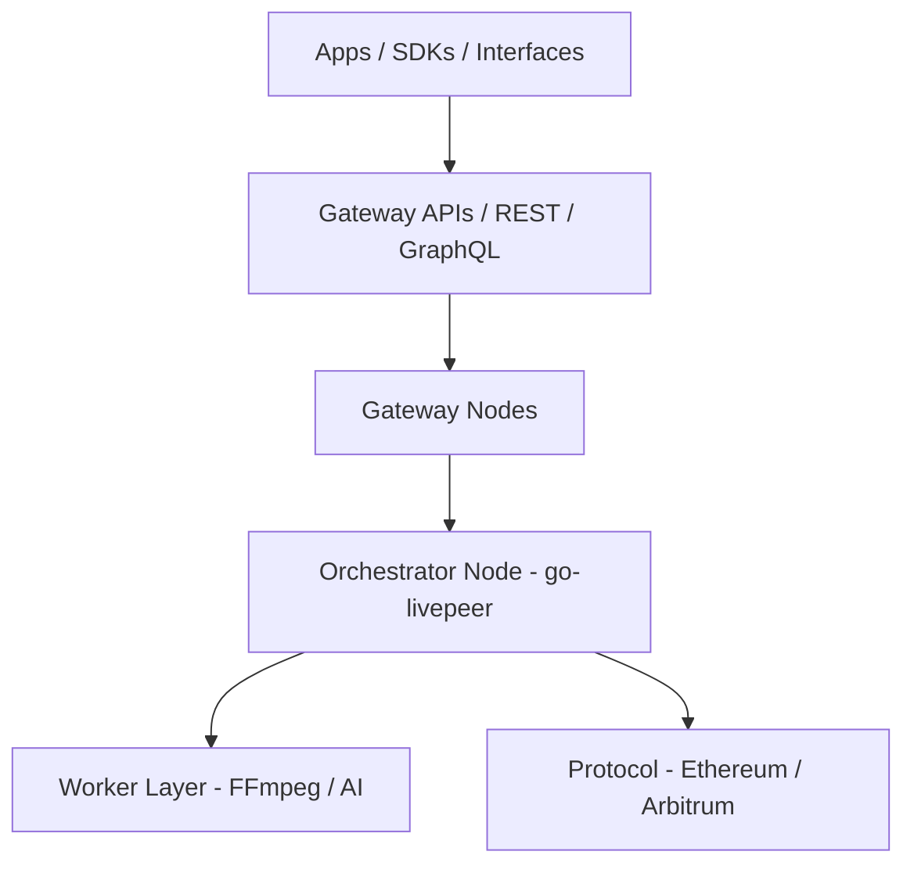

import { DynamicTable } from '/snippets/components/layout/table.jsx'
import { GotoCard, GotoLink } from '/snippets/components/primitives/links.jsx'

This page outlines the full stack of tools, infrastructure, and components that power the Livepeer Network at the node, Gateway, and client level. Livepeer's architecture is modular and developer-facing: you can run an Orchestrator, build a custom AI Gateway, or use APIs to build media apps on decentralized compute.

## Architecture layers

The network sits above the protocol: Gateways and Orchestrators handle off-chain compute and routing; the protocol (Arbitrum) handles staking, tickets, and rewards.

## Orchestrator node

The Orchestrator node runs **go-livepeer** (the `livepeer` binary), available at:

[https://github.com/livepeer/go-livepeer](https://github.com/livepeer/go-livepeer)

### Key components

- **Transcoder selection** - Internal or external workers; configured via `orchSecret` and `orchAddr` for remote transcoders
- **Ticket validation** - L2 `TicketBroker` on Arbitrum for ETH payment redemption
- **Reward claim** - Merkle submission to `BondingManager` each round
- **LPT staking** - BondingManager for self-bond and delegator stake
- **Region advertisement** - For Gateway routing (latency, capacity)

### Deployment modes

- Bare metal with GPU
- Containerized
- Cloud auto-scaling

### Tools

- **livepeer_cli** - Stake, set fee/reward cut, monitor sessions
- **livepeer_exporter** - Prometheus metrics exporter for observability

## Worker layer

Workers can be local or remote services attached to an Orchestrator:

<DynamicTable
  headerList={["Type", "Language / runtime", "Example use"]}
  itemsList={[
    { "Type": "Transcoder", "Language / runtime": "FFmpeg", "Example use": ".ts segment processing, multi-bitrate output" },
    { "Type": "Inference", "Language / runtime": "Python (Torch)", "Example use": "AI tasks, e.g. SDXL image-to-image" },
    { "Type": "Plugin", "Language / runtime": "WebRTC / C++", "Example use": "Real-time browser capture or object detection" }
  ]}
/>

Configured via Orchestrator `config.json` or environment variables.

## Gateway infrastructure

Gateways manage:

- Session auth (API key, ETH deposit, or credit check)
- Job routing to Orchestrators
- Session logging and retries

**Codebases:**

- [Studio Gateway](https://github.com/livepeer/studio-gateway)
- [Daydream Gateway](https://github.com/livepeer/daydream)
- [Cascade](https://github.com/livepeer/cascade) - Load balancer and AI workflow coordination

**Features:** Rate limiting, region scoring, health probes, fallback Orchestrators, credit tracking (e.g. Postgres/Redis).

## APIs

<DynamicTable
  headerList={["API", "Protocol", "Description"]}
  itemsList={[
    { "API": "REST Gateway", "Protocol": "HTTPS", "Description": "Transcode, AI job control (e.g. Livepeer Studio API)" },
    { "API": "gRPC Gateway", "Protocol": "gRPC", "Description": "Fast session handshakes, monitoring (e.g. ReserveSession, Heartbeat)" },
    { "API": "Explorer API", "Protocol": "GraphQL", "Description": "Metrics, staking, round data (explorer.livepeer.org)" }
  ]}
/>

**Endpoints:**

- `https://livepeer.studio/api` - Studio REST
- `https://explorer.livepeer.org/graphql` - Explorer GraphQL

## CLI and SDKs

**CLI:** `livepeer_cli` (shipped with go-livepeer)

- Stake LPT, bond/unbond
- Set Orchestrator fees and reward cut
- Watch active sessions, query protocol state

**SDKs:**

- **[Livepeer JS SDK](https://github.com/livepeer/js-sdk)** - Playback, ingest, AI session tools; works in Node.js and browser
- **Python AI pipelines** - Used in internal and community projects (e.g. dotSimulate, MetaDJ)

## Monitoring and observability

<DynamicTable
  headerList={["Tool", "Metric type", "Description"]}
  itemsList={[
    { "Tool": "Prometheus", "Metric type": "Session, CPU, ticketing", "Description": "Exposed via livepeer_exporter" },
    { "Tool": "Grafana dashboards", "Metric type": "Visual ops", "Description": "Studio and Orchestrator internal views" },
    { "Tool": "Loki", "Metric type": "Logs", "Description": "Transcode errors, API retries" },
    { "Tool": "Gateway logs", "Metric type": "Credits, API, routing", "Description": "Per-session logs (e.g. Redis / S3)" }
  ]}
/>

Node software exposes explicit metrics (e.g. Segment success rate, ticket value sent/redeemed, orchestrator swaps); see [Job lifecycle](./job-lifecycle) for event/transition details.

## Deployment examples

- [Orchestrator on AWS](https://github.com/livepeer/orchestrator-on-aws)
- [Studio gateway deploy](https://github.com/livepeer/studio-gateway-deploy)
- [Daydream AI node pipeline](https://github.com/livepeer/daydream)

## See also

- [Interfaces](./interfaces) - REST, gRPC, GraphQL, JS SDK, CLI, and smart contract access
- [Marketplace](./marketplace) - How Gateways route jobs and how pricing works
- [Job lifecycle](./job-lifecycle) - End-to-end flow and state machine
- [Protocol technical architecture](../livepeer-protocol/technical-architecture) - On-chain contracts and node types from protocol perspective
- [Blockchain contracts](../resources/blockchain-contracts) - Contract addresses (Arbitrum)

## References

- [Livepeer GitHub](https://github.com/livepeer)
- [Orchestrator docs](/v2/orchestrators/portal)
- [Daydream Gateway](https://github.com/livepeer/daydream)
- [Livepeer Explorer](https://explorer.livepeer.org)
