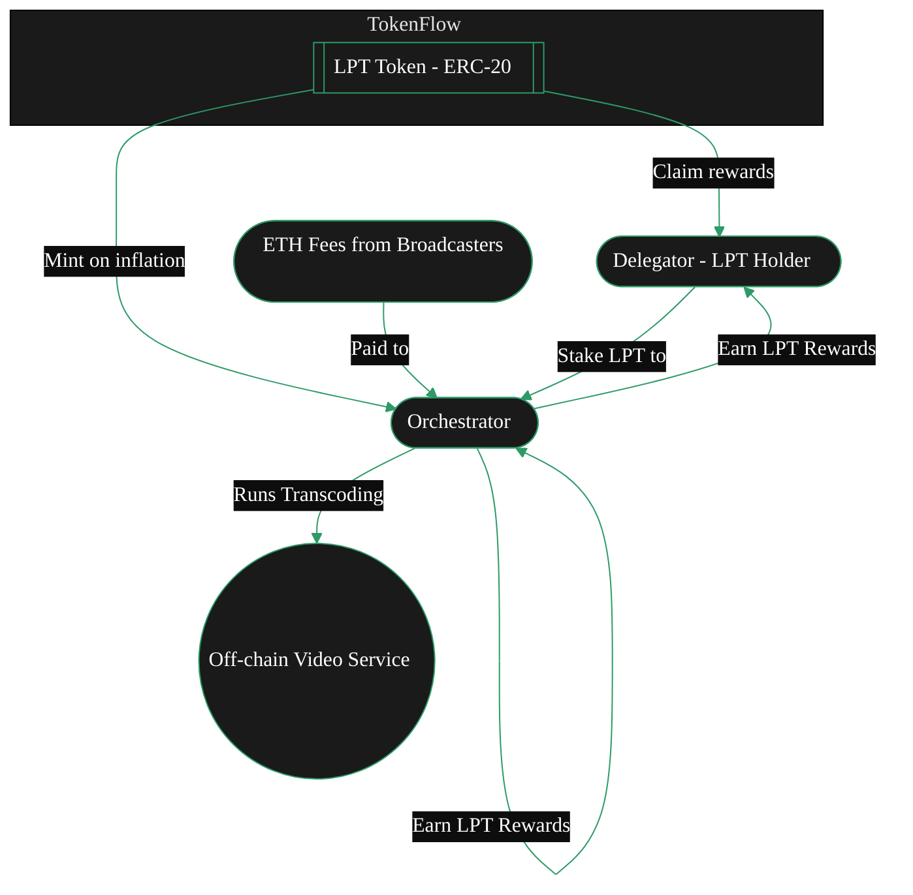

{/* This page describes:
3. **Token (LPT)**

   * Purpose of LPT
   * Security model
   * Inflation mechanics
   * Not used for job payments (ETH is)

BUT ONLY BRIEFLY -> DEFERS TO TOKEN TAB
*/}

import { CardTitleTextWithArrow } from '/snippets/components/primitives/text.jsx'
import { AccordionTitleWithArrow } from '/snippets/components/primitives/text.jsx'
import { Quote } from '/snippets/components/content/quote.jsx'
import { CustomDivider } from '/snippets/components/primitives/divider.jsx'
import { LinkArrow } from '/snippets/components/primitives/links.jsx'
import { DynamicTable } from '/snippets/components/layout/table.jsx'
import { ScrollableDiagram } from '/snippets/components/content/zoomableDiagram.jsx'

<div style={{ display: "flex", justifyContent: "center"}}>
  <CardTitleTextWithArrow icon="hand-holding-dollar" horizontal href="https://www.livepeer.org/lpt"> Livepeer Token </CardTitleTextWithArrow>
</div>

<div style={{ display: "flex", margin: "0 1rem" }}>
   <Tip>
      <span style={{fontSize: '1.0rem'}}>
         _**Did you know?**_
      </span>
      Livepeer’s token distribution had no [ICO](https://messari.io/report/merkle-mine). <br/> <br/>
      Instead, the initital 10 million LPT supply was distributed via a community [Merkle Mine](https://github.com/livepeer/merkle-mine),
      allowing a wide set of participants to claim tokens at network launch.
      <Icon icon="github" size={18}/> {" "} <LinkArrow label={<span style={{color: "var(--hero-text)"}}>View the github code</span>} href="https://github.com/livepeer/merkle-mine" newline={false} borderColor="var(--accent)" />
   </Tip>
</div>
{/* <Quote>
The **Livepeer Token (LPT)** is the staking and coordination token of the Livepeer protocol. LPT underpins protocol security, work selection, reward distribution, and decentralised governance incentivising optimal network service outcomes.
</Quote> */}

<CustomDivider style={{margin: 0, marginBottom: "-2rem" }} />

## LP Token
Livepeer is a utility token and core component of the Livepeer Protocol. Used to secure and incentivise the decentralised network to deliver its key value proposition of reliable, cost-efficient, powerful AI and video streaming workflows.

<div style={{ display: "flex", justifyContent: "center", width: "fit-content", margin: "0 auto" }}>
   <Accordion title={<div style={{color: "var(--accent)"}}>ELI5: Livepeer Token</div>} icon="user-crown">
      LPT is akin to a membership key for Liveper or LPT is like the loyalty token for useful network participants.
         - You need it to join and earn in the Livepeer system.
         - If you hold LPT, you can rent out your GPU (participate) or vote on network rules.
         - Over time, the network prints new LPT (adds to the money supply) to reward people who help run it. Those who have put their LPT into the system (staked) get extra tokens.
   </Accordion>
</div>

One of the biggest competitive advantages of Livepeer is its decentralisation - creating free markets and competitive pricing. This network of decentralised nodes, orchestrators, gateways and broadcasters, and the flow of payments in the network for doing useful work, is underpinned by the Livepeer Token (LPT).

### Token Purpose
 {/* The Livepeer Token (LPT) is used for **staking**, **securing** the network, and **governance**. */}
The Livepeer Token (LPT) has several key functions within the protocol:
- **Staking**: LPT must be staked (bonded) in the protocol via the BondingManager contract to operate as an Orchestrator or to delegate.
- **Governance**: Any staked LPT can vote on proposals. Delegators’ votes are cast via their chosen Orchestrator.
- **Security**: The protocol is secured by stake. If an Orchestrator misbehaves, its staked LPT (and its Delegators’) can be slashed.

{ /* The Livepeer Token (LPT) has several key functions within the protocol:
 - **Securing the network** through **staking** and **bonding**
   - _Operators (Orchestrators) bond LPT to run transcoding services;_
   - _Delegators stake LPT to support operators they trust._
 - **Rewarding participants** for their value-weighted contributions
   - _Staked LPT earns inflationary rewards (new LPT) and a share of ETH fees_
 - Enabling **participatory governance** and treasury management
   - _Staked LPT unlocks voting rights to shape the network's future._ */}

 <Info>LPT is **not used** for service payments for video and AI compute (e.g. transcoding, AI inference) -> those are paid in ETH or other currencies via separate payment channels. </Info>

<DynamicTable
  tableTitle={<span style={{fontSize: '0.9rem'}}>LPT Usage</span>}
  headerList={["Use Case", "LPT Functionality"]}
  itemsList={[
    { "Use Case": "Protocol Security", "LPT Functionality": "Bonded stake determines active Orchestrators" },
    { "Use Case": "Inflation Rewards", "LPT Functionality": "Only bonded LPT receives newly minted token share" },
    { "Use Case": "Governance", "LPT Functionality": "Voting rights restricted to bonded LPT holders" },
    { "Use Case": "Slashing Guarantee", "LPT Functionality": "Orchestrators risk LPT loss for malicious behavior" },
    { "Use Case": "Delegation Incentives", "LPT Functionality": "Delegators earn yield by bonding LPT to performant Orchestrators" },
  ]}
  margin="0 0.5rem -2rem 0.5rem"
/>

### Supply & Distribution

- **Initial Supply**: 10,000,000 LPT at genesis (2018), distributed via Merkle Mine (no ICO or pre-mine).

<Accordion title="See Initial LPT Distribution" icon="chart-pie">
   ```mermaid
   %%{init: {'theme': 'base', 'themeVariables': { 'primaryColor': '#1a1a1a', 'primaryTextColor': '#fff', 'primaryBorderColor': '#2d9a67', 'lineColor': '#2d9a67', 'secondaryColor': '#0d0d0d', 'tertiaryColor': '#1a1a1a', 'background': '#0d0d0d', 'fontFamily': 'system-ui', 'pieStrokeColor': '#0d0d0d', 'pieOuterStrokeColor': '#0d0d0d', 'pieSectionTextColor': '#fff', 'pieLegendTextColor': '#fff', 'pieTitleTextColor': '#fff', 'pie1': '#2d9a67', 'pie2': '#1a794e', 'pie3': '#08a045', 'pie4': '#004225' }}}%%
   pie title Initial LPT Distribution 2018
   "Community - MerkleMine" : 63.44
   "Team & Founders" : 19.00
   "Early Backers" : 12.35
   "Protocol Treasury" : 5.21
   ```
</Accordion>

- **Current Supply**: ~37,900,000 LPT (as of early 2025) – all additional supply comes from the protocol’s inflationary rewards.
- **Inflation Model**: The protocol dynamically mints new LPT. If the percentage of tokens staked falls below 50%, inflation increases to attract more stakers. If staking is above 50%, inflation decreases.
   - _Example_: In early 2025, ~44% of LPT was staked. The inflation rate was ~25.6% APR. Since only 44% of tokens were earning inflation, this meant stakers saw about 25.6% / 0.44 ≈ 58% effective APR on their staked LPT.
- **Staked vs Unstaked**: Roughly 44% of LPT is staked (June 2025). The rest (56%) is freely tradable/unbonded. Only the staked portion earns inflation rewards.


<Card title="LPT Inflation Rate" icon="chart-line" href="https://www.livepeer.org/explorer" arrow horizontal>
   View the LPT Inflation Rate on Livepeer Explorer
</Card>

### Dynamic Inflation Model

Livepeer ties LPT emissions to bonding participation. This model ensures:

- Stake velocity remains active
- Dilution impacts only unstaked participants
- Governance participation scales with protocol security

This mechanism introduces meaningful opportunity cost for passivity, encouraging active delegation and rebalancing.

<Accordion title="See Inflation Modelling Calculations" icon="calculator">

   Livepeer’s inflation is dynamic - designed to calibrate toward a target bonding rate (β*) and secure the protocol with sufficient staked LPT.

   ```bash Inflation Update Rule
   If B(t)/S(t) < β*:
   r(t+1) = min(r(t) + Δ, r_max)
   Else:
   r(t+1) = max(r(t) - Δ, r_min)
   ```

   where:
   ```text
   - S(t) = total circulating supply of LPT
   - B(t) = total bonded supply
   - β* = target bonding rate (e.g. 50%)
   - r(t) = current inflation rate
   - Δ = step rate (e.g. 0.05%)
   - r_min, r_max = protocol-set bounds (e.g. 0.5% to 7%)
   ```

   ```bash Minting Function
   M(t) = r(t) * S(t)
   ```
</Accordion>


### Rewards Distribution
#TODO
- Orchestrators: pro-rata by bonded stake
- Delegators: share of orchestrator rewards, split by rewardCut
- Treasury: fixed % (currently 10%) of M(t) per round

<ScrollableDiagram title="LPT Staking and Reward Flow" maxHeight="350px">



</ScrollableDiagram>

<Danger> Move majority of this to token section. This section will just give a product/design decision overview </Danger>

### Governance
#TODO
Only bonded LPT grants voting rights on Livepeer protocol proposals (LIPs).

**Governance Tools:**
- Forum: forum.livepeer.org
- Snapshot Voting: Used for off-chain signaling
- Governor Contract: Executes on-chain proposals post-vote

Voting power is proportional to bonded stake at snapshot block. Voters can delegate voting power to others via bonded LPT.

### Treasury
#TODO
A portion of LPT emissions flows to a community treasury. The treasury is meant to fund ecosystem-wide projects (public goods). Livepeer’s social consensus is that treasury funds should primarily go to SPEs, which then deploy them to specific initiatives.

---

#MOVE THESE


## Technical Mechanics
#TODO
### Bonding & Unbonding
LPT must be actively bonded to participate in inflation and governance.

- Bonding: Stake LPT to an orchestrator
- Unbonding: Initiate 7-day period before withdrawal
- Rebonding: Move bonded stake to another orchestrator instantly
- Each bonded LPT contributes to orchestrator selection weight and inflation share.


### Slashing & Penalties

Bonded LPT is subject to slashing if an orchestrator is caught:

- Submitting invalid transcoding results
- Cheating on ticket redemption (fraudulent claims)
- Being challenged and failing on-chain verification

Slashed LPT is:
- Partially burned
- Partially redirected to the treasury
- Results in delegator collateral loss


### Additional Resources

<Card title="Obtain Livepeer Token" icon="hand-holding-dollar" href="https://www.livepeer.org/lpt" arrow horizontal>
   Looking for places to get LPT? Follow this link.
</Card>
<Columns cols={2}>
   <Card title="LPT on Arbiscan" icon="cubes" href="https://arbiscan.io/token/0x58b6a8a3302369daec31a0680985978a9d54189c" arrow horizontal />
   <Card title="Livepeer Explorer" icon="chart-line" href="https://explorer.livepeer.org/" arrow horizontal />
   <Card title="Livepeer Blog: Token Design" icon="feather" href="https://blog.livepeer.org/livepeer-token-design-3000/" arrow horizontal />
   <Card title="Livepeer Contracts GitHub" icon="github" href="https://github.com/livepeer/protocol" arrow horizontal />
</Columns>


{/* #### Actors

- **Broadcaster (payer)** → submits jobs (video/AI) and funds them using **Probabilistic Micropayments (PM) tickets**.
- **Orchestrator (validator/worker coordinator)** → stakes LPT (self-stake + delegated), wins work, forwards segments to…
- **Transcoder (work executor)** → performs compute (encode/transcode/inference) for the orchestrator.
- **Delegator (capital provider)** → bonds LPT to an orchestrator, shares its rewards & fees.
- GPU Providers are paid for running AI Jobs

**Flow:**&#x20;

Broadcaster → (PM tickets/segments) → Orchestrator → (tasks) → Transcoder → (results) → Broadcaster.

**Economic weight flows:**&#x20;

Delegators → (bonded LPT) → Orchestrator → (rewards/fees split back) → Delegators. */}


---
#REVIEW


## Economic Flow Diagrams
Show:
- Inflation → Orchestrators + Treasury
- Fees (ETH) → Orchestrators
- Delegation → Shared rewards
- Governance → Treasury allocation

(-> Staking, Rewards, Fees & Slashing)


