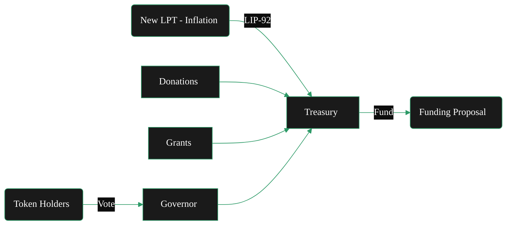

{/*
This page describes:
5. **Treasury**

   * Funding source
   * Inflation allocation
   * Grants / SPEs
   * Budget governance

BUT - only briefly - it lives in token.

*/}
import { CardTitleTextWithArrow } from '/snippets/components/primitives/text.jsx'
import { CustomDivider } from '/snippets/components/primitives/divider.jsx'
import { Quote } from '/snippets/components/content/quote.jsx'
import { DynamicTable } from '/snippets/components/layout/table.jsx'

<div style={{ display: "flex", justifyContent: "center", padding: 0, margin: 0}}>
  <CardTitleTextWithArrow icon="piggy-bank" horizontal href="https://explorer.livepeer.org/treasury"> Livepeer Treasury </CardTitleTextWithArrow>
</div>
<CustomDivider style={{margin: 0, marginBottom: "-1rem"}} />

<Quote>
The Livepeer Treasury is a smart contract-controlled pool of LPT tokens funded through protocol inflation and penalty mechanisms. It serves as the protocol’s capital allocator - financing public goods and ecosystem development, and is governed by token holders via LIP proposals.
</Quote>

## Genesis
In late 2023, the community passed several proposals creating the Livepeer Treasury.

- **Creation & Governance**:
   - [LIP‑89](https://github.com/livepeer/LIPs/blob/main/LIPs/LIP-0089.md) established the [Treasury](./treasury)
   - It deployed a custom OpenZeppelin Governor (with a 100 LPT proposal threshold and stake-weighted voting)
{/* - [LIP-89](https://github.com/livepeer/LIPs/blob/main/LIPs/LIP-0089.md) introduced a treasury contract managed by Livepeer’s Governor framework. Any token holder can propose using treasury funds. Treasury proposals follow the standard governance rules: stake 100 LPT to propose, then voting requires ≥33% quorum and >50% “For” to pass (identical to protocol votes). Once passed, the treasury contract executes the transfer (of LPT or ETH) to the specified recipient. */}
- **Funding**:
   - [LIP‑92](https://github.com/livepeer/LIPs/blob/main/LIPs/LIP-0092.md) set the on-chain revenue allocation: sending **10% of new LPT** emissions into the treasury.
   {/* - Initially, the treasury holds whatever funds were donated or allocated during genesis and via special proposals. There is no automatic tax today. [LIP-92](https://github.com/livepeer/LIPs/blob/main/LIPs/LIP-0092.md) has been discussed as a way to deduct a small percentage of protocol inflation each round and add it to the treasury. Other funding methods include grants, donations, or revenue-sharing agreements. Any change to treasury funding (like LIP-92) must be approved by token-holder vote. */}
- **Usage**:
   - [LIP‑90](https://github.com/livepeer/LIPs/blob/main/LIPs/LIP-0090.md) established that the treasury should fund public goods.
   - Approved proposals can allocate treasury assets to projects that benefit the Livepeer ecosystem.
   {/* - For example, Special Purpose Entities (teams building tools, education, security audits, etc.) can apply for grants from the treasury. All spending is transparent on-chain. The Community Forum often hosts calls or discussions with applicants, and final decisions rest with the on-chain vote. */}

<div sytle={{ display: "flex", justifyContent: "center", margin: "0 1rem" }}>

</div>
{/* https://github.com/shtukaresearch/livepeer-data-geography/blob/651a56e8c8290b30855f1393543ee9e0961c071c/roles/spe.md
The Livepeer treasury is allocated to ecosystem projects via so-called special-purpose entities (SPEs) who vie for budget allocations through a competitive grant application process. A dashboard of SPE with active funding allocations can be found here.

Scenarios
An SPE or prospective SPE operator must develop Livepeer ecosystem programmes and apply to the DAO for funding.

Identify opportunities for funded contributions.
Into which focus areas are funds most likely to be allocated?
Data availability score: 0 (no treasury allocation strategy)
Potential resource. Develop and publich ecosystem funding strategy.
How much existing competition for funding is there in my focus area?
Resource. Trawling Treasury forum
Data availability score: 4
Decide parameters (amount, focus area) to pitch an application for funding.
How much have previous grant applicants in similar focus areas received?
Resource. Trawling Treasury forum
Data availability score: 4
Which grants were rejected or revisions requested because they asked for too much funding or support?
Resource. Trawling Treasury forum; Treasury explorer
Data availability score: 4
Views: Governance (all subviews). */}

{/* <iframe src="https://dune.com/dob/livepeer-treasury" width="100%" height="500px" frameBorder="0"></iframe> */}

## Objectives
The treasury is designed to:

- **Sustain ecosystem growth** by funding core development, tools, integrations, and R&D
- **Improve protocol security** by supporting audits, incentive design, and bug bounties
- **Decentralise governance** via on-chain voting on funding proposals (LIPs)
- **Enable long-term coordination** beyond the scope of any single actor or company

## Funding Sources

Livepeer’s treasury accrues value from these primary sources (in 2026):

1. **Protocol Inflation**: 25% of newly minted LPT (inflationary rewards LPT) goes directly to the on-chain community treasury each round. (into a multisig controlled by the Livepeer Foundation and community stewards.)
2. **Slashing Penalties**: when orchestrators are slashed, 50% of the slashed LPT is burned and 50% is transferred to the treasury.
3. **Fee Pool Remainders**: if gateways/broadcasters deposit more ETH than is ultimately paid via winning tickets, the remainder is swept to the treasury.
4. **Direct LIP Transfers**: community or multisig entities can deposit LPT manually via LIP proposals.

<DynamicTable
  headerList={["Source", "Description"]}
  itemsList={[
    { "Source": "Inflationary Minting", "Description": "% of each round’s LPT minted is routed to treasury" },
    { "Source": "Slashing Penalties", "Description": "Orchestrator misbehavior results in partial burn + treasury deposit" },
    { "Source": "Ticket Fee Remainders", "Description": "Unclaimed or expired broadcaster deposits are swept to the treasury" },
    { "Source": "Direct LIP Transfers", "Description": "Community or multisig entities can deposit LPT manually" },
  ]}
  margin= "0 0 -1rem 0"
/>

## Fund Usage
The purpose of the treasury is to fund public goods.

This includes development, grants, security audits, research, operational initiatives, tooling and ecosystem growth initiatives that benefit the entire ecosystem (as determined by the community).
{/* Examples include grants for improving monitoring infrastructure, research into verifiable transcoding and support for builders.  */}

<DynamicTable
  tableTitle={<span style={{fontSize: '1rem'}}>Fund Use Cases</span>}
  headerList={["Category", "Examples"]}
  itemsList={[
    { "Category": "Core Development", "Examples": "Protocol upgrades, contract rewrites, Arbitrum migrations" },
    { "Category": "Ecosystem Grants", "Examples": "Funding for clients, indexers, AI integrations" },
    { "Category": "Public Goods", "Examples": "Documentation, SDKs, Explorer enhancements" },
    { "Category": "Security & Audits", "Examples": "Formal audits of bonding/ticket contracts" },
    { "Category": "Community Campaigns", "Examples": "Education, marketing, live events" },
    { "Category": "Contributor Payments", "Examples": "Retroactive or milestone-based compensation" },
  ]}
  margin="0 0 -1rem 0"
/>

> _See [LIP-73](https://github.com/livepeer/LIPs/blob/main/LIPs/LIP-0073.md) and [LIP-77](https://github.com/livepeer/LIPs/blob/main/LIPs/LIP-0077.md) for examples_

<Card title="Livepeer Explorer - Treasury Dashboard" icon="globe" href="https://explorer.livepeer.org/treasury" arrow horizontal > Monitor on-chain staking, proposals, and treasury transactions in real time on the Livepeer Explorer </Card>
{/* When the treasury balance reached a pre‑defined cap, contributions paused; future LIPs can adjust the rate or resume funding. */}

## Governance
The treasury uses the same [governance model & processes](governance-model) as the the protocol (though implemented by a separate Governor contract):
{/* Compound-style Governor contract customized for Livepeer. */}
- **Proposals**: Stake 100 LPT to propose.
- **Voting**: Any staked tokens (orchestrators + delegators) can vote on the grant. Delegators normally let their operator vote on their behalf, but may detach to vote separately.
- **Quorum/Threshold**: Same as protocol: 33% of stake must participate, with a majority in favor.
- **Execution**: If passed, the Governor releases funds immediately. If failed, the stake is returned, and funds remain untouched.

### Reporting & Transparency

Treasury balances, disbursements, and historical LIP outcomes are publicly visible via:

- [Livepeer Explorer](https://explorer.livepeer.org/treasury): Track the treasury on-chain via the Livepeer Explorer – Treasury Page.
- Governance History on [Arbiscan](https://arbiscan.io/address/0x363cdB9BaE210Ef182c60b5a496139E980330127#code): All proposals, votes, and payments are public
- Disbursement Events in [ABI](https://arbiscan.io/address/0x363cdB9BaE210Ef182c60b5a496139E980330127#code)
      ```javascript Example Query (using ethers.js)
      const event = TreasuryContract.filters.TreasuryWithdrawal()
      provider.on(event, (log) => console.log(log.args))
      ```
- For historical examples, see the [Forum threads](https://forum.livepeer.org/c/treasury/20) on funding proposals or the explorer’s voting records.
- Follow milestone updates and reports on the [Livepeer Forum](https://forum.livepeer.org/c/treasury/20).

{/* ## Grants & Allocations
The Livepeer treasury is allocated to ecosystem projects via so-called special-purpose entities (SPEs) who vie for budget allocations through a competitive grant application process.

Spending proposals must be approved by governance, ensuring transparency and accountability.

Special‑purpose entities (SPEs) can request allocations to execute scoped projects (e.g., building a verification framework, developing new codecs) and must report back on milestones.

This structure turns inflation into a community‑directed investment in the protocol’s long‑term health rather than pure dilution. */}

## Livepeer Foundation Role

While the on-chain treasury itself is wholly community-governed, the Livepeer Foundation plays an important role as a neutral steward for funding processes and outcomes.
<Info>
{/* The Livepeer Foundation is a non-profit organisation that stewards the long-term vision, ecosystem growth, and core development of the Livepeer network.  */}
{/* <br/><br/>  */}
**Treasury mechanics remain on-chain and community governance-controlled**
- The community controls the money
- The Foundation ensures the money is effectively & accountably used.
</Info>
It's role includes:
- **Governance Orchestration**: Ensures treasury proposals move efficiently from idea to on-chain execution through structured processes and coordination.
   {/*
   The Foundation ensures that treasury proposals move from idea → draft → community review → on-chain execution.
      This includes:

      - Structuring proposal frameworks (SPEs, budget formats, milestones)
      - Coordinating review cycles and community calls
      - Ensuring proposals are sufficiently specified before vote
      - Facilitating execution after approval
      Without this layer, treasury funds stall in process friction.
    */}
- **Accountability & Milestone Oversight**: Maintains transparency and tracks deliverables so approved funds translate into measurable outcomes.
      {/* <div>
      Once treasury funds are approved, the Foundation helps ensure:
         - Deliverables are tracked
         - Milestones are reported publicly
         - Budget usage aligns with scope
         - Underperforming initiatives are surfaced
      They do not “police” spending - they maintain transparency and continuity so governance decisions compound rather than fragment.
      </div> */}
- **Strategic Capital Framing**: Helps define funding priorities and long-term allocation strategy aligned with network health.
   {/*
   The Foundation helps define:
      - What categories of work treasury should fund (protocol R&D, ecosystem growth, infra, coordination)
      - Multi-quarter budgeting horizons
      - Tradeoffs between short-term impact and long-term network health
   They frame the strategy - the community votes on allocation.
    */}
- **Execution Enablement**: Aligns contributors and removes blockers so treasury-funded initiatives actually ship.
   {/*
      Treasury funding is only valuable if someone can execute.

      The Foundation:
      - Identifies capable contributors
      - Aligns working groups
      - Removes operational blockers
      - Bridges Foundation resources with independent SPEs

      This converts governance intent into shipped outcomes.
   */}
- **Long-Term Network Health**: Stewards treasury deployment to strengthen protocol security, decentralization, and ecosystem growth.
   {/*
   The treasury exists to strengthen:
      - **Protocol security** - audits, formal verification, incentive design
      - **Decentralization** - reducing validator/operator concentration, enabling new node types
      - **Supply-side resilience** - transcoder infrastructure, redundancy, geographic distribution
      - **Demand-side growth** - application integrations, developer tooling, use-case expansion
      - **Tooling and ecosystem expansion** - SDKs, monitoring, indexing, public goods

   The Foundation’s role is to ensure treasury deployment reinforces these pillars rather than drifting into reactive or fragmented spending.
    */}

{/* The community controls the money.
The Foundation ensures the money gets used well.

They are not the treasury owner.
They are the steward of treasury effectiveness. */}

{/*
- **Shapes/coordinates the governance pipeline** so treasury proposals get written, reviewed, and executed via the community’s SPE + voting process.
- **Convenes/participates in Advisory Boards** (incl. governance/treasury focus) to align priorities and unblock proposal work.
- **Supports the SPE framework** (templates, reporting, accountability), often via GovWorks-type operations.
- **Coordinates core ecosystem work** (incl. onboarding/aligning technical SPEs, convening dev syncs, mediating ecosystem-level conflicts),
- Helps ensure **accountability** for allocated fund use. */ }

## Contract Architecture

- Contract Name: `Treasury`
- Deployment: Arbitrum One

_**Contract Role**_

- Holds LPT funds
- Accepts authorized `distribute()` calls from governance
- Emits `TreasuryWithdrawal` events on approved spend

<Card title="Treasury Contract on Arbiscan" icon="ethereum" href="https://arbiscan.io/address/0x363cdB9BaE210Ef182c60b5a496139E980330127#code" arrow horizontal > See the full Tresury contract ABI and transaction details on Arbiscan </Card>

## Improvement Discussions
To ensure that treasury spending aligns with protocol objectives, the Livepeer community has experimented with frameworks for public‑goods funding.

- One example is the [**transparent milestone‑based grant model**](https://forum.livepeer.org/t/treasury-grant-process/3250): proposers submit budgets and deliverables, funds are released in tranches upon completion and progress is publicly reported on the forum.
- Another is [**quadratic funding**](https://forum.livepeer.org/t/quadratic-funding/3251), which could match community donations from the treasury to signal strong grassroots support. Discussions have also explored regen network‑style retroactive funding, where contributions are rewarded after impact is demonstrated.

These experiments reflect a maturing and invested community's commitment to inclusive and accountable resource allocation.

{/* ## Long-Term Vision */}

## Further Resources
<Card title="Treasury Documentation" icon="piggy-bank" href="/v2/lpt/treasury/overview" arrow horizontal > See the Livepeer Treasury documentation in the [LP Token](/v2/lpt/treasury/overview) section for comprehensive technical details and guides on voting and porposals. </Card>
<Columns cols={2}>
   <Card title="LIP-89: Treasury Proposal" icon="file" href="https://github.com/livepeer/LIPs/blob/master/LIPs/LIP-89.md"> Specification for the on-chain Treasury and governance framework </Card>
   <Card title="LIP-92: Treasury Funding" icon="message" href="https://forum.livepeer.org/t/lip-92-livepeer-treasury-contribution-percentage/3249"> Discussion of allocating a percentage of inflation to the treasury </Card>
   <Card title="Treasury Explorer" icon="globe" href="https://explorer.livepeer.org/treasury" > On-chain treasury transactions </Card>
   <Card title="Messari Report" icon="scroll" href="https://messari.io/asset/livepeer/reports" > Messari Report: Livepeer Treasury </Card>
   <Card title="Treasury Analytics" icon="chart-line" href="https://dune.com/dob/livepeer-treasury" > Dune Dashboard Analytics </Card>
   <Card href="https://www.karmahq.xyz/community/livepeer" title="Community SPE Dashboard" icon="boxes" > SPE Project Dashboard </Card>
   <Card href="https://arbiscan.io/address/0x363cdB9BaE210Ef182c60b5a496139E980330127#code" title="Treasury Contract" icon="ethereum" > Treasury Contract on Arbiscan </Card>
   <Card href="https://github.com/livepeer/protocol/blob/e8b6243c/contracts/governance/Treasury.sol" title="Treasury Contract" icon="github" > Treasury Contract on Github </Card>
</Columns>
