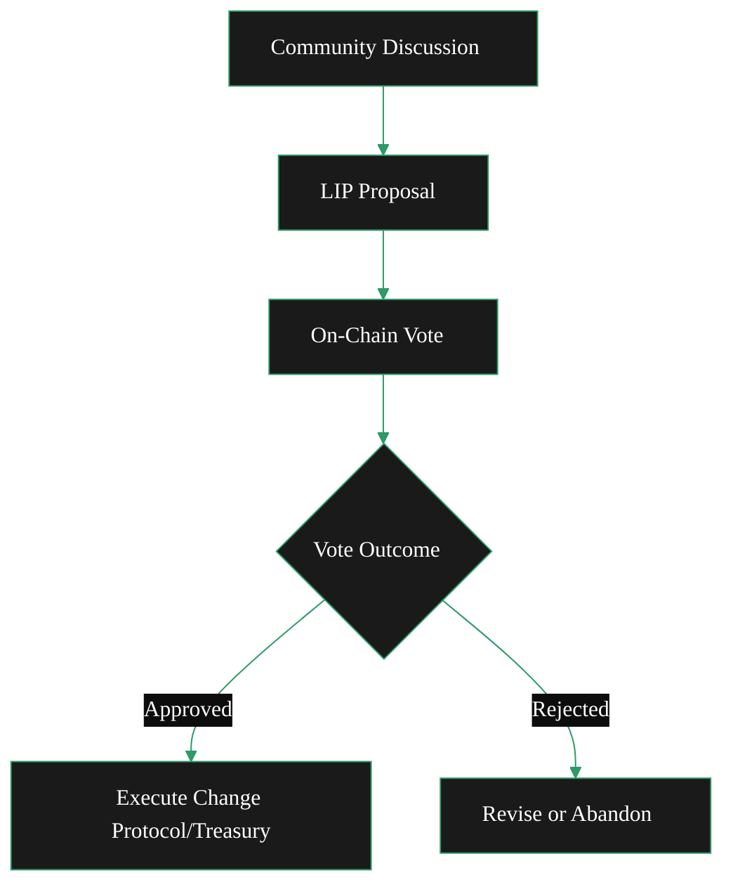

{/* codex-i18n: eyJraW5kIjoiY29kZXgtaTE4biIsInZlcnNpb24iOjEsInNvdXJjZVBhdGgiOiJ2Mi9hYm91dC9saXZlcGVlci1wcm90b2NvbC9nb3Zlcm5hbmNlLW1vZGVsLm1keCIsInNvdXJjZVJvdXRlIjoidjIvYWJvdXQvbGl2ZXBlZXItcHJvdG9jb2wvZ292ZXJuYW5jZS1tb2RlbCIsInNvdXJjZUhhc2giOiI3NWNhMGVjNjYyOWU2NjBlZTk5Y2QyZWQ5ZGM1NTE1M2IzZWJlMGMzNGM4N2E2OGE1MmM1M2I2ZWM1OWRkYzgwIiwibGFuZ3VhZ2UiOiJjbiIsInByb3ZpZGVyIjoib3BlbnJvdXRlciIsIm1vZGVsIjoib3BlbmFpL2dwdC1vc3MtMjBiOmZyZWUiLCJnZW5lcmF0ZWRBdCI6IjIwMjYtMDItMjZUMTM6MTg6MzUuOTYyWiJ9 */}
import { CardTitleTextWithArrow } from '/snippets/components/primitives/text.jsx'
import { AccordionTitleWithArrow } from '/snippets/components/primitives/text.jsx'
import { Quote } from '/snippets/components/content/quote.jsx'
import { CustomDivider } from '/snippets/components/primitives/divider.jsx'
import { LinkArrow } from '/snippets/components/primitives/links.jsx'

{/* 
This page describes:
4. **Governance**

   * LIPs
   * Voting
   * Upgrade process
   * Foundation role
   * Advisory boards 

---BUT ONLY BRIEFLY -> POINTS TO OTHER SECTIONS
*/}

   <CardTitleTextWithArrow icon="github" href="https://github.com/livepeer/lips" horizontal> livepeer-lips </CardTitleTextWithArrow>
   {/* <Card title="On-Chain Voting Explorer" icon="check-to-slot" href="https://explorer.livepeer.org/voting" horizontal arrow /> */}

<Quote> 
Livepeer is a community-driven protocol, where token holders have the ability to vote on proposals to upgrade protocol mechanisms or to spend from the treasury.
Voting is conducted on-chain via the Livepeer Governor contract, with the protocol contracts enforcing the outcome.
</Quote>
<CustomDivider style={{margin: 0, marginBottom: "-2rem" }} />

## 治理 
Livepeer 致力于开源、透明、社区治理。
它采用混合链上/链下治理模式，结合开放的社区讨论与具有约束力的链上投票。
该模式确保社区（代币持有者）共同控制升级和支出，协议执行结果。

<Accordion title={
ELI5: Governance Model
} icon="user-crown">
   Imagine a community garden run by people who own shares (tokens).

   - **Proposing a Change:** If someone has 100 share tokens, they can suggest a new rule (like “we should plant carrots”). They put 100 tokens in a safe place while the idea is considered.
   - **Voting:** Over the next month (30 days), everyone with tokens decides yes or no. If at least 33 out of every 100 token shares vote, and more than half vote “yes,” the idea becomes official. The 100 tokens go back to the proposer.
   - **Delegating Votes:** If you’ve given your shares to a friend to manage (delegation), you still get to vote because your votes travel with your shares.
   
   Rules are set by token holders: stake some tokens to propose, everyone votes, and a rule only passes if enough people say yes.
</Accordion>

### 治理功能
Livepeer 的治理服务于两个主要功能：
- **协议升级**: 提议升级协议。
- **金库支出**: 提议从金库支出。

### 治理流程

治理适用于协议和金库。协议升级和参数变更被正式化为 LIPs。
在社区审核后，进行链上投票。基于持仓加权的投票确保更大委托拥有相应的发言权。

<Steps>
   <Step title="Idea Phase: Community Discussion" icon="comment-dots">
      Proposals typically start with community discussion to gather feedback on the <LinkArrow label="Livepeer Forum" href="https://forum.livepeer.org/c/lips/18" newline={false} />.
   </Step>
   <Step title="Draft Phase: Request For Feedback (RFP)" icon="comments">
      Community members post pre-proposals (requests for feedback) on the forum.
   </Step>
   <Step title="Proposal: Livepeer Improvement Proposal (LIP)" icon="file-pen">
      Once an idea is refined, an official proposal is drafted in the form of a <LinkArrow label="Livepeer Improvement Proposal (LIP)" href="https://github.com/livepeer/LIPs" newline={ false} />
      {/* Proposals are first discussed and drafted off-chain - in the form of a <LinkArrow label="Livepeer Improvement Proposal (LIP)" href="https://github.com/livepeer/LIPs" newline={false} />.
        The forum is the primary place for discussion: <LinkArrow label="Livepeer Forum" href="https://forum.livepeer.org/c/lips/18" newline={false} /> */}
   </Step>
   <Step title="Proposal Submission: On-Chain" icon="arrow-up-right-from-square">
      Once a LIP is finalized, anyone with ≥100 LPT can submit it on-chain to the [Governor](https://github.com/livepeer/protocol/blob/e8b6243c/contracts/governance/Governor.sol) contract for a vote. This stake is large by design to ensure only serious proposals advance and is returned if the proposal passes.
   </Step>
   <Step title="Proposal Voting: On-Chain" icon="link">
      After submission, a voting period of 30 rounds (≈3.75 days) opens where eligible voters (Orchestrators and their delegated LPT) cast votes. Anyone with 1+ LPT staked can vote.
        The on-chain proposals and votes can be found on <LinkArrow label="Livepeer Explorer" href="https://explorer.livepeer.org/voting" newline={false} />.
   </Step>
   <Step title="Proposal Voting: Details" icon="ballot">
      Voting power is driven by LPT **stake-weighted voting**. If an orchestrator has X LPT staked (including delegated stake), that weight applies to its vote. 
        Note: Delegators can withdraw their delegation temporarily to vote separately if they disagree with their operator.
   </Step>
   <Step title="Proposal Voting: Quorum & Approval" icon="people">
      A proposal passes only if at least **33% of total staked LPT participates (quorum)** and **>50% of the votes** cast are “For”. These thresholds prevent minority-rule.
   </Step>
   <Step title="Proposal Execution: On-Chain" icon="check-to-slot">
      If a proposal passes, the Governor automatically executes the proposal’s instructions (changing a contract parameter or sending treasury funds).
   </Step>
</Steps>

### Livepeer 改进提案（LIPs）
Livepeer 改进提案（LIPs）是正式的设计文件（[托管在 GitHub 上](https://github.com/livepeer/LIPs)) 描述协议升级，类似于以太坊的[EIPs](https://eips.ethereum.org/EIPS/eip-1). 

*重要的 LIPs 包括：*
- **财政部创建**: [LIP-89](https://github.com/livepeer/LIPs/blob/main/LIPs/LIP-0089.md) 和 [LIP-92](https://github.com/livepeer/LIPs/blob/main/LIPs/LIP-0092.md) 设立了 [财政部](./treasury) 并设置链上收入分配（将新 LPT 排放的10%发送到国库）。
- **Confluence - Arbitrum 迁移**: [LIP-73](https://github.com/livepeer/LIPs/blob/main/LIPs/LIP-0073.md)完成了协议从 Ethereum 迁移到 Arbitrum 的过程，以降低交易成本并提高吞吐量。
- **货币政策**: [LIP-34](https://github.com/livepeer/LIPs/blob/main/LIPs/LIP-0034.md), [LIP-35](https://github.com/livepeer/LIPs/blob/main/LIPs/LIP-0035.md), [LIP-40](https://github.com/livepeer/LIPs/blob/main/LIPs/LIP-0040.md), [LIP-83](https://github.com/livepeer/LIPs/blob/main/LIPs/LIP-0083.md), 和 [LIP-100](https://github.com/livepeer/LIPs/blob/main/LIPs/LIP-0100.md) 已塑造了协议的货币政策，包括通胀计算、调整和边界。
- **治理框架**: [LIP-15](https://github.com/livepeer/LIPs/blob/main/LIPs/LIP-0015.md), [LIP-16](https://github.com/livepeer/LIPs/blob/main/LIPs/LIP-0016.md), [LIP-19](https://github.com/livepeer/LIPs/blob/main/LIPs/LIP-0019.md), [LIP-25](https://github.com/livepeer/LIPs/blob/main/LIPs/LIP-0025.md), [LIP-69](https://github.com), [LIP-19](https://github.com/livepeer/LIPs/blob/main/LIPs/LIP-0019.md) 和 [LIP-25](https://github.com/livepeer/LIPs/blob/main/LIPs/LIP-0025.md)确立了当前的去中心化治理框架。

*按类别划分的关键 LIPs：*
<Accordion title="Governance & Process" icon="building-columns">
**Governance & Process:**
- [LIP-1](https://github.com/livepeer/LIPs/blob/main/LIPs/LIP-0001.md) established the initial on‑chain governance process (Process, Purpose and Guidelines)
- [LIP-15](https://github.com/livepeer/LIPs/blob/main/LIPs/LIP-0015.md) established the polling system for LIP adoption.
- [LIP-69](https://github.com/livepeer/LIPs/blob/main/LIPs/LIP-0069.md) established the stake-based polling system & implemented stake-weighted voting.
- [LIP-19](https://github.com/livepeer/LIPs/blob/main/LIPs/LIP-0019.md) established the core governance mechanism (poll-based) for the Livepeer protocol.
- [LIP-25](https://github.com/livepeer/LIPs/blob/main/LIPs/LIP-0025.md) established the technical foundation for protocol upgrades.
</Accordion> 
<Accordion title="Protocol Migration (Confluence)" icon="arrow-down-up-across-line">
- [LIP-73](https://github.com/livepeer/LIPs/blob/main/LIPs/LIP-0073.md): Confluence - Arbitrum One Migration (Final) - Complete L1→L2 migration LIP-73.md:1-256
- [LIP-74](https://github.com/livepeer/LIPs/blob/main/LIPs/LIP-0074.md): L1 Minting and L2 Staking (Abandoned) - Alternative migration approach
</Accordion>
<Accordion title="Treasury Launch & System" icon="bank">
- [LIP-89](https://github.com/livepeer/LIPs/blob/main/LIPs/LIP-0089.md): Livepeer Treasury (Final) - Onchain treasury for public goods LIP-89.md:1-139
- [LIP-90](https://github.com/livepeer/LIPs/blob/main/LIPs/LIP-0090.md): Funding Entity Conversations (Final)
- [LIP-91](https://github.com/livepeer/LIPs/blob/main/LIPs/LIP-0091.md): Livepeer Treasury Bundle (Final)
- [LIP-92](https://github.com/livepeer/LIPs/blob/main/LIPs/LIP-0092.md): Treasury Contribution Percentage (Final) - 10% of inflation to treasury LIP-92.md:1-150
</Accordion>
<Accordion title="Economic Parameters & Monetary Policy" icon="coins">
**Economic Parameters & Monetary Policy**
- [LIP-34](https://github.com/livepeer/LIPs/blob/main/LIPs/LIP-0034.md): InflationChange Parameter Update (Final) - Slowed inflation adjustment rate
- [LIP-35](https://github.com/livepeer/LIPs/blob/main/LIPs/LIP-0035.md): inflationChange Calculation and Parameter Update (Final) - Bundle with LIP-40
- [LIP-40](https://github.com/livepeer/LIPs/blob/main/LIPs/LIP-0040.md): Minter Math Precision (Final) - Enhanced precision for percentage calculations
- [LIP-83](https://github.com/livepeer/LIPs/blob/main/LIPs/LIP-0083.md): roundLength Parameter Update (Final) - Adjusted for Ethereum Merge
- [LIP-100](https://github.com/livepeer/LIPs/blob/main/LIPs/LIP-0100.md): Introduction of Inflation Bounds (Draft) - Added ceiling/floor to inflation
</Accordion>
<Accordion title="Core Protocol Features" icon="cubes-stacked">
- [LIP-3](https://github.com/livepeer/LIPs/blob/main/LIPs/LIP-0003.md): Ability To Update Registered Solver in LivepeerVerifier (Final)
- [LIP-8](https://github.com/livepeer/LIPs/blob/main/LIPs/LIP-0008.md): Enable Partial Unbonding (Final)
- [LIP-9](https://github.com/livepeer/LIPs/blob/main/LIPs/LIP-0009.md): Service Registry (Final) - Service endpoint discovery
- [LIP-11](https://github.com/livepeer/LIPs/blob/main/LIPs/LIP-0011.md): Bond Event Details (Final)
</Accordion>
<Accordion title="Earnings & Claiming" icon="money-check-dollar">
- [LIP-36](https://github.com/livepeer/LIPs/blob/main/LIPs/LIP-0036.md): Cumulative Earnings Claiming (Final) - O(1) gas cost for earnings claims
- [LIP-52](https://github.com/livepeer/LIPs/blob/main/LIPs/LIP-0052.md): Snapshot For Claiming Earnings (Final) - Merkle tree for historical claims
</Accordion>

### 链上合约
The Livepeer 协议使用了一个自定义的 Governor 合约，该合约继承自 OpenZeppelin 的 [治理者](https://docs.openzeppelin.com/contracts/4.x/api/governance#governor) 和 [GovernorSettings](https://docs.openzeppelin.com/contracts/4.x/api/governance#governorsettings) 合约. 

关键规则如下:

- **投票期**: 30 轮（约 3.75 天）
- **法定人数**: 33% 的所有已质押 LPT
- **阈值**: 多数 (>50%) 投票
- **投票延迟**: 1 轮

### 关键角色与利益相关者

**[链上金库](./treasury)**: 一部分（10%）的代币发行流向社区金库（由 LIPs 自行创建）。
该金库存在是为了为整个网络的利益资助生态系统范围内的项目（公共产品）。
Livepeer 的社会共识是金库资金应主要用于 **SPEs**, 然后将其部署到具体的倡议中。

**[Livepeer 基金会](/v2/home/about-livepeer/ecosystem#livepeer-foundation)**: 基金会促进长期战略和生态系统协调。
它建立咨询委员会，发布路线图，并协调 **[特殊目的实体（SPEs）](/v2/home/about-livepeer/ecosystem#special-purpose-entities)** 以执行核心开发、研究、链上提案和长期愿景。

基金会也可能管理金库拨款，支持资助项目并维护网络的公共产品。
然而，虽然基金会促进社区参与，最终权威仍由社区通过 LPT 持有者的链上投票决定。

### 可视化治理流程
此流程图展示了治理流程：社区头脑风暴导致 LIP 提交，随后触发链上投票。成功的投票执行更改，而被拒绝的投票将提案退回进行修订。

## 相关资源
<Columns cols={2}>
   <Card title="Governance Model" href="/v2/cn/about/livepeer-protocol/governance-model" icon="ballot-check" arrow > Read more about the technical details of the governance model. </Card> 
   <Card title="Delegate LPT" href="https://github.com/livepeer/LIPs" icon="github" arrow > Find out more about Delegating LPT. </Card>
</Columns>

{/* ## Protocol Proposals

What can be proposed? 
What are the types?
Who is involved?
How does it work?

### On-chain governance
Livepeer’s governance is fully on-chain and stakeholder-driven. 
- Any LPT holder can propose protocol changes or treasury spending by staking 100 LPT. 
- All staked LPT holders (including Delegators via their Orchestrators) can vote on proposals. 
- Votes last for 30 rounds (~30 days). 
- For a proposal to pass, at least 33% of all staked tokens must participate (quorum), and a majority (>50%) of votes must be in favour. 
- If a proposal passes, the change is executed automatically by the smart contracts (where possible). This means the community (token holders) collectively controls upgrades and spending, with the protocol enforcing the outcome. */}

{/* Livepeer is committed to open-source, transparent, community governance.

Quick Links

Discord: [https://discord.com/channels/423160867534929930/686685097935503397](https://discord.com/channels/423160867534929930/686685097935503397)

RFPs */}
