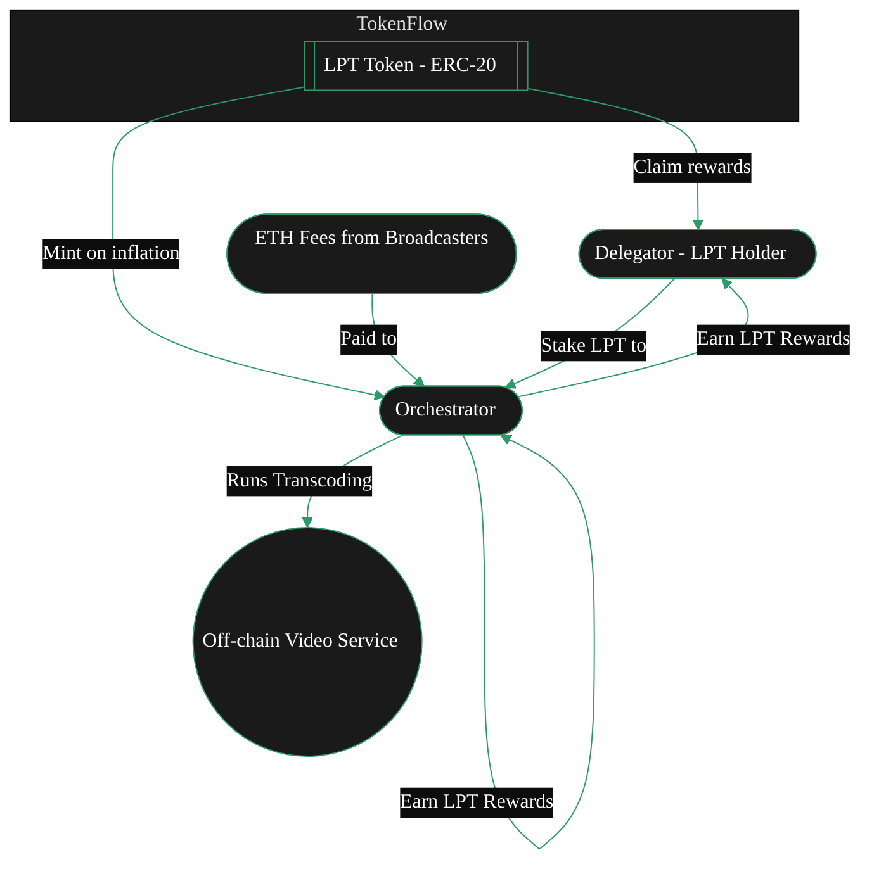

{/* codex-i18n: eyJraW5kIjoiY29kZXgtaTE4biIsInZlcnNpb24iOjEsInNvdXJjZVBhdGgiOiJ2Mi9hYm91dC9saXZlcGVlci1wcm90b2NvbC9saXZlcGVlci10b2tlbi5tZHgiLCJzb3VyY2VSb3V0ZSI6InYyL2Fib3V0L2xpdmVwZWVyLXByb3RvY29sL2xpdmVwZWVyLXRva2VuIiwic291cmNlSGFzaCI6ImU3N2E5ZjhhYzE2N2EzYjE1NThhZmIxZDA5OWEyZTc1OTRhNDhiYzM4YmQxZjMzNWMxZjhiYTdmNzgxZjNiZmYiLCJsYW5ndWFnZSI6ImNuIiwicHJvdmlkZXIiOiJvcGVucm91dGVyIiwibW9kZWwiOiJvcGVuYWkvZ3B0LW9zcy0yMGI6ZnJlZSIsImdlbmVyYXRlZEF0IjoiMjAyNi0wMi0yNlQxMzoxNjoxOS4yNThaIn0= */}
{/* This page describes:
3. **Token (LPT)**

   * Purpose of LPT
   * Security model
   * Inflation mechanics
   * Not used for job payments (ETH is) 

BUT ONLY BRIEFLY -> DEFERS TO TOKEN TAB
*/}

import { CardTitleTextWithArrow } from '/snippets/components/primitives/text.jsx'
import { AccordionTitleWithArrow } from '/snippets/components/primitives/text.jsx'
import { Quote } from '/snippets/components/content/quote.jsx'
import { CustomDivider } from '/snippets/components/primitives/divider.jsx'
import { LinkArrow } from '/snippets/components/primitives/links.jsx'
import { DynamicTable } from '/snippets/components/layout/table.jsx'
import { ScrollableDiagram } from '/snippets/components/content/zoomableDiagram.jsx'

<div style={{ display: "flex", justifyContent: "center"}}>
  <CardTitleTextWithArrow icon="hand-holding-dollar" horizontal href="https://www.livepeer.org/lpt"> Livepeer Token </CardTitleTextWithArrow> 
</div>

<div style={{ display: "flex", margin: "0 1rem" }}>
   <Tip>
      <span style={{fontSize: '1.0rem'}}>
         _**Did you know?**_
      </span>
      Livepeer’s token distribution had no [ICO](https://messari.io/report/merkle-mine). <br/> <br/>
      Instead, the initital 10 million LPT supply was distributed via a community [Merkle Mine](https://github.com/livepeer/merkle-mine), 
      allowing a wide set of participants to claim tokens at network launch. 
      <Icon icon="github" size={18}/> {" "} <LinkArrow label={<span style={{color: "var(--hero-text)"}}>View the github code</span>} href="https://github.com/livepeer/merkle-mine" newline={false} borderColor="var(--accent)" />
   </Tip>
</div>
{/* <Quote> 
The **Livepeer Token (LPT)** is the staking and coordination token of the Livepeer protocol. LPT underpins protocol security, work selection, reward distribution, and decentralised governance incentivising optimal network service outcomes. 
</Quote> */}

<CustomDivider style={{margin: 0, marginBottom: "-2rem" }} />

## LP 代币
Livepeer 是一种实用代币，也是 Livepeer 协议的核心组成部分。它用于保障并激励去中心化网络，以提供可靠、成本高效、强大的 AI 与视频流工作流程的核心价值主张。

<div style={{ display: "flex", justifyContent: "center", width: "fit-content", margin: "0 auto" }}>
   <Accordion title={<div style={{color: "var(--accent)"}}>ELI5: Livepeer Token</div>} icon="user-crown">
      LPT is akin to a membership key for Liveper or LPT is like the loyalty token for useful network participants.
         - You need it to join and earn in the Livepeer system.
         - If you hold LPT, you can rent out your GPU (participate) or vote on network rules.
         - Over time, the network prints new LPT (adds to the money supply) to reward people who help run it. Those who have put their LPT into the system (staked) get extra tokens.
   </Accordion>
</div>

Livepeer 最大的竞争优势之一是其去中心化--创造自由市场和竞争性定价。这个由去中心化节点、编排者、网关和广播站组成的网络，以及网络中为完成有用工作而流动的支付，都是由 Livepeer 代币（LPT）支撑的。

### 代币用途
 {/* The Livepeer Token (LPT) is used for **staking**, **securing** the network, and **governance**. */}
Livepeer 代币（LPT）在协议中具有若干关键功能：
- **质押**: 必须通过 BondingManager 合约将 LPT 质押（绑定）在协议中，以便作为编排者运作或进行委托。
- **治理**: 任何已质押的 LPT 都可以对提案进行投票。委托者的投票通过其选择的编排者进行。
- **安全**: 协议通过质押来保障安全。如果编排者行为不当，其质押的 LPT（以及其委托者）可能会被削减。

{ /* The Livepeer Token (LPT) has several key functions within the protocol:
 - **Securing the network** through **staking** and **bonding**
   - _Operators (Orchestrators) bond LPT to run transcoding services;_ 
   - _Delegators stake LPT to support operators they trust._ 
 - **Rewarding participants** for their value-weighted contributions
   - _Staked LPT earns inflationary rewards (new LPT) and a share of ETH fees_
 - Enabling **participatory governance** and treasury management
   - _Staked LPT unlocks voting rights to shape the network's future._ */}

 <Info>LPT is **not used** for service payments for video and AI compute (e.g. transcoding, AI inference) -> those are paid in ETH or other currencies via separate payment channels. </Info>

<DynamicTable
  tableTitle={<span style={{fontSize: '0.9rem'}}>LPT Usage</span>}
  headerList={["Use Case", "LPT Functionality"]}
  itemsList={[
    { "Use Case": "Protocol Security", "LPT Functionality": "Bonded stake determines active Orchestrators" },
    { "Use Case": "Inflation Rewards", "LPT Functionality": "Only bonded LPT receives newly minted token share" },
    { "Use Case": "Governance", "LPT Functionality": "Voting rights restricted to bonded LPT holders" },
    { "Use Case": "Slashing Guarantee", "LPT Functionality": "Orchestrators risk LPT loss for malicious behavior" },
    { "Use Case": "Delegation Incentives", "LPT Functionality": "Delegators earn yield by bonding LPT to performant Orchestrators" },
  ]}
  margin="0 0.5rem -2rem 0.5rem"
/>

### 供应与分配

- **初始供应**: 10,000,000 LPT 在创世时（2018），通过 Merkle Mine 分发（无 ICO 或预挖）。

<Accordion title="See Initial LPT Distribution" icon="chart-pie">
   ```mermaid
   %%{init: {'theme': 'base', 'themeVariables': { 'primaryColor': '#1a1a1a', 'primaryTextColor': '#fff', 'primaryBorderColor': '#2d9a67', 'lineColor': '#2d9a67', 'secondaryColor': '#0d0d0d', 'tertiaryColor': '#1a1a1a', 'background': '#0d0d0d', 'fontFamily': 'system-ui', 'pieStrokeColor': '#0d0d0d', 'pieOuterStrokeColor': '#0d0d0d', 'pieSectionTextColor': '#fff', 'pieLegendTextColor': '#fff', 'pieTitleTextColor': '#fff', 'pie1': '#2d9a67', 'pie2': '#1a794e', 'pie3': '#08a045', 'pie4': '#004225' }}}%%
   pie title Initial LPT Distribution 2018
   "Community - MerkleMine" : 63.44
   "Team & Founders" : 19.00
   "Early Backers" : 12.35
   "Protocol Treasury" : 5.21
   ```
</Accordion>

- **当前供应**: ~37,900,000 LPT（截至2025年初）– 所有额外供应来自协议的通胀奖励。
- **通胀模型**: 协议动态铸造新的 LPT。如果质押的代币比例低于 50%，通胀率会增加以吸引更多质押者；如果质押比例高于 50%，通胀率会下降。
   - _示例_: 在2025年初，约 44% 的 LPT 被质押。通胀率约为 25.6% 年化。由于只有 44% 的代币获得通胀，这意味着质押者在其质押的 LPT 上看到约 25.6% / 0.44 ≈ 58% 的有效年化收益率。
- **质押 vs 未质押**: 约 44% 的 LPT 被质押（2025年6月）。其余 56% 可自由交易/未绑定。只有质押部分获得通胀奖励。


<Card title="LPT Inflation Rate" icon="chart-line" href="https://www.livepeer.org/explorer" arrow horizontal>
   View the LPT Inflation Rate on Livepeer Explorer
</Card>

### 动态通胀模型

Livepeer 将 LPT 的发行与质押参与度绑定。该模型确保：

- Stake 速度保持活跃
- 稀释仅影响未质押的参与者
- 治理参与度与协议安全性成比例

此机制为被动行为引入了有意义的机会成本，鼓励积极委托和再平衡

<Accordion title="See Inflation Modelling Calculations" icon="calculator">

   Livepeer’s inflation is dynamic - designed to calibrate toward a target bonding rate (β*) and secure the protocol with sufficient staked LPT.

   ```bash Inflation Update Rule
   If B(t)/S(t) < β*:
   r(t+1) = min(r(t) + Δ, r_max)
   Else:
   r(t+1) = max(r(t) - Δ, r_min)
   ```

   where:
   ```
   - S(t) = total circulating supply of LPT
   - B(t) = total bonded supply
   - β* = target bonding rate (e.g. 50%)
   - r(t) = current inflation rate
   - Δ = step rate (e.g. 0.05%)
   - r_min, r_max = protocol-set bounds (e.g. 0.5% to 7%)
   ```

   ```bash Minting Function
   M(t) = r(t) * S(t)
   ```
</Accordion>


### 奖励分配
#TODO
- 主导者：按绑定质押按比例分配
- 委托者：主导者奖励的份额，按 rewardCut 分配
- 国库：每轮固定百分比（目前为10%）的 M(t)

<ScrollableDiagram title="LPT Staking and Reward Flow" maxHeight="350px">



</ScrollableDiagram>

<Danger> Move majority of this to token section. This section will just give a product/design decision overview </Danger>

### 治理
#TODO
仅绑定的 LPT 授予对 Livepeer 协议提案（LIPs）的投票权。

**治理工具:**
- 论坛: forum.livepeer.org
- 快照投票：用于链下信号传递
- 治理合约：在投票后执行链上提案

投票权与快照区块时绑定的质押量成正比。选民可以通过绑定 LPT 将投票权委托给他人。

### 金库
#TODO
LPT 的一部分排放流向社区金库。金库旨在资助生态系统范围内的项目（公共产品）。Livepeer’s 社会共识是金库资金应主要用于 SPEs，随后将其部署到具体的倡议中。

---

#MOVE THESE


## 技术机制
#TODO
### 绑定与解绑
LPT 必须积极绑定以参与通胀和治理。

- 绑定：将 LPT 质押给一个编排者
- 解绑：在提款前启动7天周期
- 重新绑定：将已绑定的质押立即转移到另一名调度器
- 每个已绑定的 LPT 都会贡献给调度器选择权重和通胀份额。


### 削减与处罚

如果发现调度器违规，已绑定的 LPT 将面临削减：

- 提交无效的转码结果
- 在票据兑换中作弊（欺诈性索赔）
- 被挑战并在链上验证失败

被削减的 LPT 是：
- 部分被销毁
- 部分被重定向到国库
- 导致委托人抵押品损失


### 附加资源

<Card title="Obtain Livepeer Token" icon="hand-holding-dollar" href="https://www.livepeer.org/lpt" arrow horizontal>
   Looking for places to get LPT? Follow this link.
</Card>
<Columns cols={2}>
   <Card title="LPT on Arbiscan" icon="cubes" href="https://arbiscan.io/token/0x58b6a8a3302369daec31a0680985978a9d54189c" arrow horizontal />
   <Card title="Livepeer Explorer" icon="chart-line" href="https://explorer.livepeer.org/" arrow horizontal />
   <Card title="Livepeer Blog: Token Design" icon="feather" href="https://blog.livepeer.org/livepeer-token-design-3000/" arrow horizontal />
   <Card title="Livepeer Contracts GitHub" icon="github" href="https://github.com/livepeer/protocol" arrow horizontal />
</Columns>


{/* #### Actors

- **Broadcaster (payer)** → submits jobs (video/AI) and funds them using **Probabilistic Micropayments (PM) tickets**.
- **Orchestrator (validator/worker coordinator)** → stakes LPT (self-stake + delegated), wins work, forwards segments to…
- **Transcoder (work executor)** → performs compute (encode/transcode/inference) for the orchestrator.
- **Delegator (capital provider)** → bonds LPT to an orchestrator, shares its rewards & fees.
- GPU Providers are paid for running AI Jobs

**Flow:**&#x20;

Broadcaster → (PM tickets/segments) → Orchestrator → (tasks) → Transcoder → (results) → Broadcaster.

**Economic weight flows:**&#x20;

Delegators → (bonded LPT) → Orchestrator → (rewards/fees split back) → Delegators. */}


--- 
#审查


## 经济流动图
显示：
- 通胀 → 协调者 + 国库
- 费用 (ETH) → 协调者
- 委托 → 共享奖励
- 治理 → 国库分配

(-> 质押, 奖励, 费用 & 削减)


