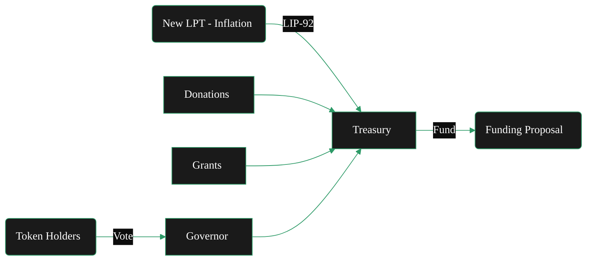

{/* codex-i18n: eyJraW5kIjoiY29kZXgtaTE4biIsInZlcnNpb24iOjEsInNvdXJjZVBhdGgiOiJ2Mi9hYm91dC9saXZlcGVlci1wcm90b2NvbC90cmVhc3VyeS5tZHgiLCJzb3VyY2VSb3V0ZSI6InYyL2Fib3V0L2xpdmVwZWVyLXByb3RvY29sL3RyZWFzdXJ5Iiwic291cmNlSGFzaCI6IjAyMDE4OGMxNzRmZjA1MDMxZDYyYmEzYzlkNDhlZmY4NDgwMDdlNDliODg5ZmJiZTFhNmU2ZmNkMjE5Y2M1ZDEiLCJsYW5ndWFnZSI6ImNuIiwicHJvdmlkZXIiOiJvcGVucm91dGVyIiwibW9kZWwiOiJvcGVuYWkvZ3B0LW9zcy0yMGI6ZnJlZSIsImdlbmVyYXRlZEF0IjoiMjAyNi0wMi0yNlQxMzozMzozOC44MDdaIn0= */}
{/* 
This page describes:
5. **Treasury**

   * Funding source
   * Inflation allocation
   * Grants / SPEs
   * Budget governance 

BUT - only briefly - it lives in token.

*/}
import { CardTitleTextWithArrow } from '/snippets/components/primitives/text.jsx'
import { CustomDivider } from '/snippets/components/primitives/divider.jsx'
import { Quote } from '/snippets/components/display/quote.jsx'
import { DynamicTable } from '/snippets/components/layout/table.jsx'

<div style={{ display: "flex", justifyContent: "center", padding: 0, margin: 0}}>
  <CardTitleTextWithArrow icon="piggy-bank" horizontal href="https://explorer.livepeer.org/treasury"> Livepeer Treasury </CardTitleTextWithArrow> 
</div>
<CustomDivider style={{margin: 0, marginBottom: "-1rem"}} />

<Quote>
The Livepeer Treasury is a smart contract-controlled pool of LPT tokens funded through protocol inflation and penalty mechanisms. It serves as the protocol’s capital allocator - financing public goods and ecosystem development, and is governed by token holders via LIP proposals.
</Quote>

## 创世
在2023年末，社区通过了若干提案，创建了 Livepeer 金库。 

- **创建与治理**: 
   - [LIP‑89](https://github.com/livepeer/LIPs/blob/main/LIPs/LIP-0089.md)建立了 [金库](./treasury)
   - 它部署了一个自定义的 OpenZeppelin Governor（具有 100 LPT 提案阈值和按持仓加权投票）
{/* - [LIP-89](https://github.com/livepeer/LIPs/blob/main/LIPs/LIP-0089.md) introduced a treasury contract managed by Livepeer’s Governor framework. Any token holder can propose using treasury funds. Treasury proposals follow the standard governance rules: stake 100 LPT to propose, then voting requires ≥33% quorum and >50% “For” to pass (identical to protocol votes). Once passed, the treasury contract executes the transfer (of LPT or ETH) to the specified recipient. */}
- **资金**: 
   - [LIP‑92](https://github.com/livepeer/LIPs/blob/main/LIPs/LIP-0092.md)设置链上收入分配：发送 **10% 的新 LPT** 发放到国库。
   {/* - Initially, the treasury holds whatever funds were donated or allocated during genesis and via special proposals. There is no automatic tax today. [LIP-92](https://github.com/livepeer/LIPs/blob/main/LIPs/LIP-0092.md) has been discussed as a way to deduct a small percentage of protocol inflation each round and add it to the treasury. Other funding methods include grants, donations, or revenue-sharing agreements. Any change to treasury funding (like LIP-92) must be approved by token-holder vote. */}
- **使用**: 
   - [LIP‑90](https://github.com/livepeer/LIPs/blob/main/LIPs/LIP-0090.md) 已确定国库应资助公共产品。
   - 已批准的提案可以将国库资产分配给有利于 Livepeer 生态系统的项目。 
   {/* - For example, Special Purpose Entities (teams building tools, education, security audits, etc.) can apply for grants from the treasury. All spending is transparent on-chain. The Community Forum often hosts calls or discussions with applicants, and final decisions rest with the on-chain vote. */}

<div sytle={{ display: "flex", justifyContent: "center", margin: "0 1rem" }}>

</div>
{/* https://github.com/shtukaresearch/livepeer-data-geography/blob/651a56e8c8290b30855f1393543ee9e0961c071c/roles/spe.md
The Livepeer treasury is allocated to ecosystem projects via so-called special-purpose entities (SPEs) who vie for budget allocations through a competitive grant application process. A dashboard of SPE with active funding allocations can be found here.

Scenarios
An SPE or prospective SPE operator must develop Livepeer ecosystem programmes and apply to the DAO for funding.

Identify opportunities for funded contributions.
Into which focus areas are funds most likely to be allocated?
Data availability score: 0 (no treasury allocation strategy)
Potential resource. Develop and publich ecosystem funding strategy.
How much existing competition for funding is there in my focus area?
Resource. Trawling Treasury forum
Data availability score: 4
Decide parameters (amount, focus area) to pitch an application for funding.
How much have previous grant applicants in similar focus areas received?
Resource. Trawling Treasury forum
Data availability score: 4
Which grants were rejected or revisions requested because they asked for too much funding or support?
Resource. Trawling Treasury forum; Treasury explorer
Data availability score: 4
Views: Governance (all subviews). */}

{/* <iframe src="https://dune.com/dob/livepeer-treasury" width="100%" height="500px" frameBorder="0"></iframe> */}

## 目标
国库的设计目标是：

- **维持生态系统增长** 通过资助核心开发、工具、集成和研发
- **提升协议安全** 通过支持审计、激励设计和漏洞赏金
- **去中心化治理** 通过链上投票决定资金提案（LIPs）
- **实现长期协调** 超出任何单一行为者或公司的范围

## 资金来源

Livepeer’s 国库从这些主要来源获得价值（2026年）：

1. **协议通胀**: 25% 的新铸造 LPT（通胀奖励 LPT）直接进入链上社区金库，每轮。 (进入由 Livepeer 基金会和社区管理员控制的多重签名账户。)
2. **削减惩罚**: 当指挥者被削减时，50% 被削减的 LPT 被销毁，50% 转移到金库。
3. **费用池剩余**: 如果网关/广播者存入的 ETH 超过最终通过中奖票支付的金额，剩余部分将被划入金库。 
4. **直接 LIP 转账**: 社区或多重签名实体可以通过 LIP 提案手动存入 LPT。

<DynamicTable
  headerList={["Source", "Description"]}
  itemsList={[
    { "Source": "Inflationary Minting", "Description": "% of each round’s LPT minted is routed to treasury" },
    { "Source": "Slashing Penalties", "Description": "Orchestrator misbehavior results in partial burn + treasury deposit" },
    { "Source": "Ticket Fee Remainders", "Description": "Unclaimed or expired broadcaster deposits are swept to the treasury" },
    { "Source": "Direct LIP Transfers", "Description": "Community or multisig entities can deposit LPT manually" },
  ]}
  margin= "0 0 -1rem 0"
/>

## 基金使用
金库的目的在于资助公共产品。

这包括开发、资助、安保审计、研究、运营举措、工具以及有利于整个生态系统的生态增长举措（由社区决定）。 
{/* Examples include grants for improving monitoring infrastructure, research into verifiable transcoding and support for builders.  */}

<DynamicTable
  tableTitle={<span style={{fontSize: '1rem'}}>Fund Use Cases</span>}
  headerList={["Category", "Examples"]}
  itemsList={[
    { "Category": "Core Development", "Examples": "Protocol upgrades, contract rewrites, Arbitrum migrations" },
    { "Category": "Ecosystem Grants", "Examples": "Funding for clients, indexers, AI integrations" },
    { "Category": "Public Goods", "Examples": "Documentation, SDKs, Explorer enhancements" },
    { "Category": "Security & Audits", "Examples": "Formal audits of bonding/ticket contracts" },
    { "Category": "Community Campaigns", "Examples": "Education, marketing, live events" },
    { "Category": "Contributor Payments", "Examples": "Retroactive or milestone-based compensation" },
  ]}
  margin="0 0 -1rem 0"
/>

> _参见 [LIP-73](https://github.com/livepeer/LIPs/blob/main/LIPs/LIP-0073.md) 和 [LIP-77](https://github.com/livepeer/LIPs/blob/main/LIPs/LIP-0077.md) 作为示例_

<Card title="Livepeer Explorer - Treasury Dashboard" icon="globe" href="https://explorer.livepeer.org/treasury" arrow horizontal > Monitor on-chain staking, proposals, and treasury transactions in real time on the Livepeer Explorer </Card>
{/* When the treasury balance reached a pre‑defined cap, contributions paused; future LIPs can adjust the rate or resume funding. */}

## 治理
财政库使用相同的 [治理模型和流程](governance-model) 与协议相同（尽管由单独的 Governor 合约实现）:
{/* Compound-style Governor contract customized for Livepeer. */}
- **提案**: 质押 100 LPT 以提出提案。
- **投票**: 任何已质押的代币（编排者 + 委托者）都可以对资助进行投票。委托者通常让其运营商代为投票，但也可以分离后单独投票。
- **法定人数/阈值**: 与协议相同：33% 的质押必须参与，且多数投赞成票。
- **执行**: 如通过，治理者立即释放资金；如未通过，质押将被退回，资金保持不变。

### 报告与透明度 

国库余额、拨款和历史 LIP 结果可通过以下方式公开查看：

- [Livepeer Explorer](https://explorer.livepeer.org/treasury): 通过 Livepeer Explorer（国库页面）在链上跟踪国库。 
- 治理历史在 [Arbiscan](https://arbiscan.io/address/0x363cdB9BaE210Ef182c60b5a496139E980330127#code): 所有提案、投票和付款都是公开的
- 支出事件在 [ABI](https://arbiscan.io/address/0x363cdB9BaE210Ef182c60b5a496139E980330127#code)
      ```javascript Example Query (using ethers.js)
      const event = TreasuryContract.filters.TreasuryWithdrawal()
      provider.on(event, (log) => console.log(log.args))
      ```
- 有关历史示例，请参阅 [论坛帖子](https://forum.livepeer.org/c/treasury/20) 关于资助提案或探索者的投票记录。
- 关注里程碑更新和报告 [Livepeer 论坛](https://forum.livepeer.org/c/treasury/20).

{/* ## Grants & Allocations
The Livepeer treasury is allocated to ecosystem projects via so-called special-purpose entities (SPEs) who vie for budget allocations through a competitive grant application process. 

Spending proposals must be approved by governance, ensuring transparency and accountability. 

Special‑purpose entities (SPEs) can request allocations to execute scoped projects (e.g., building a verification framework, developing new codecs) and must report back on milestones. 

This structure turns inflation into a community‑directed investment in the protocol’s long‑term health rather than pure dilution. */}

## Livepeer 基金会角色

虽然链上金库本身完全由社区治理，但 Livepeer 基金会在资金流程和结果方面扮演着重要的中立管理者角色。
<Info> 
{/* The Livepeer Foundation is a non-profit organisation that stewards the long-term vision, ecosystem growth, and core development of the Livepeer network.  */}
{/* <br/><br/>  */}
**Treasury mechanics remain on-chain and community governance-controlled** 
- The community controls the money 
- The Foundation ensures the money is effectively & accountably used.
</Info>
其角色包括：
- **治理协调**: 确保金库提案通过结构化流程和协调，从构想到链上执行高效推进。
   {/* 
   The Foundation ensures that treasury proposals move from idea → draft → community review → on-chain execution.
      This includes:

      - Structuring proposal frameworks (SPEs, budget formats, milestones)
      - Coordinating review cycles and community calls
      - Ensuring proposals are sufficiently specified before vote
      - Facilitating execution after approval
      Without this layer, treasury funds stall in process friction.
    */}
- **问责与里程碑监督**: 维护透明度并跟踪交付成果，使已批准的资金转化为可衡量的结果。
      {/* <div> 
      Once treasury funds are approved, the Foundation helps ensure:
         - Deliverables are tracked
         - Milestones are reported publicly
         - Budget usage aligns with scope
         - Underperforming initiatives are surfaced
      They do not “police” spending - they maintain transparency and continuity so governance decisions compound rather than fragment.
      </div> */}
- **战略资本框架**: 帮助定义资金优先级和与网络健康相一致的长期分配策略。
   {/* 
   The Foundation helps define:
      - What categories of work treasury should fund (protocol R&D, ecosystem growth, infra, coordination)
      - Multi-quarter budgeting horizons
      - Tradeoffs between short-term impact and long-term network health
   They frame the strategy - the community votes on allocation.
    */}
- **执行赋能**: 对齐贡献者并消除障碍，使由国库资助的项目真正落地。
   {/* 
      Treasury funding is only valuable if someone can execute.

      The Foundation:
      - Identifies capable contributors
      - Aligns working groups
      - Removes operational blockers
      - Bridges Foundation resources with independent SPEs

      This converts governance intent into shipped outcomes.
   */}
- **长期网络健康**: 管理国库部署，以加强协议安全、去中心化和生态系统增长。
   {/* 
   The treasury exists to strengthen:
      - **Protocol security** - audits, formal verification, incentive design
      - **Decentralization** - reducing validator/operator concentration, enabling new node types
      - **Supply-side resilience** - transcoder infrastructure, redundancy, geographic distribution
      - **Demand-side growth** - application integrations, developer tooling, use-case expansion
      - **Tooling and ecosystem expansion** - SDKs, monitoring, indexing, public goods

   The Foundation’s role is to ensure treasury deployment reinforces these pillars rather than drifting into reactive or fragmented spending.
    */}

{/* The community controls the money.
The Foundation ensures the money gets used well.

They are not the treasury owner.
They are the steward of treasury effectiveness. */}

{/* 
- **Shapes/coordinates the governance pipeline** so treasury proposals get written, reviewed, and executed via the community’s SPE + voting process.
- **Convenes/participates in Advisory Boards** (incl. governance/treasury focus) to align priorities and unblock proposal work.
- **Supports the SPE framework** (templates, reporting, accountability), often via GovWorks-type operations.
- **Coordinates core ecosystem work** (incl. onboarding/aligning technical SPEs, convening dev syncs, mediating ecosystem-level conflicts), 
- Helps ensure **accountability** for allocated fund use. */ }

## 合约架构

- 合约名称: `Treasury`
- 部署: Arbitrum 一

_**合约角色**_

- 持有 LPT 资金
- 接受授权的 `distribute()` 调用来自治理
- 发出 `TreasuryWithdrawal` 事件在批准支出

<Card title="Treasury Contract on Arbiscan" icon="ethereum" href="https://arbiscan.io/address/0x363cdB9BaE210Ef182c60b5a496139E980330127#code" arrow horizontal > See the full Tresury contract ABI and transaction details on Arbiscan </Card> 

## 改进讨论
为了确保国库支出与协议目标保持一致，Livepeer 社区已经尝试了公共产品资助的框架。 

- 一个例子是 [**透明的里程碑式资助模型**](https://forum.livepeer.org/t/treasury-grant-process/3250): 提案人提交预算和交付物，资金在完成后分批释放，进展在论坛上公开报告。 
- 另一个是 [**二次方资助**](https://forum.livepeer.org/t/quadratic-funding/3251)，这可以将国库的社区捐赠匹配，以表明强大的草根支持。讨论还探讨了 regen network‑style 事后资助模式，在影响得到证明后奖励贡献。 

这些实验反映了一个成熟且投入的社区对包容性和负责任资源分配的承诺。

{/* ## Long-Term Vision */}

## 进一步资源
<Card title="Treasury Documentation" icon="piggy-bank" href="/v2/cn/lpt/treasury/overview" arrow horizontal > See the Livepeer Treasury documentation in the [LP Token](/v2/cn/lpt/treasury/overview) section for comprehensive technical details and guides on voting and porposals. </Card>
<Columns cols={2}>
   <Card title="LIP-89: Treasury Proposal" icon="file" href="https://github.com/livepeer/LIPs/blob/master/LIPs/LIP-89.md"> Specification for the on-chain Treasury and governance framework </Card> 
   <Card title="LIP-92: Treasury Funding" icon="message" href="https://forum.livepeer.org/t/lip-92-livepeer-treasury-contribution-percentage/3249"> Discussion of allocating a percentage of inflation to the treasury </Card> 
   <Card title="Treasury Explorer" icon="globe" href="https://explorer.livepeer.org/treasury" > On-chain treasury transactions </Card>
   <Card title="Messari Report" icon="scroll" href="https://messari.io/asset/livepeer/reports" > Messari Report: Livepeer Treasury </Card>
   <Card title="Treasury Analytics" icon="chart-line" href="https://dune.com/dob/livepeer-treasury" > Dune Dashboard Analytics </Card>
   <Card href="https://www.karmahq.xyz/community/livepeer" title="Community SPE Dashboard" icon="boxes" > SPE Project Dashboard </Card>
   <Card href="https://arbiscan.io/address/0x363cdB9BaE210Ef182c60b5a496139E980330127#code" title="Treasury Contract" icon="ethereum" > Treasury Contract on Arbiscan </Card>
   <Card href="https://github.com/livepeer/protocol/blob/e8b6243c/contracts/governance/Treasury.sol" title="Treasury Contract" icon="github" > Treasury Contract on Github </Card>
</Columns>
