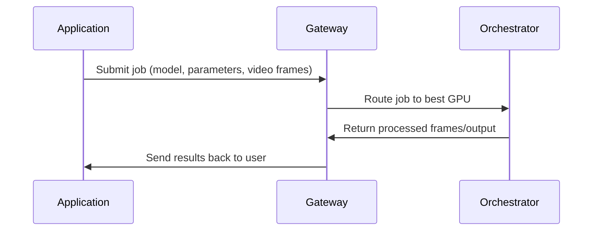

{/* codex-i18n: eyJraW5kIjoiY29kZXgtaTE4biIsInZlcnNpb24iOjEsInNvdXJjZVBhdGgiOiJ2Mi9hYm91dC9yZXNvdXJjZXMvZ2F0ZXdheXMtdnMtb3JjaGVzdHJhdG9ycy5tZHgiLCJzb3VyY2VSb3V0ZSI6InYyL2Fib3V0L3Jlc291cmNlcy9nYXRld2F5cy12cy1vcmNoZXN0cmF0b3JzIiwic291cmNlSGFzaCI6ImQwMmIyOTYzNTY1M2VlMGZkNmM0MzlkYjEyNWJkNTY1ZmY3NTc5NTUxYWEwNjI3MjdmODU4ZTE3YThhMDYyNDAiLCJsYW5ndWFnZSI6ImNuIiwicHJvdmlkZXIiOiJvcGVucm91dGVyIiwibW9kZWwiOiJvcGVuYWkvZ3B0LW9zcy0xMjBiOmZyZWUiLCJnZW5lcmF0ZWRBdCI6IjIwMjYtMDItMjZUMTk6MTU6MzcuMDkzWiJ9 */}
---

## 概览

简要说明：

<Callout >

<Icon icon="torii-gate" /> **Gateways coordinate.**

<Icon icon="microchip"/> **Orchestrators compute.**

</Callout>

它们共同构成了 Livepeer AI 视频管道的核心。

| 角色             | 功能                                       | 执行 GPU 工作？ | 面向外部？ |
| ---------------- | ---------------------------------------------- | ------------------ | ---------------- |
| **网关**      | 作业接收、定价、路由、能力匹配 | ❌ 否              | ✅ 是           |
| **编排器** | GPU 计算、推理、转码、BYOC      | ✅ 是             | ❌ 否            |

## 网关职责

网关充当网络的前门：

- 从应用程序接收作业
- 确定所需的模型、流水线或 GPU
- 根据性能和定价选择最佳编排器
- 以低延迟路由工作负载
- 将结果返回给客户端
- 发布市场供应（模型、流水线、每帧成本等）

网关提供 _服务智能_, 不是计算。

---

## 编排器职责

编排器是运行以下任务的 GPU 操作员：

- 实时 AI 推理
- Daydream / ComfyStream 流水线
- BYOC 容器
- 传统转码

他们提供：

- GPU算力
- 模型执行
- 确定且可验证的输出
- 性能保证

他们不直接公开外部 API——网关负责处理。
