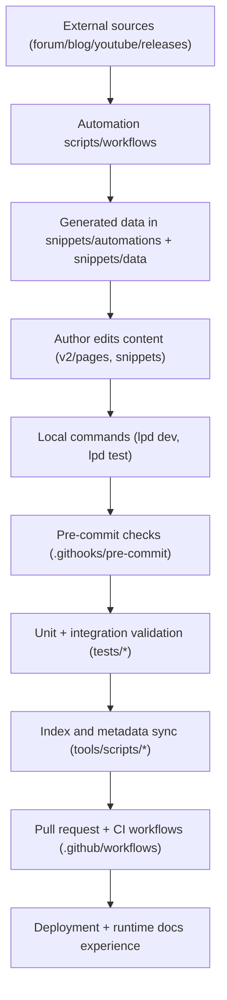

{/* codex-i18n: eyJraW5kIjoiY29kZXgtaTE4biIsInZlcnNpb24iOjEsInNvdXJjZVBhdGgiOiJkb2NzLWd1aWRlL2FyY2hpdGVjdHVyZS1tYXAubWR4Iiwic291cmNlUm91dGUiOiJkb2NzLWd1aWRlL2FyY2hpdGVjdHVyZS1tYXAiLCJzb3VyY2VIYXNoIjoiNGJlZWU5YTFiYTI3YmE1NGY4ZGZiYzgzMjI0NDI0OTBmNWFlYzA5NjJjZmNiYmZkMjBjZjEzOGIyNTg4NmY2MyIsImxhbmd1YWdlIjoiY24iLCJwcm92aWRlciI6Im9wZW5yb3V0ZXIiLCJtb2RlbCI6InF3ZW4vcXdlbi10dXJibyIsImdlbmVyYXRlZEF0IjoiMjAyNi0wMy0wMVQxNzoyNjoyMC40MjdaIn0= */}
这是内容、工具、验证和自动化之间交互的内部系统图。

## 顶级组件

- 内容源：`v2/pages/**`, `snippets/**`, `docs.json`
- 运行时 UX: Mintlify 开发/构建 + 托管文档部署
- 本地操作员工具：`lpd`, `.githooks/*`, `tools/scripts/*`, `tests/*`
- CI/自动化：`.github/workflows/*`, `.github/scripts/*`, `snippets/automations/*`
- 治理文档：`README.md`, `docs-guide/*`, `contribute/CONTRIBUTING/*`

## 数据与控制流

## 执行层

### 第1层：创作+内容系统

- Markdown/MDX 页面和代码片段是可编辑的内容基本单元。
- `docs.json` 定义导航和路由上下文。

### 第2层：本地执行

- `lpd` 协调设置/开发/测试/钩子/脚本。
- 预提交钩子运行快速安全检查和分阶段审计。
- 测试运行器验证样式、MDX、链接/导入、质量、文档导航和脚本文档。

### 第3层：CI+自动化

- 工作流运行更改文件质量检查和 PR 的浏览器检查。
- 定时/手动工作流刷新外部数据和支持资源。
- 模板和接收工作流强制问题/PR 的质量和标签。

### 第4层：文档治理

- `docs-guide/` 定义内部导航的真相来源。
- `README.md` 提供高层次的导向并指向规范的文档指南页面。

## 关键合约边缘

1. 脚本元数据合约：
   - 脚本标题 -> 脚本索引生成 -> 文档指南脚本目录。
2. 工作流/模板合约：
   - `.github/workflows/*` + `.github/ISSUE_TEMPLATE/*` -> 文档指南生成的索引。
3. 内容有效性合约：
   - 内容更改 -> 钩子/测试 -> CI -> 可部署文档。
