{/* codex-i18n: eyJraW5kIjoiY29kZXgtaTE4biIsInZlcnNpb24iOjEsInNvdXJjZVBhdGgiOiJ2Mi9nYXRld2F5cy9hYm91dC1nYXRld2F5cy9nYXRld2F5LWV4cGxhaW5lci5tZHgiLCJzb3VyY2VSb3V0ZSI6InYyL2dhdGV3YXlzL2Fib3V0LWdhdGV3YXlzL2dhdGV3YXktZXhwbGFpbmVyIiwic291cmNlSGFzaCI6IjJjNGZlNWMzMzIwNjMxZTEzODAwZTUwZmY1ODQ5YjJiOGEyODZkOGZmNDFiNzhjNWNhYjYyZTUzZjNlODFmYzIiLCJsYW5ndWFnZSI6ImNuIiwicHJvdmlkZXIiOiJvcGVucm91dGVyIiwibW9kZWwiOiJxd2VuL3F3ZW4tdHVyYm8iLCJnZW5lcmF0ZWRBdCI6IjIwMjYtMDItMjdUMTQ6MDM6MzAuNjAxWiJ9 */}
import { GotoCard } from '/snippets/components/primitives/links.jsx'

<Danger>
  This page is a work in progress.  
  TODO: Edit, Streamline, Format & Style
</Danger>

## 定义

网关是 Livepeer 网络中的主要需求聚合层。
它们接受终端客户提供的视频转码和AI推理请求，然后将这些任务分发到配备GPU的协调器网络中。
在早期的 Livepeer 文档中，这个角色被称为广播者。

**_思维模型_**
<AccordionGroup>
  <Accordion title="From a Cloud Background?" icon="cloud" >

Running a Gateway is similar to operating an API Gateway or Load Balancer in cloud computing -
it ingests traffic, routes workloads to backend GPU nodes, and manages session flow
without doing the heavy compute itself.

```mermaid
%%{init: {'theme': 'base', 'themeVariables': { 'primaryColor': '#1a1a1a', 'primaryTextColor': '#fff', 'primaryBorderColor': '#2d9a67', 'lineColor': '#2d9a67', 'secondaryColor': '#0d0d0d', 'tertiaryColor': '#1a1a1a', 'background': '#0d0d0d', 'fontFamily': 'system-ui' }}}%%
flowchart LR
    subgraph Clients["Client / Application Layer"]
        A["Apps & SDKs<br/>• Video Ingest<br/>• AI Inference Requests<br/>• WebRTC / HTTP"]
    end

    subgraph Gateway["Gateway Layer (Livepeer Gateway)"]
        B["Gateway Node<br/><br/>Cloud Analogy:<br/>• API Gateway<br/>• L7 Load Balancer<br/>• Control Plane<br/><br/>Responsibilities:<br/>• Auth & Rate Limits<br/>• Stream Segmentation<br/>• Job Routing<br/>• Health Checks<br/>• Retry & Failover"]
    end

    subgraph Compute["Compute Layer (Supply Side)"]
        C["Orchestrators<br/>GPU Workers<br/><br/>Cloud Analogy:<br/>• Auto-scaling GPU Fleet<br/>• Managed Inference Pool"]
    end

    subgraph Settlement["Coordination & Settlement"]
        D["Ethereum + Livepeer Protocol<br/><br/>• Payments<br/>• Accounting<br/>• Slashing / Security"]
    end

    A -->|Requests| B
    B -->|Dispatch Jobs| C
    C -->|Results / Streams| B
    B -->|Responses| A
    C -->|Usage & Proof| D

    classDef default fill:#1a1a1a,color:#fff,stroke:#2d9a67,stroke-width:2px
    style Clients fill:#0d0d0d,stroke:#2d9a67,stroke-width:1px
    style Gateway fill:#0d0d0d,stroke:#2d9a67,stroke-width:1px
    style Compute fill:#0d0d0d,stroke:#2d9a67,stroke-width:1px
    style Settlement fill:#0d0d0d,stroke:#2d9a67,stroke-width:1px
```

  <ScrollableDiagram title="Gateway as Cloud Infrastructure">

  </ScrollableDiagram>
  </Accordion>
  <Accordion title="From an Ethereum Background?" icon="coin" >

Running a Gateway is **not** like running a validator on Ethereum.
Validators secure consensus whereas Gateways route workloads. It's more akin to a Sequencer on a Layer 2.
Just as a Sequencer ingests user transactions, orders them, and routes them into the rollup execution layer,
a Livepeer Gateway performs the same function for the Livepeer compute network.

```mermaid
%%{init: {'theme': 'base', 'themeVariables': { 'primaryColor': '#1a1a1a', 'primaryTextColor': '#fff', 'primaryBorderColor': '#2d9a67', 'lineColor': '#2d9a67', 'secondaryColor': '#0d0d0d', 'tertiaryColor': '#1a1a1a', 'background': '#0d0d0d', 'fontFamily': 'system-ui' }}}%%
flowchart LR
    subgraph User["User Layer"]
        A["Client<br/>Video/AI Request"]
    end

    subgraph Gateway["Gateway Layer"]
        B["Livepeer Gateway<br/>= L2 Sequencer<br/><br/>• Ingests Requests<br/>• Segments/Preprocesses<br/>• Selects Orchestrators<br/>• Routes Jobs<br/>• Returns Results"]
    end

    subgraph Compute["Compute Layer"]
        C["Orchestrators<br/>GPU Workers<br/><br/>= L2 Execution Layer"]
    end

    subgraph Settlement["Settlement Layer"]
        D["Ethereum<br/>Consensus & Payment Security"]
    end

    A --> B
    B --> C
    C --> B
    B --> A
    C --> D

    classDef default fill:#1a1a1a,color:#fff,stroke:#2d9a67,stroke-width:2px
    style User fill:#0d0d0d,stroke:#2d9a67,stroke-width:1px
    style Gateway fill:#0d0d0d,stroke:#2d9a67,stroke-width:1px
    style Compute fill:#0d0d0d,stroke:#2d9a67,stroke-width:1px
    style Settlement fill:#0d0d0d,stroke:#2d9a67,stroke-width:1px
```

  <ScrollableDiagram title="Gateways as L2 Sequencers">

  </ScrollableDiagram>
  </Accordion>
  <Accordion title="Neither? You can still run a gateway!" icon="film" >

For the rest of us, running a Gateway is like being a film producer.
You take a request, assemble the right specialists, manage constraints,
and ensure the final result is delivered reliably-without doing every task yourself.

```mermaid
%%{init: {'theme': 'base', 'themeVariables': { 'primaryColor': '#1a1a1a', 'primaryTextColor': '#fff', 'primaryBorderColor': '#2d9a67', 'lineColor': '#2d9a67', 'secondaryColor': '#0d0d0d', 'tertiaryColor': '#1a1a1a', 'background': '#0d0d0d', 'fontFamily': 'system-ui' }}}%%
flowchart LR
    subgraph Persona["Persona: Gateway Operator = Film Producer"]
        P["Film Producer Mindset<br/>• Owns delivery<br/>• Sets constraints<br/>• Chooses specialists<br/>• Ensures quality"]
    end

    subgraph Request["Act I - The Pitch"]
        A["Incoming Request<br/>• Live Video Stream<br/>• AI Inference Job<br/>• Quality & Latency Requirements"]
    end

    subgraph Planning["Act II - Pre-Production"]
        B["Gateway (Producer)<br/><br/>• Interpret the request<br/>• Set budget & latency constraints<br/>• Choose specialists<br/>• Plan execution"]
    end

    subgraph Crew["Act III - Production Crew"]
        C["Orchestrators / GPU Workers<br/><br/>• Transcoding<br/>• AI Inference<br/>• Real-time Processing"]
    end

    subgraph Delivery["Act IV - Final Cut & Release"]
        D["Verified Output<br/>• Stream / AI Result<br/>• Quality checked<br/>• Delivered on time"]
    end

    subgraph Settlement["Credits & Accounting"]
        E["Onchain Settlement<br/>• Usage recorded<br/>• Payments distributed<br/>• Trust enforced"]
    end

    P --> A
    A --> B
    B --> C
    C --> B
    B --> D
    C --> E

    classDef default fill:#1a1a1a,color:#fff,stroke:#2d9a67,stroke-width:2px
    style Persona fill:#0d0d0d,stroke:#2d9a67,stroke-width:1px
    style Request fill:#0d0d0d,stroke:#2d9a67,stroke-width:1px
    style Planning fill:#0d0d0d,stroke:#2d9a67,stroke-width:1px
    style Crew fill:#0d0d0d,stroke:#2d9a67,stroke-width:1px
    style Delivery fill:#0d0d0d,stroke:#2d9a67,stroke-width:1px
    style Settlement fill:#0d0d0d,stroke:#2d9a67,stroke-width:1px
```

  <ScrollableDiagram title="Gateway as Film Producer">

  </ScrollableDiagram>
  </Accordion>
</AccordionGroup> 

## 什么是网关？

网关是应用程序进入 Livepeer compute 网络的入口。
它们是连接实时AI和视频工作负载与执行GPU计算的协调器的协调层。

它们作为协议和分布式计算网络之间的关键技术层运行。

网关是一个自托管的 Livepeer 节点，它直接与编排者交互，提交任务，处理付款，并暴露直接的协议接口。
Daydream 等托管服务不是网关。

网关负责

- 验证请求
- 选择工作者
- 将请求转换为工作者 OpenAPI 调用
- 聚合结果

网关从他们路由的所有作业的交易费用中赚取收入。

如果您来自以太坊背景，网关可以粗略地视为L2汇总中的排序器。
如果您来自传统云背景，网关则类似于API网关或负载均衡器。

任何想要在Livepeer协议之上构建应用程序和服务（如[Daydream]和[Stream.place]）的人都会构建自己的网关，以便向Livepeer开发者、构建者和终端用户提供他们的服务，并使他们的应用程序与Livepeer GPU网络（DePIN / Orchestrators）进行通信。

## 网关的作用

网关处理运行可扩展、低延迟AI视频网络所需的所有服务级逻辑：

- **作业接收**  
  他们从使用 Livepeer API、PyTrickle 或 BYOC 集成的应用程序接收工作负载。

- **功能与模型匹配**  
  网关确定哪些编排器支持所需的 GPU、模型或流水线。

- **路由与调度**  
  他们根据性能、可用性和定价将任务分派给最佳编排器。

- **市场曝光**  
  网关运营商可以发布他们提供的服务，包括支持的模型、管道和定价结构。

网关执行_不_执行 GPU 计算。相反，它们专注于协调和服务路由。

<GotoCard
  label="Gateway Functions & Services"
  text="Learn More About Gateway Functions & Services"
  relativePath="../../gateways/about/functions.mdx"
/>

## 为什么网关很重要

随着 Livepeer 过渡到高需求的实时 AI 网络，网关成为关键基础设施。

它们支持：

- 适用于 Daydream、ComfyStream 和其他实时 AI 视频工具的低延迟工作流
- 针对计算密集型工作负载的动态 GPU 路由
- 一个去中心化的计算能力市场
- 通过 BYOC 管道模型实现灵活集成

网关简化了开发人员的体验，同时保留了 Livepeer 网络的去中心化、性能和竞争力。

## 摘要

网关是 Livepeer 生态系统的协调和路由层。它们暴露功能，定价服务，接受工作负载，并将它们分发给编排器进行GPU执行。这种设计实现了可扩展、低延迟、面向AI的去中心化计算市场。

这种架构使 Livepeer 能够扩展为实时AI视频基础设施的全球提供商。

---

---

---

---

<Warning> WIP: Unsure where below section belongs currently</Warning>

<Accordion title="Marketplace Content">
  ## Key Marketplace Features

### 1. Capability Discovery

Gateways and orchestrators list:

- AI model support
- Versioning and model weights
- Pipeline compatibility
- GPU type and compute class

Applications can programmatically choose the best provider.

### 2. Dynamic Pricing

Pricing can vary by:

- GPU class
- Model complexity
- Latency SLA
- Throughput requirements
- Region

Gateways expose pricing APIs for transparent selection.

### 3. Performance Competition

Orchestrators compete on:

- Speed
- Reliability
- GPU quality
- Cost efficiency

Gateways compete on:

- Routing quality
- Supported features
- Latency
- Developer ecosystem fit

This creates a healthy decentralized market.

### 4. BYOC Integration

Any container-based pipeline can be brought into the marketplace:

- Run custom AI models
- Run ML workflows
- Execute arbitrary compute
- Support enterprise workloads

Gateways advertise BYOC offerings; orchestrators execute containers.

{' '}
<GotoCard
  label="Protocol Overview"
  text="Understand the Full Livepeer Network Design"
  relativePath="../../about/livepeer-protocol/livepeer-protocol/protocol-overview.mdx"
/>

## Marketplace Benefits

- **Developer choice** - choose the best model, price, and performance
- **Economic incentives** - better nodes earn more work
- **Scalability** - network supply grows independently of demand
- **Innovation unlock** - new models and pipelines can be added instantly
- **Decentralization** - no single operator controls the workload flow

## Summary

The Marketplace turns Livepeer into a competitive, discoverable, real-time AI compute layer.

- Gateways expose services
- Orchestrators execute them
- Applications choose the best fit
- Developers build on top of it
- Users benefit from low-latency, high-performance AI
</Accordion>

# 参考文献

<Warning> Unverified Reference </Warning>
https://github.com/videoDAC/livepeer-gateway

<iframe
  src="https://cdn.jsdelivr.net/gh/videoDAC/livepeer-gateway@master/README.md"
  width="100%"
  height="500px"
  frameborder="0" title="Embedded content from cdn.jsdelivr.net">
  
Your browser does not support iframes.

</iframe>
