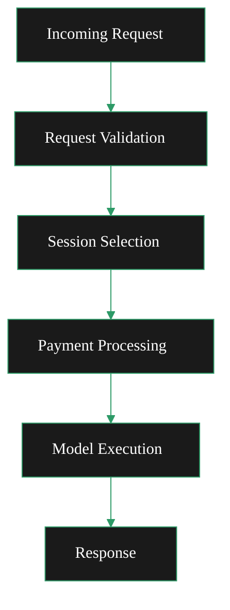

{/* codex-i18n: eyJraW5kIjoiY29kZXgtaTE4biIsInZlcnNpb24iOjEsInNvdXJjZVBhdGgiOiJ2Mi9nYXRld2F5cy9ydW4tYS1nYXRld2F5L21vbml0b3IvbW9uaXRvci1hbmQtb3B0aW1pc2UubWR4Iiwic291cmNlUm91dGUiOiJ2Mi9nYXRld2F5cy9ydW4tYS1nYXRld2F5L21vbml0b3IvbW9uaXRvci1hbmQtb3B0aW1pc2UiLCJzb3VyY2VIYXNoIjoiMGIwOGFkOGVlYzI0OTYwNGU4MWFkYWE1NGExNGE0ZjQ0MTY2NjYwMjRiNDJiODAzY2Y2MzUzYzEyNzI4OWFkNCIsImxhbmd1YWdlIjoiY24iLCJwcm92aWRlciI6Im9wZW5yb3V0ZXIiLCJtb2RlbCI6InF3ZW4vcXdlbi10dXJibyIsImdlbmVyYXRlZEF0IjoiMjAyNi0wMi0yN1QxNDoxNjoyMC4zMzZaIn0= */}
import { DoubleIconLink } from '/snippets/components/primitives/links.jsx'
import { ScrollableDiagram } from '/snippets/components/display/zoomable-diagram.jsx'

<Danger> Currently operating as a brainstorming page </Danger>

## 请求路由

**请求处理流程（两者）**

- **请求验证**: OpenAPI 验证中间件验证请求结构
- **会话选择**: AISessionManager 根据模型能力选择适当的协调器
- **支付处理**: 根据非实时端点的像素数量计算支付
- **模型执行**: 将请求发送到指定模型的AI工作者

<ScrollableDiagram title="Request Processing Flow">

</ScrollableDiagram>

#### 转码请求

传统的视频转码请求通过以下方式处理:

- **RTMP 推流**: 端口 `1935` 默认情况下
- **HTTP 推送**: `/live/{streamKey}` 当 `-httpIngest` 已启用
- **HLS 输出**: 用于播放的自适应码率流

#### AI 请求

AI 处理请求通过专用端点进行路由<DoubleIconLink label="ai_mediaserver.go" href="https://github.com/livepeer/go-livepeer/blob/5691cb48/server/ai_mediaserver.go" iconLeft="github" />

<Danger> (fixme) OpenAPI Spec is here: ai/worker/api/openapi.json </Danger>

    <ResponseField name="/text-to-image" type="json">
      Generate images from text prompts.
      Uses `jsonDecoder` for parsing
    </ResponseField>
    <ResponseField name="/image-to-image" type="multipart/form-data">
      Transform images with prompts.
      Uses `multipartDecoder` for file uploads
    </ResponseField>
    <ResponseField name="/image-to-video" type="multipart/form-data">
      Create videos from images.
      Uses `multipartDecoder` for file uploads
    </ResponseField>
    <ResponseField name="/upscale" type="multipart/form-data">
      Upscale (enhance) images to higher resolution.
      Uses `multipartDecoder` for file uploads
    </ResponseField>
    <ResponseField name="/live/video-to-video/{stream}/start" type="multipart/form-data">
      Apply transformations to a live video streamed to the returned endpoints.
      Live video endpoint has specialized handling for real-time streaming with MediaMTX integration
    </ResponseField>

## 支付模型

双设置处理两种不同的支付模型：

#### 转码付款

基础：按处理的视频片段计算
方法：每个片段发送付款票证
验证：多协调器验证以确保质量

#### AI 付款

基础：按处理的像素计算（宽度 × 高度 × 输出）
方法：基于像素的付款计算
实时视频：流媒体期间的间隔付款

## 操作注意事项

#### 资源分配

在运行双设置时，请考虑：

- GPU 资源：在转码和 AI 工作负载之间共享
- 内存：加载（“预热”）时，AI 模型需要大量 RAM
- 网络：用于流式传输输入和 AI 请求/响应的带宽

#### 监控

监控两种工作负载类型:

- 转码: 段处理延迟，成功率
- AI: 模型加载时间，推理延迟，像素处理速率

#### 扩展策略

- 水平扩展: 在负载均衡器后部署多个网关实例
- 垂直扩展: 为AI模型并行分配更多GPU资源
- 专用化：根据工作负载模式，将节点分为转码节点和基于AI的节点
