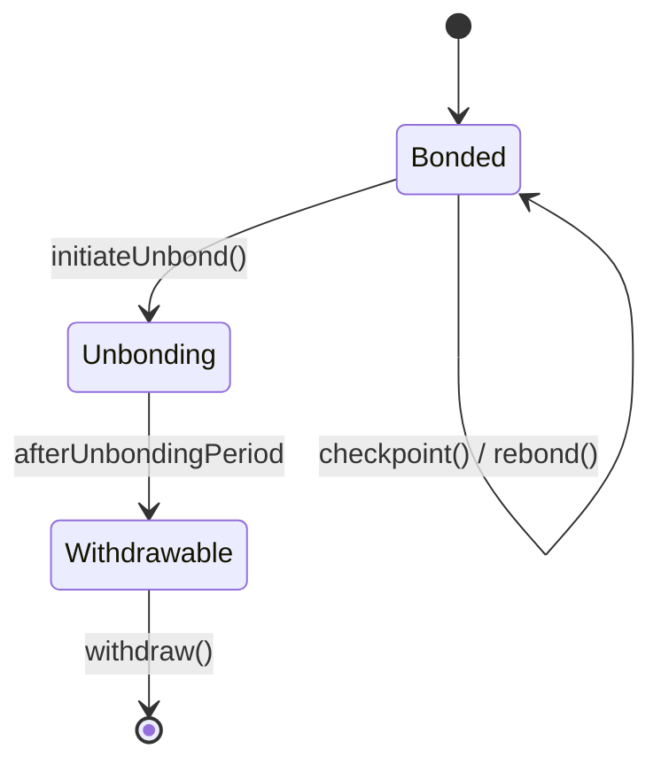

{/* codex-i18n: eyJraW5kIjoiY29kZXgtaTE4biIsInZlcnNpb24iOjEsInNvdXJjZVBhdGgiOiJ2Mi9scHQvYWJvdXQvbWVjaGFuaWNzLm1keCIsInNvdXJjZVJvdXRlIjoidjIvbHB0L2Fib3V0L21lY2hhbmljcyIsInNvdXJjZUhhc2giOiJiOTk1NTM4MmY5ZDNjNGQ0M2JjMGI4NDdhNmRiYmZkYTkwNmRhYTFjMDUzYWMzYjU4YjE1ZGMyYjdlYmM4MDY2IiwibGFuZ3VhZ2UiOiJjbiIsInByb3ZpZGVyIjoib3BlbnJvdXRlciIsIm1vZGVsIjoicXdlbi9xd2VuLXR1cmJvIiwiZ2VuZXJhdGVkQXQiOiIyMDI2LTAzLTAxVDEwOjUxOjM1Ljk4NFoifQ== */}
import { MathInline, MathBlock } from '/snippets/components/content/math.jsx'

## 执行摘要

此页面描述了LPT在绑定和解绑状态之间转换的确定性合约级机制，如何处理轮次，以及如何检查点和领取奖励。

此处描述的所有机制都严格在**协议层（链上）**。

---

## 1. 核心状态变量

让：

- <MathInline latex={String.raw`S_t`} /> = 第 round 的总 LPT 供应量<MathInline latex={String.raw`t`} />
- <MathInline latex={String.raw`B_T`} /> = 总质押余额
- <MathInline latex={String.raw`B_i`} /> = 与参与者相关的质押金额 <MathInline latex={String.raw`i`} />
- 轮次 <MathInline latex={String.raw`t`} /> = 协议管理的离散会计时期

轮次是发行和奖励分配的原子会计单位。

---

## 2. 债券

债券是指将 LPT 锁定到质押合约中，以参与协议奖励和治理的行为。

当参与者 <MathInline latex={String.raw`i`} />质押金额 <MathInline latex={String.raw`x`} />:

<MathBlock latex={String.raw`B_i^{new} = B_i^{old} + x`} />

<MathBlock latex={String.raw`B_T^{new} = B_T^{old} + x`} />

质押份额贡献于：

- 奖励资格
- 治理投票权重
- 安全参与

质押记录在 BondingManager 合约中。

---

## 3. 委托归属

如果委托人<MathInline latex={String.raw`D`} />将质押到协调者<MathInline latex={String.raw`O`} />:

<MathBlock latex={String.raw`B_O = B_{self,O} + \sum_D b_{D,O}`} />

委托人保留所有权，但委托奖励权利和投票权重归属。

---

## 4. 解绑

解绑启动一个提现期。

当参与者<MathInline latex={String.raw`i`} /> 解除绑定金额<MathInline latex={String.raw`x`} />:

<MathBlock latex={String.raw`B_i^{new} = B_i^{old} - x`} />

<MathBlock latex={String.raw`B_T^{new} = B_T^{old} - x`} />

质押进入待提取状态，受制于以轮次计算的解押期。

在此期间：

- 质押不会产生收益
- 质押不能立即转移

此延迟可防止快速的基于质押的操控。

---

## 5. 轮次生命周期

每轮包括:

1. 通胀计算
2. 奖励分配资格
3. 检查点处理

轮次转换由协议时间逻辑触发。

每轮发行：

<MathBlock latex={String.raw`R_t = S_t \cdot r_t`} />

供应更新:

<MathBlock latex={String.raw`S_{t+1} = S_t + R_t`} />

---

## 6. 奖励检查点

奖励不会自动转移；必须进行检查点操作。

检查点更新根据质押权重更新参与者的奖励余额。

分配给协调者<MathInline latex={String.raw`O`} />:

<MathBlock latex={String.raw`R_O = R_t \cdot \frac{B_O}{B_T}`} />

委托者份额：

<MathBlock latex={String.raw`R_{D,O} = R_O (1 - c_O) \cdot \frac{b_{D,O}}{B_O}`} />

检查点更新在提取或重新绑定之前更新内部会计状态。

---

## 7. 索取和重新绑定

参与者可以:

- 领取奖励至流动性余额
- 重新质押奖励（复合质押）

重新质押会增加 <MathInline latex={String.raw`B_i`} /> 从而增加未来的经济权重。

---

## 8. 状态转换图

---

## 9. 安全性影响

保护协议完整性的机制:

- **解除质押延迟** - 减少短期操控
- **基于轮次的会计处理** - 确定性奖励周期
- **基于质押的分配** - 资本支撑的安全性

---

## 10. 协议与网络分离

**协议（链上）：**
- 质押/取消质押逻辑
- 轮次转换
- 奖励发放
- 质押归属

**网络（链下）：**
- 作业执行
- 性能
- 费用生成

此处描述的机制完全在链上。

---

## 参考文献

- [Livepeer 协议仓库](https://github.com/livepeer/protocol)
- [合约注册表](https://docs.livepeer.org/references/contract-addresses)
