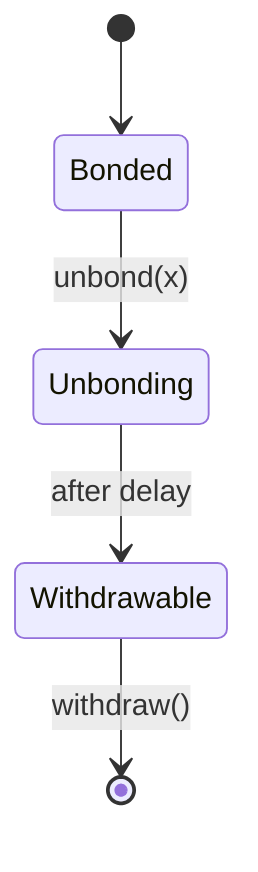
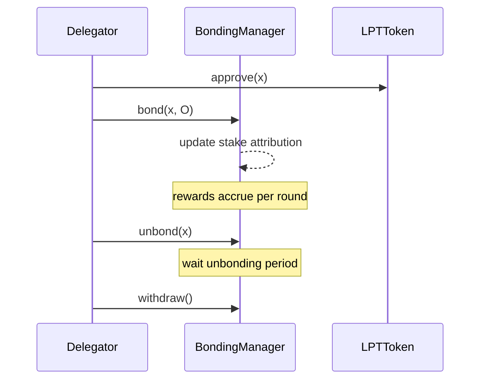

{/* codex-i18n: eyJraW5kIjoiY29kZXgtaTE4biIsInZlcnNpb24iOjEsInNvdXJjZVBhdGgiOiJ2Mi9scHQvZGVsZWdhdGlvbi9kZWxlZ2F0aW9uLWd1aWRlLm1keCIsInNvdXJjZVJvdXRlIjoidjIvbHB0L2RlbGVnYXRpb24vZGVsZWdhdGlvbi1ndWlkZSIsInNvdXJjZUhhc2giOiIxZDk3ZmE4MmY3MDAwNTM5ZWI2ZjEyMmMyYjFkMjk4ODE2NGQxMWU1NGVkYTFjNDIyNmM4OWFkODhhYzNjMmRlIiwibGFuZ3VhZ2UiOiJjbiIsInByb3ZpZGVyIjoib3BlbnJvdXRlciIsIm1vZGVsIjoicXdlbi9xd2VuLXR1cmJvIiwiZ2VuZXJhdGVkQXQiOiIyMDI2LTAzLTAxVDExOjA4OjMwLjg3MVoifQ== */}
import { MathInline, MathBlock } from '/snippets/components/content/math.jsx'

## 执行摘要

本指南提供了一个协议准确、合同感知的LPT委托操作指南。它严格专注于链上机制：质押、质押归属、奖励检查点、取消质押和提款。

委托会修改协议状态。它不会直接修改网络路由或执行。

---

## 1. 前提条件

在委托之前，参与者必须：

1. 在自托管钱包中持有LPT。
2. 连接到正确的部署网络（参见合约注册表）。
3. 了解解绑延迟和流动性限制。

标准合约引用：[合约地址](https://docs.livepeer.org/references/contract-addresses)

委托主要与BondingManager合约交互。

---

## 2. 第1步 —— 批准代币转账

如果直接与合约交互，则LPT代币合约必须被批准以转移所需的质押金额。

让<MathInline latex={String.raw`x`} />为要委托的金额。

批准不会改变质押状态；它仅授权质押合约转移代币。

状态影响：无（仅更新授权）。

---

## 3. 第2步 — 质押并委托

调用 `bond(x, O)` 其中:

- <MathInline latex={String.raw`x`} /> = LPT 数量
- <MathInline latex={String.raw`O`} /> = 选定的协调器地址

 状态转换:

<MathBlock latex={String.raw`B_i^{new} = B_i^{old} + x`} />

<MathBlock latex={String.raw`B_O^{new} = B_O^{old} + x`} />

<MathBlock latex={String.raw`B_T^{new} = B_T^{old} + x`} />

 委托会立即影响后续轮次的质押归属（受协议时间规则限制）。

---

## 4. 第3步 —— 验证链上状态

质押后，验证:

1. 您地址的质押金额。
2. 委托（协调器）地址归属。
3. 分配给协调器的总质押金额。

验证方法:

- 区块浏览器对BondingManager状态的读取。
- Livepeer 浏览器或等效索引器。

委托必须通过链上状态进行验证，而不仅仅依赖UI显示。

---

## 5. 奖励累积和检查点

每轮<MathInline latex={String.raw`t`} />:

<MathBlock latex={String.raw`R_t = S_t \cdot r_t`} />

协调器分配:

<MathBlock latex={String.raw`R_O = R_t \cdot \frac{B_O}{B_T}`} />

委托人净分配（包含佣金）<MathInline latex={String.raw`c_O`} />:

<MathBlock latex={String.raw`R_{D,O} = R_O \cdot (1 - c_O) \cdot \frac{b_{D,O}}{B_O}`} />

奖励可能需要进行检查点操作后才能被领取或重新质押。

检查点操作会更新内部账务，但除非明确领取，否则不会自动转移代币。

---

## 6. 第4步 — 重新质押（可选的复利操作）

除了提取奖励外，委托人可以选择重新质押。

如果奖励金额 = <MathInline latex={String.raw`y`} />:

<MathBlock latex={String.raw`B_i^{new} = B_i^{old} + y`} />

复利会增加未来的权重：

<MathBlock latex={String.raw`W_i = \frac{B_i}{B_T}`} />

---

## 7. 第5步 —— 启动解绑

要退出委托，请调用 `unbond(x)`。

状态转换：

<MathBlock latex={String.raw`B_i^{new} = B_i^{old} - x`} />

<MathBlock latex={String.raw`B_O^{new} = B_O^{old} - x`} />

<MathBlock latex={String.raw`B_T^{new} = B_T^{old} - x`} />

质押进入解绑状态。

在解绑期间：

- 质押不会产生收益。
- 质押不能立即提取。

---

## 8. 解绑延迟

协议会强制执行以轮次计算的延迟。

此延迟：

- 防止快速的质押轮换攻击。
- 稳定安全参与。
- 为委托人引入流动性风险。

状态模型:

---

## 9. 第6步 — 提取质押

在解绑期结束后，调用`withdraw()`.

状态影响:

- 质押余额保持减少。
- 流动 LPT 余额增加。

提现完成退出流程。

---

## 10. 风险审查检查表

在委托之前，请评估：

1. 佣金费率<MathInline latex={String.raw`c_O`} />
2. 协调器质押集中度
3. 历史检查点一致性
4. 治理对齐
5. 流动性需求（考虑到解绑延迟）

委托是在流动性受限下的资本分配决策。

---

## 11. 协议与网络分离

**协议（链上）:**

- `bond()`
- `unbond()`
- `withdraw()`
- 奖励分配
- 治理投票权重

**网络（链下）:**

- 节点运行时间
- 任务执行
- 费用生成

委托会更改协议状态；它不会直接更改路由行为。

---

## 12. 时序图（端到端）

---

## 参考文献

- [Livepeer 协议仓库](https://github.com/livepeer/protocol)
- [合约注册表](https://docs.livepeer.org/references/contract-addresses)
