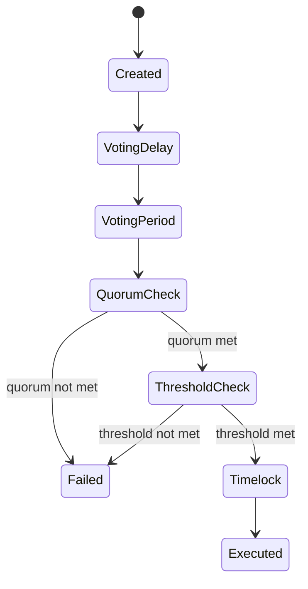

{/* codex-i18n: eyJraW5kIjoiY29kZXgtaTE4biIsInZlcnNpb24iOjEsInNvdXJjZVBhdGgiOiJ2Mi9scHQvZ292ZXJuYW5jZS9tb2RlbC5tZHgiLCJzb3VyY2VSb3V0ZSI6InYyL2xwdC9nb3Zlcm5hbmNlL21vZGVsIiwic291cmNlSGFzaCI6IjIxZjQ3YmFlZGJjZDczNTY1ODlkZTdlMWZjNjY3ZGM0MjU3Yjk3OTk2YTViZTE1OWEwZjhiMGM2NmFiNWQzZTIiLCJsYW5ndWFnZSI6ImNuIiwicHJvdmlkZXIiOiJvcGVucm91dGVyIiwibW9kZWwiOiJxd2VuL3F3ZW4tdHVyYm8iLCJnZW5lcmF0ZWRBdCI6IjIwMjYtMDMtMDFUMTE6MTY6NTQuMTI0WiJ9 */}
import { MathInline, MathBlock } from '/snippets/components/content/math.jsx'

## 执行摘要

Livepeer 治理是一个由智能合约完全执行的基于提案的系统，其权力按质押资本比例分配。权力与质押的代币成正比，一旦满足法定人数和阈值条件，执行将是确定性的。

本页面正式定义了治理决策流程，包括法定人数机制、投票阈值、时间锁语义和攻击面考虑因素。

---

## 1. 治理基础

令：

- <MathInline latex={String.raw`B_i`} /> = 分配给参与者的质押代币<MathInline latex={String.raw`i`} />
- <MathInline latex={String.raw`B_T`} /> = 总质押余额
- <MathInline latex={String.raw`V_i`} /> = 参与者的投票权<MathInline latex={String.raw`i`} />

投票权:

<MathBlock latex={String.raw`V_i = \frac{B_i}{B_T}`} />

所有治理权重都来源于质押余额。

---

## 2. 提案生命周期

一个治理提案通常遵循这些确定性阶段:

1. **创建** - 以编码操作提交提案
2. **投票延迟** - 投票开放前的时期
3. **投票周期** - 绑定参与者进行投票
4. **法定人数检查** - 最低参与要求
5. **阈值检查** - 多数条件
6. **队列（时间锁）** - 执行延迟
7. **执行** - 如果条件满足则进行状态转换

这些转换由治理合约强制执行。

---

## 3. 有效投票数要求

设：

- <MathInline latex={String.raw`Q`} /> = 有效投票数比例
- <MathInline latex={String.raw`V_{cast}`} /> = 总投票权数量

法定人数条件:

<MathBlock latex={String.raw`V_{cast} \ge Q \cdot B_T`} />

至少 33% 的所有质押 LPT 必须参与投票，否则投票无效。此要求确保一小部分人不能在没有广泛社区参与的情况下推动激进的更改。

---

## 4. 多数/阈值条件

设:

- <MathInline latex={String.raw`V_{for}`} /> = 支持的加权质押投票
- <MathInline latex={String.raw`V_{against}`} /> = 按质押权重计算的反对票

多数条件（简单多数）：

<MathBlock latex={String.raw`V_{for} > V_{against}`} />

参与投票的多数必须支持该提案。简单多数批准在包容性和决断力之间取得平衡：如果社区意见均分，提案无法通过。

---

## 5. 时间锁语义

批准的提案在执行前会进入时间锁阶段。

时间锁属性：

- 在批准和执行之间引入延迟
- 为利益相关者提供反应的机会
- 降低突然参数变化的风险

时间锁延迟<MathInline latex={String.raw`T_{delay}`} />在协议级别定义。

---

## 6. 执行模型

如果达成共识和阈值条件且时间锁已过期：

- 执行编码的操作
- 合约状态以确定性方式转换

执行可能包括：

- 参数修改
- 代理实现更新
- 资金库转账

每个提案的执行都是原子性的。

---

## 7. 治理对象和合约架构

官方合约地址文档列出了Arbitrum主网上的治理相关合约：

- **Governor** - 提案和投票逻辑
- **LivepeerGovernor (proxy/target)** - 可升级的治理实现
- **BondingVotes** - 跟踪基于质押的投票权
- **Treasury** - 由治理控制的资金

这表明治理不仅仅是社交行为；它是通过已部署的合约并使用已发布的地址来执行的。

---

## 8. 金库参数

金库治理讨论确定了两个参数尤为重要：

| 参数 | 描述 |
|-----------|-------------|
| `treasuryRewardCutRate` | 每轮分配到金库的通胀奖励百分比（目前约为10%） |
| `treasuryBalanceCeiling` | 一旦储备金余额超过上限（750,000 LPT），则可以将分成设置为零 |

---

## 9. 安全性和博弈论考虑

### 9.1 控制所需的资本

让 <MathInline latex={String.raw`\theta`} /> 表示控制结果所需的最小比例。

所需最低资本：

<MathBlock latex={String.raw`Capital_{control} \ge \theta B_T`} />

更高的质押余额会增加治理捕获成本。

### 9.2 质押集中风险

如果少数地址控制了大部分<MathInline latex={String.raw`B_T`} />，治理捕获风险会增加。安全性与集中度成反比。

### 9.3 投票冷漠风险

如果投票门槛分数<MathInline latex={String.raw`Q`} />相对于典型参与度而言较高：
- 由于参与度不足，提案可能会失败

如果 <MathInline latex={String.raw`Q`} /> 相对较低：
- 小规模的协调群体可能会通过提案

因此，门槛校准是一个安全参数。

### 9.4 执行者中心化

安全委员会/协议所有者根据投票结果调用函数来设置值。这引入了信任依赖：即使投票是去中心化的，执行可能在某些路径上仍保持中心化。

---

## 10. 治理权被夺取的风险

该系统突出了几个结构上重要的风险：

1. **低参与度和投票权集中** - 会降低对敌对治理行为的防御能力
2. **执行者中心化** - 安全委员会依赖引入了信任要求
3. **惩罚功能禁用** - 降低了系统对不当行为自动实施经济惩罚的能力，增加了对声誉和社会解决方案的依赖

---

## 11. 治理状态机

---

## 12. 协议与网络分离

**协议（链上）：**
- 提案提交
- 投票表决
- 法定人数和阈值执行
- 时间锁执行
- 参数修改

**网络（链下）：**
- 节点操作
- 性能
- 任务执行

治理修改规则；网络参与者在这些规则内操作。

---

## 参考文献

- [Livepeer 协议仓库](https://github.com/livepeer/protocol)
- [合约注册表](https://docs.livepeer.org/references/contract-addresses)
- [Livepeer 改进提案（LIPs）](https://github.com/livepeer/LIPs)
