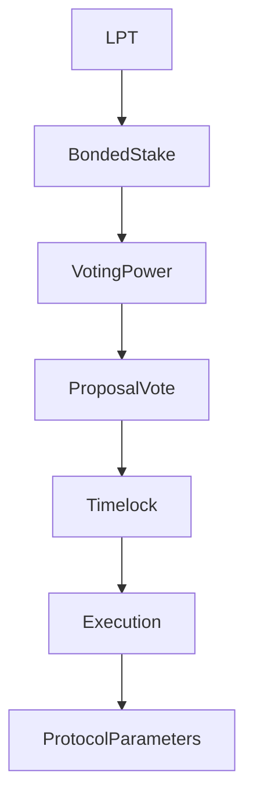

{/* codex-i18n: eyJraW5kIjoiY29kZXgtaTE4biIsInZlcnNpb24iOjEsInNvdXJjZVBhdGgiOiJ2Mi9scHQvZ292ZXJuYW5jZS9vdmVydmlldy5tZHgiLCJzb3VyY2VSb3V0ZSI6InYyL2xwdC9nb3Zlcm5hbmNlL292ZXJ2aWV3Iiwic291cmNlSGFzaCI6IjE2MDljNDMyNjBhMzY5NjI1ZGUxMWUyODc4ZjM4ZjA2NDQyZWIwZGNlNzk1ZWNjNjg5NWU4MmMxNTczOGM2MTIiLCJsYW5ndWFnZSI6ImNuIiwicHJvdmlkZXIiOiJvcGVucm91dGVyIiwibW9kZWwiOiJxd2VuL3F3ZW4tdHVyYm8iLCJnZW5lcmF0ZWRBdCI6IjIwMjYtMDMtMDFUMTE6MTY6MDcuNTg1WiJ9 */}
import { MathInline, MathBlock } from '/snippets/components/content/math.jsx'

## 执行摘要

Livepeer 治理是一种基于质押权重的链上决策系统，负责控制协议参数更新、合约升级（在可升级的情况下）和资金库分配。

治理权仅来自**质押的 LPT**。它在**协议层（链上）** 并修改约束网络层的经济和合同规则。

---

## 1. 正式定义

让：

- <MathInline latex={String.raw`B_i`} /> = 分配给参与者的质押金额<MathInline latex={String.raw`i`} />
- <MathInline latex={String.raw`B_T`} /> = 总质押金额

投票权：

<MathBlock latex={String.raw`V_i = \frac{B_i}{B_T}`} />

因此，治理是一个基于质押资本的决策系统。只有质押的代币才能贡献投票权重。

---

## 2. 治理范围

治理可以修改：

1. 通货膨胀参数（例如，调整系数、目标质押率）
2. 合约实现（通过启用的升级模式）
3. 国库支出
4. 协议配置常量

治理不**直接**控制:

- GPU 调度
- 作业路由
- 网关定价策略
- 链下运营行为

这些属于网络层。

---

## 3. 链上/链下混合模型

Livepeer 使用链上/链下混合治理模型。链下流程（讨论、工作组和信号）允许社区在开放论坛中辩论和精炼想法。然后链上投票将这些想法绑定为协议升级或资金分配。这种分离方式保持链上交易最小化，同时最大化社区参与和透明度。

### Livepeer 改进提案（LIPs）

协议变更的主要机制是 Livepeer 改进提案 (LIP)。LIP 是结构化文档（托管在 GitHub 上），用于指定技术变更、参数调整或治理流程——类似于 Ethereum 的 EIP。

LIP 的生命周期遵循一个有计划的节奏：

1. **想法与讨论** – 任何人都可以在 Livepeer 论坛或 Discord 上提出一个想法。开发人员、协调者和委托人的早期反馈有助于识别权衡。

2. **特殊目的实体的成立** – 复杂的想法通常会导致成立一个特殊目的实体 (SPE)：由社区成员组成的小组，他们界定问题、研究替代方案、制定规范并估算资源需求。SPE 在链下运作，并对社区负责。

3. **起草与质押要求** – 一旦提案成熟，作者将使用标准模板起草一个 LIP，并向协议仓库提交一个拉取请求。提案者必须至少质押 100 LPT 才能提交 LIP。

4. **正式审查与修订** – LIP 将由社区、核心开发人员和 Livepeer 基金会进行审查。审查期通常至少持续两周。

5. **快照投票** – 在上链之前，提案者可以进行一个 Snapshot 投票（链下按代币权重的投票）来了解社区意见。

6. **链上投票** – 最后，LIP 提交到治理智能合约进行具有约束力的投票。如果达到法定人数和多数阈值，该提案将被排入执行队列。

---

## 4. 投票机制

让提案<MathInline latex={String.raw`P`} /> 在投票窗口期间保持活跃。

投票权总数：

<MathBlock latex={String.raw`V_{cast} = \sum_{i \in voters} B_i`} />

如果提案满足治理合约逻辑中定义的法定人数和多数阈值，则提案通过。这些阈值是在链上强制执行的。

---

## 5. 治理作为安全层

治理安全性取决于质押代币的分布情况。

设 <MathInline latex={String.raw`\theta`} /> 为影响结果所需的质押代币比例。

最低资本要求：

<MathBlock latex={String.raw`Capital_{control} \geq \theta B_T`} />

安全性随着总质押代币的增加而提高，随着质押集中度的增加而降低：

<MathBlock latex={String.raw`Security \propto B_T`} />

---

## 6. 架构上下文

### 6.1 协议层合约

治理逻辑与以下合约进行交互：

- 提案创建
- 投票和计票
- 时间锁执行
- 已批准提案的执行

规范合同地址: [合同注册表](https://docs.livepeer.org/references/contract-addresses)

### 6.2 网络层交互

治理决策可能通过修改以下内容间接影响网络行为:

- 激励参数
- 奖励动态
- 可升级的合约逻辑

然而，工作负载的执行仍发生在链下。

---

## 7. 系统图

---

## 8. 协议与网络分离

**协议（链上）：**
- 提案创建
- 投票和计票
- 参数更新
- 合约升级
- 资金库执行

**网络（链下）:**
- 节点操作
- 工作负载执行
- 路由和定价

治理修改规则；网络参与者在这些规则内执行操作。

---

## 参考文献

- [Livepeer 协议仓库](https://github.com/livepeer/protocol)
- [合约注册表](https://docs.livepeer.org/references/contract-addresses)
- [Livepeer 改进提案（LIPs）](https://github.com/livepeer/LIPs)
