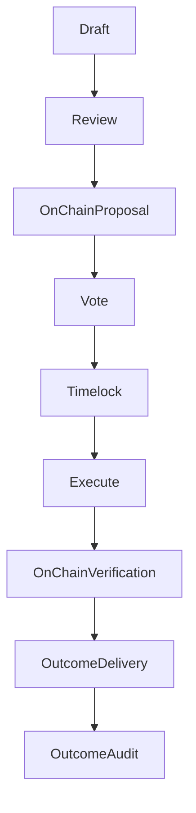

{/* codex-i18n: eyJraW5kIjoiY29kZXgtaTE4biIsInZlcnNpb24iOjEsInNvdXJjZVBhdGgiOiJ2Mi9scHQvdHJlYXN1cnkvYWxsb2NhdGlvbnMubWR4Iiwic291cmNlUm91dGUiOiJ2Mi9scHQvdHJlYXN1cnkvYWxsb2NhdGlvbnMiLCJzb3VyY2VIYXNoIjoiM2M2MzlkMTczZjYzYzU4ZDQ5ZWZlZWZkZjNmYzNlMTViMGM0OGRjMDZiZTUwNjYzNzMyNmZjZTgyOGExNjI3ZCIsImxhbmd1YWdlIjoiY24iLCJwcm92aWRlciI6Im9wZW5yb3V0ZXIiLCJtb2RlbCI6InF3ZW4vcXdlbi10dXJibyIsImdlbmVyYXRlZEF0IjoiMjAyNi0wMy0wMVQxMToyNDozOS45NjFaIn0= */}
import { MathInline, MathBlock } from '/snippets/components/content/math.jsx'

## 执行摘要

储备金分配是一种由治理授权的链上操作，将协议控制的资产转移到接收方以用于特定目的。分配由智能合约以确定性方式执行，但其现实世界的结果取决于接收方的链下交付。

本页面定义了：

- 分配会计模型
- 分配决策的评估框架
- 安全性和故障模式
- 验证和审计方法

---

## 1. 正式分配模型

让:

- <MathInline latex={String.raw`T`} /> = 分配前的储备金余额
- <MathInline latex={String.raw`A_k`} /> = 提案的分配金额<MathInline latex={String.raw`k`} />
- <MathInline latex={String.raw`T'`} /> = 分配后的储备金余额

单次分配更新:

<MathBlock latex={String.raw`T' = T - A_k`} />

超过<MathInline latex={String.raw`n`} /> 次分配:

<MathBlock latex={String.raw`T_n = T_0 - \sum_{k=1}^{n} A_k`} />

其中每个<MathInline latex={String.raw`A_k`} /> 通过治理提案负载执行。

---

## 2. 分配分类

储备金分配通常分为以下类别：

1. **生态系统开发** — 应用程序、集成、SDK。
2. **协议研发** — 安全研究、审计、经济建模。
3. **基础设施支持** — operator tooling, monitoring, reliability improvements.
4. **Community Programs** — education, onboarding, documentation, events.
5. **Strategic Interventions** — bootstrapping demand or supply where markets underprovide.

These categories are conceptual; on-chain execution is simply calldata.

---

## 3. 评估框架

储备金分配是在不确定性下的决策。

定义一个分配提案<MathInline latex={String.raw`k`} />带有预期结果函数:

<MathBlock latex={String.raw`Outcome_k = g(Impact_k, Feasibility_k, Risk_k, Alignment_k)`} />

一个实用的决策函数是:

<MathBlock latex={String.raw`Score_k = w_1 Impact_k + w_2 Feasibility_k - w_3 Risk_k + w_4 Alignment_k`} />

其中<MathInline latex={String.raw`w_i`} /> 是治理选择的权重。

### 3.1 影响

衡量对协议目标的预期改进，例如：

- 增加网络需求（费用）
- 改善运营商参与度（质押）
- 加强安全态势

### 3.2 可行性

评估执行可能性，给定：

- 技术范围
- 团队能力
- 交付时间表

### 3.3 风险

捕获:

- 执行风险
- 对抗风险
- 机会成本

### 3.4 对齐

确保结果强化协议级目标，而不是私人价值捕获。

---

## 4. 治理安全模型

分配继承治理安全。

让：

- <MathInline latex={String.raw`B_T`} /> = 总质押代币
- <MathInline latex={String.raw`\theta`} /> = 控制治理结果所需的份额

控制所需资本：

<MathBlock latex={String.raw`Capital_{control} \ge \theta B_T`} />

因此，储备金的安全性取决于质押分布和参与度。

---

## 5. 失败模式和风险

### 5.1 协议级故障

- calldata 错误
- 储备金余额不足
- 目标合约回滚

### 5.2 治理级故障

- 被集中质押捕获
- 低投票率 / 低参与度
- 审查不足的快速提案

### 5.3 结果级故障

因为交付是在链下：

- 收件人可能无法交付
- 结果可能无法验证
- 激励措施可能不一致

金库可以强制转移，但无法保证执行。

---

## 6. 验证和审计模型

验证分为两个领域:

### 6.1 链上验证（确定性）

确认以下内容：

- 提案已成功执行
- 转账已发生
- 接收者地址与预期目标匹配
- 国库余额减少了<MathInline latex={String.raw`A_k`} />

此可通过交易日志和状态读取进行验证。

### 6.2 链下结果验证（非确定性）

结果验证需要：

- 里程碑报告
- 公开交付物（代码、文档、部署）
- 可复现的影响证据

治理应优先考虑具有可衡量和可审计结果的分配。

---

## 7. 图表 — 分配生命周期

---

## 8. 协议与网络分离

**协议（链上）：**

- 分配授权和执行
- 确定性转账
- 链上审计追踪

**网络/链下:**

- 接收者交付
- 生态系统影响
- 结果衡量

国库在链上控制资产；结果取决于链下执行。

---

## 参考文献

- [Livepeer 协议仓库](https://github.com/livepeer/protocol)
- [合约注册表](https://docs.livepeer.org/references/contract-addresses)
