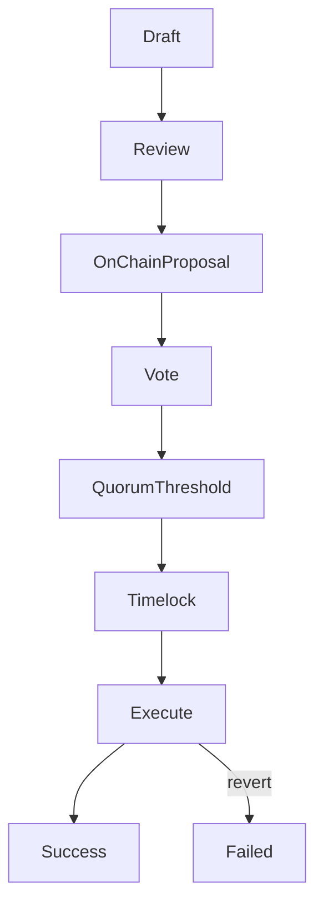

{/* codex-i18n: eyJraW5kIjoiY29kZXgtaTE4biIsInZlcnNpb24iOjEsInNvdXJjZVBhdGgiOiJ2Mi9scHQvdHJlYXN1cnkvcHJvcG9zYWxzLm1keCIsInNvdXJjZVJvdXRlIjoidjIvbHB0L3RyZWFzdXJ5L3Byb3Bvc2FscyIsInNvdXJjZUhhc2giOiIzN2RjMzYwNjU5NDlhMDJiNzQ3Y2M1YmIyMzQ4ZDE5ZGJiYTJiYmY2ODUwNmYzNmY5MDdlMTcwNjk4YjQ3OGNhIiwibGFuZ3VhZ2UiOiJjbiIsInByb3ZpZGVyIjoib3BlbnJvdXRlciIsIm1vZGVsIjoicXdlbi9xd2VuLXR1cmJvIiwiZ2VuZXJhdGVkQXQiOiIyMDI2LTAzLTAxVDExOjI0OjAwLjMwNVoifQ== */}
import { MathInline, MathBlock } from '/snippets/components/content/math.jsx'

## 执行摘要

一个资金库提案是一个治理提案，其可执行的有效载荷授权链上资金库操作（通常是转账、拨款或合约调用）。在 Livepeer 中，资金库提案在 **协议层（链上）**：一旦达到法定人数和阈值，并且时间锁过期，编码的操作将确定性地执行。

本页面定义了资金库提案有效载荷的结构、执行语义以及主要的失败模式。

---

## 1. 正式定义

一个储备金提案 <MathInline latex={String.raw`P`} /> 是可执行操作的元组:

<MathBlock latex={String.raw`P = \{ a_1, a_2, \dots, a_n \}`} />

每个操作 <MathInline latex={String.raw`a_k`} /> 被定义为:

<MathBlock latex={String.raw`a_k = (Target_k, Value_k, Data_k)`} />

其中:

- **目标** 是被调用的合约或地址
- **值** 是附加的原生代币金额（如果有）
- **数据** 是 ABI 编码的 calldata，指定函数选择器和参数

该提案将通过治理并在等待期后执行。

---

## 2. 治理授权

让绑定的质押变量：

- <MathInline latex={String.raw`B_i`} /> = 投票者的绑定质押<MathInline latex={String.raw`i`} />
- <MathInline latex={String.raw`B_T`} /> = 总绑定质押

投票权：

<MathBlock latex={String.raw`V_i = \frac{B_i}{B_T}`} />

法定人数条件：

<MathBlock latex={String.raw`V_{cast} \ge Q \cdot B_T`} />

阈值条件（示例）：

<MathBlock latex={String.raw`V_{for} > V_{against}`} />

只有满足治理条件的提案才能进入时间锁队列。

---

## 3. 时间锁队列语义

一旦获得批准，提案将被放入一个延迟的时间锁队列中<MathInline latex={String.raw`T_{delay}`} />.

时间锁提供：

- 可预测的执行窗口
- 利益相关者的响应时间
- 防止突然或恶意更改的缓解措施

在延迟结束后才能执行。

---

## 4. 执行语义

在时间锁到期后，执行尝试应用每个操作<MathInline latex={String.raw`a_k`} /> 在执行交易中原子地进行。

 两个重要属性：

1. ** 确定性：** 执行由 calldata 严格定义
2. ** 原子性：** 如果任何操作回滚，交易将回滚，除非执行模型明确容忍部分失败

因此，必须在考虑调用数据正确性和失败模型的情况下编写资金库提案。

---

## 5. 资金库转账作为标准案例

一种常见操作是资金库转账。

如果资金库余额是<MathInline latex={String.raw`T`} />且分配金额是<MathInline latex={String.raw`A`} />:

<MathBlock latex={String.raw`T' = T - A`} />

接收者余额增加 <MathInline latex={String.raw`A`} /> 根据资产的转账语义。

---

## 6. 失败模式

国库提案执行可能因多种原因失败。

### 6.1 调用数据错误

错误的函数选择器或格式错误的 ABI 编码会导致回滚。

### 6.2 财务储备余额不足

转账金额超过财务储备持有的金额。

### 6.3 目标合约中止

由于访问控制、暂停状态或参数验证，被调用的合约拒绝调用。

### 6.4 资产转账语义

某些代币合约可能：

- 返回 false 而不是回滚
- 应用转账费用
- 强制允许列表

提案作者必须验证目标资产行为。

### 6.5 时间锁配置

如果时间锁延迟或执行窗口条件配置错误，提案可能变得无法执行。

---

## 7. 风险缓解检查表

在提交资金库提案之前:

1. 通过注册表验证目标地址和合约
2. 确认 ABI 编码正确
3. 确认资金库余额充足
4. 尽可能模拟执行
5. 确保 calldata 可审计且作用域最小

---

## 8. 提案执行流程

---

## 9. 协议与网络分离

**协议（链上）：**
- 提案负载定义
- 投票统计和授权
- 时间锁队列
- 确定性执行
- 金库转账

**网络（链下）:**
- 起草和审查
- 由接受者进行的赠款交付和运营执行

资金库提案由协议逻辑强制执行；结果需要链下交付。

---

## 参考文献

- [Livepeer 协议仓库](https://github.com/livepeer/protocol)
- [合约注册表](https://docs.livepeer.org/references/contract-addresses)
