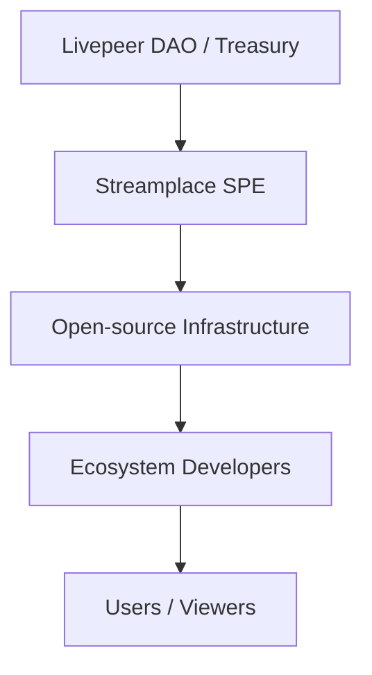

{/* codex-i18n: eyJraW5kIjoiY29kZXgtaTE4biIsInZlcnNpb24iOjEsInNvdXJjZVBhdGgiOiJ2Mi9wbGF0Zm9ybXMvc3RyZWFtcGxhY2UvaW50cm9kdWN0aW9uL3N0cmVhbXBsYWNlLWZ1bmRpbmctbW9kZWwubWR4Iiwic291cmNlUm91dGUiOiJ2Mi9wbGF0Zm9ybXMvc3RyZWFtcGxhY2UvaW50cm9kdWN0aW9uL3N0cmVhbXBsYWNlLWZ1bmRpbmctbW9kZWwiLCJzb3VyY2VIYXNoIjoiMWNhYWE3MTkyY2MzMTkwNzllMTMzN2IwNDliYjYyYTkzN2IxODEwMzU4MzY3YzVhY2RkZmUyMGNiODc5YmQ5ZSIsImxhbmd1YWdlIjoiY24iLCJwcm92aWRlciI6Im9wZW5yb3V0ZXIiLCJtb2RlbCI6InF3ZW4vcXdlbi10dXJibyIsImdlbmVyYXRlZEF0IjoiMjAyNi0wMi0yN1QxODoxNDozNy4zNTBaIn0= */}
---

Streamplace 作为 **特殊目的实体 (SPE)** 在 Livepeer 生态系统内运作。SPE 是由公共资金支持的团队，负责构建 **关键的、开源的、公共产品基础设施** 以增强和扩展 Livepeer 网络。

此页面解释：

- 什么是SPE？
- 资金如何从Livepeer金库流出
- Streamplace如何使用这些资金
- 为什么存在SPE模型

---

# 🏛️ 什么是SPE？

A **特殊目的实体** 是由 Livepeer 生态系统资助的以使命为导向的工程或运营团队，用于实现：

- 长期基础设施
- 开源软件
- 网络级功能
- 为创作者、开发者和节点运营商带来好处的公共产品

Streamplace 是一个专注于 **去中心化视频基础设施、溯源系统以及用于社交/Web3 应用的 SDK**。

---

# 💸 资金流动图

---

# 📦 Streamplace 作为 SPE 提供的内容

储备资金使 Streamplace 能够维护和改进：

### **1. Streamplace 节点**

- 摄入 (WHIP/WHEP/RTMP)
- 分段
- 出处嵌入 (C2PA + Ethereum)
- 转码分发

### **2. SDK & APIs**

开发者友好的工具，用于：

- 直播流
- 元数据配置
- 播放集成
- 社交应用嵌入

### **3. 元数据与来源标准**

完整的模式为：

- 权利
- 内容警告
- 分发政策
- 重播和集 metadata

### **4. 公共产品基础设施**

Everything Streamplace builds is:

- **open-source**
- **transparent**
- **ecosystem-owned**
- **permissionless** to adopt

---

# 🔥 为什么存在 SPE 模型

SPE 确保 Livepeer 可以可持续地资助复杂且长期的项目，而无需依赖：

- 风险投资
- 中心化运营商
- 闭源商业模式

SPE 模型创建了：

- 稳定容量用于关键网络工作
- 透明问责
- 生态系统韧性
- 健康的去中心化

---

# 📚 相关页面

- [Streamplace 概览](/platforms/streamplace/overview)
- [架构](/platforms/streamplace/introduction/streamplace-architecture)
- [来源与元数据](/platforms/streamplace/introduction/streamplace-provenance)
- [开发者集成指南](/platforms/streamplace/introduction/streamplace-integration)
