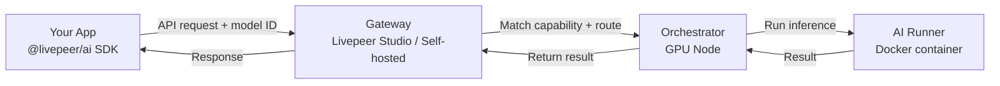

import { StyledTable, TableRow, TableCell } from '/snippets/components/layout/tables.jsx'
import { BorderedBox } from '/snippets/components/layout/containers.jsx'

Livepeer's AI network routes inference jobs from your application to a distributed pool of GPU operators (orchestrators). You submit a job, a gateway routes it to a capable orchestrator, the orchestrator runs inference, and the result comes back.

Three integration patterns are available depending on what you need:

1. **Standard API Pipelines** - call a hosted endpoint, get a result. No infrastructure needed.
2. **ComfyStream** - run ComfyUI-based workflows on live video frames in real time.
3. **BYOC (Bring Your Own Compute)** - bring your own model container; Livepeer routes jobs to it.

## Start here in 5 minutes

<BorderedBox variant="accent" padding="16px">

- **Prereqs:** A backend environment and an API key from your selected gateway provider
- **Time:** 5 minutes
- **Outcome:** Integration pattern selected and one pipeline request executed
- **First action:** Start with **Standard API Pipelines**, run one text-to-image request, then decide if ComfyStream or BYOC is needed

</BorderedBox>

---

## Choosing Your Integration Pattern

<BorderedBox variant="accent" padding="16px">

**Use Standard API Pipelines if:**
- You need text-to-image, image-to-image, image-to-video, audio-to-text, LLM, or other common pipelines
- You want to be productive in minutes with an SDK
- You're using publicly available models on the Livepeer network

**Use ComfyStream if:**
- You need to run a ComfyUI workflow on a live video stream
- You want real-time per-frame AI processing (style transfer, depth estimation, face animation)
- You're building interactive AI video experiences

**Use BYOC if:**
- You have a custom model or pipeline that isn't in the standard set
- You need to run proprietary or fine-tuned models at scale
- You want your own container executing on Livepeer's GPU network

</BorderedBox>

---

## Standard API Pipelines

Standard pipelines are available via any Livepeer gateway that supports AI inference. Send a request with your model ID and parameters; get back a result.

### Available Pipelines

<StyledTable variant="bordered">
  <thead>
    <TableRow header>
 <TableCell header>Pipeline</TableCell>
 <TableCell header>Input</TableCell>
 <TableCell header>Output</TableCell>
 <TableCell header>Example Use Case</TableCell>
    </TableRow>
  </thead>
  <tbody>
    <TableRow>
 <TableCell>**text-to-image**</TableCell>
 <TableCell>Text prompt</TableCell>
 <TableCell>Image (PNG/JPEG)</TableCell>
 <TableCell>Generative art, product visualization, creative tools</TableCell>
    </TableRow>
    <TableRow>
 <TableCell>**image-to-image**</TableCell>
 <TableCell>Image + prompt</TableCell>
 <TableCell>Image</TableCell>
 <TableCell>Style transfer, image editing, variation generation</TableCell>
    </TableRow>
    <TableRow>
 <TableCell>**image-to-video**</TableCell>
 <TableCell>Image + parameters</TableCell>
 <TableCell>Video</TableCell>
 <TableCell>Animate product photos, AI video generation</TableCell>
    </TableRow>
    <TableRow>
 <TableCell>**audio-to-text**</TableCell>
 <TableCell>Audio file</TableCell>
 <TableCell>Transcript (JSON)</TableCell>
 <TableCell>Transcription, subtitles, meeting notes</TableCell>
    </TableRow>
    <TableRow>
 <TableCell>**text-to-speech**</TableCell>
 <TableCell>Text</TableCell>
 <TableCell>Audio</TableCell>
 <TableCell>Voice synthesis, accessibility features</TableCell>
    </TableRow>
    <TableRow>
 <TableCell>**llm**</TableCell>
 <TableCell>Text prompt</TableCell>
 <TableCell>Text</TableCell>
 <TableCell>Chat, content generation, summarization</TableCell>
    </TableRow>
    <TableRow>
 <TableCell>**segment-anything-2**</TableCell>
 <TableCell>Image + points</TableCell>
 <TableCell>Segmentation mask</TableCell>
 <TableCell>Object isolation, background removal</TableCell>
    </TableRow>
    <TableRow>
 <TableCell>**upscale**</TableCell>
 <TableCell>Image</TableCell>
 <TableCell>Upscaled image</TableCell>
 <TableCell>Low-res image enhancement</TableCell>
    </TableRow>
    <TableRow>
 <TableCell>**live-video-to-video**</TableCell>
 <TableCell>Video stream</TableCell>
 <TableCell>Transformed video stream</TableCell>
 <TableCell>Real-time stream effects</TableCell>
    </TableRow>
  </tbody>
</StyledTable>

### Quick Example (text-to-image)

```typescript
import { Livepeer } from "@livepeer/ai";

const livepeer = new Livepeer({
  httpBearer: process.env.LIVEPEER_GATEWAY_API_KEY,
});

const result = await livepeer.generate.textToImage({
  prompt: "A futuristic cityscape at night, neon lights, photorealistic",
  modelId: "SG161222/RealVisXL_V4.0_Lightning",  // fast, warm model
  width: 1024,
  height: 1024,
  numInferenceSteps: 6,   // Lightning model - keep low (4-8)
  guidanceScale: 1.5,      // Lightning model - keep 1.0-2.0
});

// result.imageResponse.images[0].url
```

<Note>
 **Model selection matters.** Lightning-suffix models (e.g. `RealVisXL_V4.0_Lightning`) are optimized for speed - use 4-8 inference steps and guidance scale 1.0-2.0. Standard SDXL models need 20-50 steps and guidance 7.0-9.0. Check [available models and warm status](https://tools.livepeer.cloud/ai/network-capabilities) before selecting.
</Note>

### Available Gateways for AI

| Gateway | Endpoint | Auth | Best For |
|---|---|---|---|
| Livepeer Studio | `https://livepeer.studio/api/beta/generate` | `Authorization: Bearer <LIVEPEER_STUDIO_API_KEY>` | Production apps |
| Cloud SPE | [tools.livepeer.cloud](https://tools.livepeer.cloud) | Provider-defined | Development and experimentation |
| Self-hosted | Your gateway URL | `Authorization: Bearer <LIVEPEER_GATEWAY_API_KEY>` | Custom routing, private models |

As of 02-March-2026, Studio AI uses `https://livepeer.studio/api/beta/generate`; for Cloud SPE-managed access, check [tools.livepeer.cloud](https://tools.livepeer.cloud) for current direct API endpoint and auth requirements.

---

## ComfyStream

ComfyStream integrates ComfyUI with the Livepeer gateway protocol to run AI pipelines on **live video frames** in real time. It's the foundation of real-time AI video products like Daydream.

**How it works:**

1. Video stream is ingested and split into frames
2. Each frame is sent to a ComfyStream worker node
3. The worker runs the ComfyUI workflow graph on the frame (style transfer, detection, etc.)
4. The processed frame is returned and reassembled into an output stream

ComfyStream targets 15-30 FPS throughput with TensorRT-accelerated models achieving 10x+ performance over standard inference.

**Use ComfyStream for:**
- Real-time style transfer on live streams
- Per-frame AI effects (depth estimation, face animation)
- Interactive AI art with webcam input

<Card title="ComfyStream Guide" icon="diagram-project" href="./comfystream" arrow horizontal>
 Full ComfyStream architecture, node types, and integration guide.
</Card>

---

## BYOC (Bring Your Own Compute)

BYOC lets you bring a custom model container into the Livepeer AI network. Your container receives jobs routed by gateways, executes inference, and returns results - while Livepeer handles routing, payment, and coordination.

**BYOC is the right path when:**
- Your model is fine-tuned or proprietary (not available in the standard pipeline set)
- You need a specific inference runtime (vLLM, TensorRT, custom Python)
- You want Livepeer to provide the routing and payment layer for your compute

**Container requirements:**
- Expose an HTTP endpoint implementing the Livepeer AI worker API
- Accept job payloads matching the gateway's protocol format
- Return results in the expected schema

<Card title="BYOC Setup Guide" icon="box-open" href="./byoc" arrow horizontal>
 How to build, register, and deploy a BYOC container on the Livepeer network.
</Card>

---

## How the Network Routes AI Jobs



The gateway selects the best orchestrator based on capability (does it have the requested model warm?), performance history, pricing, and latency. **Warm models** - models already loaded in GPU memory - return results significantly faster than cold models that need to load first.

<Tip>
 Check [tools.livepeer.cloud/ai/network-capabilities](https://tools.livepeer.cloud/ai/network-capabilities) to see which models are currently warm on the network before choosing your model ID.
</Tip>

---

## Next Steps

<CardGroup cols={2}>
  <Card title="AI Inference Quickstart" icon="bolt-lightning" href="/v2/developers/quickstart/ai/ai-pipelines" arrow>
 Build your first AI integration in minutes.
  </Card>
  <Card title="API Reference" icon="code" href="/v2/gateways/resources/technical/api-reference/AI-API/text-to-image" arrow>
 Full endpoint reference for all AI pipelines.
  </Card>
  <Card title="ComfyStream" icon="diagram-project" href="./comfystream" arrow>
 Real-time per-frame AI video pipelines.
  </Card>
  <Card title="BYOC" icon="box-open" href="./byoc" arrow>
 Bring your own model container.
  </Card>
</CardGroup>
