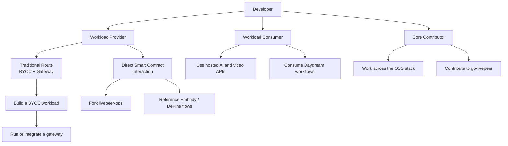

import { BorderedBox } from '/snippets/components/layout/containers.jsx'

Livepeer serves several distinct types of builders. The fastest path to your first success depends on what you're trying to build. Use this guide to find your lane.

## Start here in 5 minutes

<BorderedBox variant="accent" padding="16px">

- **Prereqs:** A clear goal (video app, AI app, gateway ops, GPU ops, or protocol extension)
- **Time:** 5 minutes
- **Outcome:** One primary path selected with one concrete first doc to execute
- **First action:** Pick one tab below and complete the first linked quickstart before branching

</BorderedBox>

---

## What do you want to build?

<Tabs>
  <Tab title="I want to add video to my app">
 **You are:** An application developer adding live streaming or video-on-demand to a product.

**Your path:** Use a hosted gateway service. You do not need to run infrastructure.

**What you'll use:** `livepeer` npm package, `@livepeer/react` Player and Broadcast components, RTMP ingest, HLS playback, Livepeer Studio dashboard.

**Primary CTA:** Start implementation with the quickstart.
<Card title="Video Streaming Quickstart" icon="tower-broadcast" href="/v2/developers/get-started/video-quickstart" arrow>
Create a livestream, get a stream key, and play back with the Livepeer Player in minutes.
</Card>

**Secondary CTA:** Use Studio product docs for production API details.
<Card title="Livepeer Studio" icon="video-arrow-up-right" href="/v2/solutions/livepeer-studio/overview" arrow>
Hosted video gateway - REST API, SDKs, dashboard. Best for production video applications.
</Card>

  </Tab>

  <Tab title="I want to run AI on video">
 **You are:** A developer building AI-powered video experiences - style transfer, generative video, real-time effects, transcription, or custom AI pipelines.

**Your path:** Use a hosted AI gateway (Studio, Daydream, or Cloud SPE) to start. If you need custom models or pipelines, consider BYOC or running your own gateway.

**What you'll use:** `@livepeer/ai` SDK, `httpBearer` auth, gateway AI endpoints, and optionally ComfyStream for custom workflows.
**Also useful:** [Daydream overview](/v2/solutions/daydream/overview) and [AI API reference](/v2/gateways/resources/technical/api-reference/AI-API/text-to-image).

**Primary CTA:** Get your first response from the AI network.
<Card title="AI Quickstart" icon="robot" href="/v2/developers/get-started/ai-quickstart" arrow>
Run text-to-image and other AI pipelines in minutes using the Livepeer AI SDK.
</Card>

**Secondary CTA:** Choose between standard APIs, ComfyStream, and BYOC.
<Card title="AI on Livepeer" icon="circuit-board" href="/v2/developers/concepts/ai-on-livepeer" arrow>
Understand how Livepeer AI pipelines work, including ComfyStream and BYOC.
</Card>

  </Tab>

  <Tab title="I want to run a gateway">
 **You are:** Building a product or platform that routes Livepeer jobs as core infrastructure, or you need custom SLA and routing control.

**Your path:** Run your own go-livepeer gateway node. This is the path taken by Livepeer Studio, Daydream, and Cloud SPE themselves.

**What you'll use:** go-livepeer, Docker or Linux binary, Arbitrum RPC, ETH wallet for on-chain mode.
**Also useful:** [Why Run a Gateway](/v2/gateways/guides/operator-considerations/business-case) and [Gateway Requirements](/v2/gateways/setup/requirements/setup).

**Primary CTA:** Launch a node quickly in a controlled test setup.
<Card title="Gateway Quickstart" icon="bolt-lightning" href="/v2/gateways/quickstart/gateway-setup" arrow>
Get a gateway running in under 10 minutes.
</Card>

**Secondary CTA:** Validate the business case before production rollout.
<Card title="Gateway Operator Opportunities" icon="briefcase" href="/v2/gateways/guides/opportunities/overview" arrow>
The business case for running your own gateway node.
</Card>

  </Tab>

  <Tab title="I want to contribute GPU compute">
 **You are:** A GPU operator wanting to earn ETH fees and LPT rewards by running transcoding and AI inference for the Livepeer network.

**Your path:** Set up a go-livepeer orchestrator node with GPU support.

**What you'll use:** go-livepeer orchestrator mode, NVIDIA GPU with CUDA, Linux, Arbitrum wallet.

**Primary CTA:** Complete the setup flow.
<Card title="Orchestrator Setup" icon="server" href="/v2/orchestrators/old/setting-up-an-orchestrator/overview" arrow>
Step-by-step orchestrator setup guide.
</Card>

**Secondary CTA:** Keep the portal open for operations and references.
<Card title="Orchestrator Portal" icon="microchip" href="/v2/orchestrators/portal" arrow>
Everything you need to set up and run an orchestrator node.
</Card>

  </Tab>

  <Tab title="I want to extend the protocol">
 **You are:** A developer building on top of Livepeer's smart contracts - staking derivatives, custom governance tools, analytics infrastructure, or other protocol-level integrations.

**Your path:** Start with the protocol documentation and contract addresses.

**Also useful:** [Protocol Economics](/v2/about/livepeer-protocol/economics) and [Technical Architecture](/v2/about/livepeer-network/technical-architecture).

**Primary CTA:** Get protocol context before integrating contracts.
<Card title="Protocol Overview" icon="scroll" href="/v2/about/livepeer-protocol/overview" arrow>
How the Livepeer protocol works: staking, rewards, governance.
</Card>

**Secondary CTA:** Use canonical addresses for Arbitrum deployments.
<Card title="Contract Addresses" icon="file-contract" href="/v2/resources/references/contract-addresses" arrow>
Livepeer smart contract addresses on Arbitrum One.
</Card>

  </Tab>
</Tabs>

---

## Three ways to go deeper

The tabs above get you to a first win quickly. Once you know how you want to engage with the network, most developer journeys settle into one of three longer-term paths.

<Columns cols={3}>
  <Card title="Workload Provider" icon="server" href="#workload-provider" arrow>
    Build workloads that orchestrators run, whether that means BYOC, custom
    routing, or direct smart contract control.
  </Card>
  <Card
    title="Workload Consumer"
    icon="wand-magic-sparkles"
    href="#workload-consumer"
    arrow
  >
    Consume existing AI or video workloads through hosted gateways, Daydream, or
    other higher-level products.
  </Card>
  <Card
    title="Core Contributor"
    icon="code-branch"
    href="#core-contributor"
    arrow
  >
    Work directly on go-livepeer, the protocol, or the supporting OSS stack that
    powers the network.
  </Card>
</Columns>

Here is the deeper operating model behind those roles:

### Workload Provider

Workload Providers define what runs on Livepeer compute. That can mean packaging a BYOC container, choosing your own routing layer, or interacting with the protocol more directly when you need full operational control.

<Steps>
  <Step title="Start with the standard BYOC route" icon="boxes">
 BYOC is the clearest path for most builders. Package the workload, understand the pipeline model, and validate the routing flow end to end.

    <Card title="BYOC" icon="cube" href="/v2/developers/build/byoc" arrow horizontal>

Learn how custom containers attach to Livepeer's inference and routing model.
</Card>

  </Step>
  <Step title="Add a gateway when you need routing control" icon="tower-broadcast">
 If you need your own routing, auth, or SLA layer, pair BYOC with a gateway path instead of relying only on hosted products.

    <Card title="Run a Gateway" icon="tower-broadcast" href="/v2/developers/concepts/running-a-gateway" arrow horizontal>

Understand when gateway control is worth the extra operational complexity.
</Card>

  </Step>
  <Step title="Use direct contract tooling for advanced control" icon="file-contract">
 The DeFine-maintained `livepeer-ops` workflow and Embody reference implementation show the more protocol-native route: direct orchestrator management, remote coordination, and custom control planes.
  </Step>
</Steps>

<CardGroup cols={2}>
  <Card
    title="livepeer-ops"
    icon="github"
    href="https://github.com/its-DeFine/livepeer-ops"
  >
    DeFine's direct smart contract and operator-management toolkit for advanced
    workload providers.
  </Card>
  <Card
    title="Embody pipeline reference"
    icon="github"
    href="https://github.com/its-DeFine/Unreal_Vtuber"
  >
    Reference implementation for a real-time avatar workflow built on direct
    orchestration patterns.
  </Card>
</CardGroup>

### Workload Consumer

Workload Consumers do not need to run infrastructure. They use hosted APIs, higher-level products, or existing workloads already available on the network.

<CardGroup cols={3}>
  <Card
    title="AI Quickstart"
    icon="robot"
    href="/v2/developers/get-started/ai-quickstart"
  >
    Get your first response from Livepeer AI without setting up infrastructure.
  </Card>
  <Card
    title="Daydream"
    icon="wand-magic-sparkles"
    href="/v2/solutions/daydream/overview"
  >
    Explore the productized real-time generative workflow built on Livepeer
    infrastructure.
  </Card>
  <Card
    title="AI on Livepeer"
    icon="circuit-board"
    href="/v2/developers/concepts/ai-on-livepeer"
  >
    Compare hosted APIs, ComfyStream, and custom workload options before you go
    deeper.
  </Card>
</CardGroup>

### Core Contributor

Core Contributors work on the repos that power the network itself: `go-livepeer`, the protocol contracts, the AI runtime, ComfyStream, and the docs and tooling around them.

<CardGroup cols={3}>
  <Card title="OSS Stack" icon="books" href="/v2/developers/concepts/oss-stack">
    See how the main Livepeer repos fit together and where each kind of
    contribution starts.
  </Card>
  <Card
    title="Contribution Guide"
    icon="book-open"
    href="/v2/developers/guides/contribution-guide"
  >
    Review contribution standards, repo expectations, and submission
    conventions.
  </Card>
  <Card
    title="go-livepeer"
    icon="github"
    href="https://github.com/livepeer/go-livepeer"
  >
    Start with the main node implementation if you want to work on gateways,
    orchestrators, or the protocol runtime.
  </Card>
</CardGroup>

---

## Zero-to-Hero Progression

Each builder path has a clear progression from first action to ecosystem contribution:

| Stage          | Application Dev            | Gateway Operator                 | GPU Operator            | AI Developer              |
| -------------- | -------------------------- | -------------------------------- | ----------------------- | ------------------------- |
| **Start**      | API key + first stream     | Read requirements                | Check GPU compat.       | API key + first inference |
| **First Win**  | Stream playing in app      | Gateway running locally          | Orchestrator registered | First AI result returned  |
| **Production** | Live app with users        | On-chain gateway routing jobs    | Earning ETH + LPT       | AI pipeline in product    |
| **Hero**       | Build tools for other devs | Run multi-region gateway product | Top-tier orchestrator   | Ship novel AI pipeline    |

---

## Not sure yet? Browse by use case

<CardGroup cols={3}>
  <Card
    title="Live Streaming"
    icon="tower-broadcast"
    href="/v2/developers/get-started/video-quickstart"
    arrow
  >
    RTMP, WebRTC, HLS, OBS
  </Card>
  <Card
    title="Video on Demand"
    icon="video"
    href="/v2/solutions/livepeer-studio/video-on-demand/overview"
    arrow
  >
    Upload, transcode, play back
  </Card>
  <Card
    title="AI Image Generation"
    icon="image"
    href="/v2/gateways/resources/technical/api-reference/AI-API/text-to-image"
    arrow
  >
    Text-to-image, image-to-image
  </Card>
  <Card
    title="Real-Time AI Video"
    icon="wand-magic-sparkles"
    href="/v2/solutions/daydream/overview"
    arrow
  >
    Style transfer, StreamDiffusion
  </Card>
  <Card
    title="Custom AI Pipelines"
    icon="circuit-board"
    href="/v2/developers/concepts/ai-on-livepeer"
    arrow
  >
    BYOC, ComfyStream, ComfyUI
  </Card>
  <Card
    title="Staking & Governance"
    icon="coins"
    href="/v2/lpt/delegation/overview"
    arrow
  >
    Delegate LPT, earn rewards
  </Card>
</CardGroup>
