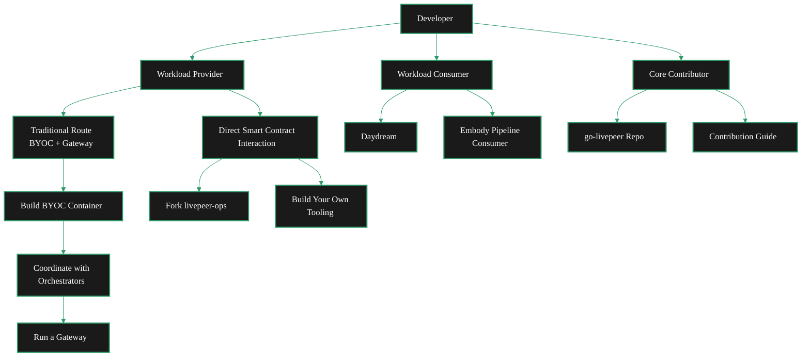

Livepeer offers multiple paths for developers depending on how you want to engage with the network. Whether you're bringing compute workloads, consuming existing AI pipelines, or contributing to the core Go implementation, there's a clear path for you.

<Tip>
  Looking to run an orchestrator? Head to the [Orchestrator section](/v2/orchestrators/quickstart/overview) for setup guides and options.
</Tip>

## Pick Your Path

<Columns cols={3}>
  <Card title="Workload Provider" icon="server" href="#path-1-workload-provider" arrow>
    Create workloads that run on Livepeer orchestrators - build containers, deploy pipelines, and leverage the network's GPU compute.
  </Card>
  <Card title="Workload Consumer" icon="wand-magic-sparkles" href="#path-2-workload-consumer" arrow>
    Consume existing pipeline workloads running on the Livepeer network - no infrastructure setup required.
  </Card>
  <Card title="Core Contributor" icon="code-branch" href="#path-3-core-contributor" arrow>
    Contribute directly to go-livepeer, the Go implementation that powers the Livepeer network.
  </Card>
</Columns>

---

---

## Path 1: Workload Provider

As a **Workload Provider**, you create workloads that run on Livepeer orchestrators. You build the containers and pipelines - orchestrators on the network provide the GPU compute to execute them. Whether it's an AI inference pipeline, a video transcoding job, or something entirely custom, you define the workload and the network runs it.

There are two approaches depending on how much control you need.

### Option A: Traditional Route (Gateway + BYOC)

The standard path for getting your workloads running on orchestrators. You develop a BYOC (Bring Your Own Container) workload, run a gateway to route jobs, and orchestrators pick up and execute your containers on their GPUs.

<Steps>
  <Step title="Understand the BYOC model" icon="boxes">
    BYOC lets you package your workload as a sidecar container that runs alongside the go-livepeer main container on orchestrator nodes. You define what the container does - the orchestrators provide the compute.

    <Card title="BYOC Documentation" icon="book-open" href="/v2/developers/ai-pipelines/byoc" arrow horizontal>
      Learn how BYOC containers work and how to build one.
    </Card>
  </Step>
  <Step title="Build your BYOC container" icon="docker">
    Develop and test your sidecar container locally. This is where your workload logic lives - inference models, processing pipelines, or any custom compute task.

    <Card title="BYOC Examples & Integrations" icon="github" href="https://github.com/ad-astra-video/livepeer-app-pipelines" arrow horizontal>
      Reference implementations and example pipelines for building BYOC containers.
    </Card>
  </Step>
  <Step title="Run your own gateway" icon="tower-broadcast">
    Set up a Livepeer gateway node. The gateway is how you submit jobs to orchestrators and receive results back.

    <Card title="Gateway Quickstart" icon="rocket" href="/v2/gateways/quickstart/gateway-setup" arrow horizontal>
      Get your gateway node running.
    </Card>
  </Step>
  <Step title="Coordinate with orchestrators" icon="arrow-up-right-from-square">
    Contact orchestrators directly to get your BYOC container running on their nodes. Once they're running your container, you can route jobs to them through your gateway.

    <Card title="AI Pipelines Overview" icon="brain-circuit" href="/v2/developers/ai-pipelines/overview" arrow horizontal>
      Understand the full pipeline architecture.
    </Card>
  </Step>
</Steps>

### Option B: Direct Smart Contract Interaction

If you want full control over orchestrator management, you can interact with Livepeer's smart contracts directly using your own tooling. This lets you onboard orchestrators, control nodes remotely, manage payments, and build custom orchestration logic - all without going through the standard gateway flow.

A good starting point is forking **livepeer-ops**, which provides infrastructure tooling for exactly this: onboarding orchestrators, remote node management, and payment handling through direct smart contract interaction.

<Columns cols={2}>
  <Card title="livepeer-ops" icon="github" href="https://github.com/its-DeFine/livepeer-ops" arrow>
    Fork this to get started - includes orchestrator onboarding, remote node control, and smart contract payment tooling.
  </Card>
  <Card title="Embody Pipeline" icon="github" href="https://github.com/its-DeFine/Unreal_Vtuber" arrow>
    A reference implementation that uses direct smart contract interaction to run a real-time avatar pipeline on Livepeer.
  </Card>
</Columns>

<Tip>
  You're not limited to these two options. The smart contract interface is open - you can fork livepeer-ops as a foundation, extend the Embody pipeline, or build your own tooling from scratch. Use whatever fits your architecture.
</Tip>

---

## Path 2: Workload Consumer

As a **Workload Consumer**, you use existing pipeline workloads that are already running on the Livepeer network. You don't need to set up infrastructure or deploy containers - you connect to available pipelines and consume their output.

### Available Pipelines

<Columns cols={2}>
  <Card title="Daydream (DaS Scope)" icon="wand-sparkles" href="https://daydream.live/?utm_source=google&utm_medium=search&utm_campaign=23258122503&utm_term=&utm_content=&gad_source=1&gad_campaignid=23267486074&gbraid=0AAAABBoxESHVYX7R6KJ9HPMUuCIz6IOcj&gclid=Cj0KCQiA5I_NBhDVARIsAOrqIsasHrmS4nY13_rIDLHbm-LLc-PveIaE3HaD9t-7oQKycBzIE5lqogAaAqY5EALw_wcB" arrow>
    Consume Daydream pipeline workloads on the Livepeer network.
  </Card>
  <Card title="Embody Pipeline" icon="user-robot" href="https://github.com/its-DeFine/embody-skill/blob/main/SKILL.md" arrow>
    Use Embody workloads for real-time avatar and VTuber applications by giving your agent the `SKILL.md` file.
    The `SKILL.md` contains the full instructions needed to consume and use Embody workloads.
  </Card>
</Columns>

---

## Path 3: Core Contributor

As a **Core Contributor**, you work directly on go-livepeer - the Go implementation that powers gateways, orchestrators, and the protocol itself. This path is for developers who want to improve the network at the infrastructure level.

<Columns cols={2}>
  <Card title="go-livepeer" icon="github" href="https://github.com/livepeer/go-livepeer" arrow>
    The official Go implementation of the Livepeer protocol. Clone the repo and start exploring.
  </Card>
  <Card title="Contribution Guide" icon="book-open" href="/v2/developers/guides-and-tools/contribution-guide" arrow>
    Guidelines for contributing to Livepeer - coding standards, PR process, and how to get your changes merged.
  </Card>
</Columns>
