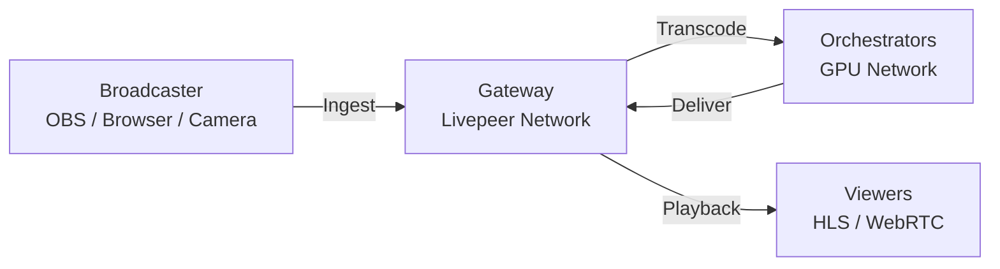

import { PreviewCallout } from '/snippets/components/primitives/previewCallouts.jsx'
import { StyledTable, TableRow, TableCell } from '/snippets/components/primitives/tables.jsx'
import { BorderedBox } from '/snippets/components/primitives/containers.jsx'

<PreviewCallout />

If you're new to live video, this page covers the core concepts you need before writing any code. If you already know RTMP, HLS, and how transcoding pipelines work, skip to the [Video Streaming Quickstart](/v2/developers/quickstart/video/video-streaming).

## Start here in 5 minutes

<BorderedBox variant="accent" padding="16px">

- **Prereqs:** Basic familiarity with web APIs and one broadcaster tool (OBS or browser encoder)
- **Time:** 5 minutes
- **Outcome:** You understand stream key/playback ID, ingest, and playback flow well enough to start the quickstart
- **First action:** Read **Stream Key vs. Playback ID**, then continue to [Video Streaming Quickstart](/v2/developers/quickstart/video/video-streaming)

</BorderedBox>

---

## How Live Video Works

A live stream travels through four stages:



1. **Ingest** — Your broadcaster sends a raw video signal to a server
2. **Transcoding** — The server converts it into multiple quality levels for different devices and connection speeds
3. **Delivery** — Processed video is made available via a CDN or playback server
4. **Playback** — Viewers watch the stream in their browser or app

Livepeer's decentralized network handles steps 2 and 3 — transcoding and delivery — using a distributed network of GPU operators called orchestrators.

---

## Core Concepts

### Stream Key vs. Playback ID

These are the two most important identifiers in a live streaming workflow:

| | Stream Key | Playback ID |
|---|---|---|
| **What it is** | Secret credential for publishing video | Public identifier for watching video |
| **Who uses it** | Broadcaster (OBS, encoder, streaming app) | Viewers (embedded player, your app) |
| **Security** | **Keep secret** — anyone with it can publish to your stream | Public — safe to expose to end users |
| **How to get it** | From your gateway/Studio when you create a stream | From your gateway/Studio alongside the stream key |

Think of the stream key as a password and the playback ID as a public URL slug.

### RTMP (Real-Time Messaging Protocol)

RTMP is the standard protocol for sending video from a broadcaster to an ingest server. OBS, hardware encoders, and most professional streaming tools support RTMP.

```
rtmp://rtmp.livepeer.com/live/{streamKey}
```

When you push video to this endpoint with your stream key, Livepeer ingests it, transcodes it, and makes it available for playback.

### HLS (HTTP Live Streaming)

HLS is the standard delivery format for live and on-demand video. It splits video into small segments and serves them over HTTP. Most players (browsers, mobile, smart TVs) support HLS natively.

```
https://livepeercdn.studio/hls/{playbackId}/index.m3u8
```

As of 02-March-2026, `livepeercdn.studio` is the documented Studio HLS playback host.

HLS introduces latency (typically 5-30 seconds) because viewers are buffering ahead. This is acceptable for most streaming use cases.

### WebRTC / WHIP

WebRTC is a browser standard for real-time audio and video communication. Livepeer supports WebRTC ingest via **WHIP** (WebRTC-HTTP Ingest Protocol), enabling sub-second latency streaming directly from a browser without OBS.

```
https://playback.livepeer.studio/webrtc/{streamKey}
```

WebRTC is also used for **low-latency playback** — where viewers receive the stream with under 2 seconds of delay instead of the typical HLS buffer.

---

## Latency Modes

<StyledTable variant="bordered">
  <thead>
    <TableRow header>
      <TableCell header>Mode</TableCell>
      <TableCell header>Latency</TableCell>
      <TableCell header>Protocol</TableCell>
      <TableCell header>Best For</TableCell>
    </TableRow>
  </thead>
  <tbody>
    <TableRow>
      <TableCell>Standard HLS</TableCell>
      <TableCell>10-30 seconds</TableCell>
      <TableCell>HLS/MPEG-TS</TableCell>
      <TableCell>Broadcast streaming, VOD-like quality</TableCell>
    </TableRow>
    <TableRow>
      <TableCell>Low-Latency HLS (LL-HLS)</TableCell>
      <TableCell>2-5 seconds</TableCell>
      <TableCell>LL-HLS</TableCell>
      <TableCell>Sports, events, interactive streams</TableCell>
    </TableRow>
    <TableRow>
      <TableCell>WebRTC Playback</TableCell>
      <TableCell>Under 500ms</TableCell>
      <TableCell>WebRTC/WHEP</TableCell>
      <TableCell>Interactive, conversational, real-time AI video</TableCell>
    </TableRow>
  </tbody>
</StyledTable>

For most applications, standard or low-latency HLS is the right choice. WebRTC playback is used when viewer interaction or real-time AI processing requires near-zero delay.

---

## Transcoding and Quality Ladders

Transcoding converts an incoming high-quality stream into multiple renditions at different resolutions and bitrates — a **quality ladder**. The viewer's player automatically selects the best rendition for their connection speed (called **adaptive bitrate streaming**).

**Example quality ladder:**

| Rendition | Resolution | Bitrate |
|---|---|---|
| 1080p | 1920×1080 | 4000 kbps |
| 720p | 1280×720 | 2000 kbps |
| 480p | 854×480 | 1000 kbps |
| 360p | 640×360 | 500 kbps |

Livepeer's orchestrators perform this transcoding work in real time for every active stream.

---

## How Livepeer Differs from Traditional Streaming

| | Traditional (AWS MediaLive, Mux) | Livepeer |
|---|---|---|
| **Transcoding** | Centralized cloud servers | Distributed GPU network |
| **Pricing** | Per-minute, billed by provider | Competitive market pricing |
| **Control** | Provider manages everything | Gateway operators control routing |
| **Censorship resistance** | Provider can terminate streams | Decentralized — no single point of control |
| **AI video** | Separate AI infrastructure required | AI inference native to the same network |

---

## Key Terms Reference

| Term | Meaning |
|---|---|
| **Stream** | A live video broadcast session |
| **Stream Key** | Secret credential for publishing to a stream |
| **Playback ID** | Public identifier for watching a stream or asset |
| **Ingest** | Receiving raw video from a broadcaster |
| **Transcode** | Converting video into multiple formats/quality levels |
| **Segment** | A short chunk of video (typically 2-6 seconds) transcoded independently |
| **Gateway** | Livepeer network entry point that routes jobs to orchestrators |
| **Orchestrator** | GPU operator that performs transcoding and AI inference |
| **RTMP** | Protocol used by OBS and encoders to send video to an ingest server |
| **HLS** | HTTP-based playback format for live and on-demand video |
| **LL-HLS** | Low-latency variant of HLS (2-5 second delay) |
| **WebRTC** | Browser real-time communication protocol (sub-500ms latency) |
| **WHIP** | WebRTC ingest protocol — push video from browser to Livepeer |
| **ABR** | Adaptive Bitrate — automatic quality selection based on viewer connection |

---

## Ready to Build?

<CardGroup cols={2}>
  <Card title="Video Streaming Quickstart" icon="bolt-lightning" href="/v2/developers/quickstart/video/video-streaming" arrow>
    Create your first stream and play it back in minutes.
  </Card>
  <Card title="Livepeer Studio" icon="video-arrow-up-right" href="/v2/solutions/livepeer-studio/overview" arrow>
    Hosted gateway for live streaming and VOD — start with the dashboard.
  </Card>
  <Card title="OBS Setup Guide" icon="video" href="/v2/solutions/livepeer-studio/livestream/stream-via-obs" arrow>
    Configure OBS to stream to Livepeer.
  </Card>
  <Card title="Livepeer Player" icon="circle-play" href="/v2/solutions/livepeer-studio/player" arrow>
    Embed the Livepeer React Player in your app.
  </Card>
</CardGroup>
