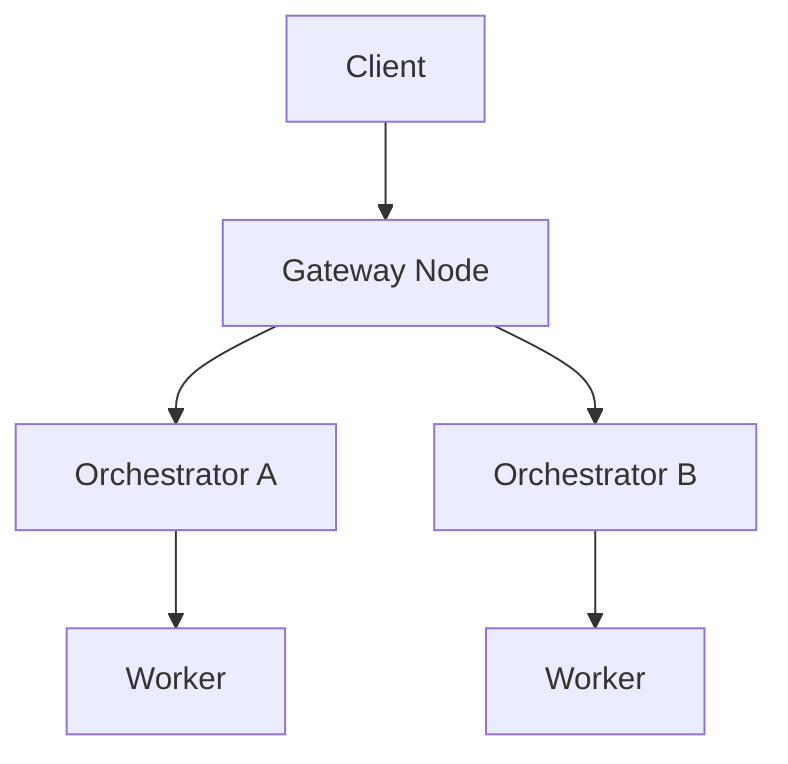

{/* codex-i18n: eyJraW5kIjoiY29kZXgtaTE4biIsInZlcnNpb24iOjEsInNvdXJjZVBhdGgiOiJ2Mi9hYm91dC9saXZlcGVlci1uZXR3b3JrL21hcmtldHBsYWNlLm1keCIsInNvdXJjZVJvdXRlIjoidjIvYWJvdXQvbGl2ZXBlZXItbmV0d29yay9tYXJrZXRwbGFjZSIsInNvdXJjZUhhc2giOiI2NTFlN2IwMWU1MWU0NWQzMzA4Zjc4M2FmNmU1ODMxYjdjNjY3ZjRhMTQxZTA3MTc5M2QyYWM4ZTdhZWM4Zjc5IiwibGFuZ3VhZ2UiOiJlcyIsInByb3ZpZGVyIjoib3BlbnJvdXRlciIsIm1vZGVsIjoib3BlbmFpL2dwdC1vc3MtMTIwYjpmcmVlIiwiZ2VuZXJhdGVkQXQiOiIyMDI2LTAyLTI2VDA2OjM2OjQzLjk1OVoifQ== */}
import { DynamicTable } from '/snippets/components/layout/table.jsx'
import { GotoCard, GotoLink } from '/snippets/components/primitives/links.jsx'

La red Livepeer admite un mercado descentralizado dinámico para cómputo de medios en tiempo real: transcodificación e inferencia de IA. A diferencia de las plataformas de infraestructura estáticas, el mercado abierto de Livepeer introduce en tiempo real **pujas, enrutamiento y precios** de trabajos a través de un conjunto global de Orchestrators. Esta página describe la capa del mercado, los comportamientos de los actores, la economía de las sesiones y cómo se relaciona con el protocolo.

## Resumen del mercado

<DynamicTable
  headerList={["Element", "Role"]}
  itemsList={[
    { "Element": "Gateway / Client", "Role": "Submit job requests (stream, image, session intent)" },
    { "Element": "Gateway", "Role": "Matches requests to suitable Orchestrators" },
    { "Element": "Orchestrator", "Role": "Advertises availability, pricing, and capabilities" },
    { "Element": "Worker", "Role": "Executes compute task (Transcoder or AI worker)" },
    { "Element": "TicketBroker", "Role": "Receives tickets for ETH reward upon verified work (on-chain)" }
  ]}
/>

Este mercado es **continuo** — Los Orchestrators están siempre disponibles para sesiones; los Gateways enrutan el trabajo fuera de cadena sin gas en cadena por trabajo.

## Demanda: cargas de trabajo de clientes

Los clientes envían varios trabajos de cómputo de medios a través de Gateways:

<DynamicTable
  headerList={["Job type", "Example use case", "Payment style"]}
  itemsList={[
    { "Job type": "Live stream", "Example use case": "RTMP ingest for video platforms", "Payment style": "Per-minute ETH / credits" },
    { "Job type": "AI inference", "Example use case": "Frame-by-frame image-to-image generation", "Payment style": "Per-job (frame, token)" },
    { "Job type": "File transcode", "Example use case": "Static MP4 → web formats", "Payment style": "Batch credits" }
  ]}
/>

**Ejemplos de API:** Livepeer Studio REST, Gateway POST job, interfaz ComfyStream (IA).

## Oferta: nodos Orchestrator

Los Orchestrators anuncian:

- Especificaciones de hardware (GPU/CPU, memoria)
- Región y latencia
- Cargas de trabajo compatibles (video, IA o ambas)
- Precio por segmento / fotograma / token

Actualizan la disponibilidad mediante endpoints de latido gRPC o REST del lado del gateway. Los Gateways usan esta información para enrutar los trabajos al mejor coincidencia.

## Lógica de enrutamiento

El Gateway califica a los Orchestrators por:

- Latencia a la fuente de entrada
- Coincidencia de carga de trabajo (video vs IA)
- Costo por trabajo
- Disponibilidad y búfer de reintentos

Las sesiones son **enrutadas** fuera de cadena al mejor coincidencia; no se gasta gas en cadena por trabajo.

## Descubrimiento de precios

La implementación actual de Livepeer usa **precios publicados** (establecidos por Orchestrator), no basados en subasta. Algunas notas:

- Los clientes pueden ser emparejados con el proveedor compatible disponible más bajo.
- Los precios pueden variar por:
  - Región (p. ej., US-East vs EU-Central)
  - Carga de GPU (Orchestrators con mucha IA pueden cobrar más)
  - Perfil de calidad (p. ej., 1080p60 vs 720p30)

<Note>
In development: LIPs may introduce dynamic auction mechanisms for AI sessions (e.g. spot job auctions). See the [Forum LIPs](https://forum.livepeer.org/c/lips/) for proposals.
</Note>

## Pagos y liquidación

**Clientes** pagan a través de:

- tickets ETH (liquidados en cadena a través del protocolo `TicketBroker`)
- Saldo de crédito (seguido fuera de cadena por algunos Gateways)

**Orchestrators:**

- Reclamar tickets ganadores al `TicketBroker` en Arbitrum
- Acumular ganancias ETH del trabajo de transcodificación/IA
- Reclamar recompensas de inflación (LPT) del `BondingManager` cada ronda

## Extensiones del sistema de crédito

Algunos Gateways ofrecen precios amigables para el usuario además de ETH directo:

<DynamicTable
  headerList={["Currency", "Top-up methods", "Denomination example"]}
  itemsList={[
    { "Currency": "USD", "Top-up methods": "Credit card, USDC", "Denomination example": "Per minute or per job" },
    { "Currency": "ETH", "Top-up methods": "MetaMask, smart wallet", "Denomination example": "Per job or per segment" }
  ]}
/>

Los orquestadores pueden fijar precios en equivalentes a USD mediante cotizaciones basadas en oráculos donde estén soportadas.

## Observabilidad

Cada sesión puede registrarse con:

- Latencia hasta la primera respuesta
- Recuento de reintentos
- ID y región del orquestador
- Precio pagado (ETH o crédito)

Los futuros indexadores del mercado pueden mostrar estadísticas de flujo de trabajos en tiempo real para la red.

## Límites entre protocolo y mercado

<DynamicTable
  headerList={["Layer", "Description", "Example"]}
  itemsList={[
    { "Layer": "Protocol", "Description": "Verifies work and pays ETH & LPT rewards", "Example": "TicketBroker, BondingManager" },
    { "Layer": "Marketplace", "Description": "Matches jobs to compute providers", "Example": "Gateway load balancer, routing" },
    { "Layer": "Interface layer", "Description": "Abstracts API, SDK, session negotiation", "Example": "Livepeer Studio SDK, Daydream API" }
  ]}
/>

## Actualizaciones futuras (LIPs propuestos)

- **LIP-78:** Subastas de trabajos puntuales
- **LIP-81:** Puente de sincronización crédito-a-protocolo
- **LIP-85:** Influencia del staking del orquestador en el enrutamiento de trabajos

Para el estado actual, consulte el [LIPs del foro](https://forum.livepeer.org/c/lips/) y [Hoja de ruta técnica](../resources/technical-roadmap).

## Ver también

- [Ciclo de vida del trabajo](./job-lifecycle) — Flujo de extremo a extremo desde la ingestión hasta la liquidación
- [Actores](./actors) — Roles de Gateway, Orquestador y Delegador
- [Livepeer Visión general del protocolo](../livepeer-protocol/overview) — Contratos en cadena e incentivos
- [Contratos de blockchain](../resources/blockchain-contracts) — TicketBroker y otras direcciones de contrato

## Referencias

- [Livepeer Documentación de Studio / Gateway](https://livepeer.studio/docs)
- [TicketBroker (protocolo)](https://github.com/livepeer/protocol/tree/master/contracts/job)
- [Configuración del nodo del orquestador](/v2/orchestrators/orchestrators-portal)
- [Foro: propuestas LIP](https://forum.livepeer.org/c/lips/)
- [Livepeer IA (ComfyStream, blog)](https://blog.livepeer.org/real-time-ai-comfyui)
