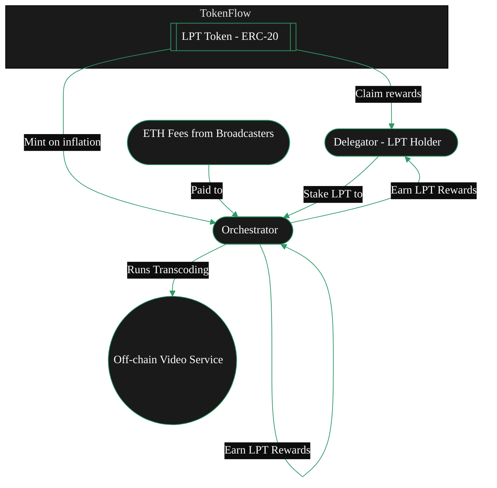

{/* codex-i18n: eyJraW5kIjoiY29kZXgtaTE4biIsInZlcnNpb24iOjEsInNvdXJjZVBhdGgiOiJ2Mi9hYm91dC9saXZlcGVlci1wcm90b2NvbC9saXZlcGVlci10b2tlbi5tZHgiLCJzb3VyY2VSb3V0ZSI6InYyL2Fib3V0L2xpdmVwZWVyLXByb3RvY29sL2xpdmVwZWVyLXRva2VuIiwic291cmNlSGFzaCI6ImU3N2E5ZjhhYzE2N2EzYjE1NThhZmIxZDA5OWEyZTc1OTRhNDhiYzM4YmQxZjMzNWMxZjhiYTdmNzgxZjNiZmYiLCJsYW5ndWFnZSI6ImVzIiwicHJvdmlkZXIiOiJvcGVucm91dGVyIiwibW9kZWwiOiJvcGVuYWkvZ3B0LW9zcy0yMGI6ZnJlZSIsImdlbmVyYXRlZEF0IjoiMjAyNi0wMi0yNlQxMjoyMzowNi42NTBaIn0= */}
{/* This page describes:
3. **Token (LPT)**

   * Purpose of LPT
   * Security model
   * Inflation mechanics
   * Not used for job payments (ETH is) 

BUT ONLY BRIEFLY -> DEFERS TO TOKEN TAB
*/}

import { CardTitleTextWithArrow } from '/snippets/components/primitives/text.jsx'
import { AccordionTitleWithArrow } from '/snippets/components/primitives/text.jsx'
import { Quote } from '/snippets/components/content/quote.jsx'
import { CustomDivider } from '/snippets/components/primitives/divider.jsx'
import { LinkArrow } from '/snippets/components/primitives/links.jsx'
import { DynamicTable } from '/snippets/components/layout/table.jsx'
import { ScrollableDiagram } from '/snippets/components/content/zoomableDiagram.jsx'

<div style={{ display: "flex", justifyContent: "center"}}>
  <CardTitleTextWithArrow icon="hand-holding-dollar" horizontal href="https://www.livepeer.org/lpt"> Livepeer Token </CardTitleTextWithArrow> 
</div>

<div style={{ display: "flex", margin: "0 1rem" }}>
   <Tip>
      <span style={{fontSize: '1.0rem'}}>
         _**Did you know?**_
      </span>
      Livepeer’s token distribution had no [ICO](https://messari.io/report/merkle-mine). <br/> <br/>
      Instead, the initital 10 million LPT supply was distributed via a community [Merkle Mine](https://github.com/livepeer/merkle-mine), 
      allowing a wide set of participants to claim tokens at network launch. 
      <Icon icon="github" size={18}/> {" "} <LinkArrow label={<span style={{color: "var(--hero-text)"}}>View the github code</span>} href="https://github.com/livepeer/merkle-mine" newline={false} borderColor="var(--accent)" />
   </Tip>
</div>
{/* <Quote> 
The **Livepeer Token (LPT)** is the staking and coordination token of the Livepeer protocol. LPT underpins protocol security, work selection, reward distribution, and decentralised governance incentivising optimal network service outcomes. 
</Quote> */}

<CustomDivider style={{margin: 0, marginBottom: "-2rem" }} />

## Token LP
Livepeer es un token utilitario y componente central del Protocolo Livepeer. Se utiliza para asegurar e incentivar la red descentralizada a entregar su propuesta de valor clave de flujos de trabajo de IA y streaming de video confiables, rentables y potentes.

<div style={{ display: "flex", justifyContent: "center", width: "fit-content", margin: "0 auto" }}>
   <Accordion title={<div style={{color: "var(--accent)"}}>ELI5: Livepeer Token</div>} icon="user-crown">
      LPT is akin to a membership key for Liveper or LPT is like the loyalty token for useful network participants.
         - You need it to join and earn in the Livepeer system.
         - If you hold LPT, you can rent out your GPU (participate) or vote on network rules.
         - Over time, the network prints new LPT (adds to the money supply) to reward people who help run it. Those who have put their LPT into the system (staked) get extra tokens.
   </Accordion>
</div>

Una de las mayores ventajas competitivas de Livepeer es su descentralización, que crea mercados libres y precios competitivos. Esta red de nodos descentralizados, orquestadores, puertas de enlace y emisoras, y el flujo de pagos en la red por realizar trabajo útil, está respaldada por el Token Livepeer (LPT).

### Propósito del Token
 {/* The Livepeer Token (LPT) is used for **staking**, **securing** the network, and **governance**. */}
El Token Livepeer (LPT) tiene varias funciones clave dentro del protocolo:
- **Staking**: LPT debe ser apostado (enlazado) en el protocolo a través del contrato BondingManager para operar como Orquestador o delegar.
- **Gobernanza**: Cualquier LPT apostado puede votar en propuestas. Los votos de los delegadores se emiten a través de su Orquestador elegido.
- **Seguridad**: El protocolo está asegurado por la participación. Si un Orquestador se comporta mal, su LPT apostado (y el de sus delegadores) puede ser sancionado.

{ /* The Livepeer Token (LPT) has several key functions within the protocol:
 - **Securing the network** through **staking** and **bonding**
   - _Operators (Orchestrators) bond LPT to run transcoding services;_ 
   - _Delegators stake LPT to support operators they trust._ 
 - **Rewarding participants** for their value-weighted contributions
   - _Staked LPT earns inflationary rewards (new LPT) and a share of ETH fees_
 - Enabling **participatory governance** and treasury management
   - _Staked LPT unlocks voting rights to shape the network's future._ */}

 <Info>LPT is **not used** for service payments for video and AI compute (e.g. transcoding, AI inference) -> those are paid in ETH or other currencies via separate payment channels. </Info>

<DynamicTable
  tableTitle={<span style={{fontSize: '0.9rem'}}>LPT Usage</span>}
  headerList={["Use Case", "LPT Functionality"]}
  itemsList={[
    { "Use Case": "Protocol Security", "LPT Functionality": "Bonded stake determines active Orchestrators" },
    { "Use Case": "Inflation Rewards", "LPT Functionality": "Only bonded LPT receives newly minted token share" },
    { "Use Case": "Governance", "LPT Functionality": "Voting rights restricted to bonded LPT holders" },
    { "Use Case": "Slashing Guarantee", "LPT Functionality": "Orchestrators risk LPT loss for malicious behavior" },
    { "Use Case": "Delegation Incentives", "LPT Functionality": "Delegators earn yield by bonding LPT to performant Orchestrators" },
  ]}
  margin="0 0.5rem -2rem 0.5rem"
/>

### Oferta y Distribución

- **Oferta Inicial**: 10,000,000 LPT en el génesis (2018), distribuido vía Merkle Mine (sin ICO ni pre-mine).

<Accordion title="See Initial LPT Distribution" icon="chart-pie">
   ```mermaid
   %%{init: {'theme': 'base', 'themeVariables': { 'primaryColor': '#1a1a1a', 'primaryTextColor': '#fff', 'primaryBorderColor': '#2d9a67', 'lineColor': '#2d9a67', 'secondaryColor': '#0d0d0d', 'tertiaryColor': '#1a1a1a', 'background': '#0d0d0d', 'fontFamily': 'system-ui', 'pieStrokeColor': '#0d0d0d', 'pieOuterStrokeColor': '#0d0d0d', 'pieSectionTextColor': '#fff', 'pieLegendTextColor': '#fff', 'pieTitleTextColor': '#fff', 'pie1': '#2d9a67', 'pie2': '#1a794e', 'pie3': '#08a045', 'pie4': '#004225' }}}%%
   pie title Initial LPT Distribution 2018
   "Community - MerkleMine" : 63.44
   "Team & Founders" : 19.00
   "Early Backers" : 12.35
   "Protocol Treasury" : 5.21
   ```
</Accordion>

- **Oferta Actual**: ~37,900,000 LPT (a principios de 2025) – toda la oferta adicional proviene de las recompensas inflacionarias del protocolo.
- **Modelo de Inflación**: El protocolo acuña dinámicamente nuevos LPT. Si el porcentaje de tokens apostados cae por debajo del 50%, la inflación aumenta para atraer más apostadores. Si el staking está por encima del 50%, la inflación disminuye.
   - _Ejemplo_: A principios de 2025, ~44% de LPT estaba apostado. La tasa de inflación fue ~25.6% APR. Dado que solo el 44% de los tokens ganaba inflación, esto significaba que los apostadores veían alrededor de 25.6% / 0.44 ≈ 58% APR efectivo sobre sus LPT apostados.
- **Apostado vs No Apostado**: Aproximadamente el 44% de LPT está apostado (junio 2025). El resto (56%) es libremente negociable/no bloqueado. Solo la porción apostada gana recompensas inflacionarias.


<Card title="LPT Inflation Rate" icon="chart-line" href="https://www.livepeer.org/explorer" arrow horizontal>
   View the LPT Inflation Rate on Livepeer Explorer
</Card>

### Modelo de Inflación Dinámica

Livepeer vincula las emisiones de LPT a la participación en el bonding. Este modelo garantiza:

- La velocidad de stake permanece activa
- La dilución afecta solo a los participantes no comprometidos
- La participación en la gobernanza escala con la seguridad del protocolo

Este mecanismo introduce un costo de oportunidad significativo por la pasividad, fomentando la delegación activa y el reequilibrio.

<Accordion title="See Inflation Modelling Calculations" icon="calculator">

   Livepeer’s inflation is dynamic - designed to calibrate toward a target bonding rate (β*) and secure the protocol with sufficient staked LPT.

   ```bash Inflation Update Rule
   If B(t)/S(t) < β*:
   r(t+1) = min(r(t) + Δ, r_max)
   Else:
   r(t+1) = max(r(t) - Δ, r_min)
   ```

   where:
   ```
   - S(t) = total circulating supply of LPT
   - B(t) = total bonded supply
   - β* = target bonding rate (e.g. 50%)
   - r(t) = current inflation rate
   - Δ = step rate (e.g. 0.05%)
   - r_min, r_max = protocol-set bounds (e.g. 0.5% to 7%)
   ```

   ```bash Minting Function
   M(t) = r(t) * S(t)
   ```
</Accordion>


### Distribución de Recompensas
#TODO
- Orquestadores: prorrateado por stake vinculado
- Delegadores: participación en las recompensas de los orquestadores, dividida por rewardCut
- Tesorería: % fijo (actualmente 10%) de M(t) por ronda

<ScrollableDiagram title="LPT Staking and Reward Flow" maxHeight="350px">



</ScrollableDiagram>

<Danger> Move majority of this to token section. This section will just give a product/design decision overview </Danger>

### Gobernanza
#TODO
Solo los LPT vinculados otorgan derechos de voto sobre las propuestas de protocolo Livepeer (LIPs).

**Herramientas de Gobernanza:**
- Foro: forum.livepeer.org
- Votación Snapshot: Se usa para señalización fuera de cadena
- Contrato Gobernador: Ejecuta propuestas en cadena después de la votación

El poder de voto es proporcional a la participación vinculada en el bloque de instantánea. Los votantes pueden delegar poder de voto a otros mediante la participación vinculada LPT.

### Tesorería
#TODO
Una porción de las emisiones de LPT fluye a una tesorería comunitaria. La tesorería está destinada a financiar proyectos a nivel de ecosistema (bienes públicos). El consenso social de Livepeer es que los fondos de la tesorería deben dirigirse principalmente a SPEs, que luego los despliegan en iniciativas específicas.

---

#MOVER ESTOS


## Mecánicas Técnicas
#TODO
### Vinculación y Desvinculación
LPT debe estar activamente vinculado para participar en la inflación y la gobernanza.

- Vinculación: Participa con LPT en un orquestador
- Desenlazado: Iniciar un período de 7 días antes de la retirada
- Reenlazado: Mover la participación enlazada a otro orquestador instantáneamente
- Cada LPT enlazado contribuye al peso de selección del orquestador y a la participación en la inflación.


### Sanciones y penalizaciones

LPT enlazado está sujeto a castigo si se detecta a un orquestador:

- Enviar resultados de transcodificación inválidos
- Engañar en la redención de tickets (reclamaciones fraudulentas)
- Ser desafiado y fallar en la verificación en cadena

El LPT castigado es:
- Parcialmente quemado
- Parcialmente redirigido al tesoro
- Conduce a la pérdida de colateral del delegador


### Recursos Adicionales

<Card title="Obtain Livepeer Token" icon="hand-holding-dollar" href="https://www.livepeer.org/lpt" arrow horizontal>
   Looking for places to get LPT? Follow this link.
</Card>
<Columns cols={2}>
   <Card title="LPT on Arbiscan" icon="cubes" href="https://arbiscan.io/token/0x58b6a8a3302369daec31a0680985978a9d54189c" arrow horizontal />
   <Card title="Livepeer Explorer" icon="chart-line" href="https://explorer.livepeer.org/" arrow horizontal />
   <Card title="Livepeer Blog: Token Design" icon="feather" href="https://blog.livepeer.org/livepeer-token-design-3000/" arrow horizontal />
   <Card title="Livepeer Contracts GitHub" icon="github" href="https://github.com/livepeer/protocol" arrow horizontal />
</Columns>


{/* #### Actors

- **Broadcaster (payer)** → submits jobs (video/AI) and funds them using **Probabilistic Micropayments (PM) tickets**.
- **Orchestrator (validator/worker coordinator)** → stakes LPT (self-stake + delegated), wins work, forwards segments to…
- **Transcoder (work executor)** → performs compute (encode/transcode/inference) for the orchestrator.
- **Delegator (capital provider)** → bonds LPT to an orchestrator, shares its rewards & fees.
- GPU Providers are paid for running AI Jobs

**Flow:**&#x20;

Broadcaster → (PM tickets/segments) → Orchestrator → (tasks) → Transcoder → (results) → Broadcaster.

**Economic weight flows:**&#x20;

Delegators → (bonded LPT) → Orchestrator → (rewards/fees split back) → Delegators. */}


--- 
#REVISIÓN


## Diagramas de Flujo Económico
Mostrar:
- Inflación → Orquestadores + Tesorería
- Tarifas (ETH) → Orquestadores
- Delegación → Recompensas compartidas
- Gobernanza → Asignación al Tesoro

(-> Staking, Recompensas, Tarifas y Slashing)


