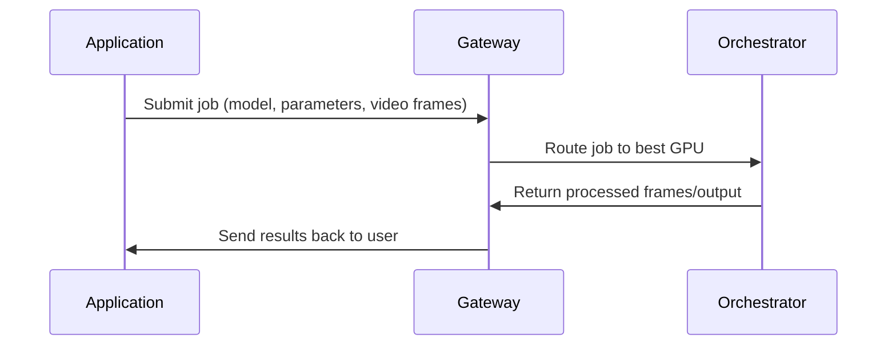

{/* codex-i18n: eyJraW5kIjoiY29kZXgtaTE4biIsInZlcnNpb24iOjEsInNvdXJjZVBhdGgiOiJ2Mi9hYm91dC9yZXNvdXJjZXMvZ2F0ZXdheXMtdnMtb3JjaGVzdHJhdG9ycy5tZHgiLCJzb3VyY2VSb3V0ZSI6InYyL2Fib3V0L3Jlc291cmNlcy9nYXRld2F5cy12cy1vcmNoZXN0cmF0b3JzIiwic291cmNlSGFzaCI6ImQwMmIyOTYzNTY1M2VlMGZkNmM0MzlkYjEyNWJkNTY1ZmY3NTc5NTUxYWEwNjI3MjdmODU4ZTE3YThhMDYyNDAiLCJsYW5ndWFnZSI6ImVzIiwicHJvdmlkZXIiOiJvcGVucm91dGVyIiwibW9kZWwiOiJvcGVuYWkvZ3B0LW9zcy0xMjBiOmZyZWUiLCJnZW5lcmF0ZWRBdCI6IjIwMjYtMDItMjZUMTc6NDU6NTguODkxWiJ9 */}
---

## Visión general

En breve:

<Callout >

<Icon icon="torii-gate" /> **Gateways coordinate.**

<Icon icon="microchip"/> **Orchestrators compute.**

</Callout>

Juntos, forman la columna vertebral de la tubería de video IA Livepeer.

| Rol             | Función                                       | ¿Realiza trabajo en GPU? | ¿De cara externa? |
| ---------------- | ---------------------------------------------- | ------------------ | ---------------- |
| **Puerta de enlace**      | Ingreso de trabajos, precios, enrutamiento, coincidencia de capacidades | ❌ No              | ✅ Sí           |
| **Orquestador** | Cómputo GPU, inferencia, transcodificación, BYOC      | ✅ Sí             | ❌ No            |

## Responsabilidades del Gateway

Los gateways actúan como la puerta de entrada a la red:

- Reciben trabajos de las aplicaciones
- Determinan el modelo, pipeline o GPU requerido
- Seleccionan el mejor orquestador según rendimiento y precio
- Enrutan la carga de trabajo con baja latencia
- Devuelven los resultados al cliente
- Publican ofertas del marketplace (modelos, pipelines, costo por fotograma, etc.)

Los gateways proporcionan _inteligencia de servicio_, no computar.

---

## Responsabilidades del orquestador

Los orquestadores son operadores de GPU que ejecutan:

- Inferencia de IA en tiempo real
- Pipelines Daydream / ComfyStream
- Contenedores BYOC
- Transcodificación tradicional

Proporcionan:

- Potencia de GPU
- Ejecución del modelo
- Salida determinista y verificable
- Garantías de rendimiento

No exponen APIs externas directamente-Los Gateways se encargan de eso.
