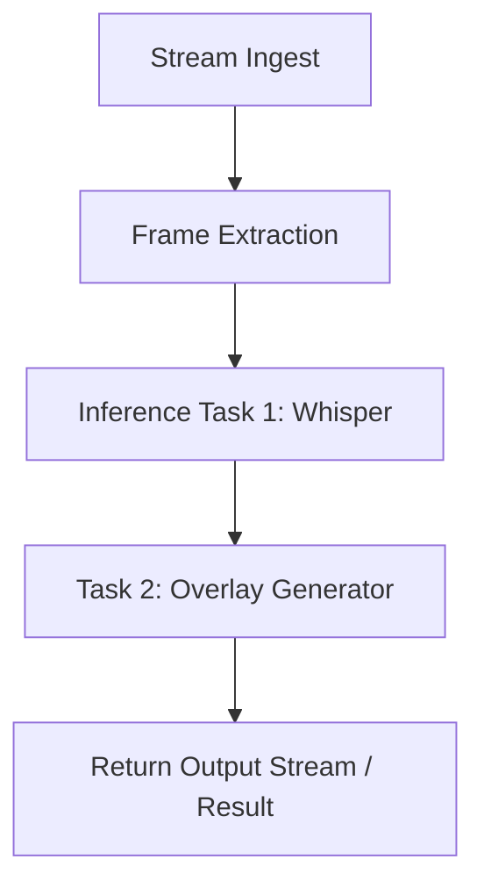

{/* codex-i18n: eyJraW5kIjoiY29kZXgtaTE4biIsInZlcnNpb24iOjEsInNvdXJjZVBhdGgiOiJ2Mi9kZXZlbG9wZXJzL2FpLXBpcGVsaW5lcy9vdmVydmlldy5tZHgiLCJzb3VyY2VSb3V0ZSI6InYyL2RldmVsb3BlcnMvYWktcGlwZWxpbmVzL292ZXJ2aWV3Iiwic291cmNlSGFzaCI6Ijc4MWU0NWEyYmY3OWE4ODljMTc4OWE4NDNlZTcxMjY1MTU3NDNlMWNlZTJjMDY3MGQyZGJiZDEyMzgyMzkwYTAiLCJsYW5ndWFnZSI6ImVzIiwicHJvdmlkZXIiOiJvcGVucm91dGVyIiwibW9kZWwiOiJxd2VuL3F3ZW4tdHVyYm8iLCJnZW5lcmF0ZWRBdCI6IjIwMjYtMDItMjdUMTI6MjM6NDcuMTYyWiJ9 */}
import { DynamicTable } from '/snippets/components/layout/table.jsx'

Livepeer AI Pipelines permiten ejecutar trabajos de inferencia de video personalizables y componibles en infraestructura GPU distribuida. Impulsado por la red Livepeer y respaldado por trabajadores fuera de cadena como ComfyStream, el sistema facilita la implementación de inteligencia artificial para video a gran escala.

## En resumen

- **Pipelines** son una o más tareas de inferencia (por ejemplo, Whisper, transferencia de estilo, detección) ejecutadas en secuencia en cuadros de video.
- **Gateways** enrutan trabajos a **Orquestadores** y **trabajadores**; el protocolo maneja los pagos y la coordinación.
- **BYOC** (Trae tu propio cálculo) y **ComfyStream** son dos formas de ejecutar o extender flujos de trabajo con sus propios modelos y nodos.

## Casos de uso

- Reconocimiento de voz (Whisper)
- Transferencia de estilo o filtros (Stable Diffusion)
- Seguimiento y detección de objetos (YOLO)
- Segmentación de video (segment-anything)
- Supresión o desenfoque de rostros
- BYOC (Trae tu propio cálculo)

## ¿Qué es una tubería?

Una tubería de IA consiste en una o más tareas ejecutadas en secuencia en cuadros de video en vivo. Cada tarea puede:

- Modificar el video (por ejemplo, agregar superposiciones)
- Generar metadatos (por ejemplo, transcripción, cuadros de límites)
- Relayar los resultados a otro nodo

Livepeer maneja la recepción de la transmisión, la extracción de cuadros y la programación de tareas. Los nodos ejecutan la inferencia real.



## Arquitectura

### Puerta de enlace y trabajadores

- **Orquestadores**colas de trabajos de inferencia y ejecutar (o delegar a) trabajadores.
- **Trabajadores**se suscriben a tipos de tareas (por ejemplo, whisper-transcribe) y las ejecutan.
- **Puertas de enlace**rutean trabajos desde los clientes a nodos compatibles. Esto es fuera de cadena; el protocolo (Arbitrum) maneja los pagos y recompensas.

### Tipos de trabajadores

<DynamicTable
  headerList={["Type", "Description", "Example models"]}
  itemsList={[
    { "Type": "Whisper Worker", "Description": "Speech-to-text inference", "Example models": "whisper-large" },
    { "Type": "Diffusion Worker", "Description": "Image-to-image or overlay generation", "Example models": "sdxl, controlnet" },
    { "Type": "Detection Worker", "Description": "Bounding box or class prediction", "Example models": "YOLOv8" },
    { "Type": "Pipeline Worker", "Description": "Chained tasks via ComfyStream or custom", "Example models": "custom-pipeline" }
  ]}
/>

## Formato de definición de pipeline

Los trabajos pueden ser objetos de tarea basados en JSON. Ejemplo:

```json
{
  "streamId": "abc123",
  "task": "custom-pipeline",
  "pipeline": [
    { "task": "whisper-transcribe", "lang": "en" },
    { "task": "segment-blur", "target": "faces" }
  ]
}
```

Los trabajadores pueden aceptar:

- Tareas formateadas en JSON a través de la Gateway
- gRPC por cuadro (baja latencia)
- Carga de resultados mediante webhook

## Trae tu propio cálculo (BYOC)

Puedes usar tus propios nodos de GPU para servir tareas de inferencia:

1. Clonar [ComfyStream](https://github.com/livepeer/comfystream) o implementar la API de procesamiento.
2. Añade complementos para Whisper, ControlNet u otros modelos.
3. Registre su nodo con la puerta de enlace (y opcionalmente en cadena).

Vea [BYOC](./byoc) para un guía completa de configuración.

## También lea

- [BYOC](./byoc) — Ejecute sus propios trabajadores de IA y regístrese en la red
- [ComfyStream](./comfystream) — Pipelines basados en ComfyUI e integración con Gateway
- [Livepeer IA (visión general)](/v2/developers/ai-inference-on-livepeer/overview) — Visión general del producto y casos de uso
- [Arquitectura técnica de la red](/v2/es/about/livepeer-network/technical-architecture) — Gateway, Orchestrator y protocolo

## Recursos

- [ComfyStream GitHub](https://github.com/livepeer/comfystream)
- [Livepeer Studio AI docs](https://livepeer.studio/docs/ai)
- [Foro: ejemplos de pipelines](https://forum.livepeer.org/t/example-pipelines)
- [Explorador](https://explorer.livepeer.org) — Estadísticas de la red y los nodos
