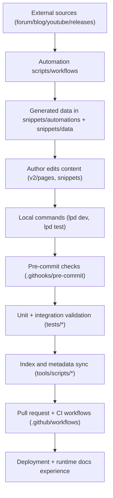

{/* codex-i18n: eyJraW5kIjoiY29kZXgtaTE4biIsInZlcnNpb24iOjEsInNvdXJjZVBhdGgiOiJkb2NzLWd1aWRlL2ZlYXR1cmVzL2FyY2hpdGVjdHVyZS1tYXAubWR4Iiwic291cmNlUm91dGUiOiJkb2NzLWd1aWRlL2ZlYXR1cmVzL2FyY2hpdGVjdHVyZS1tYXAiLCJzb3VyY2VIYXNoIjoiNGJlZWU5YTFiYTI3YmE1NGY4ZGZiYzgzMjI0NDI0OTBmNWFlYzA5NjJjZmNiYmZkMjBjZjEzOGIyNTg4NmY2MyIsImxhbmd1YWdlIjoiZXMiLCJwcm92aWRlciI6Im9wZW5yb3V0ZXIiLCJtb2RlbCI6InF3ZW4vcXdlbi10dXJibyIsImdlbmVyYXRlZEF0IjoiMjAyNi0wMy0wMVQxNzowODoyMC41MDdaIn0= */}
Este es un mapa de sistemas internos sobre cómo interactúan el contenido, las herramientas, la validación y la automatización.

## Componentes de nivel superior

- Fuente de contenido: `v2/pages/**`, `snippets/**`, `docs.json`
- UX de runtime: Mintlify dev/build + despliegue de documentación alojada
- Herramientas para operadores locales: `lpd`, `.githooks/*`, `tools/scripts/*`, `tests/*`
- CI/automatización: `.github/workflows/*`, `.github/scripts/*`, `snippets/automations/*`
- Documentación de gobernanza: `README.md`, `docs-guide/*`, `contribute/CONTRIBUTING/*`

## Flujo de datos y control

## Capas de ejecución

### Capa 1: Autoría + Sistema de contenido

- Páginas y fragmentos de Markdown/MDX son las primitivas de contenido editables.
- `docs.json` define el contexto de navegación y enrutamiento.

### Capa 2: Aplicación local

- `lpd` coordina la configuración/compilación/pruebas/ganchos/scripts.
- El gancho de pre-commit ejecuta puertas de seguridad rápidas y auditorías estagreadas.
- Los ejecutores de pruebas validan estilo, MDX, enlaces/importaciones, calidad, navegación de documentación y documentación de scripts.

### Capa 3: CI + Automatización

- Flujos de trabajo ejecutan verificaciones de calidad de archivos modificados y pruebas en navegador para PRs.
- Flujos programados/manualizados actualizan datos externos y activos de apoyo.
- Flujos de plantilla y recepción imponen calidad y etiquetado de issues/PRs.

### Capa 4: Gobernanza de documentación

- `docs-guide/` define la fuente de verdad de navegación interna.
- `README.md` proporciona orientación de alto nivel y apunta a páginas de guía de documentación canónicas.

## Bordes clave de contrato

1. Contrato de metadatos de script:
   - Encabezados de script -> generación de índice de script -> catálogo de scripts de guía de documentación.
2. Contrato de flujo/plantilla:
   - `.github/workflows/*` + `.github/ISSUE_TEMPLATE/*` -> índices generados de guía de documentación.
3. Contrato de validez de contenido:
   - Cambios de contenido -> ganchos/pruebas -> CI -> documentación desplegable.
