{/* codex-i18n: eyJraW5kIjoiY29kZXgtaTE4biIsInZlcnNpb24iOjEsInNvdXJjZVBhdGgiOiJ2Mi9nYXRld2F5cy9hYm91dC1nYXRld2F5cy9nYXRld2F5LWV4cGxhaW5lci5tZHgiLCJzb3VyY2VSb3V0ZSI6InYyL2dhdGV3YXlzL2Fib3V0LWdhdGV3YXlzL2dhdGV3YXktZXhwbGFpbmVyIiwic291cmNlSGFzaCI6IjJjNGZlNWMzMzIwNjMxZTEzODAwZTUwZmY1ODQ5YjJiOGEyODZkOGZmNDFiNzhjNWNhYjYyZTUzZjNlODFmYzIiLCJsYW5ndWFnZSI6ImVzIiwicHJvdmlkZXIiOiJvcGVucm91dGVyIiwibW9kZWwiOiJxd2VuL3F3ZW4tdHVyYm8iLCJnZW5lcmF0ZWRBdCI6IjIwMjYtMDItMjdUMTQ6NDA6NDAuOTQ5WiJ9 */}
import { GotoCard } from '/snippets/components/primitives/links.jsx'

<Danger>
  This page is a work in progress.  
  TODO: Edit, Streamline, Format & Style
</Danger>

## Definición

Los Gateways actúan como la capa principal de agregación de demanda en la red Livepeer.
Aceptan solicitudes de transcodificación de video e inferencia de IA de los clientes finales, y luego distribuyen estos trabajos a través de la red de Orchestrators equipados con GPU.
En documentación anterior de Livepeer, este rol se refería como un emisor.

**_Modelo mental_**
<AccordionGroup>
  <Accordion title="From a Cloud Background?" icon="cloud" >

Running a Gateway is similar to operating an API Gateway or Load Balancer in cloud computing -
it ingests traffic, routes workloads to backend GPU nodes, and manages session flow
without doing the heavy compute itself.

```mermaid
%%{init: {'theme': 'base', 'themeVariables': { 'primaryColor': '#1a1a1a', 'primaryTextColor': '#fff', 'primaryBorderColor': '#2d9a67', 'lineColor': '#2d9a67', 'secondaryColor': '#0d0d0d', 'tertiaryColor': '#1a1a1a', 'background': '#0d0d0d', 'fontFamily': 'system-ui' }}}%%
flowchart LR
    subgraph Clients["Client / Application Layer"]
        A["Apps & SDKs<br/>• Video Ingest<br/>• AI Inference Requests<br/>• WebRTC / HTTP"]
    end

    subgraph Gateway["Gateway Layer (Livepeer Gateway)"]
        B["Gateway Node<br/><br/>Cloud Analogy:<br/>• API Gateway<br/>• L7 Load Balancer<br/>• Control Plane<br/><br/>Responsibilities:<br/>• Auth & Rate Limits<br/>• Stream Segmentation<br/>• Job Routing<br/>• Health Checks<br/>• Retry & Failover"]
    end

    subgraph Compute["Compute Layer (Supply Side)"]
        C["Orchestrators<br/>GPU Workers<br/><br/>Cloud Analogy:<br/>• Auto-scaling GPU Fleet<br/>• Managed Inference Pool"]
    end

    subgraph Settlement["Coordination & Settlement"]
        D["Ethereum + Livepeer Protocol<br/><br/>• Payments<br/>• Accounting<br/>• Slashing / Security"]
    end

    A -->|Requests| B
    B -->|Dispatch Jobs| C
    C -->|Results / Streams| B
    B -->|Responses| A
    C -->|Usage & Proof| D

    classDef default fill:#1a1a1a,color:#fff,stroke:#2d9a67,stroke-width:2px
    style Clients fill:#0d0d0d,stroke:#2d9a67,stroke-width:1px
    style Gateway fill:#0d0d0d,stroke:#2d9a67,stroke-width:1px
    style Compute fill:#0d0d0d,stroke:#2d9a67,stroke-width:1px
    style Settlement fill:#0d0d0d,stroke:#2d9a67,stroke-width:1px
```

  <ScrollableDiagram title="Gateway as Cloud Infrastructure">

  </ScrollableDiagram>
  </Accordion>
  <Accordion title="From an Ethereum Background?" icon="coin" >

Running a Gateway is **not** like running a validator on Ethereum.
Validators secure consensus whereas Gateways route workloads. It's more akin to a Sequencer on a Layer 2.
Just as a Sequencer ingests user transactions, orders them, and routes them into the rollup execution layer,
a Livepeer Gateway performs the same function for the Livepeer compute network.

```mermaid
%%{init: {'theme': 'base', 'themeVariables': { 'primaryColor': '#1a1a1a', 'primaryTextColor': '#fff', 'primaryBorderColor': '#2d9a67', 'lineColor': '#2d9a67', 'secondaryColor': '#0d0d0d', 'tertiaryColor': '#1a1a1a', 'background': '#0d0d0d', 'fontFamily': 'system-ui' }}}%%
flowchart LR
    subgraph User["User Layer"]
        A["Client<br/>Video/AI Request"]
    end

    subgraph Gateway["Gateway Layer"]
        B["Livepeer Gateway<br/>= L2 Sequencer<br/><br/>• Ingests Requests<br/>• Segments/Preprocesses<br/>• Selects Orchestrators<br/>• Routes Jobs<br/>• Returns Results"]
    end

    subgraph Compute["Compute Layer"]
        C["Orchestrators<br/>GPU Workers<br/><br/>= L2 Execution Layer"]
    end

    subgraph Settlement["Settlement Layer"]
        D["Ethereum<br/>Consensus & Payment Security"]
    end

    A --> B
    B --> C
    C --> B
    B --> A
    C --> D

    classDef default fill:#1a1a1a,color:#fff,stroke:#2d9a67,stroke-width:2px
    style User fill:#0d0d0d,stroke:#2d9a67,stroke-width:1px
    style Gateway fill:#0d0d0d,stroke:#2d9a67,stroke-width:1px
    style Compute fill:#0d0d0d,stroke:#2d9a67,stroke-width:1px
    style Settlement fill:#0d0d0d,stroke:#2d9a67,stroke-width:1px
```

  <ScrollableDiagram title="Gateways as L2 Sequencers">

  </ScrollableDiagram>
  </Accordion>
  <Accordion title="Neither? You can still run a gateway!" icon="film" >

For the rest of us, running a Gateway is like being a film producer.
You take a request, assemble the right specialists, manage constraints,
and ensure the final result is delivered reliably-without doing every task yourself.

```mermaid
%%{init: {'theme': 'base', 'themeVariables': { 'primaryColor': '#1a1a1a', 'primaryTextColor': '#fff', 'primaryBorderColor': '#2d9a67', 'lineColor': '#2d9a67', 'secondaryColor': '#0d0d0d', 'tertiaryColor': '#1a1a1a', 'background': '#0d0d0d', 'fontFamily': 'system-ui' }}}%%
flowchart LR
    subgraph Persona["Persona: Gateway Operator = Film Producer"]
        P["Film Producer Mindset<br/>• Owns delivery<br/>• Sets constraints<br/>• Chooses specialists<br/>• Ensures quality"]
    end

    subgraph Request["Act I - The Pitch"]
        A["Incoming Request<br/>• Live Video Stream<br/>• AI Inference Job<br/>• Quality & Latency Requirements"]
    end

    subgraph Planning["Act II - Pre-Production"]
        B["Gateway (Producer)<br/><br/>• Interpret the request<br/>• Set budget & latency constraints<br/>• Choose specialists<br/>• Plan execution"]
    end

    subgraph Crew["Act III - Production Crew"]
        C["Orchestrators / GPU Workers<br/><br/>• Transcoding<br/>• AI Inference<br/>• Real-time Processing"]
    end

    subgraph Delivery["Act IV - Final Cut & Release"]
        D["Verified Output<br/>• Stream / AI Result<br/>• Quality checked<br/>• Delivered on time"]
    end

    subgraph Settlement["Credits & Accounting"]
        E["Onchain Settlement<br/>• Usage recorded<br/>• Payments distributed<br/>• Trust enforced"]
    end

    P --> A
    A --> B
    B --> C
    C --> B
    B --> D
    C --> E

    classDef default fill:#1a1a1a,color:#fff,stroke:#2d9a67,stroke-width:2px
    style Persona fill:#0d0d0d,stroke:#2d9a67,stroke-width:1px
    style Request fill:#0d0d0d,stroke:#2d9a67,stroke-width:1px
    style Planning fill:#0d0d0d,stroke:#2d9a67,stroke-width:1px
    style Crew fill:#0d0d0d,stroke:#2d9a67,stroke-width:1px
    style Delivery fill:#0d0d0d,stroke:#2d9a67,stroke-width:1px
    style Settlement fill:#0d0d0d,stroke:#2d9a67,stroke-width:1px
```

  <ScrollableDiagram title="Gateway as Film Producer">

  </ScrollableDiagram>
  </Accordion>
</AccordionGroup> 

## ¿Qué es un Gateway?

Los Gateways son el punto de entrada para las aplicaciones en la red Livepeercompute.
Son la capa de coordinación que conecta cargas de trabajo en tiempo real de IA y video con los Orchestrators que realizan el cálculo con GPU.

Operan como la capa técnica esencial entre el protocolo y la red de cálculo distribuido.

Una puerta de enlace es un nodo Livepeer operado por sí mismo que interactúa directamente con los orquestadores, envía trabajos, maneja los pagos y expone interfaces directas del protocolo.
Los servicios alojados como Daydream no son puertas de enlace.

Una Puerta de enlace es responsable de

- validar solicitudes
- seleccionar Trabajadores
- traducir solicitudes en llamadas OpenAPI de Trabajador
- agregar resultados

Los Gateways generan ingresos mediante tarifas de transacción en todos los trabajos que enrutan.

Si provienes de un fondo de Ethereum, los Gateways podrían considerarse de manera general como secuenciadores en rollups L2.
Si provienes de un fondo de nube tradicional, los Gateways son análogos a puertas de enlace de API o balanceadores de carga.

Cualquier persona que quiera construir aplicaciones y servicios (como [Daydream] y [Stream.place] ) sobre el protocolo Livepeer
construirá su propio Gateway para ofrecer sus servicios a Livepeer Desarrolladores, Constructores y usuarios finales y permitir
la comunicación de su aplicación con la red Livepeer GPU (DePIN / Orchestrators)

## Qué hacen los Gateways

Los Gateways manejan toda la lógica de nivel de servicio necesaria para operar una red de video de inteligencia artificial escalable y de baja latencia:

- **Ingreso de trabajo**  
  Reciben cargas de trabajo de aplicaciones que utilizan las API de Livepeer, PyTrickle o integraciones BYOC.

- **Capacidad y coincidencia de modelos**  
  Los nodos de puerta deciden qué orquestadores admiten la GPU, modelo o pipeline requeridos.

- **Enrutamiento y programación**  
  Envían trabajos al orquestador óptimo según rendimiento, disponibilidad y precio.

- **Exposición en el mercado**  
  Los operadores de puerta de enlace pueden publicar los servicios que ofrecen, incluidos los modelos compatibles, los flujos de trabajo y las estructuras de precios.

Las puertas de enlace hacen _no_ realizar cálculos de GPU. En su lugar, se centran en la coordinación y el enrutamiento de servicios.

<GotoCard
  label="Gateway Functions & Services"
  text="Learn More About Gateway Functions & Services"
  relativePath="../../gateways/about-gateways/gateway-functions.mdx"
/>

## ¿Por qué las puertas de enlace son importantes?

A medida que Livepeer se convierte en una red de IA de alta demanda y en tiempo real, las puertas de enlace se convierten en infraestructura esencial.

Permiten:

- Flujos de trabajo de baja latencia para Daydream, ComfyStream y otras herramientas de video de IA en tiempo real
- Enrutamiento dinámico de GPU para cargas de trabajo intensivas en inferencia
- Un mercado descentralizado de capacidades de cómputo
- Integración flexible mediante el modelo de pipeline BYOC

Los gateways simplifican la experiencia del desarrollador mientras se preserva la descentralización, el rendimiento y la competitividad de la red Livepeer.

## Resumen

Los puertos de enlace son la capa de coordinación y enrutamiento del ecosistema Livepeer. Exponen capacidades, cotizan servicios, aceptan cargas de trabajo y las envían a los orquestadores para su ejecución en GPU. Este diseño permite un mercado descentralizado de cómputo escalable, de baja latencia y listo para IA.

Esta arquitectura permite que Livepeer se escale como un proveedor global de infraestructura de video de IA en tiempo real.

---

---

---

---

<Warning> WIP: Unsure where below section belongs currently</Warning>

<Accordion title="Marketplace Content">
  ## Key Marketplace Features

### 1. Capability Discovery

Gateways and orchestrators list:

- AI model support
- Versioning and model weights
- Pipeline compatibility
- GPU type and compute class

Applications can programmatically choose the best provider.

### 2. Dynamic Pricing

Pricing can vary by:

- GPU class
- Model complexity
- Latency SLA
- Throughput requirements
- Region

Gateways expose pricing APIs for transparent selection.

### 3. Performance Competition

Orchestrators compete on:

- Speed
- Reliability
- GPU quality
- Cost efficiency

Gateways compete on:

- Routing quality
- Supported features
- Latency
- Developer ecosystem fit

This creates a healthy decentralized market.

### 4. BYOC Integration

Any container-based pipeline can be brought into the marketplace:

- Run custom AI models
- Run ML workflows
- Execute arbitrary compute
- Support enterprise workloads

Gateways advertise BYOC offerings; orchestrators execute containers.

{' '}
<GotoCard
  label="Protocol Overview"
  text="Understand the Full Livepeer Network Design"
  relativePath="../../about/livepeer-protocol/livepeer-protocol/protocol-overview.mdx"
/>

## Marketplace Benefits

- **Developer choice** - choose the best model, price, and performance
- **Economic incentives** - better nodes earn more work
- **Scalability** - network supply grows independently of demand
- **Innovation unlock** - new models and pipelines can be added instantly
- **Decentralization** - no single operator controls the workload flow

## Summary

The Marketplace turns Livepeer into a competitive, discoverable, real-time AI compute layer.

- Gateways expose services
- Orchestrators execute them
- Applications choose the best fit
- Developers build on top of it
- Users benefit from low-latency, high-performance AI
</Accordion>

# Referencias

<Warning> Unverified Reference </Warning>
https://github.com/videoDAC/livepeer-gateway

<iframe
  src="https://cdn.jsdelivr.net/gh/videoDAC/livepeer-gateway@master/README.md"
  width="100%"
  height="500px"
  frameborder="0" title="Embedded content from cdn.jsdelivr.net">
  
Your browser does not support iframes.

</iframe>
