{/* codex-i18n: eyJraW5kIjoiY29kZXgtaTE4biIsInZlcnNpb24iOjEsInNvdXJjZVBhdGgiOiJ2Mi9nYXRld2F5cy9ydW4tYS1nYXRld2F5L2NvbmZpZ3VyZS9kdWFsLWNvbmZpZ3VyYXRpb24ubWR4Iiwic291cmNlUm91dGUiOiJ2Mi9nYXRld2F5cy9ydW4tYS1nYXRld2F5L2NvbmZpZ3VyZS9kdWFsLWNvbmZpZ3VyYXRpb24iLCJzb3VyY2VIYXNoIjoiZTE5Y2E2YTJiMDAzOGI4MzgwNjI5MGNlZTI4ODJiZjEyMTE5YjVmY2I2MjU1Mjk2MjJiOGQ4ODM4NjIxMWI3NiIsImxhbmd1YWdlIjoiZXMiLCJwcm92aWRlciI6Im9wZW5yb3V0ZXIiLCJtb2RlbCI6InF3ZW4vcXdlbi10dXJibyIsImdlbmVyYXRlZEF0IjoiMjAyNi0wMi0yN1QxNDowODo1OC41NjJaIn0= */}
import { ScrollableDiagram } from '/snippets/components/display/zoomable-diagram.jsx'
import { DoubleIconLink } from '/snippets/components/primitives/links.jsx'
import { ExternalContent } from '/snippets/components/content/externalContent.jsx'
import BoxConfig from '/snippets/external/box-additional-config.mdx'

<Danger>
  This is way too long
  <Expandable title="TODO">
    **TODO:** - [ ] Verify flags and options are correct - [ ] Decide on more
    streamlined layour or steps flow - [ ] (fixme) #Configuration - [ ] (fixme)
    ##Deployment - [ ] Move Example to Guides & Resources
  </Expandable>
</Danger>

La puerta de entrada Livepeer admite una configuración de doble conjunto que permite a un nodo realizar
transcodificación de video tradicional y cargas de trabajo de procesamiento de IA simultáneamente.

Esta arquitectura unificada reduce la complejidad de la infraestructura mientras proporciona
capacidades completas de procesamiento de medios.

```mermaid
%%{init: {'theme': 'base', 'themeVariables': { 'primaryColor': '#1a1a1a', 'primaryTextColor': '#fff', 'primaryBorderColor': '#2d9a67', 'lineColor': '#2d9a67', 'secondaryColor': '#0d0d0d', 'tertiaryColor': '#1a1a1a', 'background': '#0d0d0d', 'fontFamily': 'system-ui' }}}%%
flowchart TB
    subgraph INPUT["Input Sources"]
        direction LR
        RTMP["RTMP Stream"]
        HTTP["HTTP Upload"]
        AI_REQ["AI Request"]
    end

    GATEWAY["Gateway Node<br/>LivepeerNode"]

    INPUT --> GATEWAY

    subgraph MANAGERS["Session Managers"]
        direction LR
        BSM["BroadcastSessionsManager<br/>Video Transcoding"]
        ASM["AISessionManager<br/>AI Processing"]
    end

    GATEWAY --> BSM
    GATEWAY --> ASM

    subgraph VIDEO["Video Pipeline"]
        SEG["Segment Processing"]
        ORCH_V["Orchestrators<br/>Transcoding"]
        HLS["HLS/DASH Output"]
    end

    subgraph AI["AI Pipeline"]
        PROC["AI Processing"]
        ORCH_AI["Orchestrators<br/>AI Models"]
        OUT_AI["AI Output<br/>Images/Video"]
    end

    BSM --> SEG --> ORCH_V --> HLS
    ASM --> PROC --> ORCH_AI --> OUT_AI

    subgraph PAYMENT["Payment"]
        direction LR
        PAY_SEG["Per Segment"]
        PAY_PIX["Per Pixel"]
    end

    ORCH_V --> PAY_SEG
    ORCH_AI --> PAY_PIX

    classDef default fill:#1a1a1a,color:#fff,stroke:#2d9a67,stroke-width:2px
    classDef video fill:#1a1a1a,color:#fff,stroke:#3b82f6,stroke-width:2px
    classDef ai fill:#1a1a1a,color:#fff,stroke:#a855f7,stroke-width:2px
    class RTMP,HTTP,BSM,SEG,ORCH_V,HLS,PAY_SEG video
    class AI_REQ,ASM,PROC,ORCH_AI,OUT_AI,PAY_PIX ai
    style INPUT fill:#0d0d0d,stroke:#2d9a67,stroke-width:1px
    style MANAGERS fill:#0d0d0d,stroke:#2d9a67,stroke-width:1px
    style VIDEO fill:#0d0d0d,stroke:#3b82f6,stroke-width:1px
    style AI fill:#0d0d0d,stroke:#a855f7,stroke-width:1px
    style PAYMENT fill:#0d0d0d,stroke:#2d9a67,stroke-width:1px
```

<ScrollableDiagram title="Dual Gateway Architecture: Video & AI Pipelines">



</ScrollableDiagram>

## Visión general

La capacidad dual de la puerta de entrada se habilita mediante su arquitectura modular, donde diferentes
administradores manejan flujos de trabajo específicos mientras comparten infraestructura común para la ingestión de medios,
procesamiento de pagos y entrega de resultados.

La estructura LivepeerNode contiene campos para la transcodificación tradicional (Transcoder, TranscoderManager)
y el procesamiento de IA (AIWorker, AIWorkerManager)<DoubleIconLink label="livepeernode.go" href="https://github.com/livepeer/go-livepeer/blob/5691cb48/core/livepeernode.go" iconLeft="github" />

La puerta de entrada determina el tipo de procesamiento según la solicitud:

- Las solicitudes de codificación estándar pasan por el BroadcastSessionsManager
- Las solicitudes de IA pasan por el AISessionManager con autenticación y selección de pipeline específicos para IA<DoubleIconLink label="ai_auth.go" href="https://github.com/livepeer/go-livepeer/blob/5691cb48/server/ai_auth.go" iconLeft="github" />

La puerta de enlace se inicializa con dos administradores de sesiones distintos:

```go
// Traditional transcoding session manager
sessManager = NewSessionManager(ctx, s.LivepeerNode, params)
```

```go
// AI processing session manager
AISessionManager: NewAISessionManager(lpNode, AISessionManagerTTL)
```

**Diferencias clave**

<table style={{ width: '100%', borderCollapse: 'collapse' }}>
  <thead>
    <tr style={{ background: '#1a1a1a', borderBottom: '2px solid #2d9a67' }}>
      <th
        style={{
          padding: '12px 16px',
          textAlign: 'left',
          color: '#2d9a67',
          fontWeight: '600',
        }}
      >
        Aspect
      </th>
      <th
        style={{
          padding: '12px 16px',
          textAlign: 'left',
          color: '#3b82f6',
          fontWeight: '600',
        }}
      >
        Video Transcoding
      </th>
      <th
        style={{
          padding: '12px 16px',
          textAlign: 'left',
          color: '#a855f7',
          fontWeight: '600',
        }}
      >
        AI Pipelines
      </th>
    </tr>
  </thead>
  <tbody>
    <tr style={{ borderBottom: '1px solid #333' }}>
      <td style={{ padding: '10px 16px', color: '#2d9a67' }}>
        Processing Type
      </td>
      <td style={{ padding: '10px 16px' }}>Format/bitrate conversion</td>
      <td style={{ padding: '10px 16px' }}>AI model inference</td>
    </tr>
    <tr style={{ borderBottom: '1px solid #333' }}>
      <td style={{ padding: '10px 16px', color: '#2d9a67' }}>
        Session Manager
      </td>
      <td style={{ padding: '10px 16px', fontFamily: 'monospace' }}>
        BroadcastSessionsManager
      </td>
      <td style={{ padding: '10px 16px', fontFamily: 'monospace' }}>
        AISessionManager
      </td>
    </tr>
    <tr style={{ borderBottom: '1px solid #333' }}>
      <td style={{ padding: '10px 16px', color: '#2d9a67' }}>Payment Model</td>
      <td style={{ padding: '10px 16px' }}>Per segment</td>
      <td style={{ padding: '10px 16px' }}>Per pixel processed</td>
    </tr>
    <tr style={{ borderBottom: '1px solid #333' }}>
      <td style={{ padding: '10px 16px', color: '#2d9a67' }}>Protocol</td>
      <td style={{ padding: '10px 16px' }}>Standard HLS/DASH</td>
      <td style={{ padding: '10px 16px' }}>
        Trickle protocol for real-time AI
      </td>
    </tr>
    <tr style={{ borderBottom: '1px solid #333' }}>
      <td style={{ padding: '10px 16px', color: '#2d9a67' }}>Components</td>
      <td style={{ padding: '10px 16px' }}>RTMP Server, Playlist Manager</td>
      <td style={{ padding: '10px 16px' }}>MediaMTX, Trickle Server</td>
    </tr>
  </tbody>
</table>

## Configuración

Para configurar una puerta de enlace para que maneje tanto la codificación de video como el procesamiento de IA, debe establecer las banderas y opciones adecuadas al iniciar el binario livepeer.

**Banderas esenciales**

Para habilitar la configuración dual, configure la puerta de enlace con las siguientes banderas:

<table style={{ width: '100%', borderCollapse: 'collapse' }}>
  <thead>
    <tr style={{ background: '#1a1a1a', borderBottom: '2px solid #2d9a67' }}>
      <th
        style={{
          padding: '12px 16px',
          textAlign: 'left',
          color: '#2d9a67',
          fontWeight: '600',
        }}
      >
        Flag
      </th>
      <th style={{ padding: '12px 16px', textAlign: 'left', color: '#fff' }}>
        Description
      </th>
      <th style={{ padding: '12px 16px', textAlign: 'center', color: '#fff' }}>
        Required
      </th>
    </tr>
  </thead>
  <tbody>
    <tr style={{ borderBottom: '1px solid #333' }}>
      <td
        style={{
          padding: '10px 16px',
          fontFamily: 'monospace',
          color: '#2d9a67',
        }}
      >
        -gateway
      </td>
      <td style={{ padding: '10px 16px' }}>Run as a gateway node</td>
      <td style={{ padding: '10px 16px', textAlign: 'center' }}>✓</td>
    </tr>
    <tr style={{ borderBottom: '1px solid #333' }}>
      <td
        style={{
          padding: '10px 16px',
          fontFamily: 'monospace',
          color: '#2d9a67',
        }}
      >
        -httpIngest
      </td>
      <td style={{ padding: '10px 16px' }}>
        Enable HTTP ingest for AI requests
      </td>
      <td style={{ padding: '10px 16px', textAlign: 'center' }}>✓</td>
    </tr>
    <tr style={{ borderBottom: '1px solid #333' }}>
      <td
        style={{
          padding: '10px 16px',
          fontFamily: 'monospace',
          color: '#2d9a67',
        }}
      >
        -transcodingOptions
      </td>
      <td style={{ padding: '10px 16px' }}>Transcoding profiles for video</td>
      <td style={{ padding: '10px 16px', textAlign: 'center' }}>✓</td>
    </tr>
    <tr style={{ borderBottom: '1px solid #333' }}>
      <td
        style={{
          padding: '10px 16px',
          fontFamily: 'monospace',
          color: '#2d9a67',
        }}
      >
        -aiServiceRegistry
      </td>
      <td style={{ padding: '10px 16px' }}>Enable AI service registry</td>
      <td style={{ padding: '10px 16px', textAlign: 'center' }}>✓</td>
    </tr>
  </tbody>
</table>
Ver: <DoubleIconLink
  label="cmd/livepeer/livepeer.go"
  href="https://github.com/livepeer/go-livepeer/blob/5691cb48/cmd/livepeer/livepeer.go"
  iconLeft="github"
/>

<Danger> Verify all code below here </Danger>

### Configuración específica de IA

```bash AI flags icon="user-robot"
-aiModels=${env:HOME}/.lpData/cfg/aiModels.json
-aiModelsDir=${env:HOME}/.lpData/models
-aiRunnerContainersPerGPU=1
-livePaymentInterval=5s
```

### Configuración de transcodificación

Nota, si `transcodingOptions.json`archivo no se proporciona, la puerta de enlace usará los perfiles de transcodificación predeterminados`-transcodingOptions=P240p30fps16x9,P360p30fps16x9`.

```bash Transcoding flags icon="film-canister"
# -transcodingOptions=P240p30fps16x9,P360p30fps16x9
-transcodingOptions=${env:HOME}/.lpData/cfg/transcodingOptions.json
-maxSessions=10
-nvidia=all  # or specific GPU IDs
```

## Despliegue

<Tabs>
  <Tab title="Off-Chain Developement Setup">
    For local development and testing purposes, there is no need to connect to the blockchain payments layer.

    <Note> You will need to run your own orchestrator node for local development. </Note>

        ```bash Off-Chain Gateway Deployment with dual capabilities icon="terminal"
        livepeer -gateway \
            -httpIngest \
            -transcodingOptions=${env:HOME}/.lpData/offchain/transcodingOptions.json \
            -orchAddr=0.0.0.0:8935 \
            -httpAddr=0.0.0.0:9935 \
            -httpIngest \
            -v=6

            # Verify these
            -aiServiceRegistry \
            -aiModels=${env:HOME}/.lpData/cfg/aiModels.json \
            -aiModelsDir=${env:HOME}/.lpData/models \
            -aiRunnerContainersPerGPU=1 \
        ```

    </Tab>
    <Tab title="On-Chain Production Setup">
        For production deployment with blockchain integration

        You will need an ETH account with funds to pay for transcoding and AI processing and set the following environment variables:
        `$ETH_SECRET`
        `$ETH_ACCT_ADDR`

        ```bash On-Chain Gateway Deployment with dual capabilities icon="terminal"
        livepeer -gateway \
            -transcodingOptions=${env:HOME}/.lpData/offchain/transcodingOptions.json \
            -orchAddr=0.0.0.0:8935 \
            -httpAddr=0.0.0.0:9935 \
            -httpIngest \
            -v=6 \
            -network=arbitrum-one-mainnet \
            -ethUrl=https://arb1.arbitrum.io/rpc \
            -ethPassword=<ETH_SECRET> \
            -ethAcctAddr=<ETH_ACCT_ADDR> \
            -v=6

            # verfiy these
            -aiServiceRegistry \
            -aiModels=${env:HOME}/.lpData/cfg/aiModels.json \
            -aiModelsDir=${env:HOME}/.lpData/models \
            -aiRunnerContainersPerGPU=1 \
            -livePaymentInterval=5s
        ```
    </Tab>

</Tabs>

## Despliegue con puerta de enlace/Orquestador con capacidad de inteligencia artificial

Para nodos que manejan tanto la orquestación como el procesamiento de inteligencia artificial

```bash Combined Gateway/OrchestratorOn-Chain Deployment icon="terminal"

    livepeer -orchestrator -aiWorker -aiServiceRegistry \
        -serviceAddr=0.0.0.0:8935 \
        -nvidia=all \
        -aiModels=${env:HOME}/.lpData/cfg/aiModels.json \
        -aiModelsDir=${env:HOME}/.lpData/models \
        -network=arbitrum-one-mainnet \
        -ethUrl=https://arb1.arbitrum.io/rpc \
        -ethPassword=<ETH_SECRET> \
        -ethAcctAddr=<ETH_ACCT_ADDR> \
        -ethOrchAddr=<ORCH_ADDR>
```

## Solución de problemas

**Problemas comunes**

- **Modelos de IA no se cargan:** Verificar `-aiModelsDir` y permisos del archivo del modelo
- **Fallos en la transcodificación:** Verificar controladores de GPU y `-nvidia` configuración
- **Conflictos de puerto:** Asegúrate de que`-rtmpAddr`, `-httpAddr`, y `-cliAddr` estén disponibles
- **Presión de memoria:** Supervisar el uso de memoria de los modelos de IA, ajustar`-aiRunnerContainersPerGPU`

**Comandos de depuración**

```bash icon="terminal"
    # Check transcoding capabilities
    curl http://localhost:8935/getBroadcastConfig

    # Test AI endpoint
    curl -X POST http://localhost:8935/text-to-image \
    -H "Content-Type: application/json" \
    -d '{"prompt":"test image"}'

    # Monitor logs
    livepeer -gateway -v=6 2>&1 | grep -E "(transcode|AI|segment)"
```

<br />

## Configuración de ejemplo

La configuración de la caja para desarrollo local demuestra la ejecución de una puerta de enlace que maneja ambos tipos de procesamiento.

<ExternalContent
  repoName="livepeer/go-livepeer - box/box.md"
  githubUrl="https://github.com/livepeer/go-livepeer/blob/master/box/box.md"
  maxHeight="800px"
>
  <BoxConfig />
</ExternalContent>
