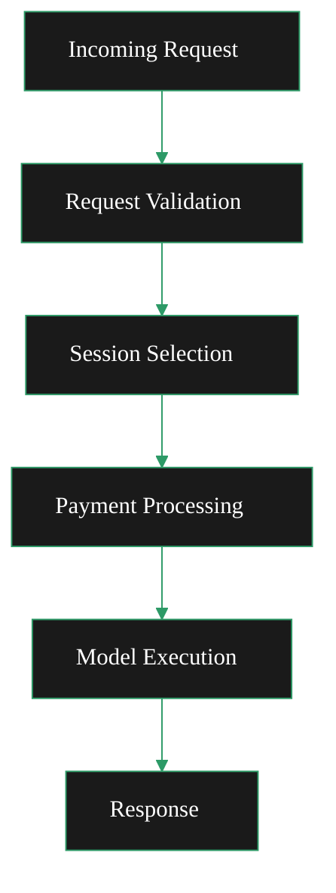

{/* codex-i18n: eyJraW5kIjoiY29kZXgtaTE4biIsInZlcnNpb24iOjEsInNvdXJjZVBhdGgiOiJ2Mi9nYXRld2F5cy9ydW4tYS1nYXRld2F5L21vbml0b3IvbW9uaXRvci1hbmQtb3B0aW1pc2UubWR4Iiwic291cmNlUm91dGUiOiJ2Mi9nYXRld2F5cy9ydW4tYS1nYXRld2F5L21vbml0b3IvbW9uaXRvci1hbmQtb3B0aW1pc2UiLCJzb3VyY2VIYXNoIjoiMGIwOGFkOGVlYzI0OTYwNGU4MWFkYWE1NGExNGE0ZjQ0MTY2NjYwMjRiNDJiODAzY2Y2MzUzYzEyNzI4OWFkNCIsImxhbmd1YWdlIjoiZXMiLCJwcm92aWRlciI6Im9wZW5yb3V0ZXIiLCJtb2RlbCI6InF3ZW4vcXdlbi10dXJibyIsImdlbmVyYXRlZEF0IjoiMjAyNi0wMi0yN1QxNDoxNTowMi4xODVaIn0= */}
import { DoubleIconLink } from '/snippets/components/primitives/links.jsx'
import { ScrollableDiagram } from '/snippets/components/content/zoomableDiagram.jsx'

<Danger> Currently operating as a brainstorming page </Danger>

## Enrutamiento de solicitudes

**Flujo de procesamiento de solicitudes (ambos)**

- **Validación de solicitud**: Middleware de validación de OpenAPI valida la estructura de la solicitud
- **Selección de sesión**: AISessionManager selecciona el orquestador adecuado según la capacidad del modelo
- **Procesamiento de pagos**: Calcula el pago en función del número de píxeles para los puntos finales no en vivo
- **Ejecución del modelo**: Envía la solicitud al trabajador de IA con el modelo especificado

<ScrollableDiagram title="Request Processing Flow">

</ScrollableDiagram>

#### Solicitudes de transcodificación

Las solicitudes tradicionales de transcodificación de video se manejan a través de:

- **Ingestión RTMP**: Puerto `1935` por defecto
- **HTTP push**: `/live/{streamKey}` punto de conexión cuando `-httpIngest`está habilitado
- **Salida HLS**: Secuencias de velocidad de bits adaptativa para reproducción

#### Solicitudes de IA

Las solicitudes de procesamiento de IA se enrutan a través de puntos finales dedicados<DoubleIconLink label="ai_mediaserver.go" href="https://github.com/livepeer/go-livepeer/blob/5691cb48/server/ai_mediaserver.go" iconLeft="github" />

<Danger> (fixme) OpenAPI Spec is here: ai/worker/api/openapi.json </Danger>

    <ResponseField name="/text-to-image" type="json">
      Generate images from text prompts.
      Uses `jsonDecoder` for parsing
    </ResponseField>
    <ResponseField name="/image-to-image" type="multipart/form-data">
      Transform images with prompts.
      Uses `multipartDecoder` for file uploads
    </ResponseField>
    <ResponseField name="/image-to-video" type="multipart/form-data">
      Create videos from images.
      Uses `multipartDecoder` for file uploads
    </ResponseField>
    <ResponseField name="/upscale" type="multipart/form-data">
      Upscale (enhance) images to higher resolution.
      Uses `multipartDecoder` for file uploads
    </ResponseField>
    <ResponseField name="/live/video-to-video/{stream}/start" type="multipart/form-data">
      Apply transformations to a live video streamed to the returned endpoints.
      Live video endpoint has specialized handling for real-time streaming with MediaMTX integration
    </ResponseField>

## Modelos de pago

La configuración dual maneja dos modelos de pago diferentes:

#### Pagos de transcodificación

Base: Por segmento de video procesado
Método: Boletos de pago enviados con cada segmento
Verificación: Verificación multi-orquestador para garantía de calidad

#### Pagos de IA

Base: Por píxel procesado (ancho × alto × salidas)
Método: Cálculo de pago basado en píxeles
Vídeo en vivo: Pagos basados en intervalos durante la transmisión

## Consideraciones operativas

#### Asignación de recursos

Al ejecutar una configuración dual, considere:

- Recursos de GPU: Compartidos entre la transcodificación y las cargas de trabajo de IA
- Memoria: Los modelos de IA requieren una cantidad significativa de RAM cuando están cargados ("calientes")
- Red: Ancho de banda para la ingestión de transmisiones y las solicitudes/respuestas de IA

#### Monitoreo

Monitorear ambos tipos de carga de trabajo:

- Codificación: Latencia de procesamiento de segmentos, tasas de éxito
- IA: Tiempos de carga de modelos, latencia de inferencia, tasas de procesamiento de píxeles

#### Estrategias de escalado

- Horizontal: Implementar múltiples instancias de puerta de enlace detrás de un balanceador de carga
- Vertical: Asignar más recursos de GPU para paralelismo de modelos de IA
- Especializados: Nodos separados para transcodificación vs IA basado en patrones de carga de trabajo
