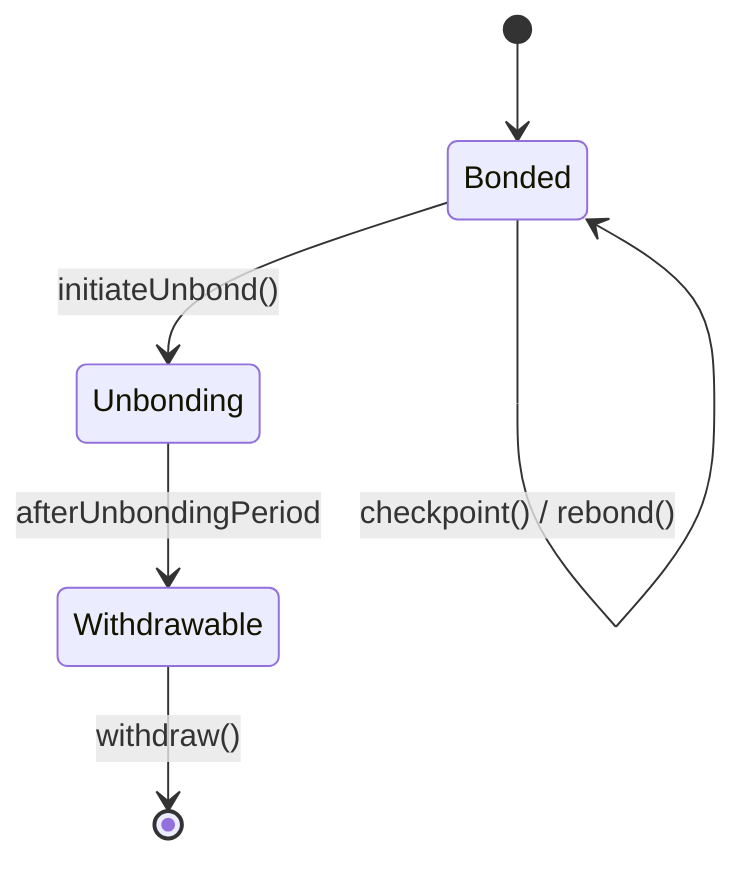

{/* codex-i18n: eyJraW5kIjoiY29kZXgtaTE4biIsInZlcnNpb24iOjEsInNvdXJjZVBhdGgiOiJ2Mi9scHQvYWJvdXQvbWVjaGFuaWNzLm1keCIsInNvdXJjZVJvdXRlIjoidjIvbHB0L2Fib3V0L21lY2hhbmljcyIsInNvdXJjZUhhc2giOiJiOTk1NTM4MmY5ZDNjNGQ0M2JjMGI4NDdhNmRiYmZkYTkwNmRhYTFjMDUzYWMzYjU4YjE1ZGMyYjdlYmM4MDY2IiwibGFuZ3VhZ2UiOiJlcyIsInByb3ZpZGVyIjoib3BlbnJvdXRlciIsIm1vZGVsIjoib3BlbmFpL2dwdC1vc3MtMjBiOmZyZWUiLCJnZW5lcmF0ZWRBdCI6IjIwMjYtMDMtMDFUMDk6NTQ6MzMuOTkwWiJ9 */}
import { MathInline, MathBlock } from '/snippets/components/content/math.jsx'

## Resumen Ejecutivo

Esta página describe la mecánica determinista a nivel de contrato que rige cómo LPT transiciona entre estados vinculados y desvinculados, cómo se procesan las rondas y cómo se registran y reclaman las recompensas.

Todos los mecanismos descritos aquí operan estrictamente en la **capa del protocolo (en cadena)**.

---

## 1. Variables de Estado Core

Sea:

- <MathInline latex={String.raw`S_t`} /> = suministro total de LPT en la ronda <MathInline latex={String.raw`t`} />
- <MathInline latex={String.raw`B_T`} /> = participación total vinculada
- <MathInline latex={String.raw`B_i`} /> = participación vinculada atribuida al participante <MathInline latex={String.raw`i`} />
- Ronda <MathInline latex={String.raw`t`} /> = época contable discreta gestionada por el protocolo

Las rondas forman la unidad contable atómica para la emisión y distribución de recompensas.

---

## 2. Vinculación

La vinculación es el acto de bloquear LPT en el contrato de staking para participar en las recompensas y gobernanza del protocolo.

Cuando el participante <MathInline latex={String.raw`i`} /> vincula la cantidad <MathInline latex={String.raw`x`} />:

<MathBlock latex={String.raw`B_i^{new} = B_i^{old} + x`} />

<MathBlock latex={String.raw`B_T^{new} = B_T^{old} + x`} />

La participación vinculada contribuye a:

- Elegibilidad de recompensas
- Peso de votación de gobernanza
- Participación en seguridad

El bonding se registra en el contrato BondingManager.

---

## 3. Atribución de delegación

Si el delegador <MathInline latex={String.raw`D`} /> se une al orquestador <MathInline latex={String.raw`O`} />:

<MathBlock latex={String.raw`B_O = B_{self,O} + \sum_D b_{D,O}`} />

Los delegadores mantienen la propiedad pero delegan los derechos de recompensa y la atribución del peso de voto.

---

## 4. Desapego

El desapego inicia un período de retiro.

Cuando el participante <MathInline latex={String.raw`i`} /> se desapega la cantidad <MathInline latex={String.raw`x`} />:

<MathBlock latex={String.raw`B_i^{new} = B_i^{old} - x`} />

<MathBlock latex={String.raw`B_T^{new} = B_T^{old} - x`} />

La participación entra en un estado de retiro pendiente sujeto a un período de desapego medido en rondas.

Durante este período:

- La participación no gana recompensas
- La participación no puede transferirse inmediatamente

Este retraso protege contra manipulaciones rápidas basadas en la participación.

---

## 5. Ciclo de vida de la ronda

Cada ronda incluye:

1. Cálculo de inflación
2. Elegibilidad para la distribución de recompensas
3. Procesamiento de puntos de control

La transición de ronda se activa por la lógica de temporización del protocolo.

Emisión por ronda:

<MathBlock latex={String.raw`R_t = S_t \cdot r_t`} />

Actualización de suministro:

<MathBlock latex={String.raw`S_{t+1} = S_t + R_t`} />

---

## 6. Puntos de control de recompensas

Las recompensas no se transfieren automáticamente; deben ser registradas en puntos de control.

El registro en puntos de control actualiza los saldos de recompensas de los participantes según el peso de la participación.

Asignación al orquestador <MathInline latex={String.raw`O`} />:

<MathBlock latex={String.raw`R_O = R_t \cdot \frac{B_O}{B_T}`} />

Participación del delegador:

<MathBlock latex={String.raw`R_{D,O} = R_O (1 - c_O) \cdot \frac{b_{D,O}}{B_O}`} />

El registro en puntos de control actualiza el estado contable interno antes de la retirada o el rebonding.

---

## 7. Reclamo y rebonding

Los participantes pueden:

- Reclamar recompensas a saldo líquido
- Rebondar recompensas (participación compuesta)

El rebonding aumenta <MathInline latex={String.raw`B_i`} /> y, por lo tanto, el peso económico futuro.

---

## 8. Diagrama de transición de estado

---

## 9. Implicaciones de Seguridad

Mecanismos que protegen la integridad del protocolo:

- **Retraso de desvinculación** — reduce la manipulación a corto plazo
- **Contabilidad basada en rondas** — ciclos de recompensa deterministas
- **Asignación ponderada por participación** — seguridad respaldada por capital

---

## 10. Separación entre Protocolo y Red

**Protocolo (En Cadena):**
- Lógica de vinculación/desvinculación
- Transiciones de ronda
- Emisión de recompensas
- Atribución de participación

**Red (Fuera de Cadena):**
- Ejecución de trabajos
- Rendimiento
- Generación de tarifas

Las mecánicas descritas aquí son completamente en cadena.

---

## Referencias

- [Livepeer Repositorio de Protocolo](https://github.com/livepeer/protocol)
- [Registro de Contratos](https://docs.livepeer.org/references/contract-addresses)
