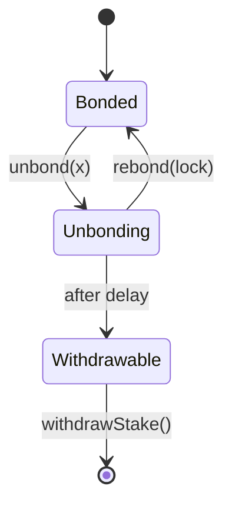
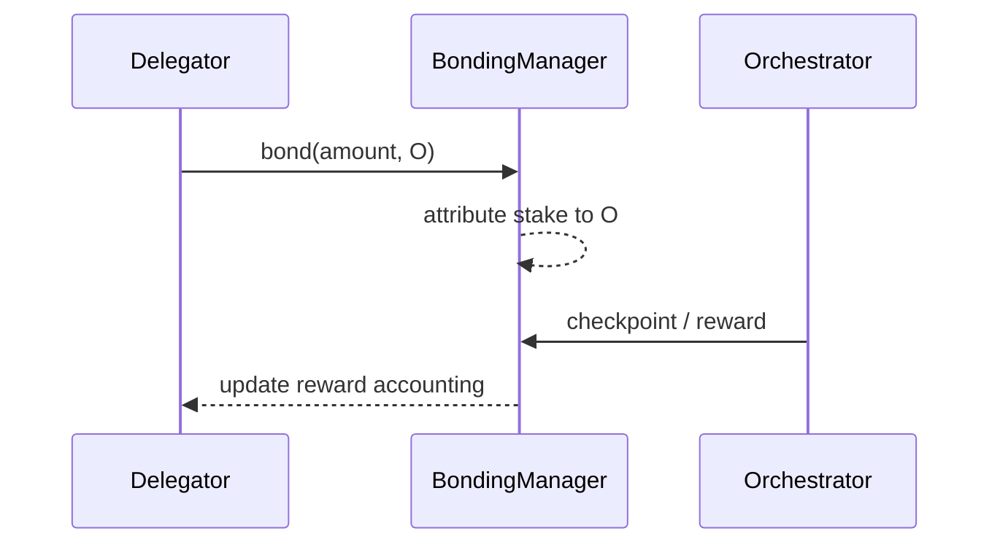

{/* codex-i18n: eyJraW5kIjoiY29kZXgtaTE4biIsInZlcnNpb24iOjEsInNvdXJjZVBhdGgiOiJ2Mi9scHQvZGVsZWdhdGlvbi9hYm91dC1kZWxlZ2F0b3JzLm1keCIsInNvdXJjZVJvdXRlIjoidjIvbHB0L2RlbGVnYXRpb24vYWJvdXQtZGVsZWdhdG9ycyIsInNvdXJjZUhhc2giOiJmNjg4MThlMjM3YjYzNGVhMDY2YWU3ODc2N2M1MjA0NGU0YWQ4ZWFlMmViZTg0YTllY2I5MDgzNjU1ZTMyZDNiIiwibGFuZ3VhZ2UiOiJlcyIsInByb3ZpZGVyIjoib3BlbnJvdXRlciIsIm1vZGVsIjoicXdlbi9xd2VuLXR1cmJvIiwiZ2VuZXJhdGVkQXQiOiIyMDI2LTAzLTAxVDExOjAwOjQwLjExMVoifQ== */}
import { MathInline, MathBlock } from '/snippets/components/content/math.jsx'

## Resumen Ejecutivo

Un **delegador** es un titular de LPT que vincula su stake y lo atribuye a un orchestrator. Los delegadores no operan infraestructura, pero son participantes económicamente responsables: su stake aumenta la seguridad del protocolo, forma la asignación de capital entre orchestrators y contribuye al poder de gobernanza ponderado por el stake.

La delegación es estrictamente una **capa de protocolo (en cadena)**mecanismo. Los delegadores no enrutan ni ejecutan trabajos; participan en la estructura económica en cadena que limita e incentiva a los operadores de capa de red.

---

## 1. Definición formal

Sea:

- <MathInline latex={String.raw`D`} />: una dirección de delegador
- <MathInline latex={String.raw`O`} />: una dirección de orquestador
- <MathInline latex={String.raw`b_{D,O}`} />: el capital comprometido por <MathInline latex={String.raw`D`} />hacia <MathInline latex={String.raw`O`} />
- <MathInline latex={String.raw`B_{self,O}`} />: stake auto-sellado de <MathInline latex={String.raw`O`} />

Stake total atribuido a <MathInline latex={String.raw`O`} />:

<MathBlock latex={String.raw`B_O = B_{self,O} + \sum_D b_{D,O}`} />

Stake total vinculado:

<MathBlock latex={String.raw`B_T = \sum_O B_O`} />

Los cambios en el stake del delegador modifican el estado contable del protocolo (atribución de vinculación) y, por lo tanto, los resultados de recompensas y gobernanza ponderados por stake.

---

## 2. Contexto arquitectónico

### 2.1 Capa de protocolo (En cadena)

Los delegadores interactúan con contratos de protocolo que:

- rastrean el stake vinculado por dirección
- asignan el stake a un delegado (orchestrator)
- impone tiempos de desvinculación
- asignar emisión (y, donde sea aplicable, tarifas)
- calcular el poder de gobernanza ponderado por participación

las direcciones de los contratos canónicos y las redes se publican en el[registro de contratos](https://docs.livepeer.org/references/contract-addresses).

### 2.2 Capa de red (fuera de cadena)

Los orquestadores operan software de nodo e infraestructura (GPUs/computación, enrutamiento, procesos de operaciones) para ejecutar trabajo. Los delegadores están económicamente vinculados al rendimiento y comportamiento del operador, pero no controlan directamente los caminos de ejecución.

---

## 3. Rol Económico

Los delegadores sirven a tres objetivos del protocolo.

### 3.1 Participación en Seguridad

El costo de seguridad escala con el total de participación asegurada:

<MathBlock latex={String.raw`\text{Security} \propto B_T`} />

Los delegadores aumentan <MathInline latex={String.raw`B_T`} />, aumentando el costo económico necesario para capturar resultados ponderados por el stake.

### 3.2 Asignación de capital

La delegación redistribuye el stake entre los orchestrators, moldeando la estructura del mercado de operadores.

Peso del orchestrator:

<MathBlock latex={String.raw`W_O = \frac{B_O}{B_T}`} />

Delegadores seleccionando <MathInline latex={String.raw`O`} /> aumentan <MathInline latex={String.raw`W_O`} />, afectando la asignación de emisión y la influencia en la gobernanza.

### 3.3 Participación en la Gobernanza

El poder de votación deriva del stake comprometido. Para un participante <MathInline latex={String.raw`i`} />:

<MathBlock latex={String.raw`V_i = \frac{B_i}{B_T}`} />

Por lo tanto, los delegadores influyen en los cambios en los parámetros del protocolo, actualizaciones y decisiones sobre el tesoro.

---

## 4. Modelo de Recompensas (Emisión y Tarifas)

Por ronda <MathInline latex={String.raw`t`} />, emisión del protocolo:

<MathBlock latex={String.raw`R_t = S_t \cdot r_t`} />

Asignación de emisión bruta del Orchestrator:

<MathBlock latex={String.raw`R_O = R_t \cdot \frac{B_O}{B_T}`} />

Asignación de emisión neta del delegador con comisión <MathInline latex={String.raw`c_O`} />:

<MathBlock latex={String.raw`R_{D,O} = R_O \cdot (1 - c_O) \cdot \frac{b_{D,O}}{B_O}`} />

El retorno total del delegador se descompone en:

<MathBlock latex={String.raw`\text{Reward}_{D,O} = \text{Issuance}_{D,O} + \text{Fees}_{D,O}`} />

La emisión es determinada por el protocolo; las tarifas son impulsadas por el mercado (demanda de la red).

---

## 5. Derechos, restricciones y responsabilidades

### 5.1 Derechos

Los delegadores pueden:

- vincular y delegar su participación a un orquestador
- desvincular la participación (sujeto a un retraso del protocolo)
- rebond durante la ventana de desvinculación
- retirar la participación después del período de desvinculación
- reclamar/rebondear recompensas según las mecánicas del protocolo

### 5.2 Restricciones

Los delegadores no pueden:

- acelerar la desvinculación más allá del retraso definido por el protocolo
- garantizar el flujo de trabajo o los ingresos por tarifas
- sustituir las decisiones operativas del orquestador

La delegación es una exposición al capital sin control operativo.

### 5.3 Responsabilidades (Prácticas)

Los delegadores deben monitorear:

- tasa de comisión <MathInline latex={String.raw`c_O`} />
- consistencia del punto de recompensa
- concentración de participación y descentralización
- propuestas de gobernanza que afectan parámetros de inflación/seguridad

La delegación se modela mejor como una asignación de capital a largo plazo.

---

## 6. Marco de evaluación para la selección de Orchestrator

La selección de delegador es multiobjetivo.

Definir una función de utilidad de delegador:

<MathBlock latex={String.raw`U(O) = f(\text{NetYield}_O, \text{Reliability}_O, \text{Concentration}_O, \text{GovernanceAlignment}_O)`} />

Donde:

- <MathInline latex={String.raw`\text{NetYield}_O`} /> se reduce por comisión <MathInline latex={String.raw`c_O`} />
- <MathInline latex={String.raw`\text{Reliability}_O`} /> captura la consistencia del punto de verificación y la estabilidad operativa
- <MathInline latex={String.raw`\text{Concentration}_O`} /> sanciona la participación dominante ya existente
- <MathInline latex={String.raw`\text{GovernanceAlignment}_O`} /> refleja las preferencias de gobernanza a largo plazo

---

## 7. Riesgos y modos de fallo

Los delegadores enfrentan un perfil de riesgo en capas.

1. **Riesgo de comisión:**más alto<MathInline latex={String.raw`c_O`} />reduce los rendimientos netos.
2. **Riesgo de punto de verificación / realización:**la emisión realizada puede divergir de la asignación teórica si no se realiza el checkpointing.
3. **riesgo de liquidez:**la demora en el desbloqueo restringe la salida.
4. **riesgo de concentración:**la exposición sistémica aumenta con la centralización del stake.
5. **riesgo de slashing (si está habilitado):**la participación puede reducirse bajo condiciones definidas del protocolo.

---

## 8. Diagramas

### 8.1 Modelo de estado

### 8.2 Flujo de recompensas

---

## 9. Separación entre protocolo y red

**Protocolo (En cadena):**contabilidad y atribución del stake vinculado, emisión y asignación ponderada por stake, retrasos en el desvinculamiento, poder de voto en gobernanza.

**Red (Fuera de cadena):**ejecución y enrutamiento de trabajos, generación de tarifas, rendimiento operativo y disponibilidad.

Los delegadores participan en la economía del protocolo; los orquestadores participan en las operaciones de la red.

---

## Referencias

- [Livepeer repositorio del protocolo](https://github.com/livepeer/protocol)
- [Registro de contratos](https://docs.livepeer.org/references/contract-addresses)
