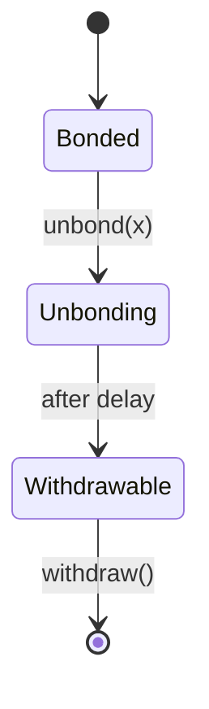
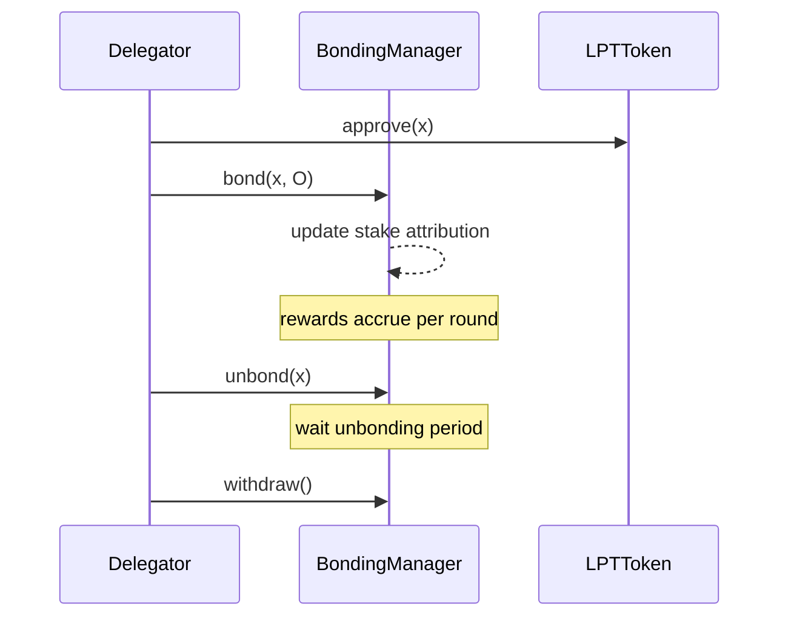

{/* codex-i18n: eyJraW5kIjoiY29kZXgtaTE4biIsInZlcnNpb24iOjEsInNvdXJjZVBhdGgiOiJ2Mi9scHQvZGVsZWdhdGlvbi9kZWxlZ2F0aW9uLWd1aWRlLm1keCIsInNvdXJjZVJvdXRlIjoidjIvbHB0L2RlbGVnYXRpb24vZGVsZWdhdGlvbi1ndWlkZSIsInNvdXJjZUhhc2giOiIxZDk3ZmE4MmY3MDAwNTM5ZWI2ZjEyMmMyYjFkMjk4ODE2NGQxMWU1NGVkYTFjNDIyNmM4OWFkODhhYzNjMmRlIiwibGFuZ3VhZ2UiOiJlcyIsInByb3ZpZGVyIjoib3BlbnJvdXRlciIsIm1vZGVsIjoicXdlbi9xd2VuLXR1cmJvIiwiZ2VuZXJhdGVkQXQiOiIyMDI2LTAzLTAxVDExOjAxOjIwLjE0MVoifQ== */}
import { MathInline, MathBlock } from '/snippets/components/content/math.jsx'

## Resumen Ejecutivo

Este guía proporciona un recorrido preciso al protocolo y consciente de contratos para delegar LPT. Se enfoca estrictamente en mecanismos en cadena: vinculación, atribución de apuesta, verificación de recompensas, desvinculación y retiro.

La delegación modifica el estado del protocolo. No modifica directamente la ruta de la red o la ejecución.

---

## 1. Condiciones previas

Antes de delegar, un participante debe:

1. Tener LPT en un monedero de custodia propia.
2. Esté conectado a la red de implementación correcta (consulte el registro de contratos).
3. Comprenda la demora de desvinculación y las restricciones de liquidez.

Referencias a contratos canónicos: [Direcciones de contratos](https://docs.livepeer.org/references/contract-addresses)

La delegación interactúa principalmente con el contrato BondingManager.

---

## 2. Paso 1 - Aprobar la transferencia de token

Si se interactúa directamente con los contratos, el contrato del token LPT debe estar aprobado para transferir la cantidad deseada de vinculación.

Deje que <MathInline latex={String.raw`x`} /> sea la cantidad a delegar.

La aprobación no cambia el estado de vinculación; solo autoriza al contrato de estaking para transferir tokens.

Impacto en el estado: ninguno (solo actualización de permiso).

---

## 3. Paso 2 - Vincular y Delegar

Llame a `bond(x, O)`donde:

- <MathInline latex={String.raw`x`} /> = LPT cantidad
- <MathInline latex={String.raw`O`} /> = dirección del orquestador elegido

Transición de estado:

<MathBlock latex={String.raw`B_i^{new} = B_i^{old} + x`} />

<MathBlock latex={String.raw`B_O^{new} = B_O^{old} + x`} />

<MathBlock latex={String.raw`B_T^{new} = B_T^{old} + x`} />

La delegación afecta inmediatamente la atribución de participación para rondas posteriores (sujeto a las reglas de temporización del protocolo).

---

## 4. Paso 3 - Verificar el estado en la cadena

Después de la unión, verifique:

1. Monto unido para su dirección.
2. Asignación de dirección del delegado (orquestador).
3. Stake total asignado al orquestador.

Métodos de verificación:

- Lectura del explorador de bloques del estado de BondingManager.
- Livepeer Explorador o índice equivalente.

La delegación debe ser verificable mediante el estado en cadena, no solo mediante la visualización de la interfaz de usuario.

---

## 5. Acumulación de recompensas y verificación de puntos

Por ronda<MathInline latex={String.raw`t`} />:

<MathBlock latex={String.raw`R_t = S_t \cdot r_t`} />

Asignación del orquestador:

<MathBlock latex={String.raw`R_O = R_t \cdot \frac{B_O}{B_T}`} />

Asignación neta del delegador con comisión <MathInline latex={String.raw`c_O`} />:

<MathBlock latex={String.raw`R_{D,O} = R_O \cdot (1 - c_O) \cdot \frac{b_{D,O}}{B_O}`} />

Las recompensas pueden requerir un punto de verificación antes de que sean reclamables o reenlazables.

El punto de verificación actualiza la contabilidad interna, pero no transfiere automáticamente los tokens a menos que se reclamen explícitamente.

---

## 6. Paso 4 - Reenlazar (Compensación opcional)

En lugar de retirar recompensas, un delegador puede reengancharse.

Si la cantidad de recompensa = <MathInline latex={String.raw`y`} />:

<MathBlock latex={String.raw`B_i^{new} = B_i^{old} + y`} />

La capitalización aumenta el peso futuro:

<MathBlock latex={String.raw`W_i = \frac{B_i}{B_T}`} />

---

## 7. Paso 5 - Iniciar el desenganche

Para salir de la delegación, llama a `unbond(x)`.

Transición de estado:

<MathBlock latex={String.raw`B_i^{new} = B_i^{old} - x`} />

<MathBlock latex={String.raw`B_O^{new} = B_O^{old} - x`} />

<MathBlock latex={String.raw`B_T^{new} = B_T^{old} - x`} />

El stake entra en un estado de desbloqueo.

Durante el desbloqueo:

- El stake no genera recompensas.
- El stake no se puede retirar inmediatamente.

---

## 8. Retraso de desvinculación

El protocolo impone un retraso medido en rondas.

Este retraso:

- Evita ataques de rotación rápida de participación.
- Estabiliza la participación en seguridad.
- Introduce un riesgo de liquidez para los delegadores.

Modelo de estado:

---

## 9. Paso 6 - Retirar el stake

Después de que el período de desvinculación finalice, llama a `withdraw()`.

Impacto en el estado:

- El balance vinculado sigue reducido.
- El saldo líquido LPT aumenta.

El retiro finaliza la salida.

---

## 10. Lista de verificación de riesgos

Antes de delegar, evalúe:

1. Tasa de comisión<MathInline latex={String.raw`c_O`} />
2. Concentración del stake del orchestrator
3. Consistencia de puntos de verificación históricos
4. Alineación de gobernanza
5. Necesidades de liquidez (dado el retraso de desvinculación)

La delegación es una decisión de asignación de capital bajo liquidez limitada.

---

## 11. Separación entre Protocolo y Red

**Protocolo (En cadena):**

- `bond()`
- `unbond()`
- `withdraw()`
- asignación de recompensas
- peso de voto en gobernanza

**Red (Fuera de cadena):**

- tiempo de actividad del nodo
- ejecución de trabajos
- generación de tarifas

Los cambios de delegación modifican el estado del protocolo; no modifican directamente el comportamiento de enrutamiento.

---

## 12. Diagrama de secuencia (de extremo a extremo)

---

## Referencias

- [Livepeer repositorio del protocolo](https://github.com/livepeer/protocol)
- [Registro de contratos](https://docs.livepeer.org/references/contract-addresses)
