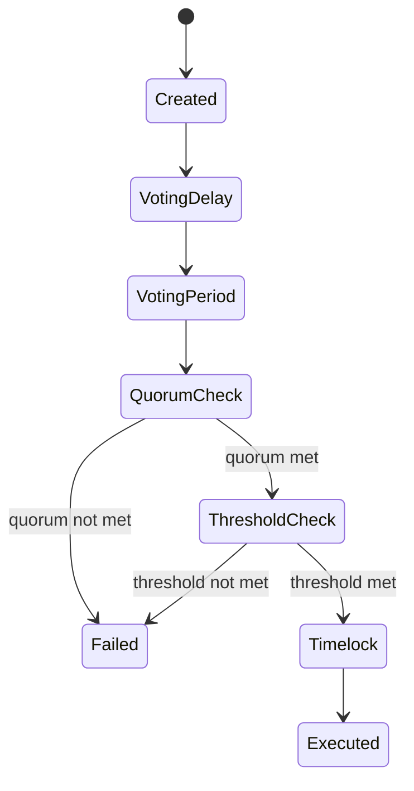

{/* codex-i18n: eyJraW5kIjoiY29kZXgtaTE4biIsInZlcnNpb24iOjEsInNvdXJjZVBhdGgiOiJ2Mi9scHQvZ292ZXJuYW5jZS9tb2RlbC5tZHgiLCJzb3VyY2VSb3V0ZSI6InYyL2xwdC9nb3Zlcm5hbmNlL21vZGVsIiwic291cmNlSGFzaCI6IjIxZjQ3YmFlZGJjZDczNTY1ODlkZTdlMWZjNjY3ZGM0MjU3Yjk3OTk2YTViZTE1OWEwZjhiMGM2NmFiNWQzZTIiLCJsYW5ndWFnZSI6ImVzIiwicHJvdmlkZXIiOiJvcGVucm91dGVyIiwibW9kZWwiOiJxd2VuL3F3ZW4tdHVyYm8iLCJnZW5lcmF0ZWRBdCI6IjIwMjYtMDMtMDFUMTE6MTE6MzUuNjA5WiJ9 */}
import { MathInline, MathBlock } from '/snippets/components/content/math.jsx'

## Resumen Ejecutivo

Livepeer de gobernanza es un sistema basado en propuestas y ponderado por capital, impuesto completamente por contratos inteligentes. La autoridad es proporcional al stake comprometido, y la ejecución es determinista una vez que se cumplen las condiciones de cuórum y umbral.

Esta página formaliza el proceso de toma de decisiones en gobernanza, incluyendo mecanismos de cuórum, umbrales de votación, semántica de timelock y consideraciones sobre superficie de ataque.

---

## 1. Primitivas de gobernanza

Sea:

- <MathInline latex={String.raw`B_i`} /> = stake comprometido atribuido al participante <MathInline latex={String.raw`i`} />
- <MathInline latex={String.raw`B_T`} /> = stake total comprometido
- <MathInline latex={String.raw`V_i`} /> = poder de voto del participante<MathInline latex={String.raw`i`} />

Poder de voto:

<MathBlock latex={String.raw`V_i = \frac{B_i}{B_T}`} />

Todo el peso de gobernanza se deriva del stake comprometido.

---

## 2. Ciclo de vida de una propuesta

Una propuesta de gobernanza generalmente sigue estas fases deterministas:

1. **Creación** - propuesta presentada con acciones codificadas
2. **Retraso de votación** - período antes de que se abra la votación
3. **Período de votación** - los participantes con enlaces emiten votos
4. **Verificación de cuórum** - requisito mínimo de participación
5. **Verificación de umbral** - condición de mayoría
6. **Cola (Timelock)** - demora de ejecución
7. **Ejecución** - transición de estado si se cumplen las condiciones

Estas transiciones son impuestas por los contratos de gobernanza.

---

## 3. Requisito de quórum

Sea:

- <MathInline latex={String.raw`Q`} /> = fracción de quórum
- <MathInline latex={String.raw`V_{cast}`} /> = poder de voto total emitido

Condición de cuórum:

<MathBlock latex={String.raw`V_{cast} \ge Q \cdot B_T`} />

Al menos el 33% de todos los LPT estaking deben participar en la votación para que sea válida. Este requisito asegura que un pequeño grupo no pueda impulsar cambios radicales sin la participación de la comunidad.

---

## 4. Condición de mayoría / umbral

Sea:

- <MathInline latex={String.raw`V_{for}`} /> = votos a favor ponderados por stake
- <MathInline latex={String.raw`V_{against}`} /> = votos ponderados por participación contra

Condición de mayoría (mayoría simple):

<MathBlock latex={String.raw`V_{for} > V_{against}`} />

Más del 50% de los votos participantes deben favorecer la propuesta. La aprobación por mayoría simple equilibra la inclusividad con la decisividad: las propuestas que dividen al comunidad en partes iguales no pueden pasar.

---

## 5. Semántica de timelock

Las propuestas aprobadas entran en un período de timelock antes de su ejecución.

Propiedades de timelock:

- Introduce un retraso entre la aprobación y la ejecución
- Proporciona la oportunidad para que los interesados reaccionen
- Reduce el riesgo de cambios repentinos en los parámetros

Retraso de timelock<MathInline latex={String.raw`T_{delay}`} />está definido a nivel del protocolo.

---

## 6. Modelo de ejecución

Si se cumplen las condiciones de cuórum y umbral y ha transcurrido el plazo de bloqueo:

- Se ejecutan las acciones codificadas
- Las transiciones de estado del contrato se realizan de forma determinista

La ejecución puede incluir:

- Modificación de parámetros
- Actualizaciones de la implementación del proxy
- Transferencias del Tesoro

La ejecución es atómica por propuesta.

---

## 7. Objetos de gobernanza y arquitectura del contrato

La documentación de direcciones de contratos oficiales enumera los contratos relacionados con la gobernanza en la red principal de Arbitrum:

- **Gobernador** - lógica de propuesta y votación
- **LivepeerGovernor (proxy/target)** - implementación de gobernador actualizable
- **Votos de vinculación** - seguimiento del poder de voto ponderado por participación
- **Tesorería** - fondos controlados por gobernanza

Esto establece que la gobernanza no es simplemente social; se ejecuta mediante contratos implementados con direcciones publicadas.

---

## 8. Parámetros de la Tesorería

Las discusiones sobre la gobernanza de la tesorería identifican dos parámetros como especialmente importantes:

| Parámetro | Descripción |
|-----------|-------------|
| `treasuryRewardCutRate` | Porcentaje de recompensas inflacionarias que se envían a la tesorería cada ronda (actualmente ~10%) |
| `treasuryBalanceCeiling` | Una vez que el saldo de la tesorería excede un techo (750.000 LPT), el recorte puede establecerse en cero |

---

## 9. Consideraciones de seguridad y teoría de juegos

### 9.1 Requisito de capital para el control

Sea <MathInline latex={String.raw`\theta`} /> la fracción mínima requerida para controlar los resultados.

Capital mínimo requerido:

<MathBlock latex={String.raw`Capital_{control} \ge \theta B_T`} />

Un mayor stake vinculado aumenta el costo de captura de gobernanza.

### 9.2 Riesgo de concentración de stake

Si un pequeño número de direcciones controla una gran fracción de <MathInline latex={String.raw`B_T`} />, el riesgo de captura de gobernanza aumenta. La seguridad es inversamente proporcional a la concentración.

### 9.3 Riesgo de apatía del votante

Si la fracción de cuórum <MathInline latex={String.raw`Q`} />es alto en comparación con la participación típica:
- Las propuestas pueden fallar debido a una baja participación

Si <MathInline latex={String.raw`Q`} />es bajo:
- Pequeños grupos coordinados pueden aprobar propuestas

Por lo tanto, la calibración del quórum es un parámetro de seguridad.

### 9.4 Centralización del Executor

El comité de seguridad/los propietarios del protocolo invocan funciones para establecer valores según el resultado de la votación. Esto introduce una dependencia de confianza: incluso si la votación es descentralizada, la ejecución puede permanecer centralizada en algunos caminos.

---

## 10. Riesgos de captura de gobernanza

El sistema destaca varios riesgos estructuralmente importantes:

1. **Baja participación y concentración del poder de votación** - reduce la defensa contra acciones de gobernanza hostiles
2. **Centralización del executor** - la dependencia de un comité de seguridad introduce requisitos de confianza
3. **Penalización desactivada** - reduce la capacidad del sistema para imponer sanciones económicas automáticas por comportamientos incorrectos, aumentando la dependencia de la reputación y las soluciones sociales

---

## 11. Máquina de estado de gobernanza

---

## 12. Separación entre protocolo y red

**Protocolo (En cadena):**
- Presentación de propuestas
- Votación
- Cumplimiento de cuórum y umbral
- Ejecución con temporización
- Modificación de parámetros

**Red (fuera de cadena):**
- Operación de nodo
- Rendimiento
- Ejecución de trabajo

La gobernanza modifica las reglas; los actores de la red operan dentro de esas reglas.

---

## Referencias

- [Livepeer Protocol Repository](https://github.com/livepeer/protocol)
- [Registro de Contratos](https://docs.livepeer.org/references/contract-addresses)
- [Livepeer Improvement Proposals (LIPs)](https://github.com/livepeer/LIPs)
