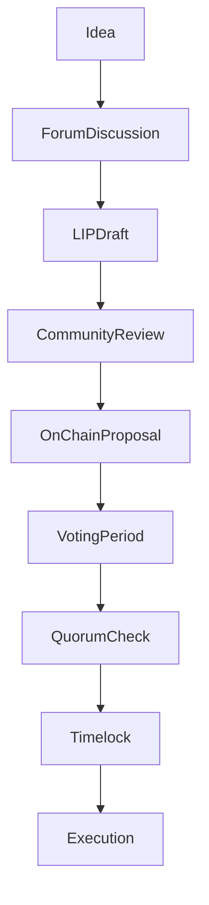

{/* codex-i18n: eyJraW5kIjoiY29kZXgtaTE4biIsInZlcnNpb24iOjEsInNvdXJjZVBhdGgiOiJ2Mi9scHQvZ292ZXJuYW5jZS9wcm9jZXNzZXMubWR4Iiwic291cmNlUm91dGUiOiJ2Mi9scHQvZ292ZXJuYW5jZS9wcm9jZXNzZXMiLCJzb3VyY2VIYXNoIjoiZGIxZDNkMGQ4ZjQxMDI5OWI3ZWY2MzQ2OWZmYjcyOTdkYzUyMDE0ZTgwYmEyYmY3NzY1NzUzNjY5ODM3NDcwMiIsImxhbmd1YWdlIjoiZXMiLCJwcm92aWRlciI6Im9wZW5yb3V0ZXIiLCJtb2RlbCI6InF3ZW4vcXdlbi10dXJibyIsImdlbmVyYXRlZEF0IjoiMjAyNi0wMy0wMVQxMToxMjo0MS45MTNaIn0= */}
import { MathInline, MathBlock } from '/snippets/components/content/math.jsx'

## Resumen Ejecutivo

Livepeer de gobernanza consiste en procesos de coordinación fuera de cadena y lógica de ejecución en cadena. Mientras que el votación y la aplicación de parámetros se manejan mediante contratos inteligentes, la formación de propuestas, revisión y construcción de consenso social ocurren fuera de cadena.

Esta página formaliza el ciclo completo de gobernanza desde la formación de ideas hasta la ejecución en cadena.

---

## 1. Vista general del ciclo de gobernanza

La gobernanza se desarrolla en dos dominios coordinados:

1. **Capa de proceso fuera de cadena** (discusión, redacción, señalización)
2. **Capa de Ejecución en Cadena** (presentación de propuestas, votación, ejecución)

Estas capas son complementarias pero distintas.

---

## 2. Capa de Proceso Fuera de Cadena

### 2.1 Formación de Ideas

La gobernanza generalmente comienza con:

- Identificación de ineficiencia en los parámetros del protocolo
- Ajustes en el modelo de seguridad
- Desalineación económica
- Necesidades de asignación del tesoro
- Requisitos de actualización de contratos

Las ideas suelen discutirse en foros públicos antes de su formalización.

### 2.2 Livepeer Propuestas de Mejora (LIPs)

Una Livepeer Propuesta de Mejora (LIP) formaliza cambios en el protocolo. Una LIP generalmente incluye:

- Motivación
- Especificación técnica
- Análisis del impacto económico
- Consideraciones de seguridad
- Análisis de compatibilidad hacia atrás

Los LIPs sirven como documentación canónica para los cambios de gobernanza.

### 2.3 Señales sociales y retroalimentación

Antes de la presentación en cadena, las propuestas suelen pasar por:

- Discusión comunitaria
- Revisión técnica
- Evaluación de riesgos
- Señalización de partes interesadas

Esto reduce la probabilidad de que propuestas adversarias o mal construidas lleguen a la ejecución.

---

## 3. Reglas de votación en cadena

El contrato de gobernanza impone umbrales de votación explícitos para protegerse contra ataques de baja participación:

### 3.1 Cuórum

Al menos **33%** de todos los LPT estaking deben participar en la votación para que sea válida. Este requisito asegura que un pequeño grupo no pueda impulsar cambios radicales sin la participación de la comunidad.

### 3.2 Límite de aprobación

Más de **50%**de los votos participantes deben favorecer la propuesta. La aprobación por mayoría simple equilibra la inclusividad con la decisión: las propuestas que dividen al comunidad en partes iguales no pueden pasar.

### 3.3 Poder de voto

El poder de voto es proporcional a los LPT comprometidos:

<MathBlock latex={String.raw`V_i = \frac{B_i}{B_T}`} />

Los delegadores ejercen la gobernanza de forma indirecta delegando a orquestadores cuyos valores se alinean con los suyos; los orquestadores deben declarar públicamente sus posiciones y pueden emitir votos en consecuencia.

---

## 4. Capa de ejecución en cadena

### 4.1 Presentación de propuestas

Una propuesta de gobernanza formal codifica acciones ejecutables de contratos. El contenido de la propuesta puede incluir:

- Actualizaciones de parámetros
- Mejoras en la implementación del contrato
- Transferencias del tesoro

La presentación activa la máquina de estado de gobernanza determinista.

### 4.2 Ventana de Voto

Los votos se realizan mediante un contrato inteligente en cadena. Cuando una LIP está lista, su hash y parámetros se colocan en cola, y los titulares de tokens pueden votar utilizando mensajes basados en firmas.

### 4.3 Verificación de Cuórum y Límite

La propuesta debe cumplir:

<MathBlock latex={String.raw`V_{cast} \ge Q \cdot B_T`} />

Y la condición de mayoría:

<MathBlock latex={String.raw`V_{for} > V_{against}`} />

Las condiciones son impuestas por los contratos de gobernanza.

### 4.4 Cola de Timelock

Las propuestas aprobadas entran en un período de timelock antes de la ejecución.

Propiedades de Timelock:

- Retraso entre la aprobación y la ejecución
- Mitigación de riesgos contra cambios repentinos en los parámetros
- Permite a los participantes evaluar las consecuencias

### 4.5 Ejecución

Si se cumplen las condiciones y expira el timelock:

- Las acciones codificadas se ejecutan de forma atómica
- Los cambios en el estado del contrato
- Se realizan transferencias de la tesorería si están incluidas

La ejecución es irreversible a nivel de transacción.

---

## 5. Coordinación de la Tesorería

Las asignaciones de la tesorería siguen el mismo ciclo de gobernanza:

1. Discusión de propuesta fuera de cadena
2. Acción de tesorería codificada en cadena
3. Votación y cuórum
4. Tiempo de bloqueo
5. Ejecución

La gobernanza del tesoro utiliza lógica de aplicación ponderada por participación.

---

## 6. Livepeer Fundación y Administración del Tesoro

La Livepeer Fundación, constituida como una organización sin fines de lucro neutral en 2025, cuida la salud a largo plazo del protocolo. Coordina el desarrollo principal, la investigación y el crecimiento del ecosistema, pero su autoridad proviene de los titulares de tokens a través de la gobernanza.

Las responsabilidades clave incluyen:

| Responsabilidad | Descripción |
|----------------|-------------|
| **Mantenimiento del protocolo** | Mantener y actualizar contratos inteligentes, implementaciones de referencia y SDKs |
| **Investigación y estándares** | Financiar investigaciones sobre transcodificación verificable, pruebas de conocimiento cero y nuevos códecs |
| **Programas de subvenciones** | Gestionar el tesoro de la comunidad para financiar a constructores, herramientas y documentación |
| **Defensa del ecosistema** | Representar a Livepeer en discusiones regulatorias y participar en comunidades de blockchain |

A pesar de su rol coordinador, la Fundación no es una autoridad central. Los pagos del tesoro, los cambios importantes en el protocolo y los planes a largo plazo requieren aprobación mediante LIPs.

---

## 7. Mitigación de riesgos y medidas de seguridad de procesos

### 7.1 Revisión en varias etapas

Separación de:

- Revisión social (off-chain)
- Ejecución determinista (on-chain)

Reduce cambios accidentales o maliciosos de parámetros.

### 7.2 Transparencia

Todos los votos y transacciones de ejecución son verificables públicamente en cadena. La gobernanza es auditable mediante exploradores de bloques.

### 7.3 Calibración de parámetros

Cuórum<MathInline latex={String.raw`Q`} /> y duración del timelock<MathInline latex={String.raw`T_{delay}`} /> son parámetros de seguridad a nivel de gobernanza.

Si<MathInline latex={String.raw`Q`} /> es demasiado bajo:
- Pequeñas coaliciones pueden aprobar propuestas

Si <MathInline latex={String.raw`Q`} /> es demasiado alto:
- Puede ocurrir estancamiento en la gobernanza

---

## 8. Consideraciones y posibles mejoras

La elección de un quórum del 33% y una aprobación del 50% refleja un equilibrio entre agilidad y resistencia a la captura. Algunas redes descentralizadas han explorado:

- **Cuota dinámica** — donde la cuota se ajusta según la asistencia histórica
- **Voto por convicción** — donde los votos se acumulan con el tiempo
- **Voto cuadrático** — para amplificar las voces minoritarias

Livepeer's governance has not yet adopted these mechanisms, but community discussions remain ongoing.

---

## 9. Diagrama de flujo del proceso de gobernanza

---

## 10. Separación entre Protocolo y Red

**Protocolo (En cadena):**
- Presentación de propuestas
- Votación
- Impartición de cuórum
- Cola de temporización
- Ejecución de cambios en contratos

**Red (fuera de cadena):**
- Foros de discusión
- Redacción de LIP
- Señalización social
- Ejecución de infraestructura

La gobernanza modifica las reglas del protocolo; los actores de la red operan dentro de los parámetros actualizados.

---

## Referencias

- [Livepeer Repositorio del protocolo](https://github.com/livepeer/protocol)
- [Registro de contratos](https://docs.livepeer.org/references/contract-addresses)
- [Livepeer Improvement Proposals (LIPs)](https://github.com/livepeer/LIPs)
- [Livepeer Forum](https://forum.livepeer.org)
