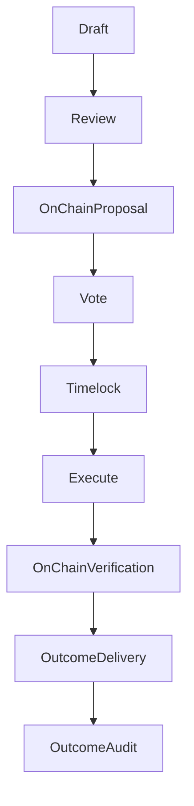

{/* codex-i18n: eyJraW5kIjoiY29kZXgtaTE4biIsInZlcnNpb24iOjEsInNvdXJjZVBhdGgiOiJ2Mi9scHQvdHJlYXN1cnkvYWxsb2NhdGlvbnMubWR4Iiwic291cmNlUm91dGUiOiJ2Mi9scHQvdHJlYXN1cnkvYWxsb2NhdGlvbnMiLCJzb3VyY2VIYXNoIjoiM2M2MzlkMTczZjYzYzU4ZDQ5ZWZlZWZkZjNmYzNlMTViMGM0OGRjMDZiZTUwNjYzNzMyNmZjZTgyOGExNjI3ZCIsImxhbmd1YWdlIjoiZXMiLCJwcm92aWRlciI6Im9wZW5yb3V0ZXIiLCJtb2RlbCI6InF3ZW4vcXdlbi10dXJibyIsImdlbmVyYXRlZEF0IjoiMjAyNi0wMy0wMVQxMToyMDoxOC44MDhaIn0= */}
import { MathInline, MathBlock } from '/snippets/components/content/math.jsx'

## Resumen Ejecutivo

Una asignación de tesorería es una acción en cadena autorizada por la gobernanza que transfiere activos controlados por el protocolo a un destinatario para un propósito definido. Las asignaciones son impuestas de forma determinista por contratos inteligentes, pero sus resultados en el mundo real dependen de la entrega fuera de cadena por parte de los destinatarios.

Esta página define:

- el modelo de contabilidad de asignación
- un marco de evaluación para las decisiones de asignación
- modos de seguridad y falla
- métodos de verificación y auditoría

---

## 1. Modelo de asignación formal

Sea:

- <MathInline latex={String.raw`T`} />= saldo del tesoro antes de la asignación
- <MathInline latex={String.raw`A_k`} />= cantidad de asignación de la propuesta<MathInline latex={String.raw`k`} />
- <MathInline latex={String.raw`T'`} />= saldo del tesoro después de la asignación

Actualización de asignación única:

<MathBlock latex={String.raw`T' = T - A_k`} />

Sobre<MathInline latex={String.raw`n`} /> asignaciones:

<MathBlock latex={String.raw`T_n = T_0 - \sum_{k=1}^{n} A_k`} />

Donde cada<MathInline latex={String.raw`A_k`} /> se ejecuta mediante un payload de propuesta de gobernanza.

---

## 2. Taxonomía de asignación

Las asignaciones del tesoro generalmente se dividen en categorías:

1. **Desarrollo del ecosistema** — aplicaciones, integraciones, SDKs.
2. **Investigación y desarrollo del protocolo** — investigación en seguridad, auditorías, modelado económico.
3. **Soporte de infraestructura** — herramientas para operadores, monitoreo, mejoras en la confiabilidad.
4. **Programas de la comunidad** — educación, incorporación, documentación, eventos.
5. **Intervenciones estratégicas** — fomentar la demanda o la oferta donde los mercados no lo hagan.

Estas categorías son conceptuales; la ejecución en cadena es simplemente calldata.

---

## 3. Marco de evaluación

La asignación del tesoro es una decisión bajo incertidumbre.

Definir una propuesta de asignación<MathInline latex={String.raw`k`} />con función de resultado esperado:

<MathBlock latex={String.raw`Outcome_k = g(Impact_k, Feasibility_k, Risk_k, Alignment_k)`} />

Una función de decisión práctica es:

<MathBlock latex={String.raw`Score_k = w_1 Impact_k + w_2 Feasibility_k - w_3 Risk_k + w_4 Alignment_k`} />

Donde<MathInline latex={String.raw`w_i`} />son pesos elegidos por la gobernanza.

### 3.1 Impacto

Mide la mejora esperada en los objetivos del protocolo, como:

- aumento de la demanda de la red (tarifas)
- mejor participación de los operadores (bonding)
- mejor posición de seguridad

### 3.2 Viabilidad

Evalúa la probabilidad de ejecución dada:

- alcance técnico
- capacidad del equipo
- plazo de entrega

### 3.3 Riesgo

Capturas:

- riesgo de ejecución
- riesgo adversarial
- costo de oportunidad

### 3.4 Alineación

Asegura que los resultados fortalezcan los objetivos del protocolo en lugar de la captura de valor privado.

---

## 4. Modelo de Seguridad de Gobernanza

Las asignaciones heredan la seguridad de gobernanza.

Sea:

- <MathInline latex={String.raw`B_T`} /> = stake total comprometido
- <MathInline latex={String.raw`\theta`} /> = fracción requerida para controlar el resultado de la gobernanza

Capital requerido para el control:

<MathBlock latex={String.raw`Capital_{control} \ge \theta B_T`} />

La seguridad del tesoro depende por tanto de la distribución y participación del stake.

---

## 5. Modos de falla y riesgos

### 5.1 Fallas a nivel del protocolo

- errores de calldata
- saldo insuficiente en el tesoro
- el contrato objetivo reverts

### 5.2 Fallas a nivel de gobernanza

- captura por participación concentrada
- cuórum bajo / baja participación
- propuestas apresuradas con revisión insuficiente

### 5.3 Fallas a nivel de resultado

Porque la entrega es off-chain:

- los destinatarios pueden fallar en entregar
- los resultados pueden no ser verificables
- los incentivos pueden no alinearse

El Tesoro puede hacer cumplir la transferencia, no el rendimiento.

---

## 6. Modelo de Verificación y Auditoría

La verificación se divide en dos dominios:

### 6.1 Verificación en cadena (Determinista)

Confirme que:

- la propuesta se ejecutó correctamente
- las transferencias ocurrieron
- la dirección del destinatario coincide con el objetivo previsto
- el saldo del tesoro disminuyó por<MathInline latex={String.raw`A_k`} />

Esto se puede verificar mediante registros de transacciones y lecturas de estado.

### 6.2 Verificación de resultado fuera de cadena (No determinista)

La verificación del resultado requiere:

- informe de hitos
- entregables públicos (código, documentación, implementaciones)
- evidencia reproducible del impacto

La gobernanza del tesoro debe preferir asignaciones con resultados medibles y auditables.

---

## 7. Diagrama — Ciclo de vida de la asignación

---

## 8. Separación entre Protocolo y Red

**Protocolo (En cadena):**

- autorización y ejecución de asignaciones
- transfers determinísticos
- registro de auditoría en cadena

**Red/Off-Chain:**

- entrega al destinatario
- impacto en el ecosistema
- medición de resultados

Los controles de la tesorería gestionan activos en cadena; los resultados dependen de la ejecución off-chain.

---

## Referencias

- [Livepeer Repositorio del Protocolo](https://github.com/livepeer/protocol)
- [Registro de Contratos](https://docs.livepeer.org/references/contract-addresses)
