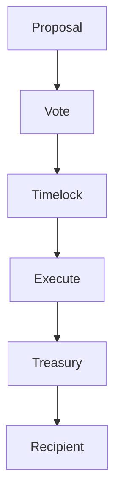

{/* codex-i18n: eyJraW5kIjoiY29kZXgtaTE4biIsInZlcnNpb24iOjEsInNvdXJjZVBhdGgiOiJ2Mi9scHQvdHJlYXN1cnkvb3ZlcnZpZXcubWR4Iiwic291cmNlUm91dGUiOiJ2Mi9scHQvdHJlYXN1cnkvb3ZlcnZpZXciLCJzb3VyY2VIYXNoIjoiOGQ2ZDZiMmFlNmFjN2EzYWVlMjNmMmM2ZWUyNmFlMzY2ZmM0NzFjYjVhMjhmOGQxOTU4NWQ5ZDhlZDQwYzg5MCIsImxhbmd1YWdlIjoiZXMiLCJwcm92aWRlciI6Im9wZW5yb3V0ZXIiLCJtb2RlbCI6InF3ZW4vcXdlbi10dXJibyIsImdlbmVyYXRlZEF0IjoiMjAyNi0wMy0wMVQxMToxODo0Ny42MjlaIn0= */}
import { MathInline, MathBlock } from '/snippets/components/content/math.jsx'

## Resumen Ejecutivo

El Tesoro de Livepeer es el grupo de activos gestionados por el protocolo que se utilizan para financiar el desarrollo de la ecosfera, la investigación en seguridad, el soporte de infraestructura y otras asignaciones alineadas estratégicamente.

El control del tesoro se impone en la **capa del protocolo (en cadena)** mediante la ejecución de la gobernanza. El tesoro no es controlado por comités fuera de la cadena en el sentido de aplicación; más bien, las propuestas de gobernanza autorizan de forma determinista los transferimientos y las acciones.

---

## 1. Definición Formal

Sea:

- <MathInline latex={String.raw`T`} /> = saldo de la tesorería (en unidades de activo relevantes)
- <MathInline latex={String.raw`A_k`} /> = monto de asignación ejecutado por la propuesta<MathInline latex={String.raw`k`} />

Actualización del saldo de la tesorería después de la asignación<MathInline latex={String.raw`k`} />:

<MathBlock latex={String.raw`T' = T - A_k`} />

Más generalmente, después de un conjunto de asignaciones<MathInline latex={String.raw`\{A_1, A_2, \dots, A_n\}`} />:

<MathBlock latex={String.raw`T_n = T_0 - \sum_{k=1}^{n} A_k`} />

Donde cada <MathInline latex={String.raw`A_k`} /> está autorizado mediante gobernanza.

---

## 2. Contexto arquitectónico

### 2.1 Capa del protocolo

En la capa del protocolo:

- Los contratos de gobernanza autorizan las asignaciones
- Los contratos de ejecución (por ejemplo, lógica de ejecución de timelock/tesorería) realizan transferencias
- El estado en cadena es la fuente de verdad

Registro de contratos canónicos: [Direcciones de contratos](https://docs.livepeer.org/references/contract-addresses)

### 2.2 Capa de red

En la capa de red, las iniciativas financiadas por el tesoro pueden afectar:

- Adopción de orquestadores
- Herramientas para desarrolladores
- Aplicaciones del ecosistema

Pero el cumplimiento del tesoro sigue siendo en cadena.

---

## 3. Propósito del tesoro y racional económico

Existe un tesoro de protocolo para:

1. Financiar bienes públicos alineados con el crecimiento del protocolo
2. Reducir la subinversión en infraestructura compartida
3. Apoyar la investigación y desarrollo a largo plazo
4. Proporcionar un mecanismo para intervenciones ecológicas estratégicas

Desde un punto de vista económico, el tesoro es un instrumento de coordinación para financiar beneficios no excluyentes que los mercados subproveyan.

---

## 4. Modelo de gobernanza del tesoro

Las decisiones del tesoro se ejecutan a través del ciclo de gobernanza.

Sea:

- <MathInline latex={String.raw`B_T`} /> = stake vinculado total
- <MathInline latex={String.raw`B_i`} /> = stake vinculado atribuido al votante<MathInline latex={String.raw`i`} />

Poder de voto:

<MathBlock latex={String.raw`V_i = \frac{B_i}{B_T}`} />

Así, el tesoro hereda las propiedades de seguridad de gobernanza.

---

## 5. Modelo de seguridad

La seguridad del tesoro depende de:

1. Stake total comprometido<MathInline latex={String.raw`B_T`} />
2. Distribución del stake (concentración)
3. Configuración de cuórum y timelock

Capital required to control outcomes:

<MathBlock latex={String.raw`Capital_{control} \ge \theta B_T`} />

Por lo tanto, un tesoro es tan seguro como el sistema de gobernanza que lo controla.

---

## 6. Riesgos y modos de falla

Los principales riesgos incluyen:

- **Captura de gobernanza** — concentración de participación
- **Baja participación** — riesgo de cuórum
- **Datos de llamada mal especificados** — falla en la ejecución
- **Incentivos desalineados** — ineficiencia en la asignación

El tesoro no es automáticamente "bueno"; sus resultados dependen de la calidad del proceso de gobernanza.

---

## 7. Diagrama del sistema

---

## 8. Separación entre Protocolo y Red

**Protocolo (En cadena):**
- Custodia y ejecución del tesoro
- Autorización de gobernanza
- Transferencias determinísticas en cadena

**Red (fuera de cadena):**
- Los destinatarios de asignación realizan trabajo (desarrollo, infraestructura)
- Efectos del crecimiento del ecosistema
- Entrega operativa

El tesoro es impuesto por la lógica del protocolo; los resultados ocurren a través de la entrega fuera de cadena.

---

## Referencias

- [Livepeer Repositorio del Protocolo](https://github.com/livepeer/protocol)
- [Registro de Contratos](https://docs.livepeer.org/references/contract-addresses)
