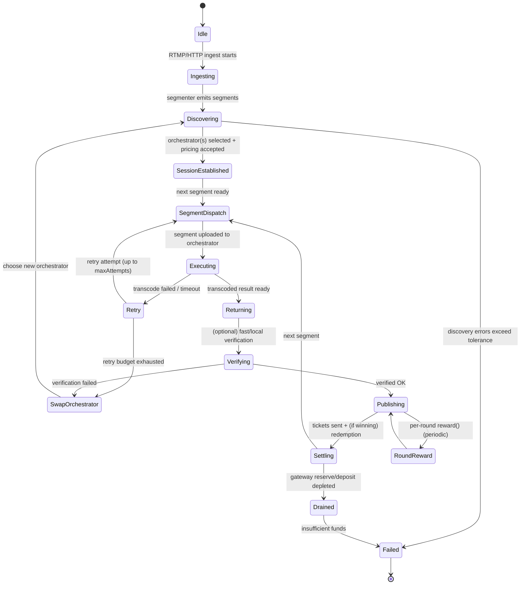

{/* codex-i18n: eyJraW5kIjoiY29kZXgtaTE4biIsInZlcnNpb24iOjEsInNvdXJjZVBhdGgiOiJ2Mi9hYm91dC9saXZlcGVlci1uZXR3b3JrL2pvYi1saWZlY3ljbGUubWR4Iiwic291cmNlUm91dGUiOiJ2Mi9hYm91dC9saXZlcGVlci1uZXR3b3JrL2pvYi1saWZlY3ljbGUiLCJzb3VyY2VIYXNoIjoiNzg5MmU2MmE4YWNlYTBjNDE5ODFlNjM5N2IxZTIyZDU1YWEyMGY3YmZjY2YyMGQxNGJiMGVkNWQ3ZWFhMTM3NyIsImxhbmd1YWdlIjoiZnIiLCJwcm92aWRlciI6Im9wZW5yb3V0ZXIiLCJtb2RlbCI6Im9wZW5haS9ncHQtb3NzLTIwYjpmcmVlIiwiZ2VuZXJhdGVkQXQiOiIyMDI2LTAyLTI2VDA3OjE2OjQ4LjA4NFoifQ== */}
import { DynamicTable } from "/snippets/components/layout/table.jsx"

{/* 
This page describes:
6. **Job Lifecycle**

   * Job submission
   * Assignment
   * Execution
   * Verification
   * Payment (ETH fees)
 */}

{/* ## Job Lifecycle
This view describes the end-to-end “compute job” as a state machine. Because Livepeer’s compute is segment-oriented, the lifecycle is modelled at the level of a stream session and per-segment processing, with payment settlement occurring continuously via tickets and periodically via reward calls. */}

### Narratif du cycle de vie
Un cycle de vie minimal, basé sur la source, est :
<Steps>
<Step title="Ingest and segmentation">
Ingest and segmentation: A Gateway receives an RTMP stream (docs provide explicit RTMP ingest examples) and produces segments to be processed. 
</Step>
<Step title="Discovery and selection">
Discovery and selection: The Gateway selects an Orchestrator set according to the node software’s discovery logic; operational failures here appear as discovery errors and orchestrator swaps. 
</Step>
<Step title="Price and session parameters">
Price and session parameters: Orchestrators advertise a price per pixel (Wei denominated) to gateways off-chain; orchestrators may auto-adjust price to compensate for ticket redemption overhead when gas is high. 
</Step>
<Step title="Segment dispatch and compute">
Segment dispatch and compute: The Gateway uploads segments; the Orchestrator executes transcoding/AI compute locally or delegates to attached transcoder processes. 
</Step>
<Step title="Result return and verification">
Result return and verification: Results are returned to the Gateway; verification may be performed (fast verification metrics exist and are explicitly named). Failures can trigger orchestrator swaps and retries. 
</Step>
<Step title="Continuous settlement">
Continuous settlement: The Gateway sends probabilistic payment tickets; the Orchestrator redeems winning tickets and the system tracks redemption errors and redeemed value. 
</Step>
<Step title="Periodic reward accounting">
Periodic reward accounting: Each round, orchestrators may call reward() as an Arbitrum transaction distributing minted rewards to itself and its delegators.
</Step>
</Steps>

### Diagramme de machine à états

### Événements et transitions
Le tableau ci-dessous associe les déclencheurs concrets aux transitions en utilisant des paramètres/mesures de configuration explicites lorsque c'est possible :

<DynamicTable
  headerList={["Event / Trigger", "Observable Evidence", "Transition", "Notes"]}
  itemsList={[
    { "Event / Trigger": "Stream starts", "Observable Evidence": "livepeer_stream_started_total increments", "Transition": "Idle → Ingesting", "Notes": "Metrics are defined in node docs." },
    { "Event / Trigger": "Discovery fails", "Observable Evidence": "livepeer_discovery_errors_total increments", "Transition": "Discovering → Failed", "Notes": "Exact selection algorithm is not fully specified in docs; treat as implementation detail." },
    { "Event / Trigger": "Segment transcode fails", "Observable Evidence": "livepeer_segment_transcode_failed_total / livepeer_transcode_retried", "Transition": "Executing → Retry", "Notes": "Retry budget controlled by maxAttempts (default 3)." },
    { "Event / Trigger": "Orchestrator swap mid-stream", "Observable Evidence": "livepeer_orchestrator_swaps", "Transition": "Retry/Verifying → SwapOrchestrator", "Notes": "Swap behaviour is observable though exact policy is not fully specified." },
    { "Event / Trigger": "Payment sent", "Observable Evidence": "livepeer_tickets_sent, livepeer_ticket_value_sent", "Transition": "Publishing → Settling", "Notes": "Deposit/reserve are explicitly surfaced per gateway." },
    { "Event / Trigger": "Reserve/deposit depleted", "Observable Evidence": "livepeer_gateway_reserve / livepeer_gateway_deposit low/zero", "Transition": "Settling → Drained", "Notes": "Some community guides discuss splitting ETH into deposit + reserve for testing; treat exact sizing as operator-specific." },
    { "Event / Trigger": "Ticket redemption error", "Observable Evidence": "livepeer_ticket_redemption_errors", "Transition": "Settling → (degraded)", "Notes": "Redemption reliability impacts realised revenue for Orchestrator." },
    { "Event / Trigger": "On-chain tx confirmation timeout", "Observable Evidence": "txTimeout (default 5 mins)", "Transition": "Settling/RoundReward → (retry/replace tx)", "Notes": "Transaction replacement knobs are defined in CLI options." },
    { "Event / Trigger": "Per-round reward minted/distributed", "Observable Evidence": "orchestrator reward service enabled", "Transition": "Publishing ↔ RoundReward", "Notes": "Docs describe default auto reward calls per round on Arbitrum." }
  ]}
  monospaceColumns={[1]}
/>

### Cycle de vie du travail (vidéo vs IA)

Livepeer prend en charge deux types de tâches principaux : le transcodage (conversion de format vidéo) et l’inférence IA (p. ex. transfert de style, génération). Chaque type suit un flux multipartite similaire mais avec des détails de pipeline différents.

Flux de travail du transcodage : Lorsqu’une passerelle (broadcaster) possède un flux en direct (ou une vidéo) à traiter, elle :
Register Funds: préfinance un contrat TicketBroker on‑chain avec ETH équivalent aux frais de travail attendus.
Select Orchestrator: hors‑chaîne, la passerelle interroge le réseau (via l’Explorer ou le signalement libp2p) pour trouver un orchestrateur actif dont le prix et la localisation correspondent à ses besoins.
Submit Segments: pour chaque segment vidéo (généralement quelques secondes), la passerelle envoie le segment brut à l’orchestrateur choisi avec un ticket de paiement probabiliste. Ce “ticket” est une promesse de paiement signée pour un tirage aléatoire (voir ci‑dessous).
Transcode: l’orchestrateur transmet le segment à son transcodeur connecté (le matériel GPU) qui génère les rendus demandés (p. ex. différents débits, formats).
Return Results: le transcodeur renvoie le(s) segment(s) encodé(s) à l’orchestrateur, qui les renvoie à la passerelle (ou à un flux de sortie).
Redeem Payments: périodiquement (ou à la fin du travail), l’orchestrateur soumet les tickets gagnants au TicketBroker on‑chain, les échange contre ETH. Un ticket gagnant est celui qui satisfait cryptographiquement un seuil aléatoire ; la plupart des tickets “perdent”, mais statistiquement, l’orchestrateur reçoit la totalité des frais gagnés au fil du temps.

The essential flow is:
flowchart LR
Gateway([Gateway (Broadcaster)]) -->|“video + ticket”| Orchestrator([Orchestrator Node])
Orchestrator -->|“assign chunk”| Transcoder([Transcoder GPU])
Transcoder -->|“renditions”| Orchestrator
Orchestrator -->|“encoded output”| Gateway
Gateway -->|“next segment / finalize”| Orchestrator

Example: une passerelle possède une vidéo en direct de 30 secondes. Elle dépose ETH dans le TicketBroker, puis diffuse les segments vers l’Orchestrateur A avec des tickets. Le transcodeur de l’Orchestrateur A produit plusieurs débits. L’Orchestrateur A envoie ensuite les tickets gagnants au contrat TicketBroker sur Arbitrum pour réclamer le paiement. Les frais (en ETH) sont automatiquement répartis selon les paramètres de partage des frais de l’orchestrateur, créditant les soldes des délégateurs.

Probabilistic Payments: Au lieu de payer segment par segment, les passerelles utilisent un schéma de ticket de loterie. Chaque ticket a une chance de “gagner” un prix fixe de ETH. Sur de nombreux segments, le paiement attendu équivaut au coût réel du travail. Cela protège les orchestrateurs des petites transactions on‑chain et de la variabilité du gas. (Les diffuseurs préfinancent suffisamment de ETH afin que les paiements attendus couvrent tous les tickets.)

AI Inference Workflow: Les tâches IA (p. ex. transfert de style en temps réel, génération vidéo) utilisent le même modèle de mise et de frais mais peuvent impliquer des pipelines de plusieurs modèles (p. ex. encodeur texte → décodeur image). Livepeer’s Cascade framework coordonne les flux de travail IA multi‑étapes : une passerelle envoie les données initiales et une invite, et les orchestrateurs appliquent séquentiellement les modèles jusqu’à la production d’une vidéo finale.

For example, Daydream (an AI app) captures webcam video, sends it through a StableDiffusion pipeline on the network, and returns the stylized video output.

Example (AI): Un utilisateur alimente un flux webcam dans Daydream (propulsé par Livepeer AI). La passerelle envoie les images plus une invite “style” à l’Orchestrateur B. B exécute une séquence de GPU (p. ex. amélioration → stylisation) et renvoie une vidéo éditée par IA en temps réel. Livepeer’s GPUs and networking are optimized for this low-latency pipeline.

The common pattern: Gateway 🡒 Orchestrator(s) 🡒 Transcoder/AI Model 🡒 Gateway. Smart contracts (TicketBroker for fees, JobsManager, etc.) mediate off-chain jobs and on-chain accounting.
