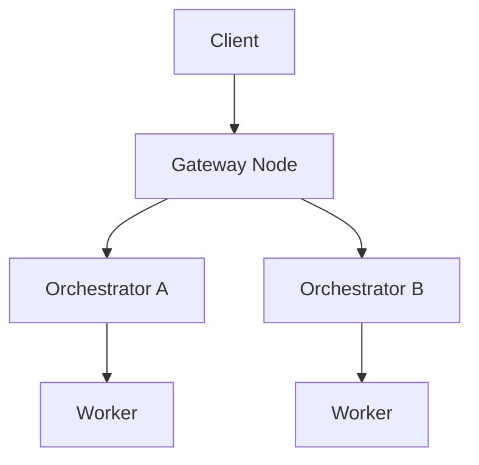

{/* codex-i18n: eyJraW5kIjoiY29kZXgtaTE4biIsInZlcnNpb24iOjEsInNvdXJjZVBhdGgiOiJ2Mi9hYm91dC9saXZlcGVlci1uZXR3b3JrL21hcmtldHBsYWNlLm1keCIsInNvdXJjZVJvdXRlIjoidjIvYWJvdXQvbGl2ZXBlZXItbmV0d29yay9tYXJrZXRwbGFjZSIsInNvdXJjZUhhc2giOiI2NTFlN2IwMWU1MWU0NWQzMzA4Zjc4M2FmNmU1ODMxYjdjNjY3ZjRhMTQxZTA3MTc5M2QyYWM4ZTdhZWM4Zjc5IiwibGFuZ3VhZ2UiOiJmciIsInByb3ZpZGVyIjoib3BlbnJvdXRlciIsIm1vZGVsIjoib3BlbmFpL2dwdC1vc3MtMTIwYjpmcmVlIiwiZ2VuZXJhdGVkQXQiOiIyMDI2LTAyLTI2VDA2OjQ5OjA0LjIxMFoifQ== */}
import { DynamicTable } from '/snippets/components/layout/table.jsx'
import { GotoCard, GotoLink } from '/snippets/components/primitives/links.jsx'

Le réseau Livepeer prend en charge un marché décentralisé dynamique pour le calcul multimédia en temps réel : transcodage et inférence IA. Contrairement aux plateformes d’infrastructure statiques, le marché ouvert de Livepeer introduit le temps réel **enchères, routage et tarification** des tâches à travers un pool mondial d’Orchestrateurs. Cette page décrit la couche du marché, les comportements des acteurs, l’économie des sessions, et comment cela se rapporte au protocole.

## Aperçu du marché

<DynamicTable
  headerList={["Element", "Role"]}
  itemsList={[
    { "Element": "Gateway / Client", "Role": "Submit job requests (stream, image, session intent)" },
    { "Element": "Gateway", "Role": "Matches requests to suitable Orchestrators" },
    { "Element": "Orchestrator", "Role": "Advertises availability, pricing, and capabilities" },
    { "Element": "Worker", "Role": "Executes compute task (Transcoder or AI worker)" },
    { "Element": "TicketBroker", "Role": "Receives tickets for ETH reward upon verified work (on-chain)" }
  ]}
/>

Ce marché est **continu** - Les Orchestrateurs sont toujours disponibles pour les sessions ; les Passerelles dirigent le travail hors chaîne sans frais de gaz en chaîne par tâche.

## Demande : charges de travail client

Les clients soumettent diverses tâches de calcul multimédia via les Passerelles :

<DynamicTable
  headerList={["Job type", "Example use case", "Payment style"]}
  itemsList={[
    { "Job type": "Live stream", "Example use case": "RTMP ingest for video platforms", "Payment style": "Per-minute ETH / credits" },
    { "Job type": "AI inference", "Example use case": "Frame-by-frame image-to-image generation", "Payment style": "Per-job (frame, token)" },
    { "Job type": "File transcode", "Example use case": "Static MP4 → web formats", "Payment style": "Batch credits" }
  ]}
/>

**Exemples d’API :** Livepeer Studio REST, passerelle POST job, interface ComfyStream (IA).

## Offre : nœuds Orchestrateur

Les Orchestrateurs annoncent :

- Spécifications matérielles (GPU/CPU, mémoire)
- Région et latence
- Charges de travail prises en charge (vidéo, IA, ou les deux)
- Prix par segment / image / jeton

Ils mettent à jour la disponibilité via des points de terminaison de battement gRPC ou REST côté passerelle. Les Passerelles utilisent ces informations pour diriger les tâches vers la meilleure correspondance.

## Logique de routage

La Passerelle note les Orchestrateurs selon :

- Latence à la source d’entrée
- Correspondance de charge de travail (vidéo vs IA)
- Coût par tâche
- Disponibilité et tampon de réessai

Les sessions sont **routées** hors chaîne vers la meilleure correspondance ; aucun gaz en chaîne n’est dépensé par tâche.

## Découverte des prix

L’implémentation actuelle de Livepeer utilise **tarification affichée** (définie par l’Orchestrateur), pas basée sur les enchères. Quelques notes :

- Les clients peuvent être associés au fournisseur compatible disponible le plus bas.
- Les prix peuvent varier selon :
  - Région (p. ex. US-Est vs EU-Central)
  - Charge GPU (les Orchestrateurs fortement IA peuvent facturer davantage)
  - Profil de qualité (p. ex. 1080p60 vs 720p30)

<Note>
In development: LIPs may introduce dynamic auction mechanisms for AI sessions (e.g. spot job auctions). See the [Forum LIPs](https://forum.livepeer.org/c/lips/) for proposals.
</Note>

## Paiements et règlement

**Clients** paient via :

- tickets ETH (régularisés en chaîne via le protocole `TicketBroker`)
- Solde de crédit (suivi hors chaîne par certaines Passerelles)

**Orchestrateurs :**

- Réclamer les tickets gagnants sur le `TicketBroker` sur Arbitrum
- Accumuler les gains ETH provenant du travail de transcodage/IA
- Réclamer les récompenses d’inflation (LPT) du `BondingManager` chaque ronde

## Extensions du système de crédit

Certaines Passerelles offrent une tarification conviviale en plus du ETH direct :

<DynamicTable
  headerList={["Currency", "Top-up methods", "Denomination example"]}
  itemsList={[
    { "Currency": "USD", "Top-up methods": "Credit card, USDC", "Denomination example": "Per minute or per job" },
    { "Currency": "ETH", "Top-up methods": "MetaMask, smart wallet", "Denomination example": "Per job or per segment" }
  ]}
/>

Les orchestrateurs peuvent fixer le prix en équivalent USD via une cotation basée sur un oracle lorsqu'elle est prise en charge.

## Observabilité

Chaque session peut être enregistrée avec :

- Latence jusqu'à la première réponse
- Nombre de tentatives
- ID de l'orchestrateur et région
- Prix payé (ETH ou crédit)

Les indexeurs du futur marché peuvent exposer des statistiques de flux de travail en temps réel pour le réseau.

## Frontières protocole–marché

<DynamicTable
  headerList={["Layer", "Description", "Example"]}
  itemsList={[
    { "Layer": "Protocol", "Description": "Verifies work and pays ETH & LPT rewards", "Example": "TicketBroker, BondingManager" },
    { "Layer": "Marketplace", "Description": "Matches jobs to compute providers", "Example": "Gateway load balancer, routing" },
    { "Layer": "Interface layer", "Description": "Abstracts API, SDK, session negotiation", "Example": "Livepeer Studio SDK, Daydream API" }
  ]}
/>

## Mises à jour futures (LIPs proposées)

- **LIP-78:** Enchères de jobs Spot
- **LIP-81:** Passerelle de synchronisation crédit-vers-protocole
- **LIP-85:** Influence du staking de l'orchestrateur sur le routage des jobs

Pour le statut actuel, voir le [Forum LIPs](https://forum.livepeer.org/c/lips/) et [Feuille de route technique](../resources/technical-roadmap).

## Voir aussi

- [Cycle de vie du job](./job-lifecycle) - Flux de bout en bout de l'ingestion au règlement
- [Acteurs](./actors) - Rôles de Gateway, Orchestrateur et Déléguant
- [Livepeer Vue d'ensemble du protocole](../livepeer-protocol/overview) - Contrats on-chain et incitations
- [Contrats blockchain](../resources/blockchain-contracts) - TicketBroker et autres adresses de contrat

## Références

- [Livepeer Docs Studio / Gateway](https://livepeer.studio/docs)
- [TicketBroker (protocole)](https://github.com/livepeer/protocol/tree/master/contracts/job)
- [Configuration du nœud orchestrateur](/v2/fr/orchestrators/orchestrators-portal)
- [Forum : propositions LIP](https://forum.livepeer.org/c/lips/)
- [Livepeer IA (ComfyStream, blog)](https://blog.livepeer.org/real-time-ai-comfyui)
