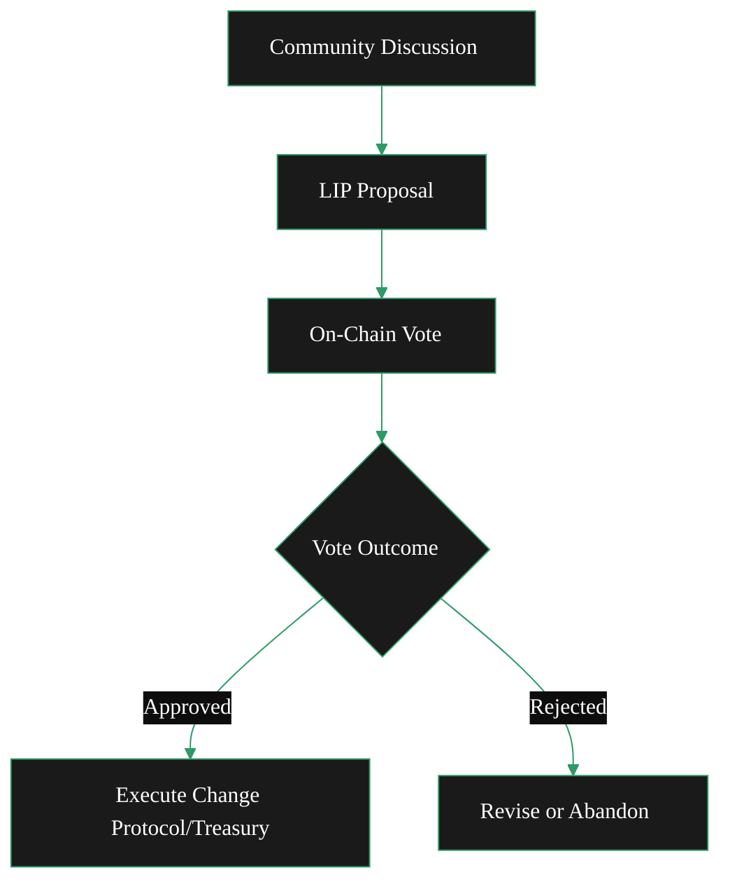

{/* codex-i18n: eyJraW5kIjoiY29kZXgtaTE4biIsInZlcnNpb24iOjEsInNvdXJjZVBhdGgiOiJ2Mi9hYm91dC9saXZlcGVlci1wcm90b2NvbC9nb3Zlcm5hbmNlLW1vZGVsLm1keCIsInNvdXJjZVJvdXRlIjoidjIvYWJvdXQvbGl2ZXBlZXItcHJvdG9jb2wvZ292ZXJuYW5jZS1tb2RlbCIsInNvdXJjZUhhc2giOiI3NWNhMGVjNjYyOWU2NjBlZTk5Y2QyZWQ5ZGM1NTE1M2IzZWJlMGMzNGM4N2E2OGE1MmM1M2I2ZWM1OWRkYzgwIiwibGFuZ3VhZ2UiOiJmciIsInByb3ZpZGVyIjoib3BlbnJvdXRlciIsIm1vZGVsIjoib3BlbmFpL2dwdC1vc3MtMjBiOmZyZWUiLCJnZW5lcmF0ZWRBdCI6IjIwMjYtMDItMjZUMTI6NTE6MTIuODcxWiJ9 */}
import { CardTitleTextWithArrow } from '/snippets/components/primitives/text.jsx'
import { AccordionTitleWithArrow } from '/snippets/components/primitives/text.jsx'
import { Quote } from '/snippets/components/display/quote.jsx'
import { CustomDivider } from '/snippets/components/primitives/divider.jsx'
import { LinkArrow } from '/snippets/components/primitives/links.jsx'

{/* 
This page describes:
4. **Governance**

   * LIPs
   * Voting
   * Upgrade process
   * Foundation role
   * Advisory boards 

---BUT ONLY BRIEFLY -> POINTS TO OTHER SECTIONS
*/}

   <CardTitleTextWithArrow icon="github" href="https://github.com/livepeer/lips" horizontal> livepeer-lips </CardTitleTextWithArrow>
   {/* <Card title="On-Chain Voting Explorer" icon="check-to-slot" href="https://explorer.livepeer.org/voting" horizontal arrow /> */}

<Quote> 
Livepeer is a community-driven protocol, where token holders have the ability to vote on proposals to upgrade protocol mechanisms or to spend from the treasury.
Voting is conducted on-chain via the Livepeer Governor contract, with the protocol contracts enforcing the outcome.
</Quote>
<CustomDivider style={{margin: 0, marginBottom: "-2rem" }} />

## Gouvernance 
Livepeer s'engage à une gouvernance open-source, transparente et communautaire.
Il utilise un modèle hybride de gouvernance on‑chain/off‑chain qui combine discussion communautaire ouverte avec des votes on‑chain contraignants.
Ce modèle garantit que la communauté (détenants de jetons) contrôle collectivement les mises à jour et les dépenses, le protocole appliquant le résultat.

<Accordion title={
ELI5: Governance Model
} icon="user-crown">
   Imagine a community garden run by people who own shares (tokens).

   - **Proposing a Change:** If someone has 100 share tokens, they can suggest a new rule (like “we should plant carrots”). They put 100 tokens in a safe place while the idea is considered.
   - **Voting:** Over the next month (30 days), everyone with tokens decides yes or no. If at least 33 out of every 100 token shares vote, and more than half vote “yes,” the idea becomes official. The 100 tokens go back to the proposer.
   - **Delegating Votes:** If you’ve given your shares to a friend to manage (delegation), you still get to vote because your votes travel with your shares.
   
   Rules are set by token holders: stake some tokens to propose, everyone votes, and a rule only passes if enough people say yes.
</Accordion>

### Fonctions de gouvernance
La gouvernance dans Livepeer sert deux fonctions principales :
- **Mises à jour du protocole**: Propositions pour mettre à jour le protocole.
- **Dépenses du trésor**: Propositions pour dépenser du trésor.

### Processus de gouvernance

La gouvernance s'applique à la fois au protocole et au trésor. Les mises à jour du protocole et les changements de paramètres sont formalisés sous forme de LIPs.
Après vérification communautaire, un vote on‑chain est organisé. Le vote pondéré par la participation garantit que les délégations plus importantes ont une voix proportionnelle.

<Steps>
   <Step title="Idea Phase: Community Discussion" icon="comment-dots">
      Proposals typically start with community discussion to gather feedback on the <LinkArrow label="Livepeer Forum" href="https://forum.livepeer.org/c/lips/18" newline={false} />.
   </Step>
   <Step title="Draft Phase: Request For Feedback (RFP)" icon="comments">
      Community members post pre-proposals (requests for feedback) on the forum.
   </Step>
   <Step title="Proposal: Livepeer Improvement Proposal (LIP)" icon="file-pen">
      Once an idea is refined, an official proposal is drafted in the form of a <LinkArrow label="Livepeer Improvement Proposal (LIP)" href="https://github.com/livepeer/LIPs" newline={ false} />
      {/* Proposals are first discussed and drafted off-chain - in the form of a <LinkArrow label="Livepeer Improvement Proposal (LIP)" href="https://github.com/livepeer/LIPs" newline={false} />.
        The forum is the primary place for discussion: <LinkArrow label="Livepeer Forum" href="https://forum.livepeer.org/c/lips/18" newline={false} /> */}
   </Step>
   <Step title="Proposal Submission: On-Chain" icon="arrow-up-right-from-square">
      Once a LIP is finalized, anyone with ≥100 LPT can submit it on-chain to the [Governor](https://github.com/livepeer/protocol/blob/e8b6243c/contracts/governance/Governor.sol) contract for a vote. This stake is large by design to ensure only serious proposals advance and is returned if the proposal passes.
   </Step>
   <Step title="Proposal Voting: On-Chain" icon="link">
      After submission, a voting period of 30 rounds (≈3.75 days) opens where eligible voters (Orchestrators and their delegated LPT) cast votes. Anyone with 1+ LPT staked can vote.
        The on-chain proposals and votes can be found on <LinkArrow label="Livepeer Explorer" href="https://explorer.livepeer.org/voting" newline={false} />.
   </Step>
   <Step title="Proposal Voting: Details" icon="ballot">
      Voting power is driven by LPT **stake-weighted voting**. If an orchestrator has X LPT staked (including delegated stake), that weight applies to its vote. 
        Note: Delegators can withdraw their delegation temporarily to vote separately if they disagree with their operator.
   </Step>
   <Step title="Proposal Voting: Quorum & Approval" icon="people">
      A proposal passes only if at least **33% of total staked LPT participates (quorum)** and **>50% of the votes** cast are “For”. These thresholds prevent minority-rule.
   </Step>
   <Step title="Proposal Execution: On-Chain" icon="check-to-slot">
      If a proposal passes, the Governor automatically executes the proposal’s instructions (changing a contract parameter or sending treasury funds).
   </Step>
</Steps>

### Livepeer Propositions d'amélioration (LIPs)
Livepeer Propositions d'amélioration (LIPs) sont des documents de conception formels ([hébergé sur GitHub](https://github.com/livepeer/LIPs)) qui décrivent les mises à niveau du protocole, similaires à celles d'Ethereum[EIPs](https://eips.ethereum.org/EIPS/eip-1). 

*Les LIPs les plus impactants incluent :*
- **Création du Trésor**: [LIP-89](https://github.com/livepeer/LIPs/blob/main/LIPs/LIP-0089.md) et [LIP-92](https://github.com/livepeer/LIPs/blob/main/LIPs/LIP-0092.md) qui a établi le [Trésor](./treasury) et définir l'allocation des revenus on-chain (en envoyant 10% des nouvelles émissions de LPT dans le trésor).
- **Confluence - Migration Arbitrum**: [LIP-73](https://github.com/livepeer/LIPs/blob/main/LIPs/LIP-0073.md) qui a complété la migration du protocole d'Ethereum vers Arbitrum afin de réduire les coûts de transaction et d'augmenter le débit.
- **Politique monétaire**: [LIP-34](https://github.com/livepeer/LIPs/blob/main/LIPs/LIP-0034.md), [LIP-35](https://github.com/livepeer/LIPs/blob/main/LIPs/LIP-0035.md), [LIP-40](https://github.com/livepeer/LIPs/blob/main/LIPs/LIP-0040.md), [LIP-83](https://github.com/livepeer/LIPs/blob/main/LIPs/LIP-0083.md), et [LIP-100](https://github.com/livepeer/LIPs/blob/main/LIPs/LIP-0100.md) qui ont façonné la politique monétaire du protocole, y compris les calculs d'inflation, les ajustements et les limites.
- **Cadre de gouvernance**: [LIP-15](https://github.com/livepeer/LIPs/blob/main/LIPs/LIP-0015.md), [LIP-16](https://github.com/livepeer/LIPs/blob/main/LIPs/LIP-0016.md), [LIP-19](https://github.com/livepeer/LIPs/blob/main/LIPs/LIP-0019.md), [LIP-25](https://github.com/livepeer/LIPs/blob/main/LIPs/LIP-0025.md), [LIP-69](https://github.com), [LIP-19](https://github.com/livepeer/LIPs/blob/main/LIPs/LIP-0019.md) et [LIP-25](https://github.com/livepeer/LIPs/blob/main/LIPs/LIP-0025.md) qui a établi le cadre de gouvernance décentralisé actuel.

*LIPs clés par catégorie :*
<Accordion title="Governance & Process" icon="building-columns">
**Governance & Process:**
- [LIP-1](https://github.com/livepeer/LIPs/blob/main/LIPs/LIP-0001.md) established the initial on‑chain governance process (Process, Purpose and Guidelines)
- [LIP-15](https://github.com/livepeer/LIPs/blob/main/LIPs/LIP-0015.md) established the polling system for LIP adoption.
- [LIP-69](https://github.com/livepeer/LIPs/blob/main/LIPs/LIP-0069.md) established the stake-based polling system & implemented stake-weighted voting.
- [LIP-19](https://github.com/livepeer/LIPs/blob/main/LIPs/LIP-0019.md) established the core governance mechanism (poll-based) for the Livepeer protocol.
- [LIP-25](https://github.com/livepeer/LIPs/blob/main/LIPs/LIP-0025.md) established the technical foundation for protocol upgrades.
</Accordion> 
<Accordion title="Protocol Migration (Confluence)" icon="arrow-down-up-across-line">
- [LIP-73](https://github.com/livepeer/LIPs/blob/main/LIPs/LIP-0073.md): Confluence - Arbitrum One Migration (Final) - Complete L1→L2 migration LIP-73.md:1-256
- [LIP-74](https://github.com/livepeer/LIPs/blob/main/LIPs/LIP-0074.md): L1 Minting and L2 Staking (Abandoned) - Alternative migration approach
</Accordion>
<Accordion title="Treasury Launch & System" icon="bank">
- [LIP-89](https://github.com/livepeer/LIPs/blob/main/LIPs/LIP-0089.md): Livepeer Treasury (Final) - Onchain treasury for public goods LIP-89.md:1-139
- [LIP-90](https://github.com/livepeer/LIPs/blob/main/LIPs/LIP-0090.md): Funding Entity Conversations (Final)
- [LIP-91](https://github.com/livepeer/LIPs/blob/main/LIPs/LIP-0091.md): Livepeer Treasury Bundle (Final)
- [LIP-92](https://github.com/livepeer/LIPs/blob/main/LIPs/LIP-0092.md): Treasury Contribution Percentage (Final) - 10% of inflation to treasury LIP-92.md:1-150
</Accordion>
<Accordion title="Economic Parameters & Monetary Policy" icon="coins">
**Economic Parameters & Monetary Policy**
- [LIP-34](https://github.com/livepeer/LIPs/blob/main/LIPs/LIP-0034.md): InflationChange Parameter Update (Final) - Slowed inflation adjustment rate
- [LIP-35](https://github.com/livepeer/LIPs/blob/main/LIPs/LIP-0035.md): inflationChange Calculation and Parameter Update (Final) - Bundle with LIP-40
- [LIP-40](https://github.com/livepeer/LIPs/blob/main/LIPs/LIP-0040.md): Minter Math Precision (Final) - Enhanced precision for percentage calculations
- [LIP-83](https://github.com/livepeer/LIPs/blob/main/LIPs/LIP-0083.md): roundLength Parameter Update (Final) - Adjusted for Ethereum Merge
- [LIP-100](https://github.com/livepeer/LIPs/blob/main/LIPs/LIP-0100.md): Introduction of Inflation Bounds (Draft) - Added ceiling/floor to inflation
</Accordion>
<Accordion title="Core Protocol Features" icon="cubes-stacked">
- [LIP-3](https://github.com/livepeer/LIPs/blob/main/LIPs/LIP-0003.md): Ability To Update Registered Solver in LivepeerVerifier (Final)
- [LIP-8](https://github.com/livepeer/LIPs/blob/main/LIPs/LIP-0008.md): Enable Partial Unbonding (Final)
- [LIP-9](https://github.com/livepeer/LIPs/blob/main/LIPs/LIP-0009.md): Service Registry (Final) - Service endpoint discovery
- [LIP-11](https://github.com/livepeer/LIPs/blob/main/LIPs/LIP-0011.md): Bond Event Details (Final)
</Accordion>
<Accordion title="Earnings & Claiming" icon="money-check-dollar">
- [LIP-36](https://github.com/livepeer/LIPs/blob/main/LIPs/LIP-0036.md): Cumulative Earnings Claiming (Final) - O(1) gas cost for earnings claims
- [LIP-52](https://github.com/livepeer/LIPs/blob/main/LIPs/LIP-0052.md): Snapshot For Claiming Earnings (Final) - Merkle tree for historical claims
</Accordion>

### Contrats On-Chain
Le protocole Livepeer utilise un contrat Governor personnalisé qui hérite de celui d'OpenZeppelin [Governor](https://docs.openzeppelin.com/contracts/4.x/api/governance#governor) et [GovernorSettings](https://docs.openzeppelin.com/contracts/4.x/api/governance#governorsettings) contrats. 

Les règles clés appliquées sont :

- **Période de vote**: 30 tours (~3,75 jours)
- **Quorum**: 33 % de tous les LPT mis en jeu
- **Seuil**: Majorité (>50 %) des votes exprimés
- **Délai de vote**: 1 tour

### Rôles clés & parties prenantes

**[Trésorerie en chaîne](./treasury)**: Une partie (10 %) des émissions de jetons est versée dans une trésorerie communautaire (créée elle‑même par les LIPs).
Cette trésorerie existe pour financer des projets à l’échelle de l’écosystème (biens publics) au bénéfice de l’ensemble du réseau.
Le consensus social de Livepeer est que les fonds de la trésorerie doivent principalement être alloués à **SPEs**, qui les déploient ensuite vers des initiatives spécifiques.

**[Livepeer Fondation](/v2/home/about-livepeer/ecosystem#livepeer-foundation)**: La Fondation favorise la stratégie à long terme et la coordination de l’écosystème.
Elle établit des conseils consultatifs, publie des feuilles de route et coordonne le travail de **[Entités à usage spécial (SPEs)](/v2/home/about-livepeer/ecosystem#special-purpose-entities)** pour exécuter le développement de base, la recherche, les propositions en chaîne et la vision à long terme.

La Fondation peut également gérer les décaissements de trésorerie, soutenir les programmes de subventions et maintenir les biens publics du réseau.
Cependant, alors que la Fondation facilite la participation communautaire, l'autorité ultime repose sur la communauté via les votes en chaîne des détenteurs de LPT.

### Visualiser le processus de gouvernance
Ce diagramme montre le processus de gouvernance : le brainstorming communautaire conduit à une soumission de LIP, qui déclenche un vote sur la chaîne. Un vote réussi exécute le changement, tandis qu'un vote rejeté renvoie la proposition pour révision.

## Ressources connexes
<Columns cols={2}>
   <Card title="Governance Model" href="/v2/about/livepeer-protocol/governance-model" icon="ballot-check" arrow > Read more about the technical details of the governance model. </Card> 
   <Card title="Delegate LPT" href="https://github.com/livepeer/LIPs" icon="github" arrow > Find out more about Delegating LPT. </Card>
</Columns>

{/* ## Protocol Proposals

What can be proposed? 
What are the types?
Who is involved?
How does it work?

### On-chain governance
Livepeer’s governance is fully on-chain and stakeholder-driven. 
- Any LPT holder can propose protocol changes or treasury spending by staking 100 LPT. 
- All staked LPT holders (including Delegators via their Orchestrators) can vote on proposals. 
- Votes last for 30 rounds (~30 days). 
- For a proposal to pass, at least 33% of all staked tokens must participate (quorum), and a majority (>50%) of votes must be in favour. 
- If a proposal passes, the change is executed automatically by the smart contracts (where possible). This means the community (token holders) collectively controls upgrades and spending, with the protocol enforcing the outcome. */}

{/* Livepeer is committed to open-source, transparent, community governance.

Quick Links

Discord: [https://discord.com/channels/423160867534929930/686685097935503397](https://discord.com/channels/423160867534929930/686685097935503397)

RFPs */}
