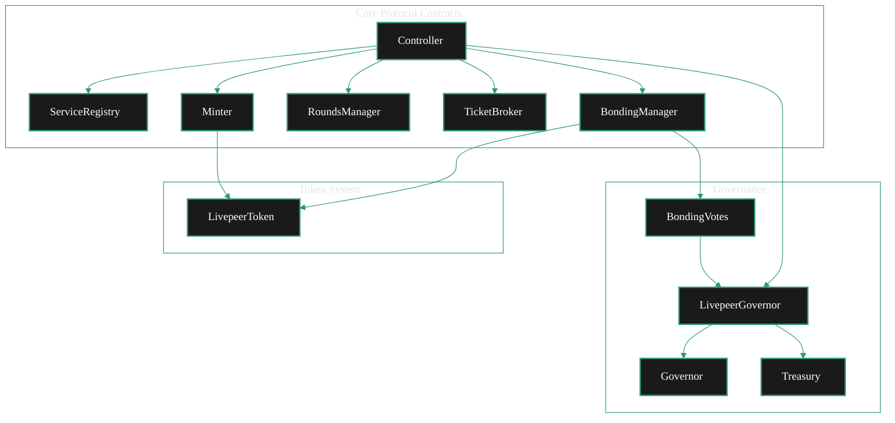
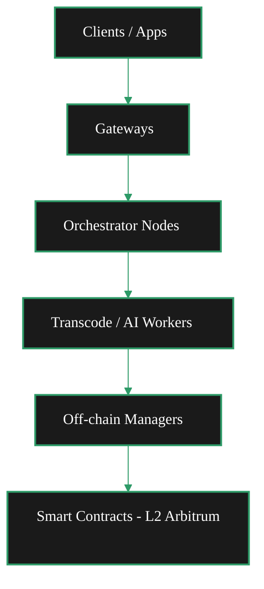
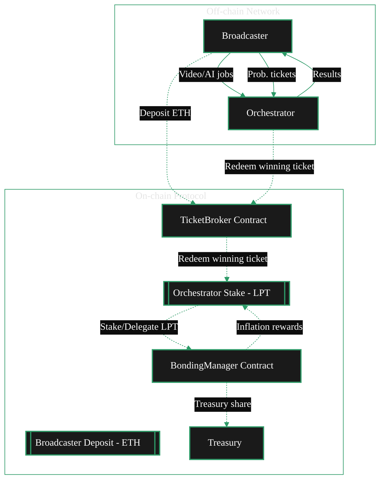

{/* codex-i18n: eyJraW5kIjoiY29kZXgtaTE4biIsInZlcnNpb24iOjEsInNvdXJjZVBhdGgiOiJ2Mi9hYm91dC9saXZlcGVlci1wcm90b2NvbC90ZWNobmljYWwtYXJjaGl0ZWN0dXJlLm1keCIsInNvdXJjZVJvdXRlIjoidjIvYWJvdXQvbGl2ZXBlZXItcHJvdG9jb2wvdGVjaG5pY2FsLWFyY2hpdGVjdHVyZSIsInNvdXJjZUhhc2giOiJmNDJjMTIwYzkwNWZkNmU0ZmU3NTQxZmE5ZWJiMTMzZjJmMzU1MmEyNDNhZGFhOGRiMDcyYmI1MGZhYTMwNTRiIiwibGFuZ3VhZ2UiOiJmciIsInByb3ZpZGVyIjoib3BlbnJvdXRlciIsIm1vZGVsIjoib3BlbmFpL2dwdC1vc3MtMjBiOmZyZWUiLCJnZW5lcmF0ZWRBdCI6IjIwMjYtMDItMjZUMTI6NTU6NDcuMzI5WiJ9 */}
{/* This page describes:
7. **Technical Architecture**

   * Smart contracts
   * On-chain components
   * How protocol interacts with network 

How in depth though?
*/}

import { GotoCard, GotoLink } from '/snippets/components/primitives/links.jsx'
import { Image } from '/snippets/components/display/image.jsx'
import { ScrollableDiagram } from '/snippets/components/display/zoomable-diagram.jsx'
import { DynamicTable } from '/snippets/components/layout/table.jsx'
import { CardTitleTextWithArrow } from '/snippets/components/primitives/text.jsx'
import { CustomDivider } from '/snippets/components/primitives/divider.jsx'
import { Quote } from '/snippets/components/display/quote.jsx'

  <CardTitleTextWithArrow icon="github" horizontal href="https://github.com/livepeer/protocol"> Livepeer Protocol </CardTitleTextWithArrow> 

<CustomDivider style={{margin: 0, marginBottom: "-1rem"}} />

<Quote>

</Quote>

Notes
- La blockchain gère les incitations économiques et la coordination, tandis que `go-livepeer` les nœuds réseau gèrent le travail intensif en calcul du traitement des médias et de l'inférence IA.
- Les contrats sur chaîne vérifient le travail et gèrent les paiements, mais n'effectuent pas le transcodage réel / l'inférence IA
- `go-livepeer` les nœuds communiquent avec la blockchain pour soumettre des preuves de travail et réclamer des récompenses
- Cette architecture permet au protocole de se développer tout en maintenant la sécurité économique grâce à la vérification sur chaîne

---

{/* <Warning> this is the NETWORK not the protocol </Warning>
The [go-livepeer](https://github.com/livepeer/go-livepeer) architecture is organized around three node types that work together to form a decentralised media processing network:

- Gateway: Accepts video streams and AI jobs, routes work to orchestrators
- Orchestrator: Manages transcoding tasks, pays out rewards
- Worker Nodes: (Transcoder & AI Worker) Performs video transcoding or AI inference work

<Image src="/snippets/assets/domain/01_ABOUT/ProtocolNodeDiagram.png" alt="System Overview" caption="Livepeer System Overview" height="500px"/> */}

{/* Livepeer is a decentralized infrastructure protocol that allows users to upload, transcode, and serve video content & run AI pipelines. It operates on a network with different node types including Gateways (formerly Broadcasters), Orchestrators, and Transcoders. The protocol uses smart contracts deployed on Ethereum Mainnet and Arbitrum Mainnet, with the native token LPT (Livepeer Token). Since the Confluence upgrade, the protocol primarily runs on Arbitrum Mainnet.

The core components of the Livepeer node implementation work together to provide a distributed, scalable video transcoding platform. Each component has specific responsibilities:
- LivepeerNode: The central structure representing a node in the network
- LivepeerServer: Handles media operations and HTTP interfaces
- Orchestrator: Manages transcoding tasks and payment processing
- BroadcastSessionsManager: Coordinates with multiple orchestrators
- RemoteTranscoderManager: Distributes work to transcoders
- RPC System: Enables communication between different node types

These components implement the Livepeer protocol, allowing video to be efficiently transcoded in a decentralized network. */}

## Architecture du protocole

<ScrollableDiagram title="Livepeer Protocol Contract Architecture" maxHeight="600px">

</ScrollableDiagram>

## Aperçu du système

Livepeer peut être modélisé comme une architecture en couches:

{/* <ScrollableDiagram title="Livepeer System Overview" maxHeight="500px">

</ScrollableDiagram> */}

<DynamicTable
  headerList={["Layer", "Role"]}
  itemsList={[
    { "Layer": "Client Layer", "Role": "Streams or submits jobs via Application Layer (eg. CLI, SDK, API)" },
    { "Layer": "Gateway Layer", "Role": "Receives jobs, initiates session routing" },
    { "Layer": "Orchestrator Layer", "Role": "Bids on sessions, runs compute nodes" },
    { "Layer": "Worker Layer", "Role": "Performs transcoding / AI inference" },
    { "Layer": "Off-chain Manager", "Role": "Handles bonding sync, ticket validation" },
    { "Layer": "L2 Contracts (ARB)", "Role": "TicketBroker, BondingManager, Delegator claims, reward withdrawal" },
    { "Layer": "L1 Contracts (ETH)", "Role": "LivepeerToken, BridgeMinter - token issuance & bridging only" },
  ]}
/>

## Diagramme du système

<ScrollableDiagram title="Livepeer Protocol System Diagram" maxHeight="600px">

</ScrollableDiagram>

## Modèle d'acteur et d'incitation 

## Modèle de confiance et de vérification

## Cycle de vie du travail

## Gouvernance & Trésorerie

## Références de protocole

<Note>Aggregate from from internal Livepeer Notions, Prev site & deepwiki</Note>

{/* 
### A/B/C TEST LAYOUTS

**Expandable**

  <Expandable title="All References" defaultOpen={true}>
    <ResponseField name="Contract Addresses">
        <GotoLink
          label="Contract Addresses"
          text="See all current contract addresses for the deployed protocol"
          relativePath="../../../resources/references/contract-addresses.mdx"
        />
    </ResponseField>

    <ResponseField name="is_over_21" type="boolean">
      Whether the user is over 21 years old
    </ResponseField>

  </Expandable>

**Steps**

<Steps>
  <Step title="Contract Addresses" icon="code">
    <GotoLink
      label="Contract Addresses"
      text="See all current contract addresses for the deployed protocol"
      relativePath="../../../resources/references/contract-addresses.mdx"
    />
  </Step>
  <Step title="Contract Addresses" icon="home">
    See all current contract addresses for the deployed protocol
  </Step>
  <Step title="Contract Addresses" icon="book">
    See all current contract addresses for the deployed protocol
  </Step>
</Steps>

**Basic Link**

<GotoLink
  label="Contract Addresses"
  text="See all current contract addresses for the deployed protocol"
  relativePath="../../../resources/references/contract-addresses.mdx"
/>

**Link Cards**

<GotoCard
  label="Contract Addresses"
  text="See all current contract addresses for the deployed protocol"
  relativePath="../../../resources/references/contract-addresses.mdx"
/>

### Links

<Warning>To remove... notes only</Warning>
Internal

- [Reward Calc](https://www.notion.so/livepeer/Livepeer-Protocol-Reward-Calculation-2320a34856878026adb0e7bcb7521661)
- [Reward Accumulation]("https://www.notion.so/livepeer/Livepeer-Rewards-Accumulation-Mechanism-23e0a348568780199f26f8cbc3c2d231")
- [Migration Report]("https://www.notion.so/livepeer/Livepeer-L1-L2-Migration-Report-Complete-Technical-Overview-2b10a348568780a28b59df9d8710bff9")

Docs Current

- */}
