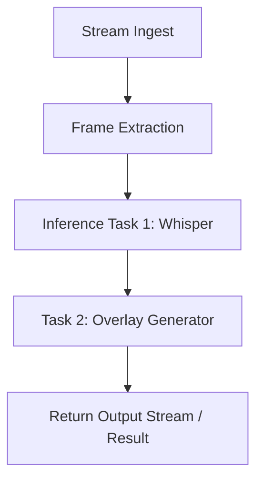

{/* codex-i18n: eyJraW5kIjoiY29kZXgtaTE4biIsInZlcnNpb24iOjEsInNvdXJjZVBhdGgiOiJ2Mi9kZXZlbG9wZXJzL2FpLXBpcGVsaW5lcy9vdmVydmlldy5tZHgiLCJzb3VyY2VSb3V0ZSI6InYyL2RldmVsb3BlcnMvYWktcGlwZWxpbmVzL292ZXJ2aWV3Iiwic291cmNlSGFzaCI6Ijc4MWU0NWEyYmY3OWE4ODljMTc4OWE4NDNlZTcxMjY1MTU3NDNlMWNlZTJjMDY3MGQyZGJiZDEyMzgyMzkwYTAiLCJsYW5ndWFnZSI6ImZyIiwicHJvdmlkZXIiOiJvcGVucm91dGVyIiwibW9kZWwiOiJxd2VuL3F3ZW4tdHVyYm8iLCJnZW5lcmF0ZWRBdCI6IjIwMjYtMDItMjdUMTI6MjU6MTcuODAzWiJ9 */}
import { DynamicTable } from '/snippets/components/layout/table.jsx'

Livepeer AI Pipelines permettent d'exécuter des tâches d'inférence vidéo personnalisables et composables sur une infrastructure GPU distribuée. Alimenté par le réseau Livepeer et soutenu par des travailleurs hors chaîne comme ComfyStream, le système rend facile le déploiement d'IA vidéo à grande échelle.

## En bref

- **Pipelines** sont une ou plusieurs tâches d'inférence (par exemple, Whisper, transfert de style, détection) exécutées séquentiellement sur les images vidéo.
- **Gateways** dirigent les tâches vers des **Orchestrators** et **workers**; le protocole gère le paiement et la coordination.
- **BYOC** (Apportez votre propre calcul) et **ComfyStream** sont deux façons de faire fonctionner ou d'étendre des pipelines avec vos propres modèles et nœuds.

## Cas d'utilisation

- Reconnaissance vocale (Whisper)
- Transfert de style ou filtres (Stable Diffusion)
- Suivi et détection d'objets (YOLO)
- Segmentation vidéo (segment-anything)
- Masquage ou floutage du visage
- BYOC (Apportez votre propre calcul)

## Qu'est-ce qu'une pipeline ?

Une pipeline IA se compose d'une ou plusieurs tâches exécutées séquentiellement sur des images vidéo en direct. Chaque tâche peut :

- Modifier la vidéo (par exemple, ajouter des superpositions)
- Générer des métadonnées (par exemple, transcript, boîtes englobantes)
- Transmettre les résultats à un autre nœud

Livepeer gère l'ingestion du flux, l'extraction des images et l'envoi des tâches. Les nœuds exécutent l'inférence réelle.



## Architecture

### Passerelle et travailleurs

- **Orchestrateurs**envoyer des tâches d'inférence dans la file d'attente et exécuter (ou déléguer à) des travailleurs.
- **Travailleurs**s'abonner aux types de tâches (par exemple, whisper-transcribe) et les exécuter.
- **Portails**router les tâches des clients vers des nœuds compatibles. Cela se fait hors chaîne ; le protocole (Arbitrum) gère les paiements et les récompenses.

### Types de travailleurs

<DynamicTable
  headerList={["Type", "Description", "Example models"]}
  itemsList={[
    { "Type": "Whisper Worker", "Description": "Speech-to-text inference", "Example models": "whisper-large" },
    { "Type": "Diffusion Worker", "Description": "Image-to-image or overlay generation", "Example models": "sdxl, controlnet" },
    { "Type": "Detection Worker", "Description": "Bounding box or class prediction", "Example models": "YOLOv8" },
    { "Type": "Pipeline Worker", "Description": "Chained tasks via ComfyStream or custom", "Example models": "custom-pipeline" }
  ]}
/>

## Format de définition de pipeline

Les tâches peuvent être des objets de tâche basés sur JSON. Exemple :

```json
{
  "streamId": "abc123",
  "task": "custom-pipeline",
  "pipeline": [
    { "task": "whisper-transcribe", "lang": "en" },
    { "task": "segment-blur", "target": "faces" }
  ]
}
```

Les workers peuvent accepter :

- Tâches au format JSON via la passerelle
- gRPC par image (faible latence)
- Téléchargement des résultats via un webhook

## Apportez votre propre calcul (BYOC)

Vous pouvez utiliser vos propres nœuds GPU pour exécuter des tâches d'inférence :

1. Cloner [ComfyStream](https://github.com/livepeer/comfystream) ou implémenter l'API de traitement.
2. Ajoutez des plugins pour Whisper, ControlNet ou d'autres modèles.
3. Inscrivez votre nœud avec la passerelle (et éventuellement sur la chaîne).

Voir [BYOC](./byoc) pour un guide complet de configuration.

## Voir également

- [BYOC](./byoc) - Exécutez vos propres travailleurs IA et enregistrez-vous sur le réseau
- [ComfyStream](./comfystream) - Pipelines basés sur ComfyUI et intégration du Gateway
- [Livepeer IA (aperçu)](/v2/developers/ai-inference-on-livepeer/overview) - Aperçu du produit et cas d'utilisation
- [Architecture technique du réseau](/v2/fr/about/livepeer-network/technical-architecture) - Gateway, Orchestrator, et protocole

## Ressources

- [GitHub ComfyStream](https://github.com/livepeer/comfystream)
- [Livepeer Docs AI Studio](https://livepeer.studio/docs/ai)
- [Forum : exemples de pipelines](https://forum.livepeer.org/t/example-pipelines)
- [Explorateur](https://explorer.livepeer.org) - Statistiques du réseau et du nœud
