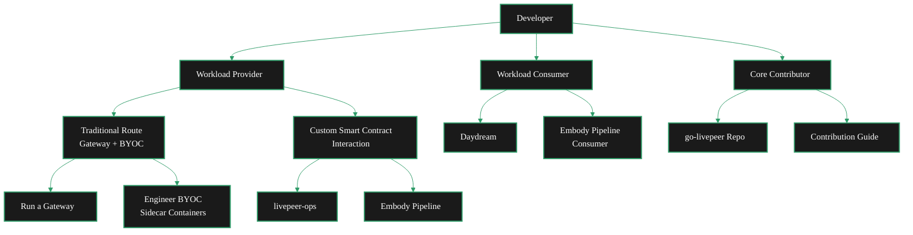

{/* codex-i18n: eyJraW5kIjoiY29kZXgtaTE4biIsInZlcnNpb24iOjEsInNvdXJjZVBhdGgiOiJ2Mi9kZXZlbG9wZXJzL2RldmVsb3Blci1wYXRoLm1keCIsInNvdXJjZVJvdXRlIjoidjIvZGV2ZWxvcGVycy9kZXZlbG9wZXItcGF0aCIsInNvdXJjZUhhc2giOiIyZDc0MDY0ODc2YWU3YTAwMWY1NTRkNmFmYTU5NzMwZmJlOWE0Y2VlZThlOWI0YTM0ZjZkMmIwNmNkMDIxZTU4IiwibGFuZ3VhZ2UiOiJmciIsInByb3ZpZGVyIjoib3BlbnJvdXRlciIsIm1vZGVsIjoib3BlbmFpL2dwdC1vc3MtMjBiOmZyZWUiLCJnZW5lcmF0ZWRBdCI6IjIwMjYtMDMtMDFUMDg6NDU6NDguOTEyWiJ9 */}
Livepeer offre plusieurs parcours pour les développeurs selon la façon dont vous souhaitez interagir avec le réseau. Que vous apportiez des charges de travail informatiques, consommiez des pipelines d'IA existants ou contribuez à l'implémentation Go principale, il existe un chemin clair pour vous.

## Choisissez votre parcours

<Columns cols={3}>
  <Card title="Workload Provider" icon="server" href="#path-1-workload-provider" arrow>
    Bring your own compute workloads to the Livepeer network by running a gateway or interacting with smart contracts directly.
  </Card>
  <Card title="Workload Consumer" icon="wand-magic-sparkles" href="#path-2-workload-consumer" arrow>
    Consume existing pipeline workloads running on the Livepeer network — no infrastructure setup required.
  </Card>
  <Card title="Core Contributor" icon="code-branch" href="#path-3-core-contributor" arrow>
    Contribute directly to go-livepeer, the Go implementation that powers the Livepeer network.
  </Card>
</Columns>

---

---

## Parcours 1 : Fournisseur de charge de travail

En tant que **Fournisseur de charge de travail**, vous apportez des charges de travail informatiques au réseau Livepeer. Vous définissez ce qui est traité — que ce soit un pipeline d'inférence IA, un travail de transcodage vidéo ou quelque chose de totalement personnalisé — et le dirigez via le réseau d'orchestrateurs de Livepeer.

Il existe deux approches selon vos besoins.

### Option A : Route traditionnelle (Gateway + BYOC)

Le chemin standard exécute votre propre passerelle et utilise des conteneurs sidecar BYOC (Bring Your Own Container) aux côtés du conteneur principal go-livepeer.

<Steps>
  <Step title="Run your own gateway" icon="tower-broadcast">
    Set up a Livepeer gateway node that routes workloads to orchestrators on the network.

    <Card title="Gateway Quickstart" icon="rocket" href="/v2/gateways/quickstart/gateway-setup" arrow horizontal>
      Get your gateway node running in minutes.
    </Card>
  </Step>
  <Step title="Engineer your BYOC containers" icon="docker">
    Build sidecar containers that run alongside the go-livepeer main container. BYOC lets you define custom workloads that orchestrators execute on their GPUs.

    <Card title="BYOC Documentation" icon="boxes" href="/v2/developers/ai-pipelines/byoc" arrow horizontal>
      Learn how to build and deploy BYOC sidecar containers.
    </Card>
  </Step>
  <Step title="Deploy workloads through your gateway" icon="arrow-up-right-from-square">
    Once your gateway is running and your BYOC containers are built, deploy your workloads to the network through your gateway.

    <Card title="AI Pipelines Overview" icon="brain-circuit" href="/v2/developers/ai-pipelines/overview" arrow horizontal>
      Understand the full AI pipeline architecture.
    </Card>
  </Step>
</Steps>

### Option B : Interaction personnalisée avec contrat intelligent

Si vous souhaitez plus de contrôle, vous pouvez interagir directement avec les contrats intelligents de Livepeer — contournant le flux standard de la passerelle pour construire une logique d'orchestration personnalisée.

<Columns cols={2}>
  <Card title="livepeer-ops" icon="github" href="https://github.com/its-DeFine/livepeer-ops" arrow>
    Infrastructure tooling for deploying and managing Livepeer workloads with custom smart contract interactions.
  </Card>
  <Card title="Embody Pipeline" icon="github" href="https://github.com/its-DeFine/Unreal_Vtuber" arrow>
    A reference implementation showing how to build a custom pipeline that interacts with Livepeer contracts directly.
  </Card>
</Columns>

<Tip>
  You're not limited to these two options. Providers can fork livepeer-ops, extend the Embody pipeline, or build entirely custom implementations. The smart contract interface is open — use it however fits your architecture.
</Tip>

---

## Parcours 2 : Consommateur de charge de travail

En tant que **Consommateur de charge de travail**, vous utilisez des charges de travail de pipeline existantes déjà en cours d'exécution sur le réseau Livepeer. Vous n'avez pas besoin de mettre en place d'infrastructure ou de déployer des conteneurs — vous vous connectez aux pipelines disponibles et consommez leurs sorties.

### Pipelines disponibles

<Columns cols={2}>
  <Card title="Daydream (DaS Scope)" icon="wand-sparkles" href="#">
    Consume Daydream pipeline workloads on the Livepeer network.
    <Note>Link coming soon</Note>
  </Card>
  <Card title="Embody Pipeline" icon="user-robot" href="#">
    Consume Embody pipeline workloads for real-time avatar and VTuber applications.
    <Note>Link coming soon</Note>
  </Card>
</Columns>

---

## Parcours 3 : Contributeur principal

En tant que **Contributeur principal**, vous travaillez directement sur go-livepeer — l'implémentation Go qui alimente les passerelles, les orchestrateurs et le protocole lui-même. Ce parcours est destiné aux développeurs qui souhaitent améliorer le réseau au niveau de l'infrastructure.

<Columns cols={2}>
  <Card title="go-livepeer" icon="github" href="https://github.com/livepeer/go-livepeer" arrow>
    The official Go implementation of the Livepeer protocol. Clone the repo and start exploring.
  </Card>
  <Card title="Contribution Guide" icon="book-open" href="/v2/developers/guides-and-resources/contribution-guide" arrow>
    Guidelines for contributing to Livepeer — coding standards, PR process, and how to get your changes merged.
  </Card>
</Columns>
