{/* codex-i18n: eyJraW5kIjoiY29kZXgtaTE4biIsInZlcnNpb24iOjEsInNvdXJjZVBhdGgiOiJ2Mi9nYXRld2F5cy9hYm91dC1nYXRld2F5cy9nYXRld2F5LWV4cGxhaW5lci5tZHgiLCJzb3VyY2VSb3V0ZSI6InYyL2dhdGV3YXlzL2Fib3V0LWdhdGV3YXlzL2dhdGV3YXktZXhwbGFpbmVyIiwic291cmNlSGFzaCI6IjJjNGZlNWMzMzIwNjMxZTEzODAwZTUwZmY1ODQ5YjJiOGEyODZkOGZmNDFiNzhjNWNhYjYyZTUzZjNlODFmYzIiLCJsYW5ndWFnZSI6ImZyIiwicHJvdmlkZXIiOiJvcGVucm91dGVyIiwibW9kZWwiOiJxd2VuL3F3ZW4tdHVyYm8iLCJnZW5lcmF0ZWRBdCI6IjIwMjYtMDItMjdUMTQ6MDE6MDguMTA1WiJ9 */}
import { GotoCard } from '/snippets/components/primitives/links.jsx'

<Danger>
  This page is a work in progress.  
  TODO: Edit, Streamline, Format & Style
</Danger>

## Définition

Les passerelles servent de couche d'aggrégation de la demande principale dans le réseau Livepeer.
Elles acceptent les demandes de transcodage vidéo et d'inférence IA des clients finaux, puis distribuent ces tâches à travers le réseau des Orchestrators équipés de GPU.
Dans les anciens documents Livepeer, ce rôle était appelé diffuseur.

**_Modèle mental_**
<AccordionGroup>
  <Accordion title="From a Cloud Background?" icon="cloud" >

Running a Gateway is similar to operating an API Gateway or Load Balancer in cloud computing -
it ingests traffic, routes workloads to backend GPU nodes, and manages session flow
without doing the heavy compute itself.

```mermaid
%%{init: {'theme': 'base', 'themeVariables': { 'primaryColor': '#1a1a1a', 'primaryTextColor': '#fff', 'primaryBorderColor': '#2d9a67', 'lineColor': '#2d9a67', 'secondaryColor': '#0d0d0d', 'tertiaryColor': '#1a1a1a', 'background': '#0d0d0d', 'fontFamily': 'system-ui' }}}%%
flowchart LR
    subgraph Clients["Client / Application Layer"]
        A["Apps & SDKs<br/>• Video Ingest<br/>• AI Inference Requests<br/>• WebRTC / HTTP"]
    end

    subgraph Gateway["Gateway Layer (Livepeer Gateway)"]
        B["Gateway Node<br/><br/>Cloud Analogy:<br/>• API Gateway<br/>• L7 Load Balancer<br/>• Control Plane<br/><br/>Responsibilities:<br/>• Auth & Rate Limits<br/>• Stream Segmentation<br/>• Job Routing<br/>• Health Checks<br/>• Retry & Failover"]
    end

    subgraph Compute["Compute Layer (Supply Side)"]
        C["Orchestrators<br/>GPU Workers<br/><br/>Cloud Analogy:<br/>• Auto-scaling GPU Fleet<br/>• Managed Inference Pool"]
    end

    subgraph Settlement["Coordination & Settlement"]
        D["Ethereum + Livepeer Protocol<br/><br/>• Payments<br/>• Accounting<br/>• Slashing / Security"]
    end

    A -->|Requests| B
    B -->|Dispatch Jobs| C
    C -->|Results / Streams| B
    B -->|Responses| A
    C -->|Usage & Proof| D

    classDef default fill:#1a1a1a,color:#fff,stroke:#2d9a67,stroke-width:2px
    style Clients fill:#0d0d0d,stroke:#2d9a67,stroke-width:1px
    style Gateway fill:#0d0d0d,stroke:#2d9a67,stroke-width:1px
    style Compute fill:#0d0d0d,stroke:#2d9a67,stroke-width:1px
    style Settlement fill:#0d0d0d,stroke:#2d9a67,stroke-width:1px
```

  <ScrollableDiagram title="Gateway as Cloud Infrastructure">

  </ScrollableDiagram>
  </Accordion>
  <Accordion title="From an Ethereum Background?" icon="coin" >

Running a Gateway is **not** like running a validator on Ethereum.
Validators secure consensus whereas Gateways route workloads. It's more akin to a Sequencer on a Layer 2.
Just as a Sequencer ingests user transactions, orders them, and routes them into the rollup execution layer,
a Livepeer Gateway performs the same function for the Livepeer compute network.

```mermaid
%%{init: {'theme': 'base', 'themeVariables': { 'primaryColor': '#1a1a1a', 'primaryTextColor': '#fff', 'primaryBorderColor': '#2d9a67', 'lineColor': '#2d9a67', 'secondaryColor': '#0d0d0d', 'tertiaryColor': '#1a1a1a', 'background': '#0d0d0d', 'fontFamily': 'system-ui' }}}%%
flowchart LR
    subgraph User["User Layer"]
        A["Client<br/>Video/AI Request"]
    end

    subgraph Gateway["Gateway Layer"]
        B["Livepeer Gateway<br/>= L2 Sequencer<br/><br/>• Ingests Requests<br/>• Segments/Preprocesses<br/>• Selects Orchestrators<br/>• Routes Jobs<br/>• Returns Results"]
    end

    subgraph Compute["Compute Layer"]
        C["Orchestrators<br/>GPU Workers<br/><br/>= L2 Execution Layer"]
    end

    subgraph Settlement["Settlement Layer"]
        D["Ethereum<br/>Consensus & Payment Security"]
    end

    A --> B
    B --> C
    C --> B
    B --> A
    C --> D

    classDef default fill:#1a1a1a,color:#fff,stroke:#2d9a67,stroke-width:2px
    style User fill:#0d0d0d,stroke:#2d9a67,stroke-width:1px
    style Gateway fill:#0d0d0d,stroke:#2d9a67,stroke-width:1px
    style Compute fill:#0d0d0d,stroke:#2d9a67,stroke-width:1px
    style Settlement fill:#0d0d0d,stroke:#2d9a67,stroke-width:1px
```

  <ScrollableDiagram title="Gateways as L2 Sequencers">

  </ScrollableDiagram>
  </Accordion>
  <Accordion title="Neither? You can still run a gateway!" icon="film" >

For the rest of us, running a Gateway is like being a film producer.
You take a request, assemble the right specialists, manage constraints,
and ensure the final result is delivered reliably-without doing every task yourself.

```mermaid
%%{init: {'theme': 'base', 'themeVariables': { 'primaryColor': '#1a1a1a', 'primaryTextColor': '#fff', 'primaryBorderColor': '#2d9a67', 'lineColor': '#2d9a67', 'secondaryColor': '#0d0d0d', 'tertiaryColor': '#1a1a1a', 'background': '#0d0d0d', 'fontFamily': 'system-ui' }}}%%
flowchart LR
    subgraph Persona["Persona: Gateway Operator = Film Producer"]
        P["Film Producer Mindset<br/>• Owns delivery<br/>• Sets constraints<br/>• Chooses specialists<br/>• Ensures quality"]
    end

    subgraph Request["Act I - The Pitch"]
        A["Incoming Request<br/>• Live Video Stream<br/>• AI Inference Job<br/>• Quality & Latency Requirements"]
    end

    subgraph Planning["Act II - Pre-Production"]
        B["Gateway (Producer)<br/><br/>• Interpret the request<br/>• Set budget & latency constraints<br/>• Choose specialists<br/>• Plan execution"]
    end

    subgraph Crew["Act III - Production Crew"]
        C["Orchestrators / GPU Workers<br/><br/>• Transcoding<br/>• AI Inference<br/>• Real-time Processing"]
    end

    subgraph Delivery["Act IV - Final Cut & Release"]
        D["Verified Output<br/>• Stream / AI Result<br/>• Quality checked<br/>• Delivered on time"]
    end

    subgraph Settlement["Credits & Accounting"]
        E["Onchain Settlement<br/>• Usage recorded<br/>• Payments distributed<br/>• Trust enforced"]
    end

    P --> A
    A --> B
    B --> C
    C --> B
    B --> D
    C --> E

    classDef default fill:#1a1a1a,color:#fff,stroke:#2d9a67,stroke-width:2px
    style Persona fill:#0d0d0d,stroke:#2d9a67,stroke-width:1px
    style Request fill:#0d0d0d,stroke:#2d9a67,stroke-width:1px
    style Planning fill:#0d0d0d,stroke:#2d9a67,stroke-width:1px
    style Crew fill:#0d0d0d,stroke:#2d9a67,stroke-width:1px
    style Delivery fill:#0d0d0d,stroke:#2d9a67,stroke-width:1px
    style Settlement fill:#0d0d0d,stroke:#2d9a67,stroke-width:1px
```

  <ScrollableDiagram title="Gateway as Film Producer">

  </ScrollableDiagram>
  </Accordion>
</AccordionGroup> 

## Qu'est-ce qu'une passerelle ?

Les passerelles sont le point d'entrée des applications dans le réseau Livepeercompute.
Elles constituent la couche de coordination qui relie les charges de travail en temps réel d'IA et de vidéo aux orchestrators qui effectuent le calcul GPU.

Elles agissent comme la couche technique essentielle entre le protocole et le réseau de calcul décentralisé.

Une passerelle est un nœud Livepeer autogéré qui interagit directement avec les orchestrateurs, soumet des tâches, gère les paiements et expose des interfaces directes du protocole.
Les services hébergés comme Daydream ne sont pas des passerelles.

Une passerelle est responsable de

- valider les demandes
- sélectionner les Workers
- traduire les demandes en appels OpenAPI des Workers
- agréger les résultats

Les gateways génèrent des revenus à partir des frais de transaction sur toutes les tâches qu'ils routent.

Si vous venez d'un arrière-plan Ethereum, les gateways peuvent être considérés de manière générale comme des séquenceurs dans les rollups L2.
Si vous venez d'un arrière-plan cloud traditionnel, les gateways sont comparables à des passerelles API ou des équilibreurs de charge.

Toute personne souhaitant créer des applications et services (comme [Daydream] et [Stream.place] ) sur le protocole Livepeer
construira son propre Gateway afin d'offrir ses services aux Livepeer Développeurs, Constructeurs et utilisateurs finaux et d'autoriser
la communication de son application avec le réseau GPU Livepeer (DePIN / Orchestrators)

## Ce que font les Gateways

Les gateways gèrent toute la logique nécessaire pour faire fonctionner un réseau d'images vidéo AI à faible latence et évolutif :

- **Prise en charge des tâches**  
  Ils reçoivent des charges de travail des applications utilisant les API Livepeer, PyTrickle ou les intégrations BYOC.

- **Capacité et correspondance des modèles**  
  Les passerelles déterminent quels orchestrateurs prennent en charge la GPU, le modèle ou le pipeline requis.

- **Acheminement et planification**  
  Ils dispatchent les tâches vers l'orchestrator optimal en fonction des performances, de la disponibilité et du prix.

- **Exposition sur le marché**  
  Les opérateurs de passerelle peuvent publier les services qu'ils proposent, y compris les modèles pris en charge, les pipelines et les structures de tarification.

Les passerelles font _pas_ de calcul GPU. Au lieu de cela, elles se concentrent sur la coordination et le routage des services.

<GotoCard
  label="Gateway Functions & Services"
  text="Learn More About Gateway Functions & Services"
  relativePath="../../gateways/about-gateways/gateway-functions.mdx"
/>

## Pourquoi les passerelles sont-elles importantes

Alors que Livepeer passe à un réseau d'IA en temps réel à forte demande, les passerelles deviennent une infrastructure essentielle.

Ils permettent :

- Des workflows à faible latence pour Daydream, ComfyStream et d'autres outils vidéo IA en temps réel
- Le routage dynamique des GPU pour les charges de travail intensives en inférence
- Un marché décentralisé des capacités de calcul
- Une intégration flexible via le modèle de pipeline BYOC

Les passerelles simplifient l'expérience du développeur tout en préservant la décentralisation, les performances et la compétitivité du réseau Livepeer.

## Résumé

Les passerelles sont la couche de coordination et de routage de l'écosystème Livepeer. Elles exposent des capacités, fixent des prix pour les services, acceptent des charges de travail et les transmettent aux orchestrateurs pour l'exécution sur GPU. Ce design permet un marché décentralisé de calcul à grande échelle, à faible latence et prêt pour l'IA.

Cette architecture permet à Livepeer de s'étendre en un fournisseur mondial d'infrastructure vidéo IA en temps réel.

---

---

---

---

<Warning> WIP: Unsure where below section belongs currently</Warning>

<Accordion title="Marketplace Content">
  ## Key Marketplace Features

### 1. Capability Discovery

Gateways and orchestrators list:

- AI model support
- Versioning and model weights
- Pipeline compatibility
- GPU type and compute class

Applications can programmatically choose the best provider.

### 2. Dynamic Pricing

Pricing can vary by:

- GPU class
- Model complexity
- Latency SLA
- Throughput requirements
- Region

Gateways expose pricing APIs for transparent selection.

### 3. Performance Competition

Orchestrators compete on:

- Speed
- Reliability
- GPU quality
- Cost efficiency

Gateways compete on:

- Routing quality
- Supported features
- Latency
- Developer ecosystem fit

This creates a healthy decentralized market.

### 4. BYOC Integration

Any container-based pipeline can be brought into the marketplace:

- Run custom AI models
- Run ML workflows
- Execute arbitrary compute
- Support enterprise workloads

Gateways advertise BYOC offerings; orchestrators execute containers.

{' '}
<GotoCard
  label="Protocol Overview"
  text="Understand the Full Livepeer Network Design"
  relativePath="../../about/livepeer-protocol/livepeer-protocol/protocol-overview.mdx"
/>

## Marketplace Benefits

- **Developer choice** - choose the best model, price, and performance
- **Economic incentives** - better nodes earn more work
- **Scalability** - network supply grows independently of demand
- **Innovation unlock** - new models and pipelines can be added instantly
- **Decentralization** - no single operator controls the workload flow

## Summary

The Marketplace turns Livepeer into a competitive, discoverable, real-time AI compute layer.

- Gateways expose services
- Orchestrators execute them
- Applications choose the best fit
- Developers build on top of it
- Users benefit from low-latency, high-performance AI
</Accordion>

# Références

<Warning> Unverified Reference </Warning>
https://github.com/videoDAC/livepeer-gateway

<iframe
  src="https://cdn.jsdelivr.net/gh/videoDAC/livepeer-gateway@master/README.md"
  width="100%"
  height="500px"
  frameborder="0" title="Embedded content from cdn.jsdelivr.net">
  
Your browser does not support iframes.

</iframe>
