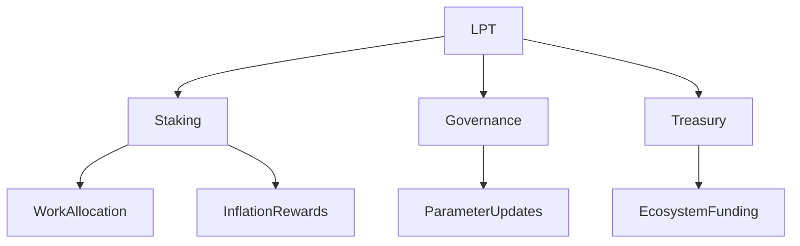

{/* codex-i18n: eyJraW5kIjoiY29kZXgtaTE4biIsInZlcnNpb24iOjEsInNvdXJjZVBhdGgiOiJ2Mi9scHQvYWJvdXQvb3ZlcnZpZXcubWR4Iiwic291cmNlUm91dGUiOiJ2Mi9scHQvYWJvdXQvb3ZlcnZpZXciLCJzb3VyY2VIYXNoIjoiNGQ2ZjU3YmU0ZTZmYjEyOGJkODc5NjdiNzRkYmRjNWYzMDM3Mjg4MThiNDk4YzNlYjE0ZjliMzRlNDkzMWY5NSIsImxhbmd1YWdlIjoiZnIiLCJwcm92aWRlciI6Im9wZW5yb3V0ZXIiLCJtb2RlbCI6Im1ldGEtbGxhbWEvbGxhbWEtMy4zLTcwYi1pbnN0cnVjdDpmcmVlIiwiZ2VuZXJhdGVkQXQiOiIyMDI2LTAzLTAxVDEwOjEyOjQxLjY4N1oifQ== */}
import { MathInline, MathBlock } from '/snippets/components/content/math.jsx'

## Résumé exécutif

Le jeton Livepeer (LPT) est l'actif de la couche de protocole qui sécurise, régit et régule économiquement le réseau Livepeer. Il ne s'agit pas d'un jeton de paiement pour la consommation de vidéos, ni d'une représentation des actions de l'entreprise. Sa fonction est strictement structurelle : il convertit le capital lié en poids économique mesurable qui sécurise l'allocation de tâches, permet la gouvernance et finance le développement de l'écosystème.

LPT fonctionne exclusivement à la **couche de protocole (sur la chaîne)** sur Arbitrum One.

---

## 1. Définition formelle

Soit le protocole Livepeer défini comme un système de coordination en chaîne pour l'allocation de travail et de récompenses entre les fournisseurs de calcul décentralisés.

LPT est défini comme :

> Un actif de coordination pondéré par les enjeux qui fournit une sécurité économique, une autorité de gouvernance et un contrôle du trésor au sein du protocole Livepeer. 

Ses domaines fonctionnels sont :

1. Sécurité des enjeux
2. Distribution de récompenses basée sur l'inflation
3. Allocation de capital déléguée
4. Vote de gouvernance
5. Intendance du trésor

---

## 2. Contexte architectural

### 2.1 Couche de protocole (sur la chaîne)

LPT interagit avec les contrats intelligents principaux :

- **BondingManager** — comptabilité des enjeux
- **Minter** — émission d'inflation
- **RoundsManager** — synchronisation des récompenses basée sur les époques
- **Governor** — exécution des propositions et des votes
- **Trésor** — fonds contrôlés par la gouvernance

Toute l'autorité du protocole découle des soldes LPT liés.

### 2.2 Couche du réseau (hors chaîne)

La couche du réseau comprend :

- Logiciel d'orchestrateur
- Exécution de calcul GPU
- Canaux de transcodage et d'inférence
- API de passerelle et routage

LPT n'exécute pas de travail. Il sécurise économiquement les acteurs qui effectuent le travail.

---

## 3. Enjeux et poids économique

Soit :

- <MathInline latex={String.raw`B_i`} /> = enjeu lié du participant <MathInline latex={String.raw`i`} />
- <MathInline latex={String.raw`B_T`} /> = enjeu lié total

Poids économique :

<MathBlock latex={String.raw`W_i = \frac{B_i}{B_T}`} />

L'allocation de travail et les récompenses d'inflation sont proportionnelles à <MathInline latex={String.raw`W_i`} />.

Cela crée un modèle de résistance à Sybil basé sur le capital.

---

## 4. Aperçu du mécanisme d'inflation

Par round <MathInline latex={String.raw`t`} />:

<MathBlock latex={String.raw`R_t = S_t \times r_t`} />

Où :

- <MathInline latex={String.raw`S_t`} /> = offre de jetons au round <MathInline latex={String.raw`t`} />
- <MathInline latex={String.raw`r_t`} /> = taux d'inflation défini par le protocole

L'inflation s'ajuste dynamiquement en fonction du taux de liaison par rapport au taux de liaison cible (voir [Tokenomique](./tokenomics) section pour la dérivation complète).

---

## 5. Modèle de délégation

Les délégués lient leur mise à des orchestrateurs, augmentant leur poids économique sans exécuter d'infrastructure.

Total des parts de l'orchestrateur:

<MathBlock latex={String.raw`B_O = B_{self,O} + \sum_D b_{D,O}`} />

La délégation permet une efficacité du capital et des marchés d'opérateurs compétitifs.

---

## 6. Autorité de gouvernance

Le pouvoir de vote découle de la mise liée:

<MathBlock latex={String.raw`V_i = \frac{B_i}{B_T}`} />

La gouvernance peut modifier:

- Paramètres d'inflation
- Implémentations de contrat
- Allocations du trésor

L'autorité de gouvernance est pondérée par le capital et appliquée en chaîne.

---

## 7. Modèle de sécurité

La sécurité du protocole est proportionnelle à la mise liée totale:

<MathBlock latex={String.raw`\text{Security} \propto B_T`} />

Un attaquant doit acquérir une fraction seuil de la mise liée LPT pour influencer l'allocation de travail ou la gouvernance.

---

## 8. Compromis économiques

| Mécanisme | Compromis |
|-----------|----------|
| Émission d'inflation | Bootstrapping vs dilution |
| Délégation | Accessibilité vs concentration |
| Gouvernance pondérée par le capital | Sécurité vs influence de la richesse |

Ces compromis sont des décisions de conception explicites.

---

## 9. Diagramme d'interaction du système

---

## 10. Considérations opérationnelles

Les participants doivent comprendre:

- Retards de liaison et de désinscription
- Structures de commission
- Ajustements des paramètres d'inflation
- Seuils de quorum de gouvernance

La participation expose le capital au risque au niveau du protocole.

---

## Références

- [Dépôt du protocole Livepeer](https://github.com/livepeer/protocol)
- [Registre de contrat](https://docs.livepeer.org/references/contract-addresses)
- [Propositions d'amélioration Livepeer (LIPs)](https://github.com/livepeer/LIPs)
