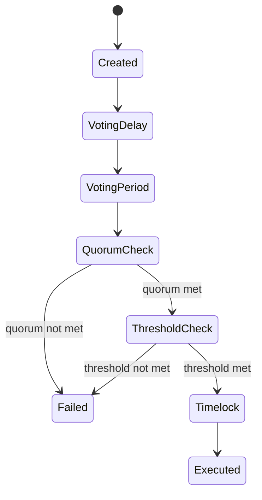

{/* codex-i18n: eyJraW5kIjoiY29kZXgtaTE4biIsInZlcnNpb24iOjEsInNvdXJjZVBhdGgiOiJ2Mi9scHQvZ292ZXJuYW5jZS9tb2RlbC5tZHgiLCJzb3VyY2VSb3V0ZSI6InYyL2xwdC9nb3Zlcm5hbmNlL21vZGVsIiwic291cmNlSGFzaCI6IjIxZjQ3YmFlZGJjZDczNTY1ODlkZTdlMWZjNjY3ZGM0MjU3Yjk3OTk2YTViZTE1OWEwZjhiMGM2NmFiNWQzZTIiLCJsYW5ndWFnZSI6ImZyIiwicHJvdmlkZXIiOiJvcGVucm91dGVyIiwibW9kZWwiOiJxd2VuL3F3ZW4tdHVyYm8iLCJnZW5lcmF0ZWRBdCI6IjIwMjYtMDMtMDFUMTE6MTQ6MjUuNDMwWiJ9 */}
import { MathInline, MathBlock } from '/snippets/components/content/math.jsx'

## Résumé exécutif

La gouvernance Livepeer est un système basé sur les propositions et pondéré par le capital, appliqué entièrement par des contrats intelligents. L'autorité est proportionnelle au stake lié, et l'exécution est déterministe une fois que les conditions de quorum et de seuil sont remplies.

Cette page formalise le processus de prise de décision en matière de gouvernance, y compris les mécanismes de quorum, les seuils de vote, les sémantiques de délai, et les considérations sur les surfaces d'attaque.

---

## 1. Primitives de gouvernance

Soit :

- <MathInline latex={String.raw`B_i`} /> = le stake lié attribué au participant <MathInline latex={String.raw`i`} />
- <MathInline latex={String.raw`B_T`} /> = montant total de la mise bloquée
- <MathInline latex={String.raw`V_i`} /> = pouvoir de vote du participant<MathInline latex={String.raw`i`} />

Pouvoir de vote :

<MathBlock latex={String.raw`V_i = \frac{B_i}{B_T}`} />

Tout le poids de gouvernance provient de la mise bloquée.

---

## 2. Cycle de vie d'une proposition

Une proposition de gouvernance suit généralement ces phases déterministes :

1. **Création** - proposition soumise avec des actions encodées
2. **Délai de vote** - période avant l'ouverture du vote
3. **Période de vote** - les participants liés émettent leurs votes
4. **Vérification de quorum** - exigence minimale de participation
5. **Vérification de seuil** - condition de majorité
6. **File d'attente (Timelock)** - délai d'exécution
7. **Exécution** - transition d'état si les conditions sont remplies

Ces transitions sont imposées par les contrats de gouvernance.

---

## 3. Condition de quorum

Soit

- <MathInline latex={String.raw`Q`} /> = fraction de quorum
- <MathInline latex={String.raw`V_{cast}`} /> = pouvoir de vote total déposé

Condition de quorum :

<MathBlock latex={String.raw`V_{cast} \ge Q \cdot B_T`} />

Au moins 33 % de tous les LPT stakés doivent participer au vote pour qu'il soit valide. Cette exigence garantit qu'une petite clique ne puisse imposer des changements radicaux sans l'implication de la communauté.

---

## 4. Condition de majorité / seuil

Soit :

- <MathInline latex={String.raw`V_{for}`} /> = votes en faveur pondérés par le montant staké
- <MathInline latex={String.raw`V_{against}`} /> = votes pondérés par le montant de la mise

Condition de majorité (majorité simple) :

<MathBlock latex={String.raw`V_{for} > V_{against}`} />

Plus de 50 % des votes participatifs doivent soutenir la proposition. L'approbation par majorité simple équilibre l'inclusivité et la prise de décision : les propositions qui divisent la communauté de manière égale ne peuvent pas passer.

---

## 5. Sémantique du timelock

Les propositions approuvées entrent dans une période de timelock avant d'être exécutées.

Propriétés du timelock :

- Introduit un délai entre l'approbation et l'exécution
- Offre une opportunité de réaction des parties prenantes
- Réduit le risque de changement soudain des paramètres

Délai de verrouillage<MathInline latex={String.raw`T_{delay}`} />est défini au niveau du protocole.

---

## 6. Modèle d'exécution

Si les conditions de quorum et de seuil sont satisfaites et que le délai de blocage est écoulé :

- Les actions encodées sont exécutées
- Les transitions d'état du contrat s'effectuent de manière déterministe

L'exécution peut inclure :

- Modification des paramètres
- Mises à jour des implémentations de proxy
- Transferts du trésor

L'exécution est atomique par proposition.

---

## 7. Objets de gouvernance et architecture des contrats

La documentation des adresses de contrat officielle liste les contrats liés à la gouvernance sur le réseau principal Arbitrum :

- **Gouverneur** - logique des propositions et du vote
- **LivepeerGovernor (proxy/cible)** - implémentation de gouvernance upgradable
- **Votes de mise en garantie** - suivi du pouvoir de vote pondéré par la mise en garantie
- **Trésorerie** - fonds contrôlés par la gouvernance

Cela établit que la gouvernance n'est pas simplement sociale ; elle est mise en œuvre par des contrats déployés avec des adresses publiées.

---

## 8. Paramètres du trésor

Les discussions sur la gouvernance du trésor identifient deux paramètres comme particulièrement importants :

| Paramètre | Description |
|-----------|-------------|
| `treasuryRewardCutRate` | Pourcentage des récompenses inflationnistes dirigées vers le trésor chaque tour (actuellement environ 10%) |
| `treasuryBalanceCeiling` | Une fois que le solde du trésor dépasse un plafond (750 000 LPT), la part peut être fixée à zéro |

---

## 9. Considérations sur la sécurité et la théorie des jeux

### 9.1 Exigence de capital pour le contrôle

Soit <MathInline latex={String.raw`\theta`} /> la fraction minimale requise pour contrôler les résultats.

Capital minimum requis :

<MathBlock latex={String.raw`Capital_{control} \ge \theta B_T`} />

Un plus grand montant de LPT bloqué augmente le coût de prise de contrôle de la gouvernance.

### 9.2 Risque de concentration des participations

Si un petit nombre d'adresses contrôlent une grande fraction de<MathInline latex={String.raw`B_T`} />, le risque de prise de contrôle de la gouvernance augmente. La sécurité est inversement proportionnelle à la concentration.

### 9.3 Risque d'indifférence des votants

Si la fraction du quorum<MathInline latex={String.raw`Q`} />est élevé par rapport à la participation typique :
- Les propositions peuvent échouer en raison d'un faible taux de participation

Si <MathInline latex={String.raw`Q`} />est faible :
- De petits groupes coordonnés peuvent faire passer des propositions

La calibration du quorum est donc un paramètre de sécurité.

### 9.4 Centralisation de l'Exécuteur

Le comité de sécurité/les propriétaires du protocole invoquent des fonctions pour définir des valeurs en fonction du résultat du vote. Cela introduit une dépendance de confiance : même si le vote est décentralisé, l'exécution peut rester centralisée sur certains chemins.

---

## 10. Risques de capture de la gouvernance

Le système met en évidence plusieurs risques structurellement importants :

1. **Faible participation et concentration de la puissance de vote** - réduit la défense contre les actions de gouvernance hostiles
2. **Centralisation de l'exécuteur** - la dépendance au comité de sécurité introduit des exigences de confiance
3. **Sanctions désactivées** - réduit la capacité du système à imposer des pénalités économiques automatiques pour le comportement incorrect, augmentant la dépendance à la réputation et aux solutions sociales

---

## 11. Machine d'état de gouvernance

---

## 12. Séparation entre le protocole et le réseau

**Protocole (sur chaîne) :**
- Soumission de proposition
- Vote
- Application des quorums et seuils
- Exécution avec délai
- Modification des paramètres

**Réseau (hors chaîne) :**
- Opération d'un nœud
- Performance
- Exécution de tâche

La gouvernance modifie les règles ; les acteurs du réseau opèrent dans ces règles.

---

## Références

- [Livepeer Dépôt de protocole](https://github.com/livepeer/protocol)
- [Registre des contrats](https://docs.livepeer.org/references/contract-addresses)
- [Livepeer Proposals d'amélioration (LIPs)](https://github.com/livepeer/LIPs)
