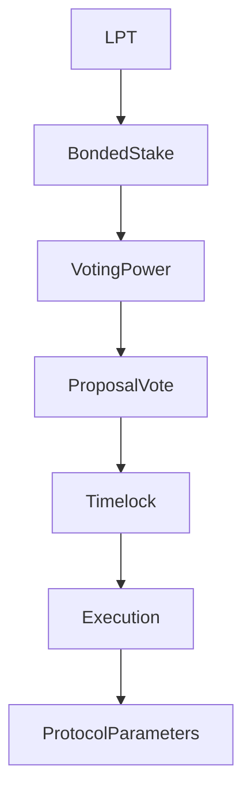

{/* codex-i18n: eyJraW5kIjoiY29kZXgtaTE4biIsInZlcnNpb24iOjEsInNvdXJjZVBhdGgiOiJ2Mi9scHQvZ292ZXJuYW5jZS9vdmVydmlldy5tZHgiLCJzb3VyY2VSb3V0ZSI6InYyL2xwdC9nb3Zlcm5hbmNlL292ZXJ2aWV3Iiwic291cmNlSGFzaCI6IjE2MDljNDMyNjBhMzY5NjI1ZGUxMWUyODc4ZjM4ZjA2NDQyZWIwZGNlNzk1ZWNjNjg5NWU4MmMxNTczOGM2MTIiLCJsYW5ndWFnZSI6ImZyIiwicHJvdmlkZXIiOiJvcGVucm91dGVyIiwibW9kZWwiOiJxd2VuL3F3ZW4tdHVyYm8iLCJnZW5lcmF0ZWRBdCI6IjIwMjYtMDMtMDFUMTE6MTM6MjUuOTI3WiJ9 */}
import { MathInline, MathBlock } from '/snippets/components/content/math.jsx'

## Résumé exécutif

La gouvernance Livepeer est un système de décision sur la chaîne, pondéré par les participations, qui contrôle les mises à jour des paramètres du protocole, les mises à niveau des contrats (lorsque c'est possible) et les affectations du trésor.

L'autorité de gouvernance provient exclusivement de**l'LPT lié**.**elle fonctionne au niveau du protocole (sur la chaîne)** et modifie les règles économiques et contractuelles qui limitent la couche réseau.

---

## 1. Définition formelle

Soit :

- <MathInline latex={String.raw`B_i`} /> = montant du stake lié attribué au participant<MathInline latex={String.raw`i`} />
- <MathInline latex={String.raw`B_T`} /> = montant total du stake lié

Puissance de vote :

<MathBlock latex={String.raw`V_i = \frac{B_i}{B_T}`} />

La gouvernance est donc un système de décision pondéré par le capital sur le stake lié. Seul le stake lié contribue au poids de vote.

---

## 2. Portée de la gouvernance

La gouvernance peut modifier :

1. Les paramètres d'inflation (par exemple, le coefficient d'ajustement, le taux cible de liaison)
2. Les implémentations de contrats (via des modèles de mise à niveau lorsqu'ils sont activés)
3. Les versements du trésor
4. Constantes de configuration du protocole

La gouvernance ne**contrôle pas**directement :

- Planification des GPU
- Acheminement des tâches
- Stratégies de tarification des passerelles
- Comportement opérationnel hors chaîne

Ces éléments appartiennent au niveau du réseau.

---

## 3. Modèle hybride sur chaîne/hors chaîne

Livepeer utilise un modèle de gouvernance hybride sur chaîne/hors chaîne. Les processus hors chaîne (discussions, groupes de travail et signaux) permettent à la communauté de débattre et d'affiner les idées dans un forum ouvert. Les votes sur chaîne transforment ensuite ces idées en mises à jour du protocole ou en affectations de fonds. Cette séparation maintient les transactions sur chaîne minimales tout en maximisant l'apport et la transparence de la communauté.

### Propositions d'amélioration Livepeer (LIPs)

Le mécanisme principal pour les changements du protocole est la proposition d'amélioration Livepeer (LIP). Les LIP sont des documents structurés (hébergés sur GitHub) qui spécifient des changements techniques, des ajustements de paramètres ou des processus de gouvernance, semblables aux EIP d'Ethereum.

Le cycle de vie d'une LIP suit un rythme délibéré :

1. **Idée et discussion** – Tout le monde peut présenter une idée sur le forum Livepeer ou sur Discord. Les premiers retours des développeurs, des orchestrateurs et des délégués aident à identifier les compromis.

2. **Formation d'une entité à usage spécifique** – Les idées complexes entraînent souvent la formation d'une entité à usage spécifique (SPE) : un groupe de travail composé de membres de la communauté qui définissent le problème, recherchent des alternatives, produisent des spécifications et estiment les besoins en ressources. Les SPE opèrent hors chaîne et sont responsables envers la communauté.

3. **Rédaction et exigence de mise en garantie** – Une fois qu'une proposition est mûre, les auteurs rédigent un LIP en utilisant un modèle standard et ouvrent une demande de tirage (pull request) contre le dépôt du protocole. Les proposers doivent avoir au moins 100 LPT bloqués sur la chaîne pour soumettre un LIP.

4. **Revue et révision formelle** – Le LIP est examiné par la communauté, les développeurs principaux et la Fondation Livepeer. La période d'examen dure généralement au moins deux semaines.

5. **Signalement par Snapshot** – Avant de passer sur la chaîne, les proposers peuvent effectuer un vote Snapshot (sondage pondéré par les jetons hors chaîne) pour mesurer l'opinion.

6. **Vote sur la chaîne** – Enfin, le LIP est soumis au contrat intelligent de gouvernance pour un vote contraignant. Si les seuils de quorum et de majorité sont atteints, la proposition est mise en file d'attente pour l'exécution.

---

## 4. Mécaniques de vote

Permettez à une proposition<MathInline latex={String.raw`P`} /> d'être active pendant une période de vote.

Puissance de vote totale déposée :

<MathBlock latex={String.raw`V_{cast} = \sum_{i \in voters} B_i`} />

Une proposition est adoptée si elle satisfait aux seuils de quorum et de majorité tels que définis dans la logique du contrat de gouvernance. Ces seuils sont appliqués sur la chaîne.

---

## 5. Gouvernance en tant que couche de sécurité

La sécurité de la gouvernance dépend de la répartition de la mise en garde.

Soit <MathInline latex={String.raw`\theta`} /> la fraction de mise en garde nécessaire pour influencer un résultat.

Capital minimum requis:

<MathBlock latex={String.raw`Capital_{control} \geq \theta B_T`} />

La sécurité augmente avec le montant total des actifs bloqués et diminue avec la concentration des actifs bloqués :

<MathBlock latex={String.raw`Security \propto B_T`} />

---

## 6. Contexte architectural

### 6.1 Contrats de la couche protocole

La logique de gouvernance interagit avec les contrats responsables de :

- Création des propositions
- Vote et comptage des votes
- Application du timelock
- Exécution des propositions approuvées

Adresses des contrats canoniques : [Registre des contrats](https://docs.livepeer.org/references/contract-addresses)

### 6.2 Interaction au niveau du réseau

Les décisions de gouvernance peuvent influencer indirectement le comportement du réseau en modifiant :

- Paramètres d'incitation
- Dynamique des récompenses
- Logique de contrat modifiable

Cependant, l'exécution des charges de travail reste hors chaîne.

---

## 7. Schéma du système

---

## 8. Séparation du protocole et du réseau

**Protocole (sur chaîne) :**
- Création de proposition
- Vote et comptage des votes
- Mises à jour des paramètres
- Mises à jour des contrats
- Exécution du trésor

**Réseau (hors chaîne) :**
- Opération d'un nœud
- Exécution de la charge de travail
- Acheminement et tarification

La gouvernance modifie les règles ; les acteurs du réseau exécutent dans ces règles.

---

## Références

- [Livepeer Dépôt de protocole](https://github.com/livepeer/protocol)
- [Registre des contrats](https://docs.livepeer.org/references/contract-addresses)
- [Livepeer Proposals d'amélioration (LIPs)](https://github.com/livepeer/LIPs)
