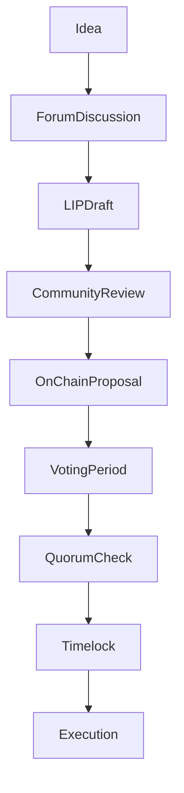

{/* codex-i18n: eyJraW5kIjoiY29kZXgtaTE4biIsInZlcnNpb24iOjEsInNvdXJjZVBhdGgiOiJ2Mi9scHQvZ292ZXJuYW5jZS9wcm9jZXNzZXMubWR4Iiwic291cmNlUm91dGUiOiJ2Mi9scHQvZ292ZXJuYW5jZS9wcm9jZXNzZXMiLCJzb3VyY2VIYXNoIjoiZGIxZDNkMGQ4ZjQxMDI5OWI3ZWY2MzQ2OWZmYjcyOTdkYzUyMDE0ZTgwYmEyYmY3NzY1NzUzNjY5ODM3NDcwMiIsImxhbmd1YWdlIjoiZnIiLCJwcm92aWRlciI6Im9wZW5yb3V0ZXIiLCJtb2RlbCI6InF3ZW4vcXdlbi10dXJibyIsImdlbmVyYXRlZEF0IjoiMjAyNi0wMy0wMVQxMToxNToyNC41ODBaIn0= */}
import { MathInline, MathBlock } from '/snippets/components/content/math.jsx'

## Résumé exécutif

La gouvernance Livepeer comprend à la fois des processus de coordination hors chaîne et une logique d'exécution sur chaîne. Bien que le vote et l'application des paramètres soient gérés par des contrats intelligents, la formation des propositions, leur examen et la construction du consensus social se déroulent hors chaîne.

Cette page formalise le cycle de gouvernance complet, de la formation d'idées à l'exécution sur chaîne.

---

## 1. Aperçu du cycle de gouvernance

La gouvernance se déroule dans deux domaines coordonnés :

1. **Couche de processus hors chaîne** (discussion, rédaction, signalement)
2. **Couche d'exécution sur la chaîne** (soumission de proposition, vote, exécution)

Ces couches sont complémentaires mais distinctes.

---

## 2. Couche de processus hors chaîne

### 2.1 Formation d'idées

La gouvernance commence généralement par :

- Identification de l'inefficacité des paramètres du protocole
- Ajustements du modèle de sécurité
- Désalignement économique
- Besoins d'allocation du trésor
- Exigences d'actualisation des contrats

Les idées sont généralement discutées dans des forums publics avant d'être formalisées.

### 2.2 Livepeer Proposals d'amélioration (LIPs)

Une Livepeer Proposal d'amélioration (LIP) formalise les modifications du protocole. Une LIP comprend généralement :

- Motivation
- Spécification technique
- Analyse de l'impact économique
- Considérations de sécurité
- Analyse de la compatibilité à l&apos;envers

Les LIPs servent de documentation canonique pour les changements de gouvernance.

### 2.3 Signalisation sociale et retour d&apos;information

Avant la soumission sur la chaîne, les propositions passent généralement par :

- Discussion communautaire
- Avis technique
- Évaluation des risques
- Signalisation des parties prenantes

Cela réduit la probabilité que des propositions adverses ou mal construites atteignent l'exécution.

---

## 3. Règles de vote sur la chaîne

Le contrat de gouvernance impose des seuils de vote explicites pour se protéger contre les attaques à faible participation :

### 3.1 Quorum

Au moins **33%** de tous les LPT bloqués doivent participer au vote pour qu'il soit valide. Cette exigence garantit qu'un petit groupe ne puisse imposer des changements radicaux sans l'implication de la communauté.

### 3.2 Seuil d'approbation

Plus de **50%** des votes participatifs doivent approuver la proposition. L'approbation par majorité simple équilibre l'inclusivité et la prise de décision : les propositions qui divisent la communauté de manière égale ne peuvent pas passer.

### 3.3 Pouvoir de vote

Le pouvoir de vote est proportionnel aux LPT liés :

<MathBlock latex={String.raw`V_i = \frac{B_i}{B_T}`} />

Les délégués exercent la gouvernance de manière indirecte en déléguant à des orchestrateurs dont les valeurs correspondent aux leurs ; les orchestrateurs doivent déclarer publiquement leurs positions et peuvent voter en conséquence.

---

## 4. Couche d'exécution sur la chaîne

### 4.1 Soumission de proposition

Une proposition de gouvernance formelle encode des actions exécutables sur les contrats. Le contenu de la proposition peut inclure :

- Mises à jour des paramètres
- Mises à niveau des implémentations de contrat
- Transferts du trésor

La soumission déclenche la machine à états de gouvernance déterministe.

### 4.2 Fenêtre de vote

Le vote se fait via un contrat intelligent sur la chaîne. Lorsqu'une LIP est prête, son hachage et ses paramètres sont mis en file d'attente, et les détenteurs de jetons peuvent voter en utilisant des messages basés sur des signatures.

### 4.3 Vérifications de quorum et de seuil

La proposition doit satisfaire :

<MathBlock latex={String.raw`V_{cast} \ge Q \cdot B_T`} />

Condition de majorité :

<MathBlock latex={String.raw`V_{for} > V_{against}`} />

Les conditions sont appliquées par les contrats de gouvernance.

### 4.4 File d'attente du timelock

Les propositions approuvées entrent dans une période de timelock avant l'exécution.

Propriétés du timelock :

- Délai entre l'approbation et l'exécution
- Atténuation des risques contre les changements soudains des paramètres
- Permet aux participants d'évaluer les conséquences

### 4.5 Exécution

Si les conditions sont remplies et que le délai d'attente expire :

- Les actions encodées s'exécutent de manière atomique
- Les changements d'état du contrat
- Les transferts du trésor ont lieu s'ils sont inclus

L'exécution est irréversible au niveau de la transaction.

---

## 5. Coordination du trésor

Les allocations du trésor suivent le même cycle de gouvernance :

1. Discussion des propositions hors chaîne
2. Action du trésor encodée sur la chaîne
3. Vote et quorum
4. Timelock
5. Exécution

La gouvernance du trésor utilise une logique d'application identique pondérée par le stake.

---

## 6. Livepeer Fondation et gestion du trésor

La Livepeer Fondation, constituée en association à but non lucratif neutre en 2025, veille au bon fonctionnement à long terme du protocole. Elle coordonne le développement principal, la recherche et la croissance de l'écosystème, mais son autorité provient des détenteurs de jetons via la gouvernance.

Les responsabilités clés incluent :

| Responsabilité | Description |
|----------------|-------------|
| **Maintenance du protocole** | Maintenance et mise à jour des contrats intelligents, des implémentations de référence et des SDK |
| **Recherche et normes** | Financement de la recherche sur la transcodage vérifiable, les preuves à zéro connaissance et de nouveaux codecs |
| **Programmes de subventions** | Gérer le trésor de la communauté pour financer les développeurs, les outils et la documentation |
| **Promotion de l'écosystème** | Représenter Livepeer lors des discussions réglementaires et s'engager avec les communautés blockchain |

Malgré son rôle de coordination, la Fondation n'est pas une autorité centrale. Les dépenses du trésor, les modifications majeures du protocole et les plans d'ensemble à long terme nécessitent une approbation via les LIPs.

---

## 7. Atténuation des risques et mesures de sécurité

### 7.1 Revue en plusieurs étapes

Séparation de :

- Revue sociale (hors chaîne)
- Exécution déterministe (sur chaîne)

Réduit les modifications accidentelles ou malveillantes de paramètres.

### 7.2 Transparence

Tous les votes et les transactions d'exécution sont vérifiables publiquement sur la chaîne. La gouvernance est auditable via les explorateurs de blocs.

### 7.3 Calibrage des paramètres

Quorum<MathInline latex={String.raw`Q`} /> et la durée du timelock<MathInline latex={String.raw`T_{delay}`} /> sont des paramètres de sécurité au niveau de la gouvernance.

Si<MathInline latex={String.raw`Q`} /> est trop faible :
- Les petites coalitions peuvent proposer des propositions

Si <MathInline latex={String.raw`Q`} /> est trop élevé :
- Une stagnation de la gouvernance peut survenir

---

## 8. Considérations et améliorations potentielles

Le choix d'un quorum de 33 % et d'une approbation de 50 % reflète un compromis entre agilité et résistance à la capture. Certaines réseaux décentralisés ont exploré :

- **Quorum dynamique** - où le quorum s'ajuste en fonction de la participation historique
- **Vote par conviction** - où les votes s'accumulent au fil du temps
- **Vote quadratique** - pour amplifier les voix des minorités

Livepeer's gouvernance n'a pas encore adopté ces mécanismes, mais les discussions de la communauté continuent.

---

## 9. Diagramme du processus de gouvernance

---

## 10. Séparation entre le protocole et le réseau

**Protocole (sur chaîne) :**
- Soumission de proposition
- Vote
- Application du quorum
- File d'attente du timelock
- Exécution des modifications de contrat

**Réseau (hors chaîne) :**
- Forums de discussion
- Rédaction des LIP
- Signalisation sociale
- Exécution de l'infrastructure

La gouvernance modifie les règles du protocole ; les acteurs du réseau opèrent dans les paramètres mis à jour.

---

## Références

- [Livepeer Dépôt du protocole](https://github.com/livepeer/protocol)
- [Registre des contrats](https://docs.livepeer.org/references/contract-addresses)
- [Livepeer Proposals d'amélioration (LIPs)](https://github.com/livepeer/LIPs)
- [Livepeer Forum](https://forum.livepeer.org)
