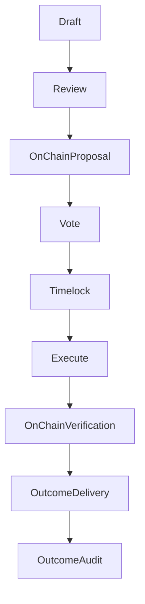

{/* codex-i18n: eyJraW5kIjoiY29kZXgtaTE4biIsInZlcnNpb24iOjEsInNvdXJjZVBhdGgiOiJ2Mi9scHQvdHJlYXN1cnkvYWxsb2NhdGlvbnMubWR4Iiwic291cmNlUm91dGUiOiJ2Mi9scHQvdHJlYXN1cnkvYWxsb2NhdGlvbnMiLCJzb3VyY2VIYXNoIjoiM2M2MzlkMTczZjYzYzU4ZDQ5ZWZlZWZkZjNmYzNlMTViMGM0OGRjMDZiZTUwNjYzNzMyNmZjZTgyOGExNjI3ZCIsImxhbmd1YWdlIjoiZnIiLCJwcm92aWRlciI6Im9wZW5yb3V0ZXIiLCJtb2RlbCI6InF3ZW4vcXdlbi10dXJibyIsImdlbmVyYXRlZEF0IjoiMjAyNi0wMy0wMVQxMToyMjoxNS44MzZaIn0= */}
import { MathInline, MathBlock } from '/snippets/components/content/math.jsx'

## Résumé exécutif

Une allocation de trésorerie est une action sur chaîne autorisée par la gouvernance qui transfère des actifs contrôlés par le protocole à un destinataire pour un objectif défini. Les allocations sont appliquées de manière déterministe par des contrats intelligents, mais leurs conséquences réelles dépendent de la livraison hors chaîne par les destinataires.

Cette page définit :

- le modèle de comptabilité des allocations
- un cadre d'évaluation pour les décisions d'allocation
- les modes de sécurité et de défaillance
- méthodes de vérification et d'audit

---

## 1. Modèle d'allocation formel

Soit :

- <MathInline latex={String.raw`T`} /> = solde du trésor avant l'allocation
- <MathInline latex={String.raw`A_k`} /> = montant de l'allocation de la proposition<MathInline latex={String.raw`k`} />
- <MathInline latex={String.raw`T'`} /> = solde du trésor après l'allocation

Mise à jour d'allocation unique :

<MathBlock latex={String.raw`T' = T - A_k`} />

Sur <MathInline latex={String.raw`n`} /> allocations :

<MathBlock latex={String.raw`T_n = T_0 - \sum_{k=1}^{n} A_k`} />

Où chaque <MathInline latex={String.raw`A_k`} /> est exécuté par un payload de proposition de gouvernance.

---

## 2. Taxonomie des allocations

Les allocations du trésor tombent généralement dans les catégories :

1. **Développement de l'écosystème** - applications, intégrations, SDKs.
2. **Recherche et développement du protocole** - recherche sur la sécurité, audits, modélisation économique.
3. **Support d'infrastructure** - outils pour opérateurs, surveillance, améliorations de fiabilité.
4. **Programmes de la communauté** - éducation, mise en route, documentation, événements.
5. **Interventions stratégiques** - stimuler la demande ou l'offre là où les marchés ne fournissent pas suffisamment.

Ces catégories sont conceptuelles ; l'exécution sur la chaîne est simplement des données de calldata.

---

## 3. Cadre d'évaluation

L'allocation du trésor est une décision sous l'incertitude.

Définir une proposition d'allocation<MathInline latex={String.raw`k`} />avec une fonction de résultat attendu :

<MathBlock latex={String.raw`Outcome_k = g(Impact_k, Feasibility_k, Risk_k, Alignment_k)`} />

Une fonction de décision pratique est :

<MathBlock latex={String.raw`Score_k = w_1 Impact_k + w_2 Feasibility_k - w_3 Risk_k + w_4 Alignment_k`} />

Où<MathInline latex={String.raw`w_i`} />sont des poids choisis par la gouvernance.

### 3.1 Impact

Mesure l'amélioration attendue des objectifs du protocole tels que : 

- une demande réseau accrue (frais)
- une participation améliorée des opérateurs (liaison)
- une posture de sécurité renforcée

### 3.2 Faisabilité

Évalue la probabilité d'exécution en tenant compte de :

- portée technique
- capacité de l'équipe
- délai de livraison

### 3.3 Risque

Captures :

- risque d'exécution
- risque adverse
- coût d'opportunité

### 3.4 Alignement

Assure que les résultats renforcent les objectifs au niveau du protocole plutôt que la capture de valeur privée.

---

## 4. Modèle de sécurité de gouvernance

Les allocations héritent du modèle de sécurité de gouvernance.

Soit :

- <MathInline latex={String.raw`B_T`} /> = montant total des fonds bloqués
- <MathInline latex={String.raw`\theta`} /> = fraction nécessaire pour contrôler le résultat de la gouvernance

Capital requis pour le contrôle :

<MathBlock latex={String.raw`Capital_{control} \ge \theta B_T`} />

La sécurité du trésor dépend donc de la distribution et de la participation des actifs.

---

## 5. Modes de défaillance et risques

### 5.1 Défaillances au niveau du protocole

- erreurs de calldata
- solde insuffisant du trésor
- le contrat cible effectue un revert

### 5.2 Échecs au niveau de la gouvernance

- capture par un stake concentré
- quorum faible / faible participation
- propositions hâtives avec une revue insuffisante

### 5.3 Échecs au niveau des résultats

En raison du fait que la livraison est hors chaîne :

- les destinataires peuvent échouer à livrer
- les résultats peuvent être indéfinissables
- les incitations peuvent ne pas être alignées

Le trésor peut imposer le transfert, pas la performance.

---

## 6. Modèle de vérification et d'audit

La vérification se divise en deux domaines :

### 6.1 Vérification sur la chaîne (déterministe)

Confirmez que :

- la proposition s'est exécutée avec succès
- les transferts ont eu lieu
- l'adresse du destinataire correspond à la cible prévue
- le solde du trésor a diminué de <MathInline latex={String.raw`A_k`} />

Cela est vérifiable via les journaux de transaction et les lectures d'état.

### 6.2 Vérification hors chaîne du résultat (non déterministe)

La vérification du résultat nécessite :

- le rapport des jalons
- les livrables publics (code, documents, déploiements)
- des preuves reproductibles de l'impact

La gouvernance du trésor devrait privilégier les allocations ayant des résultats mesurables et auditable.

---

## 7. Schéma - Cycle de vie des allocations

---

## 8. Séparation entre le protocole et le réseau

**Protocole (sur chaîne) :**

- l'autorisation et l'exécution des allocations
- transferts déterministes
- traçabilité sur la chaîne

**Réseau/Hors chaîne :**

- livraison au destinataire
- impact sur l'écosystème
- mesure des résultats

Les contrôles de trésorerie gèrent les actifs sur la chaîne ; les résultats dépendent de l'exécution hors chaîne.

---

## Références

- [Livepeer Dépôt du protocole](https://github.com/livepeer/protocol)
- [Registre des contrats](https://docs.livepeer.org/references/contract-addresses)
