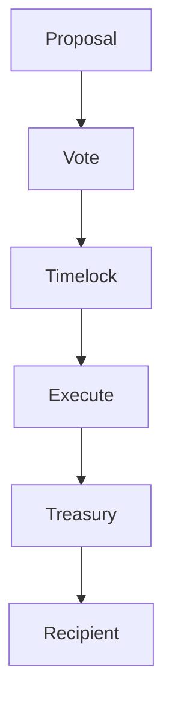

{/* codex-i18n: eyJraW5kIjoiY29kZXgtaTE4biIsInZlcnNpb24iOjEsInNvdXJjZVBhdGgiOiJ2Mi9scHQvdHJlYXN1cnkvb3ZlcnZpZXcubWR4Iiwic291cmNlUm91dGUiOiJ2Mi9scHQvdHJlYXN1cnkvb3ZlcnZpZXciLCJzb3VyY2VIYXNoIjoiOGQ2ZDZiMmFlNmFjN2EzYWVlMjNmMmM2ZWUyNmFlMzY2ZmM0NzFjYjVhMjhmOGQxOTU4NWQ5ZDhlZDQwYzg5MCIsImxhbmd1YWdlIjoiZnIiLCJwcm92aWRlciI6Im9wZW5yb3V0ZXIiLCJtb2RlbCI6InF3ZW4vcXdlbi10dXJibyIsImdlbmVyYXRlZEF0IjoiMjAyNi0wMy0wMVQxMToyMDo1Mi4xMzBaIn0= */}
import { MathInline, MathBlock } from '/snippets/components/content/math.jsx'

## Résumé exécutif

Le Trésor Livepeer est le pool de biens gérés par le protocole et contrôlé par la gouvernance, utilisé pour financer le développement de l'écosystème, la recherche en sécurité, le soutien à l'infrastructure et d'autres affectations stratégiquement alignées.

Le contrôle du trésor est appliqué au niveau **du protocole (sur la chaîne)** par l'exécution de la gouvernance. Le trésor n'est pas contrôlé par des comités hors chaîne au sens de l'exécution ; plutôt, les propositions de gouvernance autorisent de manière déterministe les transferts et les actions.

---

## 1. Définition formelle

Soit :

- <MathInline latex={String.raw`T`} /> = solde du trésor (en unités d'actif pertinentes)
- <MathInline latex={String.raw`A_k`} /> = montant de l'allocation exécutée par la proposition<MathInline latex={String.raw`k`} />

Mise à jour du solde du trésor après l'allocation<MathInline latex={String.raw`k`} />:

<MathBlock latex={String.raw`T' = T - A_k`} />

Plus généralement, après un ensemble d'allocations<MathInline latex={String.raw`\{A_1, A_2, \dots, A_n\}`} />:

<MathBlock latex={String.raw`T_n = T_0 - \sum_{k=1}^{n} A_k`} />

Où chaque <MathInline latex={String.raw`A_k`} /> est autorisé via la gouvernance.

---

## 2. Contexte architectural

### 2.1 Couche du protocole

Au niveau de la couche du protocole :

- Les contrats de gouvernance autorisent les allocations
- Les contrats d'exécution (par exemple, logique de transfert de timelock/treasury) effectuent les transferts
- L'état sur la chaîne est la source de vérité

Registre des contrats canoniques : [Adresses des contrats](https://docs.livepeer.org/references/contract-addresses)

### 2.2 Couche réseau

Au niveau du réseau, les initiatives financées par le trésor peuvent avoir un impact sur :

- L'adoption des orchestrators
- Les outils pour les développeurs
- Les applications de l'écosystème

Mais l'application du trésor reste sur la chaîne.

---

## 3. Objectif du trésor et raisonnement économique

Un trésor de protocole existe pour :

1. Financer des biens publics alignés sur la croissance du protocole
2. Réduire le sous-investissement dans l'infrastructure partagée
3. Soutenir la recherche et le développement à long terme
4. Fournir un mécanisme pour des interventions stratégiques dans l'écosystème

Du point de vue économique, le trésor est un instrument de coordination pour financer des bénéfices non excludables que les marchés sous-financent.

---

## 4. Modèle de gouvernance du trésor

Les décisions du trésor sont exécutées via le cycle de gouvernance.

Soit :

- <MathInline latex={String.raw`B_T`} /> = montant total des actifs bloqués
- <MathInline latex={String.raw`B_i`} /> = montant des actifs bloqués attribués au voteur <MathInline latex={String.raw`i`} />

Pouvoir de vote :

<MathBlock latex={String.raw`V_i = \frac{B_i}{B_T}`} />

Ainsi, le trésor hérite des propriétés de sécurité de la gouvernance.

---

## 5. Modèle de sécurité

La sécurité du trésor dépend de :

1. Le montant total des actifs bloqués<MathInline latex={String.raw`B_T`} />
2. La répartition des actifs bloqués (concentration)
3. La configuration du quorum et du délai de blocage

Capital required to control outcomes:

<MathBlock latex={String.raw`Capital_{control} \ge \theta B_T`} />

Un trésor est donc aussi sécurisé que le système de gouvernance qui le contrôle.

---

## 6. Risques et modes de défaillance

Les principaux risques incluent :

- **Capture de la gouvernance** — concentration des participations
- **Faible participation** — risque de quorum
- **Données d'appel mal spécifiées** — échec d'exécution
- **Incompatibilité d'incitations** — inefficacité de l'allocation

Le trésor n'est pas automatiquement « bon » ; ses résultats dépendent de la qualité du processus de gouvernance.

---

## 7. Schéma du système

---

## 8. Séparation entre le protocole et le réseau

**Protocole (sur chaîne) :**
- La garde et l'exécution du trésor
- L'autorisation de la gouvernance
- Transferts déterministes sur la chaîne

**Réseau (hors chaîne) :**
- Les destinataires de l'allocation exécutent du travail (développement, infrastructure)
- Effets de la croissance de l'écosystème
- Livraison opérationnelle

Le trésor est contrôlé par la logique du protocole ; les résultats sont obtenus par livraison hors chaîne.

---

## Références

- [Livepeer Dépôt du protocole](https://github.com/livepeer/protocol)
- [Registre des contrats](https://docs.livepeer.org/references/contract-addresses)
