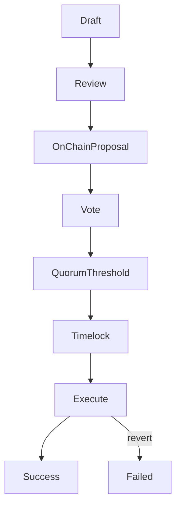

{/* codex-i18n: eyJraW5kIjoiY29kZXgtaTE4biIsInZlcnNpb24iOjEsInNvdXJjZVBhdGgiOiJ2Mi9scHQvdHJlYXN1cnkvcHJvcG9zYWxzLm1keCIsInNvdXJjZVJvdXRlIjoidjIvbHB0L3RyZWFzdXJ5L3Byb3Bvc2FscyIsInNvdXJjZUhhc2giOiIzN2RjMzYwNjU5NDlhMDJiNzQ3Y2M1YmIyMzQ4ZDE5ZGJiYTJiYmY2ODUwNmYzNmY5MDdlMTcwNjk4YjQ3OGNhIiwibGFuZ3VhZ2UiOiJmciIsInByb3ZpZGVyIjoib3BlbnJvdXRlciIsIm1vZGVsIjoicXdlbi9xd2VuLXR1cmJvIiwiZ2VuZXJhdGVkQXQiOiIyMDI2LTAzLTAxVDExOjIxOjMzLjA2NVoifQ== */}
import { MathInline, MathBlock } from '/snippets/components/content/math.jsx'

## Résumé exécutif

Une proposition de trésorerie est une proposition de gouvernance dont le contenu exécutable autorise une action de trésorerie sur la chaîne (généralement un transfert, une subvention ou un appel de contrat). Dans Livepeer, les propositions de trésorerie sont appliquées au niveau du protocole (sur la chaîne)**protocole (sur la chaîne)**: une fois que le quorum et les seuils sont atteints et que le délai d'attente expire, les actions encodées s'exécutent de manière déterministe.

Cette page définit la structure des charges utiles des propositions de trésorerie, leurs sémantiques d'exécution et les principaux modes de défaillance.

---

## 1. Définition formelle

Une proposition de trésorerie <MathInline latex={String.raw`P`} />est un tuple d'actions exécutables :

<MathBlock latex={String.raw`P = \{ a_1, a_2, \dots, a_n \}`} />

Chaque action <MathInline latex={String.raw`a_k`} />est définie comme :

<MathBlock latex={String.raw`a_k = (Target_k, Value_k, Data_k)`} />

Où :

- **Cible**est le contrat ou l'adresse appelée
- **Valeur**est le montant du jeton natif attaché (le cas échéant)
- **Données**est le calldata encodé en ABI spécifiant le sélecteur de fonction et les arguments

La proposition passe par la gouvernance et s'exécute après le délai de blocage.

---

## 2. Autorisation de gouvernance

Soient les variables de mise en garde :

- <MathInline latex={String.raw`B_i`} /> = mise en garde du votant<MathInline latex={String.raw`i`} />
- <MathInline latex={String.raw`B_T`} /> = mise en garde totale

Pouvoir de vote :

<MathBlock latex={String.raw`V_i = \frac{B_i}{B_T}`} />

Condition de quorum :

<MathBlock latex={String.raw`V_{cast} \ge Q \cdot B_T`} />

Condition seuil (exemple) :

<MathBlock latex={String.raw`V_{for} > V_{against}`} />

Seules les propositions respectant les conditions de gouvernance entrent dans la file d'attente du timelock.

---

## 3. Sémantique de la file d'attente du timelock

Une fois approuvée, la proposition est placée dans un timelock avec un délai<MathInline latex={String.raw`T_{delay}`} />.

Le timelock fournit :

- Fenêtre d'exécution prévisible
- Temps de réaction pour les parties prenantes
- Atténuation des changements soudains ou malveillants

L'exécution n'est possible qu'après l'expiration du délai.

---

## 4. Sémantique d'exécution

Après l'expiration du timelock, les tentatives d'exécution tentent d'appliquer chaque action<MathInline latex={String.raw`a_k`} /> de manière atomique au sein de la transaction d'exécution.

Deux propriétés importantes :

1. **Déterminisme :** l'exécution est strictement définie par les données de calldata
2. **Atomicité :** si une action échoue, la transaction est annulée, sauf si le modèle d'exécution tolère explicitement un échec partiel

Les propositions de trésorerie doivent donc être rédigées en tenant compte de la correction des données de calldata et du modèle d'échec.

---

## 5. Transfert de trésorerie en tant que cas canonique

Une action courante est un transfert de trésorerie.

Si le solde de la trésorerie est<MathInline latex={String.raw`T`} /> et le montant de l'allocation est<MathInline latex={String.raw`A`} />:

<MathBlock latex={String.raw`T' = T - A`} />

Le solde du destinataire augmente de <MathInline latex={String.raw`A`} /> selon les règles de transfert de l'actif.

---

## 6. Modes de défaillance

L'exécution d'une proposition de trésorerie peut échouer pour plusieurs raisons.

### 6.1 Erreur de calldata

Un sélecteur de fonction incorrect ou une encodage ABI mal formé provoque un rejet.

### 6.2 Solde du trésor insuffisant

Le montant transféré dépasse les réserves du trésor.

### 6.3 Réversion du contrat cible

Le contrat appelé rejette l'appel en raison de contrôles d'accès, d'un état mis en pause ou de la validation des paramètres.

### 6.4 Sémantique du transfert d'actif

Certains contrats de jetons peuvent :

- Renvoyer false au lieu de reverting
- Appliquer les frais de transfert
- Appliquer les listes d'autorisation

Les auteurs de propositions doivent vérifier le comportement de l'actif cible.

### 6.5 Configuration du timelock

Si les conditions de délai du timelock ou de fenêtre d'exécution sont mal configurées, les propositions peuvent devenir non exécutables.

---

## 7. Liste de prévention des risques

Avant de soumettre une proposition de trésorerie :

1. Vérifier les adresses et contrats cibles via le registre
2. Confirmer que le codage ABI est correct
3. Confirmer que le solde de la trésorerie est suffisant
4. Simuler l'exécution si possible
5. Assurez-vous que le calldata est auditable et minimement limité

---

## 8. Flux d'exécution des propositions

---

## 9. Séparation entre le protocole et le réseau

**Protocole (sur la chaîne) :**
- Définition du contenu de la proposition
- Comptage des votes et autorisation
- File d'attente de timelock
- Exécution déterministe
- Transferts du trésor

**Réseau (hors chaîne) :**
- Rédaction et examen
- Livraison des subventions et exécution opérationnelle par les bénéficiaires

Les propositions de trésorerie sont appliquées par la logique du protocole ; les résultats nécessitent une livraison hors chaîne.

---

## Références

- [Livepeer Dépôt du protocole](https://github.com/livepeer/protocol)
- [Registre des contrats](https://docs.livepeer.org/references/contract-addresses)
